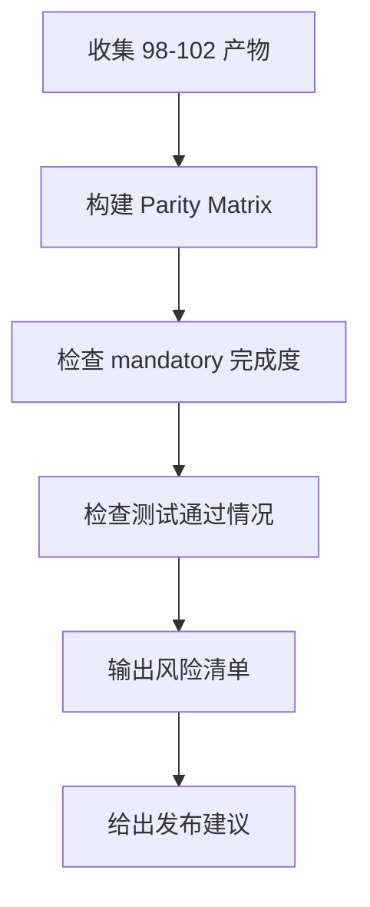

# 设计文档：Moqui Parity Acceptance Gate

## 概述

该 Spec 只做验收与收口，不引入新功能。通过结构化矩阵和 gate 检查，给出发布决策。

## 验收流程

## 交付物

- `docs/moqui-parity-matrix.md`
- `docs/moqui-parity-release-gate.md`
- 发布建议结论（go / conditional-go / no-go）

## 判定规则

1. mandatory 未完成 -> no-go
2. mandatory 完成但存在中风险未闭环 -> conditional-go
3. mandatory 完成且无关键风险 -> go
