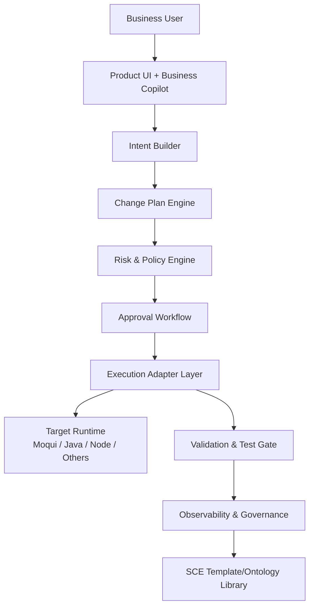

# 设计文档：交互式业务定制平台（Moqui 实验）

## 概述

本设计以“业务优先、技术受限、安全默认开启”为核心原则，构建面向非技术用户的产品内改进闭环。

设计重点：

1. 用户在 UI 内用业务语言表达诉求。
2. AI 先产出结构化计划，不直接执行高风险改动。
3. 所有执行经过统一门禁、审批与审计。
4. 通过 Adapter 机制支持多语言多框架扩展。

## 架构分层

## 核心组件

### 1. Business Copilot（UI 对话层）

- 输入：用户自然语言、当前页面上下文（模块、实体、流程节点、权限信息）
- 输出：结构化 `Change_Intent`
- 约束：
  - 默认禁止直接触发执行
  - 对敏感对象只展示受控摘要，不暴露明文敏感值

### 2. Change Plan Engine（计划引擎）

- 功能：
  - 将 `Change_Intent` 转换为 `Change_Plan`
  - 生成影响分析与验收路径
  - 绑定可回滚策略
- 输出结构（建议）：
  - `scope`
  - `actions`
  - `impact_assessment`
  - `risk_level`
  - `verification_checks`
  - `rollback_plan`

### 3. Risk & Policy Engine（风险与策略引擎）

- 输入：`Change_Plan` + 用户权限 + 资源敏感级别 + 组织策略
- 输出：`allow` / `review-required` / `deny`
- 默认策略：
  - `high` 风险强制审批
  - 涉及敏感数据与权限升级的变更默认阻断或双人审批
  - 不可逆变更必须存在可验证备份点

### 4. Approval Workflow（审批流）

- 状态机：`draft -> submitted -> approved/rejected -> executed -> verified -> archived`
- 审批要点：
  - 审批人权限校验
  - 审批意见持久化
  - 审批超时与重新提交机制

### 5. Execution Adapter Layer（执行适配层）

- 作用：把统一变更语义映射到技术栈执行动作
- Adapter 契约：
  - `capabilities()`
  - `plan(changeIntent, context)`
  - `validate(changePlan)`
  - `apply(changePlan)`
  - `rollback(executionId)`
- Moqui Adapter 为首个实现，后续可扩展到其他产品栈。

### 6. Observability & Governance（观测治理）

- 采集：
  - 变更全链路事件
  - 门禁拦截原因
  - 执行成功/失败与回滚结果
  - 用户反馈
- 输出：
  - 发布前 Gate 摘要
  - 周期治理报表
  - 风险趋势告警

## 数据模型（逻辑）

### ChangeIntent

- `intent_id`
- `user_id`
- `context_ref`（页面/模块/实体）
- `business_goal`
- `constraints`
- `created_at`

### ChangePlan

- `plan_id`
- `intent_id`
- `actions[]`
- `risk_level`
- `impact_assessment`
- `verification_checks[]`
- `rollback_plan`
- `status`

### ExecutionRecord

- `execution_id`
- `plan_id`
- `adapter_type`
- `policy_decision`
- `approval_snapshot`
- `diff_summary`
- `result`
- `rollback_ref`
- `audit_trace_id`

## 安全边界设计

1. 对话层不持有生产写权限，仅能提交 `Change_Intent`。
2. 执行层必须通过策略引擎授权票据后才能执行。
3. 审计记录不可篡改，且与执行记录强关联。
4. 敏感数据在对话、日志、报表中默认脱敏。
5. 禁止 Agent 直接访问明文凭证，凭证通过受控注入与短时令牌管理。

## Moqui 实验落地路径

### 阶段 A：只读对话

- 可解释页面结构、业务规则、流程上下文
- 不提供执行入口

### 阶段 B：建议模式

- 生成 `Change_Plan` 与风险评估
- 人工审批后由管理员执行

### 阶段 C：受控执行

- 仅开放低风险变更的一键执行
- 高风险保持审批与双重门禁

### 阶段 D：模板沉淀

- 将验证通过的变更沉淀到 SCE 模板库（scene + ontology + governance）
- 形成可复制 Domain_Pack

## 失败处理与回滚

1. 任一门禁失败：流程停在当前状态并输出原因。
2. 执行验证失败：自动触发回滚建议并阻断发布。
3. 回滚失败：提升风险等级并触发人工干预流程。

## 非目标

1. 本阶段不追求“全自动无人审批”的高风险改动。
2. 本阶段不覆盖所有行业，只聚焦 Moqui 实验可闭环能力。
