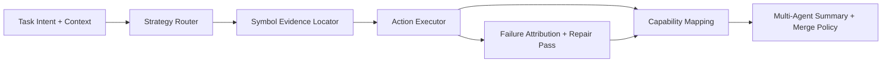

# 设计文档：SCE 核心能力矩阵增强

## 概述

本设计将 5 项能力抽象为一个可组合流水线：

`intent/context -> strategy_router -> symbol_evidence -> execute/repair -> capability_mapping -> multi_agent_summary`

原则：

1. 决策先于执行
2. 证据先于改动
3. 失败可归因、修复有边界
4. 变更可沉淀为模板资产
5. 多 agent 结果可汇总、可追责

## 架构

## 模块设计

### 1. Strategy Router（优先落地）

- 输入：任务上下文、风险状态、测试状态、回滚检查点
- 输出：
  - `decision`: `answer_only|code_change|code_fix|rollback`
  - `reasons[]`
  - `next_actions[]`
- 已落地基线：
  - `scripts/auto-strategy-router.js`
  - `docs/agent-runtime/strategy-routing-policy-baseline.json`

### 2. Symbol Evidence Locator（阶段二）

- 目标：
  - 统一输出符号命中证据，减少“答非所问”。
- 输出契约（建议）：
  - `query`
  - `hits[]: { file, line, snippet, symbol, score }`
  - `confidence`
  - `source`（rg/ast/index）

### 3. Failure Attribution + Repair Pass（阶段三）

- 目标：
  - 将失败归因标准化并执行有界修复。
- 流程：
  - 失败 -> 归类 -> 生成最小修复动作 -> 复测 -> 通过/停止。
- 关键约束：
  - 最大修复轮次固定（默认 1 次 Repair_Pass）。
  - 必须输出失败摘要与阻断原因。

### 4. Capability Mapping（阶段四）

- 目标：
  - 将项目变更映射到 scene template + ontology。
- 输出：
  - `mapping_report.json`
  - `missing_capabilities[]`
  - `recommended_templates[]`
  - `ontology_gaps[]`

### 5. Multi-Agent Summary Policy（阶段五）

- 目标：
  - 主从分工与结果汇总统一化。
- 已落地基线：
  - `docs/agent-runtime/multi-agent-coordination-policy-baseline.json`
- 计划增强：
  - 强制子 agent 输出摘要契约（spec_id/changed_files/tests/risk/open_issues）。
  - 主 agent 合并策略基于摘要而非自由文本。

## 数据契约建议

### StrategyDecision

- `decision`
- `confidence`
- `reasons[]`
- `next_actions[]`

### AgentResultSummary

- `spec_id`
- `changed_files[]`
- `tests_run`
- `tests_passed`
- `risk_level`
- `open_issues[]`

## 风险与缓解

1. 风险：策略误判导致错误执行路径
   - 缓解：默认保守回退 `answer_only`，保留人工确认入口。
2. 风险：符号证据不足仍触发写入
   - 缓解：无可靠证据时阻断高风险改动。
3. 风险：修复循环过长
   - 缓解：Repair_Pass 轮次固定并强制输出失败结论。

## 交付顺序

1. Strategy Router + baseline policy（已启动）
2. Symbol locator contract + implementation
3. Failure taxonomy + bounded repair
4. Capability mapping report
5. Multi-agent summary enforcement
