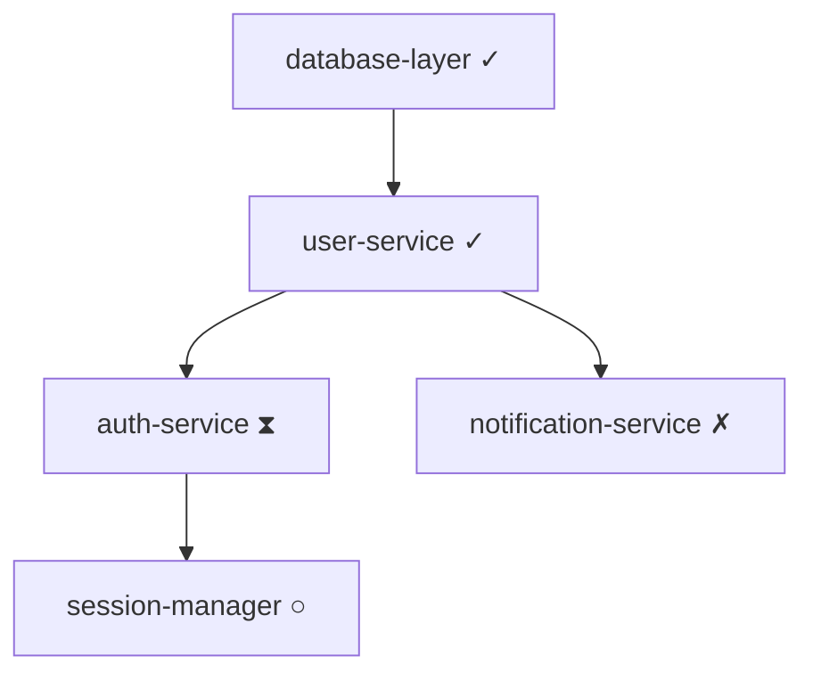

# Design Document: Spec-Level Collaboration System

## Overview

The Spec-level collaboration system enables multiple AI instances (Kiro) to work on different Specs in parallel within a large project. The system provides:

- **Dependency Management**: Define and track dependencies between Specs
- **Interface Contracts**: Formal API definitions ensuring compatibility
- **Status Tracking**: Monitor progress and assignments across Specs
- **Integration Testing**: Verify cross-Spec functionality
- **Breakdown Planning**: Decompose large features into manageable Sub-Specs

The design follows the existing kse architecture patterns and integrates seamlessly with the current Spec workflow.

## Architecture

### High-Level Architecture

```
┌─────────────────────────────────────────────────────────────┐
│                     CLI Layer (collab.js)                    │
│  Commands: init, status, assign, verify, integrate           │
└────────────────────┬────────────────────────────────────────┘
                     │
┌────────────────────┴────────────────────────────────────────┐
│              Collaboration Manager (collab-manager.js)       │
│  - Orchestrates all collaboration operations                 │
│  - Coordinates between specialized managers                  │
└────┬──────────┬──────────┬──────────┬────────────┬─────────┘
     │          │           │          │            │
┌────▼────┐ ┌──▼─────┐ ┌──▼────┐ ┌──▼──────┐ ┌───▼────────┐
│Metadata │ │Depend. │ │Contract│ │Integr.  │ │Visualizer  │
│Manager  │ │Manager │ │Manager │ │Manager  │ │            │
└─────────┘ └────────┘ └────────┘ └─────────┘ └────────────┘
     │          │           │          │            │
     └──────────┴───────────┴──────────┴────────────┘
                     │
            ┌────────▼────────┐
            │  File System    │
            │ collaboration.  │
            │   json files    │
            └─────────────────┘
```

### Component Responsibilities

1. **CLI Layer**: User-facing commands for collaboration operations
2. **Collaboration Manager**: Central orchestrator coordinating all managers
3. **Metadata Manager**: CRUD operations on collaboration.json files
4. **Dependency Manager**: Dependency graph analysis and validation
5. **Contract Manager**: Interface contract definition and verification
6. **Integration Manager**: Cross-Spec integration testing
7. **Visualizer**: Dependency graph visualization and reporting


## Components and Interfaces

### 1. Collaboration Manager (`lib/collab/collab-manager.js`)

**Purpose**: Central orchestrator for all collaboration operations

**Key Methods**:
```javascript
class CollaborationManager {
  constructor(workspaceRoot)
  
  // Master Spec operations
  async initMasterSpec(specName, subSpecs, options)
  async getCollaborationStatus(specName)
  
  // Dependency operations
  async validateDependencies(specName)
  async getReadySpecs()
  
  // Assignment operations
  async assignSpec(specName, kiroInstance)
  async updateSpecStatus(specName, status, reason)
  
  // Integration operations
  async verifyContracts(specName)
  async runIntegrationTests(specNames)
  
  // Visualization
  async generateDependencyGraph(format)
}
```

### 2. Metadata Manager (`lib/collab/metadata-manager.js`)

**Purpose**: CRUD operations on collaboration.json files

**Collaboration Metadata Schema**:
```json
{
  "version": "1.0.0",
  "type": "master" | "sub",
  "masterSpec": "spec-name",
  "subSpecs": ["spec-1", "spec-2"],
  "dependencies": [
    {
      "spec": "spec-name",
      "type": "requires-completion" | "requires-interface" | "optional",
      "reason": "description"
    }
  ],
  "assignment": {
    "kiroInstance": "kiro-1",
    "assignedAt": "2026-02-01T10:00:00Z"
  },
  "status": {
    "current": "not-started" | "in-progress" | "completed" | "blocked",
    "updatedAt": "2026-02-01T10:00:00Z",
    "blockReason": "optional description"
  },
  "interfaces": {
    "provides": ["interface-1.json"],
    "consumes": ["other-spec/interface-2.json"]
  },
  "integrationTests": ["test-1.js", "test-2.js"]
}
```

**Key Methods**:
```javascript
class MetadataManager {
  async readMetadata(specName)
  async writeMetadata(specName, metadata)
  async validateMetadata(metadata)
  async deleteMetadata(specName)
  async listAllMetadata()
  async atomicUpdate(specName, updateFn)
}
```


### 3. Dependency Manager (`lib/collab/dependency-manager.js`)

**Purpose**: Dependency graph analysis and validation

**Key Methods**:
```javascript
class DependencyManager {
  constructor(metadataManager)
  
  async buildDependencyGraph(specNames)
  async detectCircularDependencies(graph)
  async getReadySpecs(graph)
  async getCriticalPath(graph)
  async validateDependency(fromSpec, toSpec, type)
  async updateDependentSpecs(completedSpec)
}
```

**Dependency Graph Structure**:
```javascript
{
  nodes: [
    { id: 'spec-name', status: 'completed', kiroInstance: 'kiro-1' }
  ],
  edges: [
    { from: 'spec-a', to: 'spec-b', type: 'requires-completion' }
  ]
}
```

### 4. Contract Manager (`lib/collab/contract-manager.js`)

**Purpose**: Interface contract definition and verification

**Interface Contract Schema**:
```json
{
  "version": "1.0.0",
  "spec": "spec-name",
  "interfaces": [
    {
      "name": "UserService",
      "type": "class" | "function" | "module",
      "exports": [
        {
          "name": "createUser",
          "type": "function",
          "signature": "(userData: UserData) => Promise<User>",
          "description": "Creates a new user"
        }
      ]
    }
  ],
  "types": [
    {
      "name": "UserData",
      "definition": "{ name: string, email: string }"
    }
  ]
}
```

**Key Methods**:
```javascript
class ContractManager {
  async defineContract(specName, contract)
  async readContract(specName, interfaceName)
  async verifyImplementation(specName)
  async detectBreakingChanges(oldContract, newContract)
  async getConsumers(specName, interfaceName)
}
```

**Verification Strategy**:
- For JavaScript/TypeScript: Parse exports and compare with contract
- Check method names, parameter counts, return types (if available)
- Report missing exports, signature mismatches, type errors


### 5. Integration Manager (`lib/collab/integration-manager.js`)

**Purpose**: Cross-Spec integration testing

**Integration Test Structure**:
```javascript
// .kiro/specs/master-spec/integration-tests/test-user-auth.js
module.exports = {
  name: 'User Authentication Flow',
  specs: ['user-service', 'auth-service', 'session-manager'],
  async setup() {
    // Setup test environment
  },
  async test() {
    // Run integration test
    const userService = require('../../user-service/lib/user-service');
    const authService = require('../../auth-service/lib/auth-service');
    // Test cross-spec functionality
  },
  async teardown() {
    // Cleanup
  }
};
```

**Key Methods**:
```javascript
class IntegrationManager {
  async discoverTests(specName)
  async runTest(testPath)
  async runAllTests(specNames)
  async generateReport(results)
  async validateTestDependencies(test)
}
```

### 6. Visualizer (`lib/collab/visualizer.js`)

**Purpose**: Dependency graph visualization

**Output Formats**:

1. **Text-based Graph**:
```
Master Spec: user-management
├─ ✓ user-service (kiro-1) [completed]
│  └─ requires: database-layer
├─ ⧗ auth-service (kiro-2) [in-progress]
│  └─ requires: user-service
├─ ○ session-manager (unassigned) [not-started]
│  └─ requires: auth-service
└─ ✗ notification-service (kiro-3) [blocked: API key missing]
   └─ requires: user-service

Critical Path: database-layer → user-service → auth-service → session-manager
```

2. **Mermaid Format**:


**Key Methods**:
```javascript
class Visualizer {
  async generateTextGraph(graph, options)
  async generateMermaidGraph(graph)
  async highlightCriticalPath(graph)
  async formatSpecNode(spec, metadata)
}
```


## Data Models

### Collaboration Metadata

**Location**: `.kiro/specs/{spec-name}/collaboration.json`

**Full Schema**:
```typescript
interface CollaborationMetadata {
  version: string;                    // Schema version (e.g., "1.0.0")
  type: 'master' | 'sub';            // Spec type
  masterSpec?: string;                // Parent spec (for sub-specs)
  subSpecs?: string[];                // Child specs (for master specs)
  
  dependencies: Dependency[];         // Spec dependencies
  assignment?: Assignment;            // Kiro instance assignment
  status: Status;                     // Current status
  interfaces: Interfaces;             // Interface contracts
  integrationTests?: string[];        // Integration test files
}

interface Dependency {
  spec: string;                       // Target spec name
  type: 'requires-completion' | 'requires-interface' | 'optional';
  reason?: string;                    // Why this dependency exists
}

interface Assignment {
  kiroInstance: string;               // Identifier (e.g., "kiro-1", "alice-laptop")
  assignedAt: string;                 // ISO 8601 timestamp
}

interface Status {
  current: 'not-started' | 'in-progress' | 'completed' | 'blocked';
  updatedAt: string;                  // ISO 8601 timestamp
  blockReason?: string;               // Why blocked (if applicable)
}

interface Interfaces {
  provides: string[];                 // Interface files this spec provides
  consumes: string[];                 // Interface files this spec consumes
}
```

### Interface Contract

**Location**: `.kiro/specs/{spec-name}/interfaces/{interface-name}.json`

**Full Schema**:
```typescript
interface InterfaceContract {
  version: string;                    // Contract version
  spec: string;                       // Owning spec
  
  interfaces: InterfaceDefinition[];  // Exported interfaces
  types: TypeDefinition[];            // Type definitions
}

interface InterfaceDefinition {
  name: string;                       // Interface name
  type: 'class' | 'function' | 'module' | 'object';
  exports: ExportDefinition[];        // Exported members
  description?: string;
}

interface ExportDefinition {
  name: string;                       // Export name
  type: 'function' | 'property' | 'method';
  signature?: string;                 // Type signature (TypeScript-style)
  description?: string;
  required: boolean;                  // Is this export required?
}

interface TypeDefinition {
  name: string;                       // Type name
  definition: string;                 // Type definition (TypeScript-style)
  description?: string;
}
```


## Correctness Properties

*A property is a characteristic or behavior that should hold true across all valid executions of a system—essentially, a formal statement about what the system should do. Properties serve as the bridge between human-readable specifications and machine-verifiable correctness guarantees.*

### Property 1: Dependency Graph Acyclicity

*For any* set of Specs with dependencies, when validating the dependency graph, the system should reject graphs containing circular dependencies and accept acyclic graphs.

**Validates: Requirements 1.2**

### Property 2: Ready Spec Identification

*For any* dependency graph with various completion states, the set of ready Specs (those with all dependencies satisfied) should exactly match Specs whose dependencies are all marked completed.

**Validates: Requirements 1.3**

### Property 3: Dependency Status Propagation

*For any* Spec in a dependency graph, when it is marked completed, all Specs that depend on it should be notified and their ready status should be recalculated.

**Validates: Requirements 1.4**

### Property 4: Metadata Persistence Round-Trip

*For any* valid collaboration metadata, writing it to disk and then reading it back should produce equivalent metadata with all fields preserved.

**Validates: Requirements 2.2, 7.1, 7.2**

### Property 5: Assignment Reassignment Consistency

*For any* Spec with an assignment, reassigning it to a different Kiro instance should replace the old assignment completely, with no remnants of the previous assignment.

**Validates: Requirements 2.5**

### Property 6: Contract Schema Validation

*For any* interface contract, the system should accept contracts with valid JSON schema and complete required fields, and reject contracts with invalid syntax or missing required fields.

**Validates: Requirements 3.2**

### Property 7: Contract Consumer Impact Analysis

*For any* interface contract change, the system should identify exactly the set of Specs that consume that interface, with no false positives or false negatives.

**Validates: Requirements 3.5**

### Property 8: Interface Verification Accuracy

*For any* Spec implementation and its interface contract, verification should detect all mismatches (missing exports, signature differences, type errors) and report no false positives.

**Validates: Requirements 4.1, 4.2**

### Property 9: Integration Test Dependency Validation

*For any* integration test definition, the system should accept tests where all required Specs exist and reject tests referencing non-existent Specs.

**Validates: Requirements 5.2**

### Property 10: Hierarchical Structure Integrity

*For any* Master Spec with Sub-Specs, all Sub-Specs should correctly reference their Master, and the Master should correctly list all its Sub-Specs, maintaining bidirectional consistency.

**Validates: Requirements 6.3**

### Property 11: Spec Deletion Cleanup

*For any* Spec with collaboration metadata, deleting it should remove its metadata file, remove it from all dependency lists, and update all Specs that referenced it.

**Validates: Requirements 7.4**

### Property 12: Global Metadata Consistency

*For any* project with multiple collaborative Specs, running consistency validation should detect all inconsistencies (dangling references, missing dependencies, orphaned metadata).

**Validates: Requirements 7.5**

### Property 13: Dependency Graph Visualization Accuracy

*For any* dependency graph, the text-based visualization should include all Specs with correct status symbols, all dependency arrows, and correctly identify the critical path.

**Validates: Requirements 9.1, 9.2, 9.3, 9.4**

### Property 14: Mermaid Export Validity

*For any* dependency graph, exporting to Mermaid format should produce syntactically valid Mermaid code that can be rendered without errors.

**Validates: Requirements 9.5**

### Property 15: Backward Compatibility Preservation

*For any* Spec without collaboration.json, all existing kse commands should function identically to how they functioned before the collaboration feature was added.

**Validates: Requirements 10.1, 10.2, 10.3, 10.5**


## Error Handling

### Validation Errors

**Circular Dependency Detection**:
- Error: `CollaborationError: Circular dependency detected: spec-a → spec-b → spec-c → spec-a`
- Action: Reject the dependency definition, provide the cycle path
- Recovery: User must break the cycle by removing one dependency

**Missing Dependency**:
- Error: `CollaborationError: Dependency 'spec-x' not found for spec 'spec-y'`
- Action: Reject the metadata, list all missing dependencies
- Recovery: User must create the missing Spec or remove the dependency

**Invalid Metadata Schema**:
- Error: `CollaborationError: Invalid metadata schema: missing required field 'version'`
- Action: Reject the metadata write, provide schema validation errors
- Recovery: User must fix the metadata to match the schema

### Contract Errors

**Contract Mismatch**:
- Error: `ContractError: Implementation does not match contract for 'UserService'`
- Details: List specific mismatches (missing methods, signature differences)
- Action: Mark Spec status as 'requiring-review'
- Recovery: User must update implementation or contract

**Breaking Change Detection**:
- Error: `ContractError: Breaking change detected in 'UserService.createUser'`
- Details: Show old vs new signature
- Action: Mark Spec status as 'requiring-review', notify consumers
- Recovery: User must version the interface or fix consumers

### Integration Test Errors

**Missing Spec for Test**:
- Error: `IntegrationError: Cannot run test 'user-auth-flow': spec 'auth-service' not found`
- Action: Skip the test, report as blocked
- Recovery: User must complete the missing Spec

**Test Execution Failure**:
- Error: `IntegrationError: Test 'user-auth-flow' failed: assertion error`
- Details: Show test output and stack trace
- Action: Report failure with details
- Recovery: User must fix the failing Spec

### File System Errors

**Concurrent Modification**:
- Error: `FileSystemError: Metadata file modified during update`
- Action: Retry the operation with exponential backoff (max 3 attempts)
- Recovery: If retries fail, report error to user

**Permission Denied**:
- Error: `FileSystemError: Cannot write to .kiro/specs/spec-name/collaboration.json`
- Action: Report error immediately
- Recovery: User must fix file permissions

### Assignment Errors

**Spec Already Assigned**:
- Warning: `AssignmentWarning: Spec 'user-service' is already assigned to 'kiro-1', reassigning to 'kiro-2'`
- Action: Proceed with reassignment, log the change
- Recovery: No action needed

**Blocked Spec Assignment**:
- Error: `AssignmentError: Cannot assign blocked spec 'auth-service' (reason: API key missing)`
- Action: Reject assignment, show block reason
- Recovery: User must unblock the Spec first


## Testing Strategy

### Dual Testing Approach

This feature requires both **unit tests** and **property-based tests** for comprehensive coverage:

- **Unit tests**: Verify specific examples, edge cases, CLI command behavior, and error conditions
- **Property tests**: Verify universal properties across all inputs (dependency graphs, metadata structures, contracts)

### Property-Based Testing

**Library**: Use `fast-check` for JavaScript property-based testing

**Configuration**:
- Minimum 100 iterations per property test
- Each test tagged with: `Feature: spec-level-collaboration, Property {N}: {property text}`
- Each correctness property implemented by a SINGLE property-based test

**Property Test Examples**:

```javascript
// Property 1: Dependency Graph Acyclicity
test('Feature: spec-level-collaboration, Property 1: Dependency Graph Acyclicity', () => {
  fc.assert(
    fc.property(
      fc.array(fc.record({
        spec: fc.string(),
        dependencies: fc.array(fc.string())
      })),
      (specs) => {
        const graph = buildGraph(specs);
        const hasCycle = detectCycle(graph);
        const validationResult = dependencyManager.validate(graph);
        
        if (hasCycle) {
          expect(validationResult.valid).toBe(false);
          expect(validationResult.error).toContain('Circular dependency');
        } else {
          expect(validationResult.valid).toBe(true);
        }
      }
    ),
    { numRuns: 100 }
  );
});

// Property 4: Metadata Persistence Round-Trip
test('Feature: spec-level-collaboration, Property 4: Metadata Persistence Round-Trip', () => {
  fc.assert(
    fc.property(
      generateValidMetadata(),
      async (metadata) => {
        await metadataManager.write('test-spec', metadata);
        const retrieved = await metadataManager.read('test-spec');
        expect(retrieved).toEqual(metadata);
      }
    ),
    { numRuns: 100 }
  );
});
```

### Unit Testing

**Focus Areas**:
- CLI command parsing and output formatting
- Specific error conditions (missing files, invalid JSON)
- Edge cases (empty dependency graphs, single-node graphs)
- Integration with existing kse commands
- File system operations (create, read, update, delete)

**Test Structure**:
```
tests/unit/collab/
├── collab-manager.test.js
├── metadata-manager.test.js
├── dependency-manager.test.js
├── contract-manager.test.js
├── integration-manager.test.js
└── visualizer.test.js

tests/integration/collab/
├── cli-commands.test.js
├── end-to-end-workflow.test.js
└── backward-compatibility.test.js
```

### Integration Testing

**Scenarios**:
1. Complete workflow: init → assign → develop → verify → integrate
2. Multi-Spec dependency chain with sequential completion
3. Parallel development with interface contracts
4. Breaking change detection and consumer notification
5. Backward compatibility with non-collaborative Specs

### Test Data Generators

**For Property Tests**:
```javascript
// Generate valid collaboration metadata
const generateValidMetadata = () => fc.record({
  version: fc.constant('1.0.0'),
  type: fc.constantFrom('master', 'sub'),
  dependencies: fc.array(fc.record({
    spec: fc.string(),
    type: fc.constantFrom('requires-completion', 'requires-interface', 'optional'),
    reason: fc.option(fc.string())
  })),
  status: fc.record({
    current: fc.constantFrom('not-started', 'in-progress', 'completed', 'blocked'),
    updatedAt: fc.date().map(d => d.toISOString()),
    blockReason: fc.option(fc.string())
  })
});

// Generate dependency graphs (acyclic and cyclic)
const generateDependencyGraph = () => fc.array(
  fc.record({
    id: fc.string(),
    dependencies: fc.array(fc.string())
  })
);
```

### Coverage Goals

- **Line Coverage**: > 90%
- **Branch Coverage**: > 85%
- **Property Test Coverage**: All 15 correctness properties
- **Integration Test Coverage**: All major workflows
