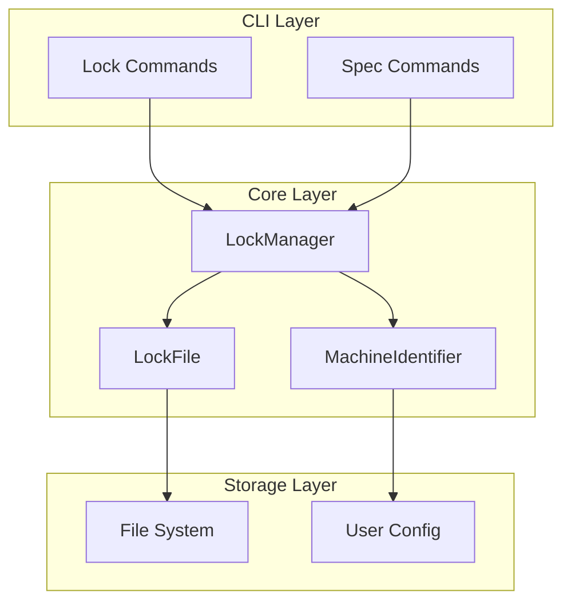

# Design Document: Spec Locking Mechanism

## Overview

This design document describes the implementation of a file-based Spec locking mechanism for the kiro-spec-engine (kse) project. The system enables multiple developers to coordinate their work by acquiring exclusive locks on Specs before editing, preventing conflicts from simultaneous modifications.

The locking mechanism uses JSON-based lock files stored within each Spec directory, combined with machine identification to track lock ownership. The design prioritizes simplicity, reliability, and backward compatibility with existing workflows.

## Architecture



The architecture follows a layered approach:

1. **CLI Layer**: Handles user commands (`kse lock`, `kse unlock`, `kse lock status`)
2. **Core Layer**: Contains business logic for lock management, machine identification, and lock file operations
3. **Storage Layer**: Manages file system operations and user configuration persistence

## Components and Interfaces

### 1. LockManager

The central component responsible for all lock operations.

```javascript
/**
 * LockManager - Manages Spec locks for multi-user collaboration
 */
class LockManager {
  /**
   * @param {string} workspaceRoot - Root directory of the workspace
   * @param {MachineIdentifier} machineIdentifier - Machine ID provider
   */
  constructor(workspaceRoot, machineIdentifier) {}

  /**
   * Acquire a lock on a Spec
   * @param {string} specName - Name of the Spec to lock
   * @param {Object} options - Lock options
   * @param {string} [options.reason] - Reason for acquiring the lock
   * @param {number} [options.timeout] - Lock timeout in hours (default: 24)
   * @returns {Promise<LockResult>}
   */
  async acquireLock(specName, options = {}) {}

  /**
   * Release a lock on a Spec
   * @param {string} specName - Name of the Spec to unlock
   * @param {Object} options - Unlock options
   * @param {boolean} [options.force] - Force unlock regardless of ownership
   * @returns {Promise<UnlockResult>}
   */
  async releaseLock(specName, options = {}) {}

  /**
   * Get lock status for a specific Spec or all Specs
   * @param {string} [specName] - Optional Spec name, if omitted returns all locks
   * @returns {Promise<LockStatus|LockStatus[]>}
   */
  async getLockStatus(specName) {}

  /**
   * Clean up stale locks
   * @returns {Promise<CleanupResult>}
   */
  async cleanupStaleLocks() {}

  /**
   * Check if a Spec is locked
   * @param {string} specName - Name of the Spec
   * @returns {Promise<boolean>}
   */
  async isLocked(specName) {}

  /**
   * Check if current machine owns the lock
   * @param {string} specName - Name of the Spec
   * @returns {Promise<boolean>}
   */
  async isLockedByMe(specName) {}
}
```

### 2. MachineIdentifier

Generates and persists unique machine identifiers.

```javascript
/**
 * MachineIdentifier - Provides unique machine identification
 */
class MachineIdentifier {
  /**
   * @param {string} configDir - Directory for storing machine ID
   */
  constructor(configDir) {}

  /**
   * Get the current machine's identifier
   * @returns {Promise<MachineId>}
   */
  async getMachineId() {}

  /**
   * Generate a new machine ID
   * @returns {MachineId}
   */
  generateMachineId() {}

  /**
   * Get human-readable machine info
   * @returns {Promise<MachineInfo>}
   */
  async getMachineInfo() {}
}
```

### 3. LockFile

Handles lock file serialization and file system operations.

```javascript
/**
 * LockFile - Manages lock file I/O operations
 */
class LockFile {
  /**
   * @param {string} specsDir - Path to specs directory
   */
  constructor(specsDir) {}

  /**
   * Read lock metadata from a Spec
   * @param {string} specName - Name of the Spec
   * @returns {Promise<LockMetadata|null>}
   */
  async read(specName) {}

  /**
   * Write lock metadata to a Spec
   * @param {string} specName - Name of the Spec
   * @param {LockMetadata} metadata - Lock metadata to write
   * @returns {Promise<void>}
   */
  async write(specName, metadata) {}

  /**
   * Delete lock file from a Spec
   * @param {string} specName - Name of the Spec
   * @returns {Promise<boolean>}
   */
  async delete(specName) {}

  /**
   * Check if lock file exists
   * @param {string} specName - Name of the Spec
   * @returns {Promise<boolean>}
   */
  async exists(specName) {}

  /**
   * List all Specs with lock files
   * @returns {Promise<string[]>}
   */
  async listLockedSpecs() {}
}
```

### 4. CLI Commands

```javascript
// kse lock <spec-name> [--reason <reason>] [--timeout <hours>]
// kse unlock <spec-name> [--force]
// kse lock status [spec-name]
// kse lock cleanup
// kse lock whoami
```

## Data Models

### LockMetadata

```typescript
interface LockMetadata {
  /** Owner name (from git config or environment) */
  owner: string;
  
  /** Unique machine identifier */
  machineId: string;
  
  /** Human-readable hostname */
  hostname: string;
  
  /** ISO 8601 timestamp when lock was acquired */
  timestamp: string;
  
  /** Optional reason for acquiring the lock */
  reason?: string;
  
  /** Lock timeout in hours */
  timeout: number;
  
  /** Schema version for future compatibility */
  version: string;
}
```

### MachineId

```typescript
interface MachineId {
  /** Unique identifier (hostname + UUID) */
  id: string;
  
  /** Human-readable hostname */
  hostname: string;
  
  /** Timestamp when ID was generated */
  createdAt: string;
}
```

### LockResult

```typescript
interface LockResult {
  /** Whether lock was successfully acquired */
  success: boolean;
  
  /** Error message if failed */
  error?: string;
  
  /** Lock metadata if successful */
  lock?: LockMetadata;
  
  /** Existing lock info if already locked */
  existingLock?: LockMetadata;
}
```

### UnlockResult

```typescript
interface UnlockResult {
  /** Whether unlock was successful */
  success: boolean;
  
  /** Error message if failed */
  error?: string;
  
  /** Whether force was used */
  forced?: boolean;
  
  /** Previous lock metadata */
  previousLock?: LockMetadata;
}
```

### LockStatus

```typescript
interface LockStatus {
  /** Spec name */
  specName: string;
  
  /** Whether Spec is locked */
  locked: boolean;
  
  /** Lock metadata if locked */
  lock?: LockMetadata;
  
  /** Whether lock is stale */
  isStale?: boolean;
  
  /** Whether current machine owns the lock */
  isOwnedByMe?: boolean;
  
  /** Duration lock has been held (human-readable) */
  duration?: string;
}
```

### CleanupResult

```typescript
interface CleanupResult {
  /** Number of stale locks cleaned */
  cleaned: number;
  
  /** Details of cleaned locks */
  cleanedLocks: Array<{
    specName: string;
    lock: LockMetadata;
  }>;
  
  /** Any errors encountered */
  errors: Array<{
    specName: string;
    error: string;
  }>;
}
```

## Correctness Properties

*A property is a characteristic or behavior that should hold true across all valid executions of a system—essentially, a formal statement about what the system should do. Properties serve as the bridge between human-readable specifications and machine-verifiable correctness guarantees.*

### Property 1: Lock Acquisition Creates Valid Lock File

*For any* valid spec name and lock options, when acquireLock succeeds, a lock file SHALL exist at `.kiro/specs/<spec-name>/.lock` containing valid JSON with all required fields (owner, machineId, hostname, timestamp, timeout, version).

**Validates: Requirements 1.1, 1.2, 5.1, 5.2**

### Property 2: Lock Contention Rejection

*For any* spec that is already locked by machine A, when machine B (different machineId) attempts to acquire the lock, the request SHALL fail and return the existing lock information.

**Validates: Requirements 1.3**

### Property 3: Reason Parameter Preservation

*For any* lock acquisition with a reason parameter, the resulting lock metadata SHALL contain the exact reason string provided.

**Validates: Requirements 1.5**

### Property 4: Lock Release Removes Lock File

*For any* locked spec, when the lock owner calls releaseLock, the lock file SHALL be deleted and the spec SHALL be reported as unlocked.

**Validates: Requirements 2.1**

### Property 5: Ownership Validation on Unlock

*For any* spec locked by machine A, when machine B (different machineId) attempts to unlock without force flag, the request SHALL fail. When force flag is provided, the request SHALL succeed.

**Validates: Requirements 2.2, 2.3**

### Property 6: Status Query Completeness

*For any* set of locked specs, getLockStatus() SHALL return status for all locked specs, and each status SHALL contain specName, locked=true, lock metadata, isStale flag, isOwnedByMe flag, and duration.

**Validates: Requirements 3.1, 3.3**

### Property 7: Stale Lock Detection

*For any* lock with timestamp older than the configured timeout, isStale SHALL be true. For any lock with timestamp within the timeout period, isStale SHALL be false.

**Validates: Requirements 3.4, 4.1, 4.4**

### Property 8: Stale Lock Cleanup

*For any* set of locks where some are stale, cleanupStaleLocks SHALL remove exactly the stale locks and return the correct count of cleaned locks.

**Validates: Requirements 4.3**

### Property 9: Own Lock Identification

*For any* lock, isOwnedByMe SHALL return true if and only if the lock's machineId matches the current machine's ID.

**Validates: Requirements 6.4**

### Property 10: Machine ID Persistence

*For any* machine, getMachineId() SHALL return the same ID across multiple calls within the same session and across sessions (persisted to config).

**Validates: Requirements 7.1**

### Property 11: Machine ID Format

*For any* generated machine ID, the ID SHALL contain both a hostname component and a UUID component, ensuring uniqueness across machines.

**Validates: Requirements 7.2**

### Property 12: Lock Metadata Round-Trip

*For any* valid LockMetadata object, serializing to JSON and then deserializing SHALL produce an equivalent object with all fields preserved.

**Validates: Requirements 8.1, 8.2, 8.3**

### Property 13: Corrupted Lock File Handling

*For any* lock file containing invalid JSON, reading the lock SHALL return null or indicate corruption, allowing a new lock to be acquired.

**Validates: Requirements 8.4**

### Property 14: Default Values for Optional Fields

*For any* lock metadata missing optional fields (e.g., reason), deserialization SHALL succeed with appropriate default values.

**Validates: Requirements 8.5**

### Property 15: Unlocked Spec Detection

*For any* spec without a lock file, isLocked SHALL return false and getLockStatus SHALL indicate locked=false.

**Validates: Requirements 10.1**

## Error Handling

### Lock Acquisition Errors

| Error Condition | Handling |
|----------------|----------|
| Spec already locked | Return `LockResult` with `success: false`, `error: "Spec is already locked"`, and `existingLock` containing current lock info |
| Spec directory doesn't exist | Return `LockResult` with `success: false`, `error: "Spec not found"` |
| File system permission error | Return `LockResult` with `success: false`, `error: "Permission denied"` |
| Invalid spec name | Return `LockResult` with `success: false`, `error: "Invalid spec name"` |

### Lock Release Errors

| Error Condition | Handling |
|----------------|----------|
| Lock owned by different machine | Return `UnlockResult` with `success: false`, `error: "Lock owned by different machine"` unless `--force` |
| No lock exists | Return `UnlockResult` with `success: true`, informational message |
| File system error | Return `UnlockResult` with `success: false`, `error: "Failed to remove lock file"` |

### Lock File Errors

| Error Condition | Handling |
|----------------|----------|
| Corrupted JSON | Treat as no lock, allow override |
| Missing required fields | Treat as corrupted, allow override |
| File read permission error | Log warning, treat as unknown state |

## Testing Strategy

### Unit Tests

Unit tests focus on specific examples and edge cases:

1. **LockManager Tests**
   - Lock acquisition on unlocked spec
   - Lock rejection on already-locked spec
   - Lock release by owner
   - Lock release rejection by non-owner
   - Force unlock by non-owner
   - Stale lock detection with various timestamps
   - Cleanup of stale locks

2. **MachineIdentifier Tests**
   - First-time ID generation
   - ID persistence across calls
   - ID format validation
   - Fallback when hostname unavailable

3. **LockFile Tests**
   - Read/write operations
   - JSON serialization/deserialization
   - Handling of corrupted files
   - Handling of missing files

### Property-Based Tests

Property tests verify universal properties across all inputs using fast-check:

1. **Property 12: Lock Metadata Round-Trip**
   - Generate random valid LockMetadata objects
   - Serialize to JSON, deserialize back
   - Verify equivalence
   - **Tag: Feature: spec-locking-mechanism, Property 12: Lock Metadata Round-Trip**

2. **Property 7: Stale Lock Detection**
   - Generate random timestamps and timeout values
   - Verify stale detection is consistent with timeout
   - **Tag: Feature: spec-locking-mechanism, Property 7: Stale Lock Detection**

3. **Property 9: Own Lock Identification**
   - Generate random machine IDs and lock metadata
   - Verify isOwnedByMe returns correct result
   - **Tag: Feature: spec-locking-mechanism, Property 9: Own Lock Identification**

4. **Property 2: Lock Contention Rejection**
   - Generate random spec names and machine IDs
   - Verify second lock attempt fails
   - **Tag: Feature: spec-locking-mechanism, Property 2: Lock Contention Rejection**

### Test Configuration

- Property-based tests: minimum 100 iterations per property
- Use fast-check library (already in devDependencies)
- Each property test references its design document property number
- Tests located in `tests/properties/lock-manager.property.test.js`

