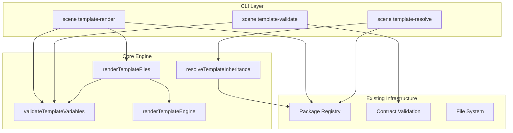

# Design Document: Scene Template Engine Foundation

## Overview

This design introduces a template engine subsystem into the existing `scene` command family. The engine provides three core capabilities:

1. **Variable Schema Validation** — typed variable declarations with validation rules in `scene-package.json`, validated via `validateTemplateVariables(schema, values)`
2. **Multi-File Template Rendering** — recursive file processing with `{{variable}}` substitution, `{{#if}}` conditionals, and `{{#each}}` loops via `renderTemplateFiles(templateDir, variables, outputDir)`
3. **Three-Layer Inheritance Resolution** — L1/L2/L3 package hierarchy with schema and file merging via `resolveTemplateInheritance(packageRegistry, packageName)`

All new functions are added to `lib/commands/scene.js` following existing patterns. Three new CLI subcommands (`template-render`, `template-validate`, `template-resolve`) are registered in `registerSceneCommands`. No new external dependencies are introduced.

## Architecture



The architecture follows the established pattern in `scene.js`:
- **Normalize** → **Validate** → **Execute** → **Print** for each CLI command
- Pure functions for core logic (schema validation, template rendering, inheritance resolution)
- Async command runners with dependency injection for file system operations
- Human-readable and `--json` output modes

## Components and Interfaces

### 1. Template Variable Schema Validator

**Constants:**
```javascript
const TEMPLATE_VARIABLE_TYPES = new Set(['string', 'number', 'boolean', 'enum', 'array']);
```

**`validateTemplateVariableSchema(variables)`**
- Input: `variables` array from `scene-package.json` contract
- Validates each variable declaration has valid name, type, and validation rules
- Returns `{ valid, errors, warnings, summary: { variable_count, type_breakdown } }`

**`validateTemplateVariables(schema, values)`**
- Input: `schema` (variables array), `values` (object of user-supplied values)
- Validates required fields, type matching, default filling, regex/enum/min/max rules
- Returns `{ valid, errors, resolved: { ...mergedValues } }`
- Collects ALL errors before returning (no early exit)

### 2. Template Rendering Engine

**`renderTemplateContent(content, valueMap)`**
- Input: template string content, resolved variable map
- Processes in order: `{{#each}}` loops → `{{#if}}` conditionals → `{{variable}}` placeholders
- Returns rendered string
- Unresolved placeholders are left unchanged

**`renderTemplateFiles(templateDir, variables, outputDir, fileSystem)`**
- Input: source template directory, variable values, output directory
- Calls `validateTemplateVariables` first; returns errors if validation fails
- Recursively walks `templateDir`, renders each file, writes to `outputDir` preserving structure
- Returns `{ rendered, errors, files: [{ source, target, size }] }`

### 3. Three-Layer Inheritance Resolver

**`resolveTemplateInheritance(registryTemplates, packageName)`**
- Input: registry template array (from `runScenePackageRegistryCommand` output), target package name
- Traverses `extends` chain from target up to root
- Merges variable schemas (child overrides parent by variable name)
- Merges template file lists (child overrides parent at same relative path)
- Detects circular references via visited-set
- Returns `{ resolved, chain: [...packageNames], mergedVariables, mergedFiles, errors }`

### 4. CLI Commands

**`normalizeSceneTemplateRenderOptions(options)`** / **`validateSceneTemplateRenderOptions(options)`**
- Options: `--package <name>`, `--values <json-or-path>`, `--out <dir>`, `--template-dir <path>`, `--json`

**`normalizeSceneTemplateValidateOptions(options)`** / **`validateSceneTemplateValidateOptions(options)`**
- Options: `--package <path>`, `--json`

**`normalizeSceneTemplateResolveOptions(options)`** / **`validateSceneTemplateResolveOptions(options)`**
- Options: `--package <name>`, `--template-dir <path>`, `--json`

**Command Runners:**
- `runSceneTemplateRenderCommand(rawOptions, dependencies)` — resolve package from registry → validate variables → render files → print summary
- `runSceneTemplateValidateCommand(rawOptions, dependencies)` — load contract → validate schema → print summary
- `runSceneTemplateResolveCommand(rawOptions, dependencies)` — build registry → resolve inheritance → print merged schema

**Print Functions:**
- `printSceneTemplateRenderSummary(options, payload, projectRoot)`
- `printSceneTemplateValidateSummary(options, payload, projectRoot)`
- `printSceneTemplateResolveSummary(options, payload, projectRoot)`

## Data Models

### Template Variable Schema (in scene-package.json)

```json
{
  "variables": [
    {
      "name": "entity_name",
      "type": "string",
      "required": true,
      "default": null,
      "description": "Primary entity name",
      "validation": {
        "regex": "^[A-Z][a-zA-Z0-9]+$"
      }
    },
    {
      "name": "field_count",
      "type": "number",
      "required": false,
      "default": 5,
      "description": "Number of fields to generate",
      "validation": {
        "min": 1,
        "max": 100
      }
    },
    {
      "name": "db_type",
      "type": "enum",
      "required": true,
      "description": "Database type",
      "validation": {
        "enum_values": ["mysql", "postgres", "moqui"]
      }
    },
    {
      "name": "enable_audit",
      "type": "boolean",
      "required": false,
      "default": false,
      "description": "Enable audit trail"
    },
    {
      "name": "tags",
      "type": "array",
      "required": false,
      "default": [],
      "description": "Tags for categorization"
    }
  ]
}
```

### Three-Layer Package Extension (in scene-package.json)

```json
{
  "layer": "l2-domain",
  "extends": "scene-base"
}
```

### Validation Result

```javascript
{
  valid: true|false,
  errors: ['variable "x": required but not provided', ...],
  resolved: { entity_name: 'Order', field_count: 5, ... }
}
```

### Schema Validation Result

```javascript
{
  valid: true|false,
  errors: ['variables[0]: type "foo" is not supported', ...],
  warnings: ['variables[2]: no description provided'],
  summary: {
    variable_count: 5,
    type_breakdown: { string: 2, number: 1, enum: 1, boolean: 1 }
  }
}
```

### Inheritance Resolution Result

```javascript
{
  resolved: true|false,
  chain: ['scene-erp-inventory', 'scene-erp', 'scene-base'],
  mergedVariables: [ /* merged variable schema array */ ],
  mergedFiles: [ /* merged file path list */ ],
  errors: []
}
```

### Template Render Result

```javascript
{
  rendered: true|false,
  errors: [],
  files: [
    { source: 'requirements.md', target: 'requirements.md', size: 1234 },
    { source: 'scripts/init.sh', target: 'scripts/init.sh', size: 567 }
  ],
  summary: {
    total_files: 2,
    total_bytes: 1801,
    variables_used: 5
  }
}
```


## Correctness Properties

*A property is a characteristic or behavior that should hold true across all valid executions of a system — essentially, a formal statement about what the system should do. Properties serve as the bridge between human-readable specifications and machine-verifiable correctness guarantees.*

### Property 1: Valid schema acceptance

*For any* array of variable declarations where each variable has a non-empty name and a type in {string, number, boolean, enum, array}, `validateTemplateVariableSchema` should return `valid: true` with zero errors.

**Validates: Requirements 1.1, 1.2**

### Property 2: Invalid type rejection

*For any* variable declaration whose type is a non-empty string not in {string, number, boolean, enum, array}, `validateTemplateVariableSchema` should return `valid: false` with an error referencing the invalid type.

**Validates: Requirements 1.3**

### Property 3: Valid schema and values acceptance

*For any* valid variable schema and a values object that supplies all required variables with type-correct values satisfying all validation rules, `validateTemplateVariables` should return `valid: true` with zero errors.

**Validates: Requirements 2.1**

### Property 4: Default value filling

*For any* variable schema where a required variable declares a default value, calling `validateTemplateVariables` without supplying that variable should produce a resolved map containing the default value for that variable.

**Validates: Requirements 2.2**

### Property 5: Missing required variable error

*For any* variable schema containing at least one required variable with no default, calling `validateTemplateVariables` without supplying that variable should return `valid: false` with an error naming the missing variable.

**Validates: Requirements 1.5, 2.3**

### Property 6: Validation rule enforcement

*For any* variable schema with validation rules (regex for strings, enum_values for enums, min/max for numbers) and a value that violates the rule, `validateTemplateVariables` should return `valid: false` with an error identifying the variable and violation.

**Validates: Requirements 2.5, 2.6, 2.7**

### Property 7: All errors collected

*For any* variable schema and values object with N distinct validation violations, `validateTemplateVariables` should return exactly N errors (no early exit).

**Validates: Requirements 2.8**

### Property 8: Placeholder substitution

*For any* template string containing `{{key}}` placeholders and a value map that includes `key`, `renderTemplateContent` should produce output where every `{{key}}` is replaced with the corresponding value.

**Validates: Requirements 3.2**

### Property 9: Conditional block evaluation

*For any* template string containing `{{#if var}}BODY{{/if}}` and a value map, the output should contain BODY if and only if the value for `var` is truthy.

**Validates: Requirements 3.3**

### Property 10: Loop block evaluation

*For any* template string containing `{{#each items}}BODY{{/each}}` where items is an array of length N, the output should contain BODY repeated N times with `{{this}}` replaced by each element.

**Validates: Requirements 3.4**

### Property 11: Rendering idempotence

*For any* template content and value map, `renderTemplateContent(renderTemplateContent(content, values), values)` should equal `renderTemplateContent(content, values)`.

**Validates: Requirements 4.1**

### Property 12: Complete substitution

*For any* template string containing only simple `{{key}}` placeholders (no control-flow directives) and a value map that supplies all referenced keys, the output should contain zero `{{...}}` markers.

**Validates: Requirements 4.2**

### Property 13: Unknown placeholder passthrough

*For any* template string containing `{{unknown_key}}` and a value map that does not include `unknown_key`, the output should still contain `{{unknown_key}}` unchanged.

**Validates: Requirements 3.7**

### Property 14: Inheritance chain traversal

*For any* registry with a valid linear inheritance chain (no cycles), `resolveTemplateInheritance` should return a chain array starting with the target package and ending with the root ancestor, with length equal to the chain depth.

**Validates: Requirements 5.3**

### Property 15: Inheritance merge override

*For any* parent and child variable schemas where both define a variable with the same name, the merged result from `resolveTemplateInheritance` should contain the child's definition for that variable. The same override rule applies to template file paths.

**Validates: Requirements 5.4, 5.5**

### Property 16: Circular inheritance detection

*For any* registry where the inheritance chain forms a cycle, `resolveTemplateInheritance` should return `resolved: false` with an error identifying the cycle.

**Validates: Requirements 5.6**

### Property 17: Backward compatibility

*For any* existing valid scene package contract (without variables, layer, or extends fields), the contract validation should continue to return `valid: true`.

**Validates: Requirements 9.4**

## Error Handling

| Error Condition | Handler | Behavior |
|---|---|---|
| Invalid variable type in schema | `validateTemplateVariableSchema` | Return error with variable index and invalid type |
| Missing required variable (no default) | `validateTemplateVariables` | Return error naming the missing variable |
| Type mismatch in value | `validateTemplateVariables` | Return error with variable name and expected type |
| Regex validation failure | `validateTemplateVariables` | Return error with variable name and regex pattern |
| Enum value not in set | `validateTemplateVariables` | Return error with variable name and allowed values |
| Number out of range | `validateTemplateVariables` | Return error with variable name and min/max bounds |
| Validation fails before render | `renderTemplateFiles` | Return validation errors, write zero output files |
| Template directory not found | `runSceneTemplateRenderCommand` | Print error, set `process.exitCode = 1` |
| Package not found in registry | `runSceneTemplateRenderCommand` | Print error, set `process.exitCode = 1` |
| Circular inheritance detected | `resolveTemplateInheritance` | Return error listing the cycle path |
| Missing parent package in extends | `resolveTemplateInheritance` | Return error naming the missing package |
| Invalid scene-package.json | `runSceneTemplateValidateCommand` | Print contract errors + schema errors, exit 1 |
| File read/write failure | Command runners | Catch, print error message, set exit code 1 |

All error paths follow the existing pattern: structured error objects for pure functions, `console.error(chalk.red(...))` + `process.exitCode = 1` for CLI commands.

## Testing Strategy

### Property-Based Testing

Library: **fast-check** (already used in project)

Each correctness property maps to a single property-based test with minimum 100 iterations. Tests are tagged with:
```
Feature: scene-template-engine-foundation, Property N: <property_text>
```

Key generators needed:
- `arbitraryVariableSchema()` — generates valid variable schema arrays with random types, names, validation rules
- `arbitraryValueMap(schema)` — generates valid value maps matching a given schema
- `arbitraryTemplateContent(variables)` — generates template strings with placeholders, if-blocks, each-blocks
- `arbitraryInheritanceChain(depth)` — generates registry entries with linear inheritance chains
- `arbitraryCyclicRegistry()` — generates registry entries with circular extends references

### Unit Testing

Unit tests cover:
- CLI option normalization and validation for all three new commands
- Command runner integration (happy path, error paths, --json mode)
- Edge cases: empty schema, empty values, empty template, deeply nested directories
- Backward compatibility: existing contracts without new fields

### Test Organization

All tests in `tests/unit/commands/scene.test.js` following existing patterns:
- `describe('validateTemplateVariableSchema', ...)` 
- `describe('validateTemplateVariables', ...)`
- `describe('renderTemplateContent', ...)`
- `describe('resolveTemplateInheritance', ...)`
- `describe('scene template-render command', ...)`
- `describe('scene template-validate command', ...)`
- `describe('scene template-resolve command', ...)`
