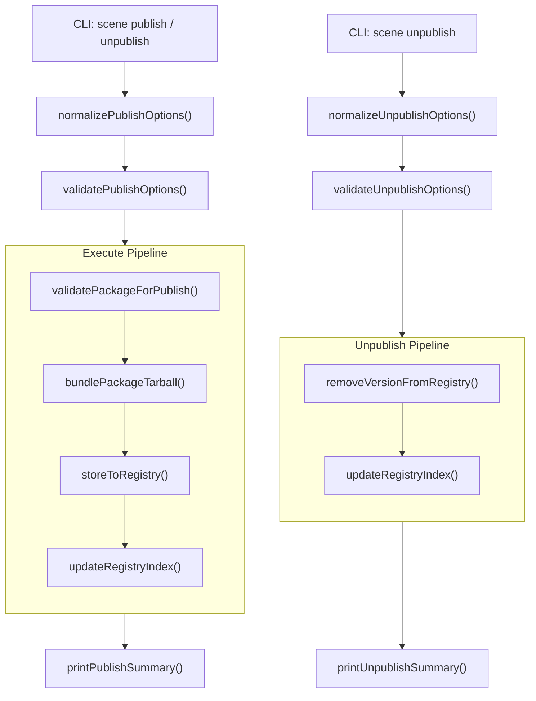

# Design Document: Scene Package Publish

## Overview

This feature extends the existing scene package system with two new CLI commands: `kse scene publish` and `kse scene unpublish`. The publish command validates a scene package, bundles its files into a `.tgz` tarball, and stores it in a local registry directory with a central index. The unpublish command removes a specific version from the registry.

The design follows the established normalize → validate → execute → print pattern used by all existing scene commands in `lib/commands/scene.js`.

### Key Design Decisions

1. **Simple tar implementation**: Use Node.js built-in `zlib.gzipSync` to compress a custom tar buffer. The tar format is minimal (POSIX ustar headers + file data) — no external dependency needed.
2. **Directory-based registry**: Packages stored at `{registry}/packages/{name}/{version}/{name}-{version}.tgz` for easy browsing and cleanup.
3. **Atomic index updates**: Read → modify → write the `registry-index.json` in a single operation. The index is the single source of truth for package discovery.
4. **Semver via existing dependency**: Use the `semver` package (already in dependencies) for version validation and sorting.

## Architecture



## Components and Interfaces

### 1. Option Normalization & Validation

Following existing patterns, two pairs of normalize/validate functions:

```js
// Publish
function normalizeScenePublishOptions(options = {}) {
  return {
    package: options.package ? String(options.package).trim() : undefined,
    registry: options.registry ? String(options.registry).trim() : '.kiro/registry',
    dryRun: options.dryRun === true,
    force: options.force === true,
    json: options.json === true
  };
}

function validateScenePublishOptions(options) {
  // --package is required, must be non-empty string
  // returns null on success, error string on failure
}

// Unpublish
function normalizeSceneUnpublishOptions(options = {}) {
  return {
    name: options.name ? String(options.name).trim() : undefined,
    version: options.version ? String(options.version).trim() : undefined,
    registry: options.registry ? String(options.registry).trim() : '.kiro/registry',
    json: options.json === true
  };
}

function validateSceneUnpublishOptions(options) {
  // --name and --version are required
  // --version must be valid semver
  // returns null on success, error string on failure
}
```

### 2. Package Validation for Publish

```js
async function validatePackageForPublish(packageDir, fileSystem) {
  // 1. Read scene-package.json from packageDir
  // 2. Run validateScenePackageContract() (existing function)
  // 3. Verify artifacts.entry_scene file exists
  // 4. Verify all artifacts.generates files exist
  // 5. Validate metadata.version is valid semver
  // Returns: { valid, contract, errors, files[] }
}
```

### 3. Tarball Creation

```js
function createTarBuffer(files) {
  // files: Array<{ relativePath, content: Buffer }>
  // Creates a POSIX ustar tar archive as a Buffer
  // Each file: 512-byte header + content padded to 512-byte boundary
  // End: two 512-byte zero blocks
}

function bundlePackageTarball(files) {
  // 1. Create tar buffer from files
  // 2. Gzip compress using zlib.gzipSync()
  // 3. Compute SHA-256 hash of compressed buffer
  // Returns: { tarball: Buffer, integrity: string, fileCount: number, size: number }
}
```

### 4. Registry Storage

```js
async function storeToRegistry(name, version, tarball, registryRoot, options, fileSystem) {
  // 1. Resolve target path: {registryRoot}/packages/{name}/{version}/{name}-{version}.tgz
  // 2. Check if version already exists
  // 3. If exists and !force, throw duplicate error
  // 4. ensureDir for target path
  // 5. Write tarball buffer to .tgz file
  // Returns: { path, overwritten }
}
```

### 5. Registry Index Management

```js
async function loadRegistryIndex(registryRoot, fileSystem) {
  // Read registry-index.json, return parsed object
  // If file doesn't exist, return default { apiVersion, packages: {} }
  // If invalid JSON, throw parse error
}

async function saveRegistryIndex(registryRoot, index, fileSystem) {
  // Write registry-index.json with 2-space indentation
}

function addVersionToIndex(index, contract, integrity, publishedAt) {
  // Add or update package entry in index.packages
  // Add version entry with timestamp and integrity hash
  // Update latest pointer to highest semver version
  // Returns: updated index
}

function removeVersionFromIndex(index, name, version) {
  // Remove version entry from index.packages[name].versions
  // Update latest pointer
  // If no versions remain, remove package entry entirely
  // Returns: { updated index, removed: boolean }
}

function resolveLatestVersion(versions) {
  // Sort version keys using semver.rcompare
  // Return highest version string, or null if empty
}
```

### 6. Command Runners

```js
async function runScenePublishCommand(rawOptions = {}, dependencies = {}) {
  // 1. Normalize & validate options
  // 2. Resolve package directory path
  // 3. validatePackageForPublish()
  // 4. Collect file contents (read all referenced files)
  // 5. bundlePackageTarball()
  // 6. If dry-run: build payload without writing, print, return
  // 7. storeToRegistry()
  // 8. loadRegistryIndex() → addVersionToIndex() → saveRegistryIndex()
  // 9. Build payload, print summary, return
}

async function runSceneUnpublishCommand(rawOptions = {}, dependencies = {}) {
  // 1. Normalize & validate options
  // 2. loadRegistryIndex()
  // 3. Check package/version exists in index
  // 4. Remove tarball file from disk
  // 5. removeVersionFromIndex() → saveRegistryIndex()
  // 6. Clean up empty directories
  // 7. Build payload, print summary, return
}
```

### 7. Print Functions

```js
function printScenePublishSummary(options, payload, projectRoot) {
  // Human-readable: coordinate, tarball path, file count, size, integrity
  // JSON mode: output payload as JSON
}

function printSceneUnpublishSummary(options, payload, projectRoot) {
  // Human-readable: removed coordinate, remaining versions count
  // JSON mode: output payload as JSON
}
```

## Data Models

### Registry Index Schema

```json
{
  "apiVersion": "kse.scene.registry/v0.1",
  "generated_at": "2025-01-01T00:00:00.000Z",
  "packages": {
    "my-package": {
      "name": "my-package",
      "group": "kse.scene",
      "description": "A scene template package",
      "latest": "1.2.0",
      "versions": {
        "1.0.0": {
          "published_at": "2025-01-01T00:00:00.000Z",
          "integrity": "sha256-abc123...",
          "tarball": "packages/my-package/1.0.0/my-package-1.0.0.tgz"
        },
        "1.2.0": {
          "published_at": "2025-01-15T00:00:00.000Z",
          "integrity": "sha256-def456...",
          "tarball": "packages/my-package/1.2.0/my-package-1.2.0.tgz"
        }
      }
    }
  }
}
```

### Publish Payload Schema

```json
{
  "published": true,
  "dry_run": false,
  "overwritten": false,
  "coordinate": "kse.scene/my-package@1.0.0",
  "package": {
    "name": "my-package",
    "group": "kse.scene",
    "version": "1.0.0",
    "kind": "scene-template"
  },
  "tarball": {
    "path": ".kiro/registry/packages/my-package/1.0.0/my-package-1.0.0.tgz",
    "size": 2048,
    "file_count": 3,
    "integrity": "sha256-abc123..."
  },
  "registry": {
    "index_path": ".kiro/registry/registry-index.json",
    "total_packages": 5,
    "total_versions": 12
  }
}
```

### Unpublish Payload Schema

```json
{
  "unpublished": true,
  "coordinate": "kse.scene/my-package@1.0.0",
  "package": {
    "name": "my-package",
    "version": "1.0.0"
  },
  "remaining_versions": 2,
  "new_latest": "0.9.0",
  "registry": {
    "index_path": ".kiro/registry/registry-index.json"
  }
}
```

### Tar Header Format (POSIX ustar)

Each file in the tar archive uses a 512-byte header:

| Offset | Size | Field |
|--------|------|-------|
| 0 | 100 | File name |
| 100 | 8 | File mode (octal) |
| 108 | 8 | Owner UID (octal) |
| 116 | 8 | Group GID (octal) |
| 124 | 12 | File size (octal) |
| 136 | 12 | Modification time (octal) |
| 148 | 8 | Header checksum (octal) |
| 156 | 1 | Type flag ('0' = regular file) |
| 157 | 100 | Link name |
| 257 | 6 | Magic ("ustar") |
| 263 | 2 | Version ("00") |
| 265 | 32 | Owner name |
| 297 | 32 | Group name |
| 329 | 8 | Device major |
| 337 | 8 | Device minor |
| 345 | 155 | Prefix |
| 500 | 12 | Padding |


## Correctness Properties

*A property is a characteristic or behavior that should hold true across all valid executions of a system — essentially, a formal statement about what the system should do. Properties serve as the bridge between human-readable specifications and machine-verifiable correctness guarantees.*

### Property 1: Tarball round-trip integrity

*For any* set of files with valid relative paths and content, creating a tar+gzip archive and then decompressing and extracting it should produce files with identical relative paths and identical content.

**Validates: Requirements 2.1, 2.2**

### Property 2: Tarball naming and registry path construction

*For any* valid package name and semver version string, the tarball filename should equal `{name}-{version}.tgz` and the registry storage path should equal `packages/{name}/{version}/{name}-{version}.tgz`.

**Validates: Requirements 2.3, 3.1**

### Property 3: SHA-256 hash determinism

*For any* buffer, computing the SHA-256 integrity hash twice on the same buffer should produce the same hash string. Additionally, two different buffers should produce different hashes (collision resistance for practical purposes).

**Validates: Requirements 2.4**

### Property 4: Semver validation consistency

*For any* string, the publish validation should accept it as a valid version if and only if the `semver.valid()` function returns a non-null value for that string.

**Validates: Requirements 1.5, 5.1**

### Property 5: File existence verification

*For any* scene package contract with file references in `artifacts.generates` and `artifacts.entry_scene`, the publish validation should fail if and only if at least one referenced file does not exist on disk.

**Validates: Requirements 1.3, 1.4**

### Property 6: Duplicate version detection without force

*For any* registry index that already contains a package at a given name and version, attempting to publish the same name and version without `--force` should fail with a duplicate error.

**Validates: Requirements 3.3**

### Property 7: Force overwrite succeeds

*For any* registry index that already contains a package at a given name and version, publishing the same name and version with `--force` should succeed and the index entry should reflect the new publish timestamp and integrity hash.

**Validates: Requirements 3.4, 6.4**

### Property 8: Index entry completeness after publish

*For any* successfully published package, the resulting registry index entry should contain: name, group, description, latest version string, and a versions object where the published version key maps to an object with `published_at` (ISO timestamp) and `integrity` (SHA-256 hash string) fields.

**Validates: Requirements 4.1, 4.2, 9.2**

### Property 9: Unpublish removes version and updates index

*For any* registry index containing a package with multiple versions, removing one version should result in that version key being absent from the versions object, the latest pointer updated to the highest remaining semver, and the tarball file removed from disk.

**Validates: Requirements 4.4, 7.1, 7.3**

### Property 10: Latest pointer equals highest semver

*For any* non-empty set of valid semver version strings in a package's versions object, the `latest` field should equal the maximum version as determined by `semver.rcompare` sorting (i.e., the first element when sorted in descending order).

**Validates: Requirements 5.2, 5.3**

### Property 11: Dry-run produces no side effects

*For any* valid package and registry state, running publish with `--dry-run` should return a payload with `published: false` and the registry index file and packages directory should remain unchanged from their state before the command.

**Validates: Requirements 6.3, 8.1, 8.2, 8.3**

### Property 12: Not-found error on unpublish

*For any* package name and version that do not exist in the registry index, the unpublish command should fail and return null, and the registry index should remain unchanged.

**Validates: Requirements 7.2**

### Property 13: Registry index JSON round-trip

*For any* valid registry index object, serializing it to JSON (with 2-space indentation) and then parsing the JSON back should produce a deeply equal object.

**Validates: Requirements 9.4**

## Error Handling

| Error Condition | Behavior | Exit Code |
|---|---|---|
| `--package` path does not exist | Print error, abort | 1 |
| `scene-package.json` missing or invalid | Print validation errors, abort | 1 |
| Referenced template file missing | Print missing file path, abort | 1 |
| `metadata.version` not valid semver | Print error, abort | 1 |
| Duplicate version without `--force` | Print duplicate error, abort | 1 |
| `registry-index.json` contains invalid JSON | Print parse error, abort | 1 |
| Unpublish target not found | Print not-found error, abort | 1 |
| File system write failure | Print error message, abort | 1 |
| Tarball creation failure (zlib error) | Print error message, abort | 1 |

All error paths follow the existing pattern: `console.error(chalk.red(...))` + `process.exitCode = 1` + `return null`.

## Testing Strategy

### Property-Based Tests

Use `fast-check` (already in devDependencies) with minimum 100 iterations per property.

| Property | Test Focus |
|---|---|
| Property 1 | Generate random file sets, create tarball, extract, compare |
| Property 2 | Generate random names/versions, verify path format |
| Property 3 | Generate random buffers, verify hash determinism |
| Property 4 | Generate random strings, compare validation with semver.valid() |
| Property 5 | Generate contracts with random file refs, mock filesystem |
| Property 6 | Generate index with existing entries, verify duplicate rejection |
| Property 7 | Generate index with existing entries, verify force overwrite |
| Property 8 | Generate random contracts, publish, verify index structure |
| Property 9 | Generate index with multiple versions, remove one, verify |
| Property 10 | Generate random semver sets, verify latest pointer |
| Property 11 | Generate valid packages, run dry-run, verify no changes |
| Property 12 | Generate random name/version not in index, verify failure |
| Property 13 | Generate random index objects, serialize/deserialize, compare |

### Unit Tests

Focus on specific examples and edge cases:
- Empty package directory
- Contract with no artifacts.generates
- Version "0.0.0" (minimum valid semver)
- Pre-release versions like "1.0.0-beta.1"
- Unpublish last version of a package (removes package entry)
- Registry index creation from scratch (first publish)
- Invalid JSON in registry-index.json
- CLI option normalization defaults

### Test File Location

All tests in `tests/unit/commands/scene.test.js` following existing patterns. Property tests in `tests/properties/` if a separate file is needed for organization.

### PBT Library

- Library: `fast-check` v4.5.3 (already installed)
- Tag format: `Feature: scene-package-publish, Property N: {property_text}`
- Minimum iterations: 100 per property
