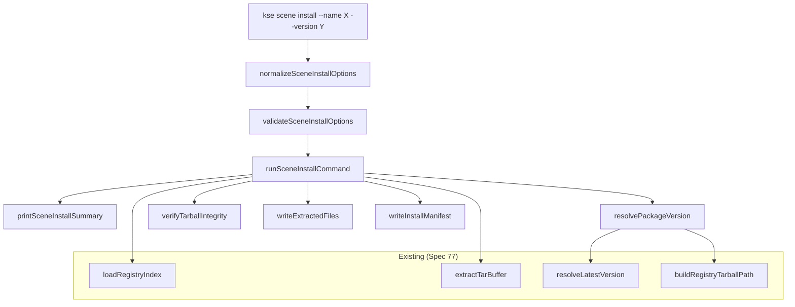

# Design Document: Scene Package Install

## Overview

The `kse scene install` command installs a published scene package from the local registry into a target project directory. It follows the established normalize → validate → run → print pattern used by all scene commands. The command resolves a package from the registry index, verifies tarball integrity via SHA-256, extracts contents using the existing `extractTarBuffer` function, and writes an install manifest (`scene-install-manifest.json`) to the target directory.

This feature reuses existing infrastructure from Spec 77: `loadRegistryIndex`, `buildRegistryTarballPath`, `resolveLatestVersion`, and `extractTarBuffer`. No new dependencies are introduced — only Node.js built-in `zlib`, `crypto`, `fs`, and `path` modules are used alongside the existing `fs-extra` already in the project.

## Architecture

The install command integrates into the existing scene command architecture:



The command runner follows the same dependency injection pattern as `runScenePackageRegistryPublishCommand` and `runSceneUnpublishCommand`, accepting `fileSystem` and `projectRoot` through a `dependencies` object.

## Components and Interfaces

### 1. normalizeSceneInstallOptions(options)

Normalizes raw CLI options into a consistent internal format with defaults.

```javascript
function normalizeSceneInstallOptions(options = {}) {
  return {
    name: options.name ? String(options.name).trim() : undefined,
    version: options.version ? String(options.version).trim() : undefined,
    out: options.out ? String(options.out).trim() : undefined,
    registry: options.registry ? String(options.registry).trim() : '.kiro/registry',
    force: options.force === true,
    dryRun: options.dryRun === true,
    json: options.json === true
  };
}
```

### 2. validateSceneInstallOptions(options)

Validates normalized options. Returns error string or null.

```javascript
function validateSceneInstallOptions(options) {
  if (!options.name || typeof options.name !== 'string') {
    return '--name is required';
  }
  // version is optional (defaults to latest)
  // if provided and not 'latest', validate semver
  if (options.version && options.version !== 'latest' && !semver.valid(options.version)) {
    return `--version "${options.version}" is not valid semver`;
  }
  return null;
}
```

### 3. runSceneInstallCommand(rawOptions, dependencies)

Main command runner. Pipeline: resolve → verify → extract → manifest.

```javascript
async function runSceneInstallCommand(rawOptions = {}, dependencies = {}) {
  const projectRoot = dependencies.projectRoot || process.cwd();
  const fileSystem = dependencies.fileSystem || fs;

  // 1. Normalize & validate
  const options = normalizeSceneInstallOptions(rawOptions);
  const validationError = validateSceneInstallOptions(options);
  if (validationError) { /* error + exit */ }

  // 2. Resolve registry root
  const registryRoot = resolveAbsolutePath(options.registry, projectRoot);

  // 3. Load registry index
  const index = await loadRegistryIndex(registryRoot, fileSystem);

  // 4. Resolve package & version
  const pkg = index.packages[options.name];
  // error if not found
  const version = (!options.version || options.version === 'latest')
    ? pkg.latest : options.version;
  const versionEntry = pkg.versions[version];
  // error if version not found

  // 5. Read tarball from disk
  const tarballPath = path.join(registryRoot, buildRegistryTarballPath(options.name, version));
  const tarballBuffer = await readFile(tarballPath);

  // 6. Verify integrity
  const computedHash = 'sha256-' + crypto.createHash('sha256').update(tarballBuffer).digest('hex');
  // error if computedHash !== versionEntry.integrity

  // 7. Resolve target directory
  const targetDir = resolveTargetDir(options, projectRoot);

  // 8. Dry-run: build payload, print, return
  // 9. Check target dir conflict (unless --force)
  // 10. Extract tarball
  const decompressed = zlib.gunzipSync(tarballBuffer);
  const files = extractTarBuffer(decompressed);

  // 11. Write files to target directory
  // 12. Write install manifest
  // 13. Build payload, print, return
}
```

### 4. printSceneInstallSummary(options, payload, projectRoot)

Formats output as human-readable text or JSON.

```javascript
function printSceneInstallSummary(options, payload, projectRoot = process.cwd()) {
  if (options.json) {
    console.log(JSON.stringify(payload, null, 2));
    return;
  }
  const dryRunLabel = payload.dry_run ? chalk.yellow(' [dry-run]') : '';
  console.log(chalk.blue('Scene Package Install') + dryRunLabel);
  console.log(`  Package: ${payload.coordinate}`);
  console.log(`  Target: ${chalk.gray(payload.target_dir)}`);
  console.log(`  Files: ${payload.file_count}`);
  console.log(`  Integrity: ${payload.integrity}`);
  if (payload.overwritten) {
    console.log(`  Overwritten: ${chalk.yellow('yes')}`);
  }
}
```

### 5. CLI Registration

Added to `registerSceneCommands`:

```javascript
sceneCmd
  .command('install')
  .description('Install scene package from local registry')
  .requiredOption('-n, --name <name>', 'Package name to install')
  .option('-v, --version <version>', 'Package version (default: latest)')
  .option('-o, --out <dir>', 'Target output directory')
  .option('-r, --registry <path>', 'Registry root directory', '.kiro/registry')
  .option('--force', 'Overwrite existing installation')
  .option('--dry-run', 'Preview install without writing files')
  .option('--json', 'Print install payload as JSON')
  .action(async (options) => {
    await runSceneInstallCommand(options);
  });
```

## Data Models

### Install Manifest (`scene-install-manifest.json`)

```json
{
  "packageName": "my-scene-template",
  "version": "1.2.0",
  "installedAt": "2026-02-10T12:00:00.000Z",
  "registryDir": ".kiro/registry",
  "integrity": "sha256-abc123...",
  "files": [
    "scene-package.json",
    "custom/scene.yaml",
    "templates/main.yaml"
  ]
}
```

### Command Payload (returned by `runSceneInstallCommand`)

```json
{
  "installed": true,
  "dry_run": false,
  "overwritten": false,
  "coordinate": "kse.scene/my-scene-template@1.2.0",
  "package": {
    "name": "my-scene-template",
    "version": "1.2.0"
  },
  "target_dir": "my-scene-template",
  "file_count": 3,
  "files": ["scene-package.json", "custom/scene.yaml", "templates/main.yaml"],
  "integrity": "sha256-abc123...",
  "registry": {
    "index_path": ".kiro/registry/registry-index.json"
  }
}
```

### Registry Index Entry (existing, read-only)

The install command reads from the existing registry index structure:

```json
{
  "apiVersion": "kse.scene.registry/v0.1",
  "packages": {
    "my-scene-template": {
      "name": "my-scene-template",
      "group": "kse.scene",
      "description": "...",
      "latest": "1.2.0",
      "versions": {
        "1.2.0": {
          "published_at": "2026-02-10T12:00:00.000Z",
          "integrity": "sha256-abc123...",
          "tarball": "packages/my-scene-template/1.2.0/my-scene-template-1.2.0.tgz"
        }
      }
    }
  }
}
```


## Correctness Properties

*A property is a characteristic or behavior that should hold true across all valid executions of a system — essentially, a formal statement about what the system should do. Properties serve as the bridge between human-readable specifications and machine-verifiable correctness guarantees.*

### Property 1: Tarball bundle-extract round-trip

*For any* set of files with relative paths and content, bundling them into a tarball via `bundlePackageTarball` and then decompressing + extracting via `gunzipSync` + `extractTarBuffer` should produce files with identical relative paths and identical content.

**Validates: Requirements 3.1, 3.5**

### Property 2: Install manifest completeness

*For any* successful install with a given package name, version, registry directory, integrity hash, and file list, the resulting install manifest object should contain all six required fields: `packageName`, `version`, `installedAt` (valid ISO 8601), `registryDir`, `integrity`, and `files` (matching the extracted file list).

**Validates: Requirements 4.1, 4.2**

### Property 3: Install manifest JSON round-trip

*For any* valid install manifest object, serializing it to JSON with `JSON.stringify` and then parsing it back with `JSON.parse` should produce a deeply equal object.

**Validates: Requirements 4.4**

### Property 4: Missing package or version produces error

*For any* package name not present in the registry index, or any version not present for an existing package, `runSceneInstallCommand` should return null and set `process.exitCode` to 1.

**Validates: Requirements 1.3, 1.4**

### Property 5: Integrity mismatch produces error

*For any* tarball where the stored integrity hash in the registry index differs from the SHA-256 hash computed from the actual tarball bytes on disk, `runSceneInstallCommand` should return null and set `process.exitCode` to 1.

**Validates: Requirements 2.4**

### Property 6: Existing target directory requires --force

*For any* target directory that already exists and contains files, `runSceneInstallCommand` without `--force` should return null and set `process.exitCode` to 1. With `--force`, the command should succeed and return a payload with `overwritten: true`.

**Validates: Requirements 3.3, 3.4, 6.3**

### Property 7: Default target directory is projectRoot/packageName

*For any* package name and project root, when `--out` is omitted, the resolved target directory should equal `path.join(projectRoot, packageName)`.

**Validates: Requirements 5.2, 5.3**

### Property 8: Dry-run writes no files but returns file list

*For any* valid install invocation with `--dry-run`, the command should return a payload with `dry_run: true`, `installed: false`, and a non-empty `files` array, while no files are written to the target directory and no install manifest is created.

**Validates: Requirements 7.1, 7.2, 7.3**

### Property 9: JSON output mode produces valid parseable JSON

*For any* install payload, when `--json` is specified, the output written to stdout should be valid JSON that, when parsed, contains the same fields as the payload object.

**Validates: Requirements 6.4**

## Error Handling

| Error Condition | Behavior | Exit Code |
|---|---|---|
| `--name` missing or empty | Print validation error, return null | 1 |
| `--version` is invalid semver (and not "latest") | Print validation error, return null | 1 |
| Package name not found in registry index | Print "package X not found in registry" error | 1 |
| Version not found for package | Print "version X not found for package Y" error | 1 |
| Registry index file missing or corrupt | Propagated from `loadRegistryIndex` error | 1 |
| Tarball file not found on disk | Print read error, return null | 1 |
| Integrity hash mismatch | Print "integrity verification failed: expected X, got Y" | 1 |
| Target directory exists without `--force` | Print "target directory already exists (use --force)" | 1 |
| File system write failure during extraction | Print write error, return null | 1 |

All errors follow the existing pattern: `console.error(chalk.red(...))` + `process.exitCode = 1` + `return null`.

## Testing Strategy

### Property-Based Tests (fast-check)

Each correctness property maps to a single property-based test with minimum 100 iterations. Tests use `fast-check` (already in the project) to generate random inputs.

| Property | Generator Strategy |
|---|---|
| P1: Tarball round-trip | Generate arrays of `{relativePath, content}` with random strings and buffers |
| P2: Manifest completeness | Generate random package names, versions, file lists, integrity hashes |
| P3: Manifest JSON round-trip | Generate random manifest objects with all required fields |
| P4: Missing package/version | Generate registry indexes and pick names/versions not in them |
| P5: Integrity mismatch | Generate valid tarballs, store with wrong hash in index |
| P6: Existing target dir | Generate file systems with pre-existing target directories |
| P7: Default target dir | Generate random package names and project roots |
| P8: Dry-run no writes | Generate valid install scenarios with dryRun: true |
| P9: JSON output | Generate random payloads, verify JSON.parse round-trip |

Tag format: `Feature: scene-package-install, Property N: <title>`

### Unit Tests (Jest)

Unit tests cover specific examples and edge cases:

- `normalizeSceneInstallOptions`: default values, trimming, boolean coercion
- `validateSceneInstallOptions`: missing name, invalid semver, valid "latest"
- `runSceneInstallCommand`: full happy-path integration with mock file system
- `runSceneInstallCommand`: dry-run mode returns payload without writing
- `runSceneInstallCommand`: --force overwrites existing installation
- `printSceneInstallSummary`: human-readable output format
- `printSceneInstallSummary`: JSON output mode
- Edge cases: empty file list in tarball, package with single version, "latest" resolution with multiple versions

### Test File

All tests in `tests/unit/commands/scene.test.js`, following the existing test organization with `describe('scene install', ...)` blocks.
