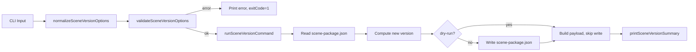

# Design Document: Scene Version Bump

## Overview

This feature adds a `kse scene version` command that bumps the `metadata.version` field in a `scene-package.json` file. It follows the established normalize → validate → run → print pattern. The command supports `major`, `minor`, `patch` increments and explicit semver strings, with `--dry-run` and `--json` output modes. All code lives in `lib/commands/scene.js` using the existing `semver` dependency.

## Architecture



## Components and Interfaces

### normalizeSceneVersionOptions

```javascript
function normalizeSceneVersionOptions(options = {}) {
  return {
    package: options.package ? String(options.package).trim() : '.',
    bump: options.bump ? String(options.bump).trim().toLowerCase() : undefined,
    dryRun: options.dryRun === true,
    json: options.json === true
  };
}
```

### validateSceneVersionOptions

```javascript
// Returns error string or null
function validateSceneVersionOptions(options) {
  if (!options.bump) {
    return '--bump is required (major, minor, patch, or explicit semver)';
  }
  const validTypes = ['major', 'minor', 'patch'];
  if (!validTypes.includes(options.bump) && !semver.valid(options.bump)) {
    return `--bump "${options.bump}" is not a valid bump type or semver version`;
  }
  return null;
}
```

### runSceneVersionCommand

```javascript
async function runSceneVersionCommand(rawOptions = {}, dependencies = {}) {
  const projectRoot = dependencies.projectRoot || process.cwd();
  const fileSystem = dependencies.fileSystem || fs;

  const options = normalizeSceneVersionOptions(rawOptions);
  const validationError = validateSceneVersionOptions(options);
  if (validationError) {
    console.error(chalk.red(`Scene version bump failed: ${validationError}`));
    process.exitCode = 1;
    return null;
  }

  try {
    // 1. Resolve package directory
    const packageDir = path.isAbsolute(options.package)
      ? options.package
      : path.join(projectRoot, options.package);

    // 2. Read scene-package.json
    const packageJsonPath = path.join(packageDir, 'scene-package.json');
    const readJson = typeof fileSystem.readJson === 'function'
      ? fileSystem.readJson.bind(fileSystem) : fs.readJson.bind(fs);
    let packageData;
    try {
      packageData = await readJson(packageJsonPath);
    } catch (err) {
      throw new Error(`failed to read scene-package.json: ${err.message}`);
    }

    // 3. Validate current version
    const metadata = packageData && typeof packageData.metadata === 'object'
      ? packageData.metadata : null;
    const currentVersion = metadata ? String(metadata.version || '').trim() : '';
    if (!currentVersion || !semver.valid(currentVersion)) {
      throw new Error(`invalid or missing metadata.version: "${currentVersion}"`);
    }

    // 4. Compute new version
    const validTypes = ['major', 'minor', 'patch'];
    let newVersion;
    if (validTypes.includes(options.bump)) {
      newVersion = semver.inc(currentVersion, options.bump);
    } else {
      // Explicit version — must be greater than current
      if (!semver.gt(options.bump, currentVersion)) {
        throw new Error(
          `explicit version "${options.bump}" must be greater than current "${currentVersion}"`
        );
      }
      newVersion = options.bump;
    }

    // 5. Write updated file (unless dry-run)
    if (!options.dryRun) {
      const writeJson = typeof fileSystem.writeJson === 'function'
        ? fileSystem.writeJson.bind(fileSystem) : fs.writeJson.bind(fs);
      packageData.metadata.version = newVersion;
      await writeJson(packageJsonPath, packageData, { spaces: 2 });
    }

    // 6. Build payload
    const name = (metadata && metadata.name) || packageData.name || '';
    const payload = {
      success: true,
      name,
      oldVersion: currentVersion,
      newVersion,
      packageDir: formatScenePackagePath(projectRoot, packageDir),
      dryRun: options.dryRun
    };

    printSceneVersionSummary(options, payload, projectRoot);
    return payload;
  } catch (error) {
    console.error(chalk.red('Scene version bump failed:'), error.message);
    process.exitCode = 1;
    return null;
  }
}
```

### printSceneVersionSummary

```javascript
function printSceneVersionSummary(options, payload, projectRoot = process.cwd()) {
  if (options.json) {
    console.log(JSON.stringify(payload, null, 2));
    return;
  }

  const dryRunLabel = payload.dryRun ? chalk.yellow(' [dry-run]') : '';
  console.log(chalk.blue('Scene Version Bump') + dryRunLabel);
  console.log(`  Package: ${payload.name}`);
  console.log(`  Version: ${payload.oldVersion} → ${payload.newVersion}`);
  console.log(`  Directory: ${chalk.gray(payload.packageDir)}`);
}
```

### Command Registration

```javascript
sceneCmd
  .command('version')
  .description('Bump the version in a scene-package.json file')
  .option('-p, --package <dir>', 'Scene package directory', '.')
  .requiredOption('-b, --bump <type>', 'Bump type: major, minor, patch, or explicit semver')
  .option('--json', 'Print result as JSON')
  .option('--dry-run', 'Show what would change without writing')
  .action(async (options) => {
    await runSceneVersionCommand(options);
  });
```

## Data Models

### Scene Package File (relevant fields)

```javascript
{
  metadata: {
    name: "my-scene-package",
    version: "1.2.3",
    // ... other fields preserved as-is
  },
  // ... rest of file preserved as-is
}
```

### Version Command Payload

```javascript
{
  success: true,
  name: "my-scene-package",
  oldVersion: "1.2.3",
  newVersion: "2.0.0",
  packageDir: ".",
  dryRun: false
}
```

### Human-Readable Output

```
Scene Version Bump
  Package: my-scene-package
  Version: 1.2.3 → 2.0.0
  Directory: .
```

### Dry-Run Output

```
Scene Version Bump [dry-run]
  Package: my-scene-package
  Version: 1.2.3 → 2.0.0
  Directory: .
```

## Correctness Properties

*A property is a characteristic or behavior that should hold true across all valid executions of a system — essentially, a formal statement about what the system should do. Properties serve as the bridge between human-readable specifications and machine-verifiable correctness guarantees.*

### Property 1: Semver increment correctness

*For any* valid semver version and any bump type (major, minor, patch), applying `semver.inc` shall produce a version that is strictly greater than the original, and the incremented component shall be exactly one more than the original while lower components reset to zero.

**Validates: Requirements 2.1**

### Property 2: Explicit version ordering enforcement

*For any* pair of valid semver versions where the explicit version is not greater than the current version, `validateSceneVersionOptions` or `runSceneVersionCommand` shall reject the operation. Conversely, for any pair where the explicit version is strictly greater, the operation shall succeed.

**Validates: Requirements 2.2, 2.3**

### Property 3: Version bump write round-trip

*For any* valid scene-package.json content and valid bump specifier, reading the file, bumping the version, writing it back, and reading again shall yield a file where `metadata.version` equals the computed new version and all other fields remain unchanged.

**Validates: Requirements 3.1**

### Property 4: Validation rejects invalid inputs

*For any* string that is neither a valid bump type (`major`, `minor`, `patch`) nor a valid semver string, `validateSceneVersionOptions` shall return a non-null error message.

**Validates: Requirements 1.4, 2.4**

### Property 5: JSON output contains all required fields

*For any* valid version bump payload, the JSON output shall contain all required fields: `success`, `name`, `oldVersion`, `newVersion`, `packageDir`, and `dryRun`.

**Validates: Requirements 4.2**

## Error Handling

| Scenario | Behavior |
|---|---|
| scene-package.json not found | Print error, `process.exitCode = 1`, return `null` |
| Invalid/missing `metadata.version` | Print error, `process.exitCode = 1`, return `null` |
| Invalid bump specifier | Print error at validation stage, `process.exitCode = 1`, return `null` |
| Explicit version not greater than current | Print error, `process.exitCode = 1`, return `null` |
| File write failure | Catch error, print message, `process.exitCode = 1`, return `null` |

All errors follow the same try/catch pattern used by `runSceneInstallCommand` and `runSceneUnpublishCommand`.

## Testing Strategy

### Property-Based Tests (fast-check)

Each correctness property maps to one property-based test with minimum 100 iterations.

| Property | Generator | Assertion |
|---|---|---|
| P1: Semver increment | Random valid semver (0–99 for each component) + random bump type | Result > original; correct component incremented |
| P2: Explicit version ordering | Random pair of valid semver versions | Rejection iff explicit ≤ current |
| P3: Write round-trip | Random scene-package.json object + random valid bump | Read-after-write yields new version, other fields unchanged |
| P4: Invalid input rejection | Random strings excluding valid bump types and valid semver | `validateSceneVersionOptions` returns non-null |
| P5: JSON output fields | Random payload with valid fields | All 6 required keys present in output |

Tag format: `Feature: scene-version-bump, Property N: <title>`

### Unit Tests (Jest)

- `normalizeSceneVersionOptions` defaults and overrides
- `validateSceneVersionOptions` missing bump, invalid bump, valid bump types, valid explicit semver
- `runSceneVersionCommand` with mock fileSystem: successful patch bump
- `runSceneVersionCommand` with mock fileSystem: explicit version bump
- `runSceneVersionCommand` error: file not found
- `runSceneVersionCommand` error: invalid current version
- `runSceneVersionCommand` error: explicit version not greater
- `runSceneVersionCommand` dry-run mode (no write calls)
- `printSceneVersionSummary` human-readable output
- `printSceneVersionSummary` JSON output
- `printSceneVersionSummary` dry-run indicator

### PBT Library

- Library: `fast-check` (already in devDependencies)
- Minimum iterations: 100 per property
- All tests in `tests/unit/commands/scene.test.js`
