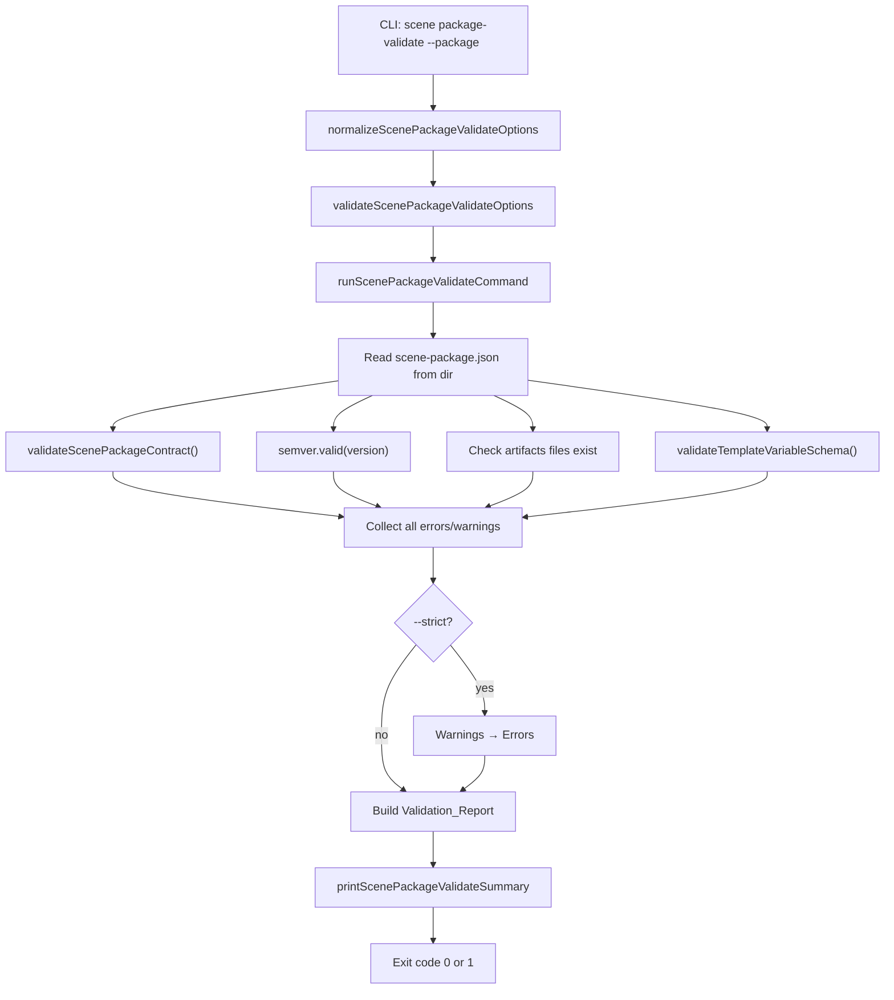

# Design Document: Scene Validate

## Overview

Adds a comprehensive `kse scene validate` subcommand that validates a scene package directory for structural integrity, metadata correctness, file existence, and template variable schema compliance. Follows the normalize → validate → run → print pattern. All code in `lib/commands/scene.js`. No new dependencies.

The command name will be `scene validate-package` to avoid collision with the existing `scene validate` (which validates scene manifests). Alternatively, this can be registered as an enhancement to the existing `scene package-validate` by adding `--package <dir>` directory-level validation alongside the existing contract-only validation.

**Design Decision**: Extend the existing `scene package-validate` command rather than creating a new subcommand. The existing command validates a contract JSON file; the enhanced version adds directory-level validation when `--package <dir>` points to a directory (detecting `scene-package.json` inside it). This reuses the existing normalize/validate/run/print functions and avoids command proliferation.

## Architecture



## Components and Interfaces

### normalizeScenePackageValidateOptions (enhanced)

Add `strict` boolean normalization to the existing function.

```javascript
function normalizeScenePackageValidateOptions(options = {}) {
  return {
    spec: options.spec ? String(options.spec).trim() : undefined,
    packagePath: options.package ? String(options.package).trim() : undefined,
    specPackage: normalizeRelativePath(options.specPackage || 'custom/scene-package.json') || 'custom/scene-package.json',
    json: options.json === true,
    strict: options.strict === true
  };
}
```

### validateScenePackageValidateOptions (unchanged)

No changes needed — existing validation already handles `--spec` / `--package` mutual exclusion.

### runScenePackageValidateCommand (enhanced)

Enhanced to perform directory-level validation when `packagePath` points to a directory:

1. Resolve input path (directory or file)
2. If directory: read `scene-package.json` from it, run full validation suite
3. If file: existing behavior (contract-only validation)
4. Full validation suite:
   - `validateScenePackageContract(contract)` — structural contract validation
   - `semver.valid(metadata.version)` — semver compliance
   - File existence checks for `artifacts.entry_scene` and `artifacts.generates`
   - `validateTemplateVariableSchema(variables)` — if variables/parameters present
5. Collect all errors and warnings
6. If `--strict`: promote warnings to errors
7. Build payload and print

### validateScenePackageDirectory (new helper)

Core validation logic extracted into a testable async function:

```javascript
async function validateScenePackageDirectory(packageDir, fileSystem) {
  // Returns { valid, contract, errors, warnings, fileChecks, summary }
}
```

This function:
- Reads `scene-package.json` from `packageDir`
- Runs `validateScenePackageContract`
- Validates semver via `semver.valid`
- Checks file existence for `artifacts.entry_scene` and `artifacts.generates`
- Validates template variable schema if `parameters` or `variables` present
- Returns aggregated errors and warnings

### printScenePackageValidateSummary (enhanced)

Enhanced to display warnings and strict mode indicator. Existing JSON and human-readable modes preserved.

## Data Models

### Enhanced Validation Payload

```javascript
{
  valid: true|false,
  input: {
    spec: null,
    path: "/path/to/package-dir",
    spec_package: null,
    mode: "directory"  // "directory" or "file"
  },
  summary: {
    coordinate: "kse.scene/my-package@1.0.0",
    kind: "scene-template",
    parameter_count: 3,
    provides_count: 2,
    requires_count: 1,
    file_count: 4,
    files_checked: 4,
    files_missing: 0
  },
  errors: [
    "metadata.version \"abc\" is not valid semver",
    "artifacts.entry_scene file not found: main.yaml"
  ],
  warnings: [
    "capabilities.provides is empty",
    "variables[0]: no description provided for \"env\""
  ]
}
```


## Correctness Properties

*A property is a characteristic or behavior that should hold true across all valid executions of a system — essentially, a formal statement about what the system should do. Properties serve as the bridge between human-readable specifications and machine-verifiable correctness guarantees.*

### Property 1: Required metadata fields produce errors when missing

*For any* scene package contract where one or more of `metadata.name`, `metadata.version`, or `metadata.description` is missing or empty, the validation report SHALL contain at least one error for each missing field.

**Validates: Requirements 1.3**

### Property 2: Semver validation consistency

*For any* string used as `metadata.version`, the validation report contains a semver error if and only if `semver.valid(version)` returns null. When an error is reported, the error message contains the invalid version string.

**Validates: Requirements 2.1, 2.2**

### Property 3: File existence check completeness

*For any* set of file paths referenced in `artifacts.entry_scene` and `artifacts.generates`, each path that does not exist on disk produces exactly one error in the validation report identifying that specific path. Paths that exist produce no file-related errors.

**Validates: Requirements 3.1, 3.2, 3.3**

### Property 4: Error collection completeness and validity semantics

*For any* scene package directory, the validation report `valid` field is `true` if and only if the `errors` array is empty. All validation checks contribute to either `errors` or `warnings` arrays, and no error is silently dropped.

**Validates: Requirements 5.1, 5.2, 5.3, 5.4**

### Property 5: Strict mode promotes warnings to errors

*For any* validation result that contains warnings but no errors, running with `strict=true` SHALL produce `valid=false` with the warnings reclassified as errors.

**Validates: Requirements 6.3**

## Error Handling

| Scenario | Behavior |
|---|---|
| `scene-package.json` not found | Report error, return `valid: false`, exit code 1 |
| `scene-package.json` not valid JSON | Report parse error, return `valid: false`, exit code 1 |
| Contract validation errors | Collect all, include in errors array |
| Invalid semver | Add error with invalid value in message |
| Missing referenced files | Add error per missing file with path |
| Variable schema errors | Merge into errors array |
| Filesystem read failure | Catch, report error, continue validation |

## Testing Strategy

- PBT library: `fast-check`, minimum 100 iterations per property test
- All tests in `tests/unit/commands/scene.test.js`
- Tag format: **Feature: scene-validate, Property {N}: {title}**

### Unit Tests
- Missing `scene-package.json` returns error
- Valid package directory returns `valid: true`
- `--json` flag outputs valid JSON
- `--strict` with warnings returns exit code 1
- Default `--package` resolves to cwd

### Property Tests
- Property 1: Generate random contracts with missing metadata fields → verify error count
- Property 2: Generate random version strings → verify semver error consistency
- Property 3: Generate random file lists with mock filesystem → verify error-per-missing-file
- Property 4: Generate random contracts → verify `valid === (errors.length === 0)`
- Property 5: Generate results with warnings only → verify strict mode flips valid to false
