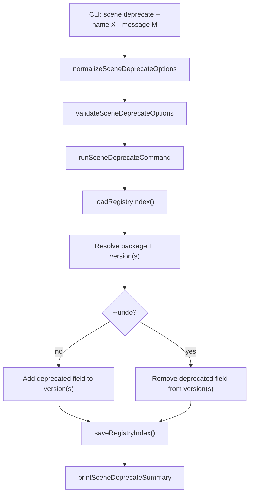

# Design Document: Scene Deprecate

## Overview

Adds a `kse scene deprecate` subcommand that marks package versions as deprecated in the local registry by adding/removing a `deprecated` field on version entries in `registry-index.json`. Also enhances `scene install` and `scene info` to surface deprecation warnings. Follows the normalize → validate → run → print pattern. All code in `lib/commands/scene.js`. No new dependencies.

## Architecture



## Components and Interfaces

### normalizeSceneDeprecateOptions

```javascript
function normalizeSceneDeprecateOptions(options = {}) {
  return {
    name: options.name ? String(options.name).trim() : undefined,
    version: options.version ? String(options.version).trim() : undefined,
    message: options.message ? String(options.message).trim() : undefined,
    registry: options.registry ? String(options.registry).trim() : '.kiro/registry',
    json: options.json === true,
    undo: options.undo === true
  };
}
```

### validateSceneDeprecateOptions

```javascript
function validateSceneDeprecateOptions(options) {
  if (!options.name) return '--name is required';
  if (!options.undo && !options.message) return '--message is required (unless --undo is used)';
  return null;
}
```

### runSceneDeprecateCommand

Core logic:
1. Normalize and validate options
2. Load registry index via `loadRegistryIndex`
3. Resolve package by name (error if not found)
4. If `--version` specified: resolve that version (error if not found)
5. If `--undo`: delete `deprecated` field from target version(s)
6. Else: set `deprecated = message` on target version(s)
7. Save registry index via `saveRegistryIndex`
8. Build payload and print

```javascript
async function runSceneDeprecateCommand(rawOptions = {}, dependencies = {}) {
  // normalize → validate → load → mutate → save → print
}
```

### printSceneDeprecateSummary

Human-readable output shows package name, action (deprecated/un-deprecated), affected versions, and message. JSON mode outputs structured payload.

### Install/Info Enhancements

**runSceneInstallCommand**: After resolving the version entry, check for `deprecated` field. If present, print a yellow warning line before proceeding with installation.

**runSceneInfoCommand / printSceneInfoSummary**: Include `deprecated` field in the versions array payload. In human-readable mode, append `[DEPRECATED: msg]` after the version line. In JSON mode, include the field as-is.

## Data Models

### Registry Index Version Entry (enhanced)

```javascript
// Existing fields
{
  published_at: "2024-01-01T00:00:00.000Z",
  integrity: "sha256-abc123",
  tarball: "packages/my-pkg/1.0.0.tgz"
}

// With deprecation marker
{
  published_at: "2024-01-01T00:00:00.000Z",
  integrity: "sha256-abc123",
  tarball: "packages/my-pkg/1.0.0.tgz",
  deprecated: "Use v2.0.0 instead"
}
```

### Deprecate Command Payload

```javascript
{
  success: true,
  action: "deprecate" | "undeprecate",
  package: "my-package",
  versions: ["1.0.0", "1.1.0"],
  message: "Use v2.0.0 instead",  // null for undeprecate
  registry: ".kiro/registry"
}
```

## Correctness Properties

*A property is a characteristic or behavior that should hold true across all valid executions of a system — essentially, a formal statement about what the system should do. Properties serve as the bridge between human-readable specifications and machine-verifiable correctness guarantees.*

### Property 1: Deprecate sets the marker on targeted versions

*For any* registry index containing a package with N versions, when the deprecate command is invoked with a valid package name and message (with or without a specific version), every targeted version entry SHALL have its `deprecated` field set to the provided message, and non-targeted versions SHALL remain unchanged.

**Validates: Requirements 1.1, 2.1**

### Property 2: Deprecate-then-undo round trip restores original state

*For any* registry index and any valid package/version target, deprecating and then un-deprecating SHALL produce a version entry with no `deprecated` field, equivalent to the original state before deprecation.

**Validates: Requirements 3.1, 3.2**

### Property 3: Error on invalid package or version target

*For any* package name not present in the registry index, or any version not present for an existing package, the deprecate command SHALL return an error (success=false) and leave the registry index unmodified.

**Validates: Requirements 1.3, 1.4**

### Property 4: Deprecation count matches affected versions

*For any* package with N versions, when deprecating all versions (no --version specified), the payload's `versions` array length SHALL equal N.

**Validates: Requirements 2.2**

### Property 5: Info output includes deprecation data for deprecated versions

*For any* package where some versions have a `deprecated` field, the info command payload SHALL include the `deprecated` field value for each deprecated version and omit it for non-deprecated versions.

**Validates: Requirements 5.1, 5.2**

## Error Handling

| Scenario | Behavior |
|---|---|
| Package not found in registry | Report error, exit code 1, return null |
| Version not found for package | Report error, exit code 1, return null |
| Registry index file missing | `loadRegistryIndex` returns empty index, then package-not-found error |
| Registry index parse failure | Propagate `loadRegistryIndex` error, exit code 1 |
| `--message` missing without `--undo` | Validation error, exit code 1 |
| `--name` missing | Validation error, exit code 1 |
| Filesystem write failure | Catch error, report, exit code 1 |

## Testing Strategy

- PBT library: `fast-check`, minimum 100 iterations per property test
- All tests in `tests/unit/commands/scene.test.js`
- Tag format: **Feature: scene-deprecate, Property {N}: {title}**

### Unit Tests
- Deprecate single version sets `deprecated` field
- Deprecate all versions sets `deprecated` on every entry
- Undo removes `deprecated` field
- Undo without `--message` passes validation
- Missing package returns error
- Missing version returns error
- `--json` outputs valid JSON payload
- Install prints warning for deprecated version
- Info includes deprecation in output

### Property Tests
- Property 1: Generate random registry indexes with random packages/versions, deprecate with random messages, verify marker set correctly
- Property 2: Generate random indexes, deprecate then undo, verify round-trip restores state
- Property 3: Generate random names/versions not in index, verify error and index unchanged
- Property 4: Generate random packages with N versions, deprecate all, verify count = N
- Property 5: Generate random packages with mixed deprecated/non-deprecated versions, verify info payload correctness
