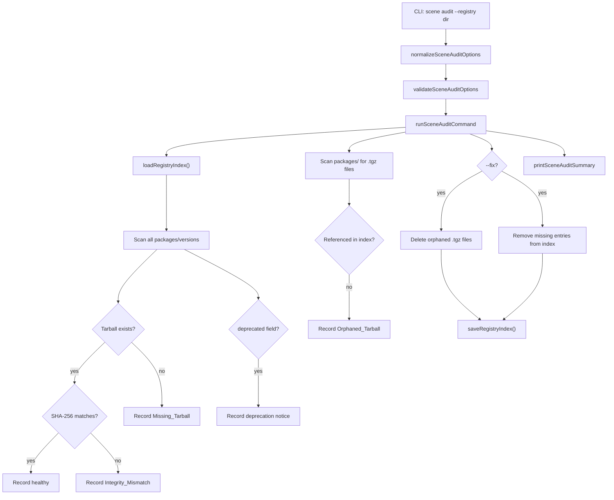

# Design Document: Scene Audit

## Overview

Adds a `kse scene audit` subcommand that performs a health check on the local scene package registry. The command loads `registry-index.json`, verifies tarball existence and SHA-256 integrity for every version entry, detects orphaned tarballs on disk, reports deprecated versions, and provides a summary. An optional `--fix` flag removes orphaned tarballs and cleans up index entries for missing tarballs. Follows the normalize → validate → run → print pattern. All code in `lib/commands/scene.js`. No new dependencies.

## Architecture



## Components and Interfaces

### normalizeSceneAuditOptions

```javascript
function normalizeSceneAuditOptions(options = {}) {
  return {
    registry: options.registry ? String(options.registry).trim() : '.kiro/registry',
    json: options.json === true,
    fix: options.fix === true
  };
}
```

### validateSceneAuditOptions

```javascript
function validateSceneAuditOptions(options) {
  // No required options — registry has a default, json and fix are boolean flags
  return null;
}
```

### runSceneAuditCommand

Core logic:
1. Normalize and validate options
2. Load registry index via `loadRegistryIndex`
3. For each package/version: check tarball existence, compute SHA-256 if exists, compare integrity, check deprecated field
4. Scan `packages/` directory recursively for `.tgz` files, compare against referenced set to find orphans
5. If `--fix`: delete orphaned files, remove missing-tarball version entries from index, save index
6. Build summary and payload, print

```javascript
async function runSceneAuditCommand(rawOptions = {}, dependencies = {}) {
  // normalize → validate → load → scan index → scan disk → fix → build payload → print
}
```

### printSceneAuditSummary

Human-readable output shows:
- Header with registry path
- Summary line: X packages, Y versions, Z healthy, W issues
- Grouped issue lists: missing tarballs, integrity mismatches, orphaned tarballs, deprecated versions
- Fix results (if --fix was used)

JSON mode outputs the full payload.

### Helper: collectTgzFiles

Recursively walks the `packages/` directory under the registry root and returns all `.tgz` file paths (relative to registry root). Uses `fs-extra` `readdir` with recursive option or manual walk.

```javascript
async function collectTgzFiles(packagesDir, fileSystem) {
  // Walk packagesDir recursively, collect all .tgz files
  // Return array of relative paths (relative to registry root)
}
```

### Helper: computeFileIntegrity

Reads a file and computes `sha256-<hex>` integrity string. Uses the already-imported `crypto` module.

```javascript
async function computeFileIntegrity(filePath, fileSystem) {
  const content = await fileSystem.readFile(filePath);
  const hash = crypto.createHash('sha256').update(content).digest('hex');
  return `sha256-${hash}`;
}
```

## Data Models

### Audit Payload

```javascript
{
  success: true,
  registry: ".kiro/registry",
  summary: {
    totalPackages: 5,
    totalVersions: 12,
    healthyVersions: 10,
    issues: 3
  },
  missing: [
    { package: "my-pkg", version: "1.0.0", tarball: "packages/my-pkg/1.0.0/my-pkg-1.0.0.tgz" }
  ],
  integrityMismatches: [
    { package: "my-pkg", version: "1.1.0", expected: "sha256-abc", actual: "sha256-def" }
  ],
  orphanedTarballs: [
    "packages/old-pkg/0.1.0/old-pkg-0.1.0.tgz"
  ],
  deprecated: [
    { package: "my-pkg", version: "0.9.0", message: "Use 1.0.0 instead" }
  ],
  fixes: null  // or { orphansRemoved: 1, entriesRemoved: 0 } when --fix is used
}
```

### Summary Count Invariant

`healthyVersions = totalVersions - missing.length - integrityMismatches.length`

Note: deprecated versions can still be healthy (deprecation is informational, not an integrity issue). The `issues` count = `missing.length + integrityMismatches.length + orphanedTarballs.length`.

## Correctness Properties

*A property is a characteristic or behavior that should hold true across all valid executions of a system — essentially, a formal statement about what the system should do. Properties serve as the bridge between human-readable specifications and machine-verifiable correctness guarantees.*

### Property 1: Summary counts are consistent with index contents

*For any* registry index with P packages and V total version entries, the audit summary SHALL report `totalPackages = P`, `totalVersions = V`, and `healthyVersions = V - missing.length - integrityMismatches.length`. The `issues` count SHALL equal `missing.length + integrityMismatches.length + orphanedTarballs.length`.

**Validates: Requirements 1.1, 6.1**

### Property 2: Missing tarball detection is exact

*For any* registry index and disk state, every version entry whose tarball file does not exist on disk SHALL appear in the `missing` array, and no version entry whose tarball exists on disk SHALL appear in the `missing` array.

**Validates: Requirements 2.1, 2.2**

### Property 3: Integrity mismatch detection is exact

*For any* registry index and disk state where tarballs exist, every version entry whose computed SHA-256 hash differs from the stored `integrity` field SHALL appear in the `integrityMismatches` array, and no version entry with matching integrity SHALL appear in the `integrityMismatches` array.

**Validates: Requirements 3.1, 3.2**

### Property 4: Orphaned tarball detection is exact

*For any* set of `.tgz` files on disk under `packages/` and any registry index, every `.tgz` file not referenced by any version entry SHALL appear in the `orphanedTarballs` array, and no referenced `.tgz` file SHALL appear in the `orphanedTarballs` array.

**Validates: Requirements 4.1, 4.2**

### Property 5: Deprecated version reporting is exact

*For any* registry index, every version entry with a `deprecated` field SHALL appear in the `deprecated` array with the correct message, and no version entry without a `deprecated` field SHALL appear in the `deprecated` array.

**Validates: Requirements 5.1**

### Property 6: Fix mode removes orphaned tarballs and missing-tarball entries

*For any* registry with orphaned tarballs and missing-tarball entries, running audit with `--fix` SHALL result in: (a) all orphaned `.tgz` files deleted from disk, (b) all version entries with missing tarballs removed from the index, and (c) the `fixes` counts matching the actual removals.

**Validates: Requirements 7.1, 7.2, 7.3**

## Error Handling

| Scenario | Behavior |
|---|---|
| Registry index file missing | `loadRegistryIndex` returns empty index, audit reports zero packages |
| Registry index parse failure | Propagate `loadRegistryIndex` error, exit code 1 |
| `packages/` directory missing | Treat as no files on disk, no orphans detected |
| File read error during integrity check | Record as integrity issue with error message |
| File delete error during --fix | Log warning, continue with remaining fixes |
| Registry write error during --fix | Catch error, report, exit code 1 |

## Testing Strategy

- PBT library: `fast-check`, minimum 100 iterations per property test
- All tests in `tests/unit/commands/scene.test.js`
- Tag format: **Feature: scene-audit, Property {N}: {title}**

### Unit Tests
- Audit empty registry returns zero counts
- Audit with all healthy versions returns correct summary
- Audit detects missing tarball
- Audit detects integrity mismatch
- Audit detects orphaned tarball
- Audit reports deprecated versions
- `--fix` removes orphaned files and missing entries
- `--fix` reports fix counts
- `--json` outputs valid JSON payload
- Normalize defaults registry to `.kiro/registry`
- Validate returns null (no required options)

### Property Tests
- Property 1: Generate random registry indexes, create matching/mismatching disk states, verify summary count invariant
- Property 2: Generate random indexes with random tarball existence, verify missing detection is exact
- Property 3: Generate random indexes with random integrity values, verify mismatch detection is exact
- Property 4: Generate random disk file sets and index entries, verify orphan detection is exact
- Property 5: Generate random indexes with mixed deprecated/non-deprecated versions, verify deprecated reporting is exact
- Property 6: Generate random registries with issues, run with --fix, verify cleanup is complete
