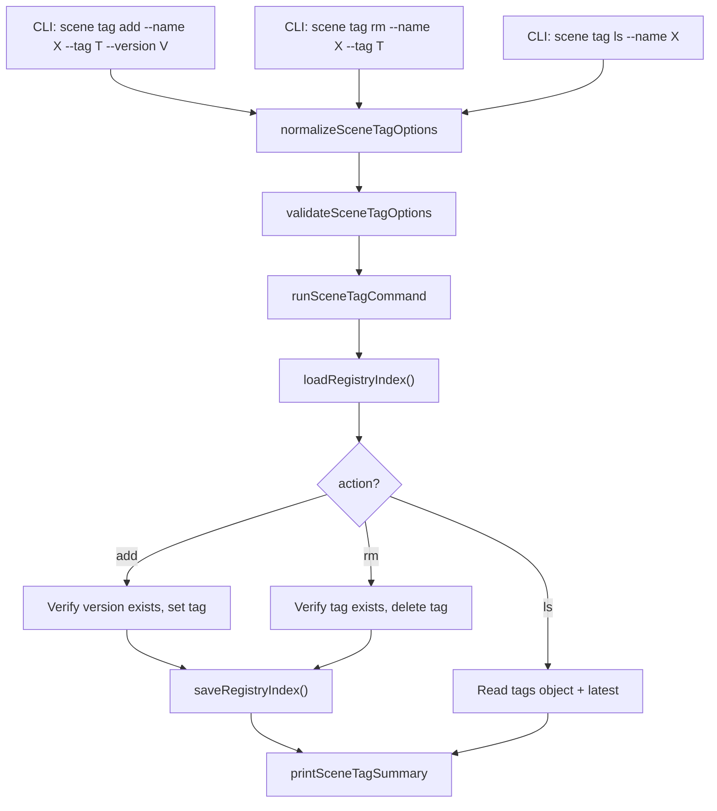

# Design Document: Scene Tag

## Overview

Adds a `kse scene tag` subcommand group to manage distribution tags on scene packages in the local registry. The group contains three sub-subcommands: `add`, `rm`, and `ls`. Each operates on a `tags` object within package entries in `registry-index.json`. Follows the normalize → validate → run → print pattern with a single `runSceneTagCommand` dispatcher. All code in `lib/commands/scene.js`. No new dependencies.

Tags are stored as a `tags` object on the package entry: `{ "stable": "1.1.0", "beta": "1.3.0-beta.1" }`. The `latest` field remains separate and auto-managed by publish. The `tag add` command prevents overwriting the `latest` tag to avoid conflicts with the publish flow.

## Architecture



## Components and Interfaces

### normalizeSceneTagOptions

```javascript
function normalizeSceneTagOptions(options = {}) {
  return {
    action: options.action ? String(options.action).trim() : undefined,
    name: options.name ? String(options.name).trim() : undefined,
    tag: options.tag ? String(options.tag).trim() : undefined,
    version: options.version ? String(options.version).trim() : undefined,
    registry: options.registry ? String(options.registry).trim() : '.kiro/registry',
    json: options.json === true
  };
}
```

### validateSceneTagOptions

```javascript
function validateSceneTagOptions(options) {
  if (!options.action) return '--action is required';
  const validActions = ['add', 'rm', 'ls'];
  if (!validActions.includes(options.action)) return `invalid action "${options.action}"`;

  if (options.action === 'add') {
    if (!options.name) return '--name is required';
    if (!options.tag) return '--tag is required';
    if (!options.version) return '--version is required';
    if (options.tag === 'latest') return '"latest" tag is managed automatically by publish';
  }
  if (options.action === 'rm') {
    if (!options.name) return '--name is required';
    if (!options.tag) return '--tag is required';
    if (options.tag === 'latest') return '"latest" tag is managed automatically by publish';
  }
  if (options.action === 'ls') {
    if (!options.name) return '--name is required';
  }
  return null;
}
```

### runSceneTagCommand

Core logic:
1. Normalize and validate options
2. Load registry index via `loadRegistryIndex`
3. Dispatch to action-specific logic:
   - **add**: Resolve package (error if not found). Verify version exists in `pkg.versions` (error if not). Initialize `pkg.tags` if absent. Set `pkg.tags[tag] = version`. Save index.
   - **rm**: Resolve package (error if not found). Verify tag exists in `pkg.tags` (error if not). Delete `pkg.tags[tag]`. Save index.
   - **ls**: Resolve package (error if not found). Read `pkg.tags` and `pkg.latest`.
4. Build payload and print

```javascript
async function runSceneTagCommand(rawOptions = {}, dependencies = {}) {
  const projectRoot = dependencies.projectRoot || process.cwd();
  const fileSystem = dependencies.fileSystem || fs;

  const options = normalizeSceneTagOptions(rawOptions);
  const validationError = validateSceneTagOptions(options);

  if (validationError) {
    console.error(chalk.red(`Scene tag failed: ${validationError}`));
    process.exitCode = 1;
    return null;
  }

  try {
    const registryRoot = path.isAbsolute(options.registry)
      ? options.registry
      : path.join(projectRoot, options.registry);

    const index = await loadRegistryIndex(registryRoot, fileSystem);
    const packages = index.packages || {};
    let payload;

    if (options.action === 'add') {
      if (!packages[options.name]) {
        throw new Error(`package "${options.name}" not found in registry`);
      }
      const pkg = packages[options.name];
      if (!pkg.versions || !pkg.versions[options.version]) {
        throw new Error(`version "${options.version}" not found for package "${options.name}"`);
      }
      if (!pkg.tags) pkg.tags = {};
      pkg.tags[options.tag] = options.version;
      await saveRegistryIndex(registryRoot, index, fileSystem);
      payload = {
        success: true,
        action: 'add',
        package: options.name,
        tag: options.tag,
        version: options.version,
        registry: options.registry
      };
    } else if (options.action === 'rm') {
      if (!packages[options.name]) {
        throw new Error(`package "${options.name}" not found in registry`);
      }
      const pkg = packages[options.name];
      if (!pkg.tags || !pkg.tags[options.tag]) {
        throw new Error(`tag "${options.tag}" not found for package "${options.name}"`);
      }
      delete pkg.tags[options.tag];
      await saveRegistryIndex(registryRoot, index, fileSystem);
      payload = {
        success: true,
        action: 'rm',
        package: options.name,
        tag: options.tag,
        registry: options.registry
      };
    } else if (options.action === 'ls') {
      if (!packages[options.name]) {
        throw new Error(`package "${options.name}" not found in registry`);
      }
      const pkg = packages[options.name];
      const tags = { ...(pkg.tags || {}) };
      payload = {
        success: true,
        action: 'ls',
        package: options.name,
        latest: pkg.latest || null,
        tags,
        registry: options.registry
      };
    }

    printSceneTagSummary(options, payload);
    return payload;
  } catch (error) {
    console.error(chalk.red('Scene tag failed:'), error.message);
    process.exitCode = 1;
    return null;
  }
}
```

### printSceneTagSummary

```javascript
function printSceneTagSummary(options, payload) {
  if (options.json) {
    console.log(JSON.stringify(payload, null, 2));
    return;
  }

  if (payload.action === 'add') {
    console.log(chalk.green(`Tag "${payload.tag}" set to version "${payload.version}" for package "${payload.package}"`));
  } else if (payload.action === 'rm') {
    console.log(chalk.green(`Tag "${payload.tag}" removed from package "${payload.package}"`));
  } else if (payload.action === 'ls') {
    const tagEntries = Object.entries(payload.tags);
    if (tagEntries.length === 0 && !payload.latest) {
      console.log(`No tags set for package "${payload.package}"`);
    } else {
      console.log(`Tags for package "${payload.package}":`);
      if (payload.latest) {
        console.log(`  latest: ${payload.latest}`);
      }
      for (const [tag, version] of tagEntries) {
        console.log(`  ${tag}: ${version}`);
      }
    }
  }
}
```

### CLI Registration

Register `scene tag` as a commander subcommand group with three sub-subcommands inside `registerSceneCommands`:

```javascript
const tagCmd = sceneCmd
  .command('tag')
  .description('Manage distribution tags on scene packages');

tagCmd
  .command('add')
  .description('Add a distribution tag to a package version')
  .requiredOption('-n, --name <name>', 'Package name')
  .requiredOption('-t, --tag <tag>', 'Tag name')
  .requiredOption('-v, --version <version>', 'Version to tag')
  .option('-r, --registry <path>', 'Registry root directory', '.kiro/registry')
  .option('--json', 'Print result as JSON')
  .action(async (options) => {
    await runSceneTagCommand({ ...options, action: 'add' });
  });

tagCmd
  .command('rm')
  .description('Remove a distribution tag from a package')
  .requiredOption('-n, --name <name>', 'Package name')
  .requiredOption('-t, --tag <tag>', 'Tag name to remove')
  .option('-r, --registry <path>', 'Registry root directory', '.kiro/registry')
  .option('--json', 'Print result as JSON')
  .action(async (options) => {
    await runSceneTagCommand({ ...options, action: 'rm' });
  });

tagCmd
  .command('ls')
  .description('List all distribution tags for a package')
  .requiredOption('-n, --name <name>', 'Package name')
  .option('-r, --registry <path>', 'Registry root directory', '.kiro/registry')
  .option('--json', 'Print result as JSON')
  .action(async (options) => {
    await runSceneTagCommand({ ...options, action: 'ls' });
  });
```

## Data Models

### Package Entry with Tags (enhanced)

```javascript
// Existing package entry
{
  latest: "1.2.0",
  versions: {
    "1.0.0": { published_at: "...", integrity: "...", tarball: "..." },
    "1.2.0": { published_at: "...", integrity: "...", tarball: "..." }
  }
}

// With tags field
{
  latest: "1.2.0",
  tags: {
    "stable": "1.0.0",
    "beta": "1.3.0-beta.1"
  },
  versions: {
    "1.0.0": { published_at: "...", integrity: "...", tarball: "..." },
    "1.2.0": { published_at: "...", integrity: "...", tarball: "..." },
    "1.3.0-beta.1": { published_at: "...", integrity: "...", tarball: "..." }
  }
}
```

### Tag Command Payloads

**Add payload:**
```javascript
{
  success: true,
  action: "add",
  package: "my-package",
  tag: "stable",
  version: "1.0.0",
  registry: ".kiro/registry"
}
```

**Rm payload:**
```javascript
{
  success: true,
  action: "rm",
  package: "my-package",
  tag: "beta",
  registry: ".kiro/registry"
}
```

**Ls payload:**
```javascript
{
  success: true,
  action: "ls",
  package: "my-package",
  latest: "1.2.0",
  tags: { "stable": "1.0.0", "beta": "1.3.0-beta.1" },
  registry: ".kiro/registry"
}
```


## Correctness Properties

*A property is a characteristic or behavior that should hold true across all valid executions of a system — essentially, a formal statement about what the system should do. Properties serve as the bridge between human-readable specifications and machine-verifiable correctness guarantees.*

### Property 1: Add-then-ls round trip

*For any* registry index containing a package with at least one version, and *for any* valid tag name (not "latest"), adding that tag pointing to an existing version and then listing tags SHALL return a tags object containing that tag with the correct version, plus the package's latest field.

**Validates: Requirements 1.1, 3.1, 3.3**

### Property 2: Add-then-rm round trip

*For any* registry index containing a package with at least one version, and *for any* valid tag name (not "latest"), adding that tag and then removing it SHALL restore the tags object to its original state before the add operation.

**Validates: Requirements 1.1, 2.1**

### Property 3: Package-not-found error across all actions

*For any* package name not present in the registry index and *for any* action (add, rm, ls), the command SHALL return null (error) and leave the registry index unmodified.

**Validates: Requirements 1.3, 2.3, 3.4**

### Property 4: Version-not-found error for add

*For any* registry index containing a package and *for any* version string not present in that package's versions object, the add action SHALL return null (error) and leave the registry index unmodified.

**Validates: Requirements 1.4**

### Property 5: Rm rejects non-existent tag

*For any* registry index containing a package and *for any* tag name not present in that package's tags object, the rm action SHALL return null (error) and leave the registry index unmodified.

**Validates: Requirements 2.2**

## Error Handling

| Scenario | Behavior |
|---|---|
| Package not found in registry | Report error, exit code 1, return null |
| Version not found for add | Report error, exit code 1, return null |
| Tag not found for rm | Report error, exit code 1, return null |
| Tag name is "latest" for add/rm | Validation error, exit code 1, return null |
| Registry index file missing | `loadRegistryIndex` returns empty index, then package-not-found error |
| `--name` missing | Validation error, exit code 1 |
| `--tag` missing for add/rm | Validation error, exit code 1 |
| `--version` missing for add | Validation error, exit code 1 |
| Filesystem write failure | Catch error, report, exit code 1 |

## Testing Strategy

- PBT library: `fast-check`, minimum 100 iterations per property test
- All tests in `tests/unit/commands/scene.test.js`
- Tag format: **Feature: scene-tag, Property {N}: {title}**

### Unit Tests
- Add tag persists the value in tags object
- Add tag overwrites existing tag value
- Add tag with non-existent package returns error
- Add tag with non-existent version returns error
- Add tag with "latest" name returns validation error
- Rm tag removes the tag from tags object
- Rm tag with non-existent tag returns error
- Rm tag with non-existent package returns error
- Rm tag with "latest" name returns validation error
- Ls returns all tags and latest field
- Ls with empty/absent tags returns empty tags object
- Ls with non-existent package returns error
- `--json` outputs valid JSON payload for all actions
- Normalize defaults registry to `.kiro/registry`
- Validate rejects missing required options per action

### Property Tests
- Property 1: Generate random registry indexes with packages and versions, add random tags, then ls — verify tag present with correct version and latest included
- Property 2: Generate random registry indexes, add random tags, then rm — verify tags restored to original state
- Property 3: Generate random package names not in index, invoke add/rm/ls — verify error and index unchanged
- Property 4: Generate random packages with versions, use non-existent version strings for add — verify error and index unchanged
- Property 5: Generate random packages with tags, use non-existent tag names for rm — verify error and index unchanged
