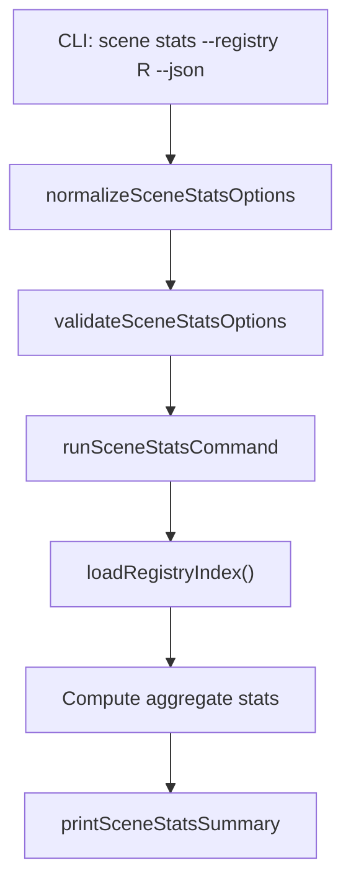

# Design Document: Scene Stats

## Overview

Adds a `kse scene stats` subcommand that computes and displays aggregate statistics about the local scene package registry. The command reads `registry-index.json` via `loadRegistryIndex`, iterates all package entries to compute metrics (total packages, total versions, total tags, ownership coverage, deprecated count, most recently published), and outputs a human-readable dashboard or structured JSON. Follows the normalize → validate → run → print pattern. All code in `lib/commands/scene.js`. No new dependencies.

Unlike owner/tag commands which have sub-subcommands, stats is a single command with no action dispatch — it always computes the full statistics dashboard.

## Architecture



## Components and Interfaces

### normalizeSceneStatsOptions

```javascript
function normalizeSceneStatsOptions(options = {}) {
  return {
    registry: options.registry ? String(options.registry).trim() : '.kiro/registry',
    json: options.json === true
  };
}
```

### validateSceneStatsOptions

Minimal validation — no required fields beyond defaults.

```javascript
function validateSceneStatsOptions(options) {
  return null;
}
```

### runSceneStatsCommand

Core logic:
1. Normalize and validate options
2. Load registry index via `loadRegistryIndex`
3. Iterate `index.packages` to compute:
   - `totalPackages`: count of package entries
   - `totalVersions`: sum of `Object.keys(pkg.versions).length` across all packages
   - `totalTags`: sum of `Object.keys(pkg.tags || {}).length` across all packages
   - `packagesWithOwner`: count of entries with truthy non-empty `owner` field
   - `packagesWithoutOwner`: `totalPackages - packagesWithOwner`
   - `deprecatedPackages`: count of entries with truthy `deprecated` field
   - `mostRecentlyPublished`: scan all versions of all packages for the latest `published_at` timestamp, record package name, version, and timestamp
4. Build payload and print

```javascript
async function runSceneStatsCommand(rawOptions = {}, dependencies = {}) {
  const projectRoot = dependencies.projectRoot || process.cwd();
  const fileSystem = dependencies.fileSystem || fs;

  const options = normalizeSceneStatsOptions(rawOptions);
  const validationError = validateSceneStatsOptions(options);

  if (validationError) {
    console.error(chalk.red(`Scene stats failed: ${validationError}`));
    process.exitCode = 1;
    return null;
  }

  try {
    const registryRoot = path.isAbsolute(options.registry)
      ? options.registry
      : path.join(projectRoot, options.registry);

    const index = await loadRegistryIndex(registryRoot, fileSystem);
    const packages = index.packages || {};
    const packageNames = Object.keys(packages);

    let totalVersions = 0;
    let totalTags = 0;
    let packagesWithOwner = 0;
    let deprecatedPackages = 0;
    let mostRecent = null;

    for (const name of packageNames) {
      const pkg = packages[name];
      const versions = pkg.versions || {};
      const versionKeys = Object.keys(versions);
      totalVersions += versionKeys.length;
      totalTags += Object.keys(pkg.tags || {}).length;

      if (pkg.owner && String(pkg.owner).trim() !== '') {
        packagesWithOwner++;
      }
      if (pkg.deprecated) {
        deprecatedPackages++;
      }

      for (const ver of versionKeys) {
        const publishedAt = versions[ver].published_at;
        if (publishedAt && (!mostRecent || publishedAt > mostRecent.publishedAt)) {
          mostRecent = { package: name, version: ver, publishedAt };
        }
      }
    }

    const payload = {
      success: true,
      totalPackages: packageNames.length,
      totalVersions,
      totalTags,
      packagesWithOwner,
      packagesWithoutOwner: packageNames.length - packagesWithOwner,
      deprecatedPackages,
      mostRecentlyPublished: mostRecent,
      registry: options.registry
    };

    printSceneStatsSummary(options, payload);
    return payload;
  } catch (error) {
    console.error(chalk.red('Scene stats failed:'), error.message);
    process.exitCode = 1;
    return null;
  }
}
```

### printSceneStatsSummary

```javascript
function printSceneStatsSummary(options, payload) {
  if (options.json) {
    console.log(JSON.stringify(payload, null, 2));
    return;
  }

  console.log(chalk.bold('Registry Statistics'));
  console.log(`  Packages:    ${payload.totalPackages}`);
  console.log(`  Versions:    ${payload.totalVersions}`);
  console.log(`  Tags:        ${payload.totalTags}`);
  console.log(`  With owner:  ${payload.packagesWithOwner}`);
  console.log(`  No owner:    ${payload.packagesWithoutOwner}`);
  console.log(`  Deprecated:  ${payload.deprecatedPackages}`);

  if (payload.mostRecentlyPublished) {
    const mr = payload.mostRecentlyPublished;
    console.log(`  Last publish: ${mr.package}@${mr.version} (${mr.publishedAt})`);
  } else {
    console.log('  Last publish: (none)');
  }
}
```

### CLI Registration

Register `scene stats` as a simple subcommand inside `registerSceneCommands`:

```javascript
sceneCmd
  .command('stats')
  .description('Show aggregate statistics about the local scene package registry')
  .option('-r, --registry <path>', 'Registry root directory', '.kiro/registry')
  .option('--json', 'Print result as JSON')
  .action(async (options) => {
    await runSceneStatsCommand(options);
  });
```

## Data Models

### Registry Index Structure (reference)

```javascript
{
  apiVersion: "kse.scene.registry/v0.1",
  packages: {
    "my-package": {
      latest: "1.2.0",
      owner: "alice",
      deprecated: false,
      tags: { "stable": "1.0.0" },
      versions: {
        "1.0.0": { published_at: "2025-01-01T00:00:00Z", integrity: "sha512-...", tarball: "..." },
        "1.2.0": { published_at: "2025-02-01T00:00:00Z", integrity: "sha512-...", tarball: "..." }
      }
    }
  }
}
```

### Stats Payload

```javascript
{
  success: true,
  totalPackages: 5,
  totalVersions: 12,
  totalTags: 3,
  packagesWithOwner: 3,
  packagesWithoutOwner: 2,
  deprecatedPackages: 1,
  mostRecentlyPublished: {
    package: "my-package",
    version: "1.2.0",
    publishedAt: "2025-02-01T00:00:00Z"
  },
  registry: ".kiro/registry"
}
```


## Correctness Properties

*A property is a characteristic or behavior that should hold true across all valid executions of a system — essentially, a formal statement about what the system should do. Properties serve as the bridge between human-readable specifications and machine-verifiable correctness guarantees.*

### Property 1: Aggregate counts correctness

*For any* registry index with any number of packages (including zero), each having any number of versions, tags, and deprecated status, the Stats_Command SHALL return a payload where:
- `totalPackages` equals the number of package entries
- `totalVersions` equals the sum of version counts across all packages
- `totalTags` equals the sum of tag counts across all packages (treating missing `tags` as empty)
- `deprecatedPackages` equals the count of packages with a truthy `deprecated` field

**Validates: Requirements 1.1, 2.1, 3.1, 3.2, 6.1**

### Property 2: Ownership partition invariant

*For any* registry index with any number of packages having various owner fields (present, absent, empty string), the Stats_Command SHALL return a payload where:
- `packagesWithOwner` equals the count of packages with a non-empty truthy `owner` field
- `packagesWithoutOwner` equals `totalPackages - packagesWithOwner`
- `packagesWithOwner + packagesWithoutOwner` equals `totalPackages`

**Validates: Requirements 4.1, 4.2, 4.3**

### Property 3: Most recently published correctness

*For any* registry index with at least one package having at least one version with a `published_at` timestamp, the Stats_Command SHALL return a `mostRecentlyPublished` object whose `publishedAt` value is greater than or equal to every other `published_at` value in the entire registry. For an empty registry, `mostRecentlyPublished` SHALL be null.

**Validates: Requirements 5.1, 5.2**

## Error Handling

| Scenario | Behavior |
|---|---|
| Registry index file missing | `loadRegistryIndex` returns empty index (packages: {}), stats show all zeros |
| Registry index parse failure | Propagate `loadRegistryIndex` error, exit code 1, return null |
| Empty registry (no packages) | All counts zero, mostRecentlyPublished null |
| Package entry with missing `versions` | Treat as empty versions object (0 versions) |
| Package entry with missing `tags` | Treat as empty tags object (0 tags) |
| Package entry with missing `owner` | Count as "without owner" |
| Filesystem read failure | Catch error, report, exit code 1 |

## Testing Strategy

- PBT library: `fast-check`, minimum 100 iterations per property test
- All tests in `tests/unit/commands/scene.test.js`
- Tag format: **Feature: scene-stats, Property {N}: {title}**

### Unit Tests
- Stats on registry with multiple packages returns correct counts
- Stats on empty registry returns all zeros and null mostRecentlyPublished
- Stats correctly counts packages with and without owners
- Stats correctly counts deprecated packages
- Stats finds the most recently published version across all packages
- Stats handles packages with missing tags object (treats as zero)
- Stats handles packages with missing owner field (counts as without owner)
- `--json` outputs valid JSON payload with all fields
- Normalize defaults registry to `.kiro/registry`
- Validate returns null (no required fields)
- Error when registry index cannot be read

### Property Tests
- Property 1: Generate random registry indexes with varying packages/versions/tags/deprecated, run stats — verify all aggregate counts match expected computations
- Property 2: Generate random registry indexes with varying owner fields (present, absent, empty), run stats — verify ownership partition invariant holds
- Property 3: Generate random registry indexes with varying published_at timestamps, run stats — verify mostRecentlyPublished has the maximum timestamp
