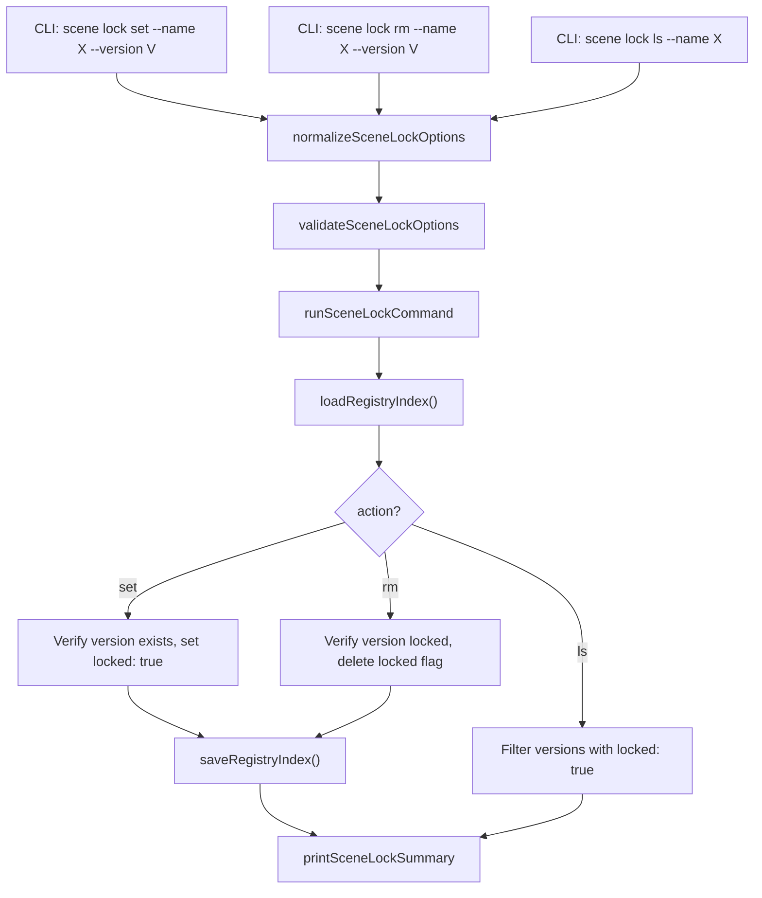

# Design Document: Scene Lock

## Overview

Adds a `kse scene lock` subcommand group to manage version locking on scene packages in the local registry. The group contains three sub-subcommands: `set`, `rm`, and `ls`. Each operates on a `locked` boolean flag on individual version entries in `registry-index.json`. Follows the normalize → validate → run → print pattern with a single `runSceneLockCommand` dispatcher. All code in `lib/commands/scene.js`. No new dependencies.

Lock state is stored as `locked: true` on version entries. When absent or falsy, the version is considered unlocked. The `set` command adds the flag, `rm` removes it (deletes the property), and `ls` filters versions that have the flag set.

## Architecture



## Components and Interfaces

### normalizeSceneLockOptions

```javascript
function normalizeSceneLockOptions(options = {}) {
  return {
    action: options.action ? String(options.action).trim() : undefined,
    name: options.name ? String(options.name).trim() : undefined,
    version: options.version ? String(options.version).trim() : undefined,
    registry: options.registry ? String(options.registry).trim() : '.kiro/registry',
    json: options.json === true
  };
}
```

### validateSceneLockOptions

```javascript
function validateSceneLockOptions(options) {
  if (!options.action) return '--action is required';
  const validActions = ['set', 'rm', 'ls'];
  if (!validActions.includes(options.action)) return `invalid action "${options.action}"`;

  if (options.action === 'set') {
    if (!options.name) return '--name is required';
    if (!options.version) return '--version is required';
  }
  if (options.action === 'rm') {
    if (!options.name) return '--name is required';
    if (!options.version) return '--version is required';
  }
  if (options.action === 'ls') {
    if (!options.name) return '--name is required';
  }
  return null;
}
```

### runSceneLockCommand

Core logic:
1. Normalize and validate options
2. Load registry index via `loadRegistryIndex`
3. Dispatch to action-specific logic:
   - **set**: Resolve package (error if not found). Verify version exists in `pkg.versions` (error if not). Check if already locked (error if so). Set `versionEntry.locked = true`. Save index.
   - **rm**: Resolve package (error if not found). Verify version exists in `pkg.versions` (error if not). Check if locked (error if not). Delete `versionEntry.locked`. Save index.
   - **ls**: Resolve package (error if not found). Filter versions where `locked === true`. Return list.
4. Build payload and print

```javascript
async function runSceneLockCommand(rawOptions = {}, dependencies = {}) {
  const projectRoot = dependencies.projectRoot || process.cwd();
  const fileSystem = dependencies.fileSystem || fs;

  const options = normalizeSceneLockOptions(rawOptions);
  const validationError = validateSceneLockOptions(options);

  if (validationError) {
    console.error(chalk.red(`Scene lock failed: ${validationError}`));
    process.exitCode = 1;
    return null;
  }

  try {
    const registryRoot = path.isAbsolute(options.registry)
      ? options.registry
      : path.join(projectRoot, options.registry);

    const index = await loadRegistryIndex(registryRoot, fileSystem);
    const packages = index.packages || {};
    let payload;

    if (options.action === 'set') {
      if (!packages[options.name]) {
        throw new Error(`package "${options.name}" not found in registry`);
      }
      const pkg = packages[options.name];
      if (!pkg.versions || !pkg.versions[options.version]) {
        throw new Error(`version "${options.version}" not found for package "${options.name}"`);
      }
      const versionEntry = pkg.versions[options.version];
      if (versionEntry.locked === true) {
        throw new Error(`version "${options.version}" of package "${options.name}" is already locked`);
      }
      versionEntry.locked = true;
      await saveRegistryIndex(registryRoot, index, fileSystem);
      payload = {
        success: true,
        action: 'set',
        package: options.name,
        version: options.version,
        registry: options.registry
      };
    } else if (options.action === 'rm') {
      if (!packages[options.name]) {
        throw new Error(`package "${options.name}" not found in registry`);
      }
      const pkg = packages[options.name];
      if (!pkg.versions || !pkg.versions[options.version]) {
        throw new Error(`version "${options.version}" not found for package "${options.name}"`);
      }
      const versionEntry = pkg.versions[options.version];
      if (!versionEntry.locked) {
        throw new Error(`version "${options.version}" of package "${options.name}" is not locked`);
      }
      delete versionEntry.locked;
      await saveRegistryIndex(registryRoot, index, fileSystem);
      payload = {
        success: true,
        action: 'rm',
        package: options.name,
        version: options.version,
        registry: options.registry
      };
    } else if (options.action === 'ls') {
      if (!packages[options.name]) {
        throw new Error(`package "${options.name}" not found in registry`);
      }
      const pkg = packages[options.name];
      const versions = pkg.versions || {};
      const lockedVersions = Object.keys(versions).filter(v => versions[v].locked === true);
      payload = {
        success: true,
        action: 'ls',
        package: options.name,
        lockedVersions,
        registry: options.registry
      };
    }

    printSceneLockSummary(options, payload);
    return payload;
  } catch (error) {
    console.error(chalk.red('Scene lock failed:'), error.message);
    process.exitCode = 1;
    return null;
  }
}
```

### printSceneLockSummary

```javascript
function printSceneLockSummary(options, payload) {
  if (options.json) {
    console.log(JSON.stringify(payload, null, 2));
    return;
  }

  if (payload.action === 'set') {
    console.log(chalk.green(`Version "${payload.version}" of package "${payload.package}" is now locked`));
  } else if (payload.action === 'rm') {
    console.log(chalk.green(`Version "${payload.version}" of package "${payload.package}" is now unlocked`));
  } else if (payload.action === 'ls') {
    if (payload.lockedVersions.length === 0) {
      console.log(`No locked versions for package "${payload.package}"`);
    } else {
      console.log(`Locked versions for package "${payload.package}":`);
      for (const version of payload.lockedVersions) {
        console.log(`  ${version}`);
      }
    }
  }
}
```

### CLI Registration

Register `scene lock` as a commander subcommand group with three sub-subcommands inside `registerSceneCommands`:

```javascript
const lockCmd = sceneCmd
  .command('lock')
  .description('Manage version locks on scene packages');

lockCmd
  .command('set')
  .description('Lock a specific version of a package')
  .requiredOption('-n, --name <name>', 'Package name')
  .requiredOption('-v, --version <version>', 'Version to lock')
  .option('-r, --registry <path>', 'Registry root directory', '.kiro/registry')
  .option('--json', 'Print result as JSON')
  .action(async (options) => {
    await runSceneLockCommand({ ...options, action: 'set' });
  });

lockCmd
  .command('rm')
  .description('Unlock a specific version of a package')
  .requiredOption('-n, --name <name>', 'Package name')
  .requiredOption('-v, --version <version>', 'Version to unlock')
  .option('-r, --registry <path>', 'Registry root directory', '.kiro/registry')
  .option('--json', 'Print result as JSON')
  .action(async (options) => {
    await runSceneLockCommand({ ...options, action: 'rm' });
  });

lockCmd
  .command('ls')
  .description('List all locked versions for a package')
  .requiredOption('-n, --name <name>', 'Package name')
  .option('-r, --registry <path>', 'Registry root directory', '.kiro/registry')
  .option('--json', 'Print result as JSON')
  .action(async (options) => {
    await runSceneLockCommand({ ...options, action: 'ls' });
  });
```

## Data Models

### Version Entry with Lock (enhanced)

```javascript
// Existing version entry
{
  "1.0.0": { published_at: "...", integrity: "...", tarball: "..." }
}

// With locked flag
{
  "1.0.0": { published_at: "...", integrity: "...", tarball: "...", locked: true }
}
```

### Lock Command Payloads

**Set payload:**
```javascript
{
  success: true,
  action: "set",
  package: "my-package",
  version: "1.0.0",
  registry: ".kiro/registry"
}
```

**Rm payload:**
```javascript
{
  success: true,
  action: "rm",
  package: "my-package",
  version: "1.0.0",
  registry: ".kiro/registry"
}
```

**Ls payload:**
```javascript
{
  success: true,
  action: "ls",
  package: "my-package",
  lockedVersions: ["1.0.0", "1.2.0"],
  registry: ".kiro/registry"
}
```


## Correctness Properties

*A property is a characteristic or behavior that should hold true across all valid executions of a system — essentially, a formal statement about what the system should do. Properties serve as the bridge between human-readable specifications and machine-verifiable correctness guarantees.*

### Property 1: Set-then-ls round trip

*For any* registry index containing a package with at least one unlocked version, locking that version with `set` and then listing locked versions with `ls` SHALL return a list that includes the locked version.

**Validates: Requirements 1.1, 3.1**

### Property 2: Set-then-rm round trip

*For any* registry index containing a package with at least one unlocked version, locking that version with `set` and then unlocking it with `rm` SHALL restore the version entry to its original state (no `locked` property).

**Validates: Requirements 1.1, 2.1**

### Property 3: Package-not-found error across all actions

*For any* package name not present in the registry index and *for any* action (set, rm, ls), the command SHALL return null (error) and leave the registry index unmodified.

**Validates: Requirements 1.2, 2.2, 3.3**

### Property 4: Version-not-found error for set and rm

*For any* registry index containing a package and *for any* version string not present in that package's versions object, both the set and rm actions SHALL return null (error) and leave the registry index unmodified.

**Validates: Requirements 1.3, 2.3**

### Property 5: Ls filtering is exact

*For any* registry index containing a package with a mix of locked and unlocked versions, the `ls` action SHALL return exactly the set of version strings that have `locked: true` — no false positives and no false negatives.

**Validates: Requirements 3.1**

## Error Handling

| Scenario | Behavior |
|---|---|
| Package not found in registry | Report error, exit code 1, return null |
| Version not found for set/rm | Report error, exit code 1, return null |
| Version already locked for set | Report error, exit code 1, return null |
| Version not locked for rm | Report error, exit code 1, return null |
| Registry index file missing | `loadRegistryIndex` returns empty index, then package-not-found error |
| `--name` missing | Validation error, exit code 1 |
| `--version` missing for set/rm | Validation error, exit code 1 |
| Invalid action | Validation error, exit code 1 |
| Filesystem write failure | Catch error, report, exit code 1 |

## Testing Strategy

- PBT library: `fast-check`, minimum 100 iterations per property test
- All tests in `tests/unit/commands/scene.test.js`
- Tag format: **Feature: scene-lock, Property {N}: {title}**

### Unit Tests
- Set lock persists `locked: true` on version entry
- Set lock on already-locked version returns error
- Set lock with non-existent package returns error
- Set lock with non-existent version returns error
- Rm lock removes `locked` property from version entry
- Rm lock on non-locked version returns error
- Rm lock with non-existent package returns error
- Rm lock with non-existent version returns error
- Ls returns all locked versions
- Ls with no locked versions returns empty list
- Ls with non-existent package returns error
- `--json` outputs valid JSON payload for all actions
- Normalize defaults registry to `.kiro/registry`
- Validate rejects missing required options per action

### Property Tests
- Property 1: Generate random registry indexes with packages and versions, lock a random version, then ls — verify locked version present in list
- Property 2: Generate random registry indexes, lock a random version, then rm — verify version entry restored to original state
- Property 3: Generate random package names not in index, invoke set/rm/ls — verify error and index unchanged
- Property 4: Generate random packages with versions, use non-existent version strings for set/rm — verify error and index unchanged
- Property 5: Generate random packages with mixed locked/unlocked versions, invoke ls — verify exact match of locked versions
