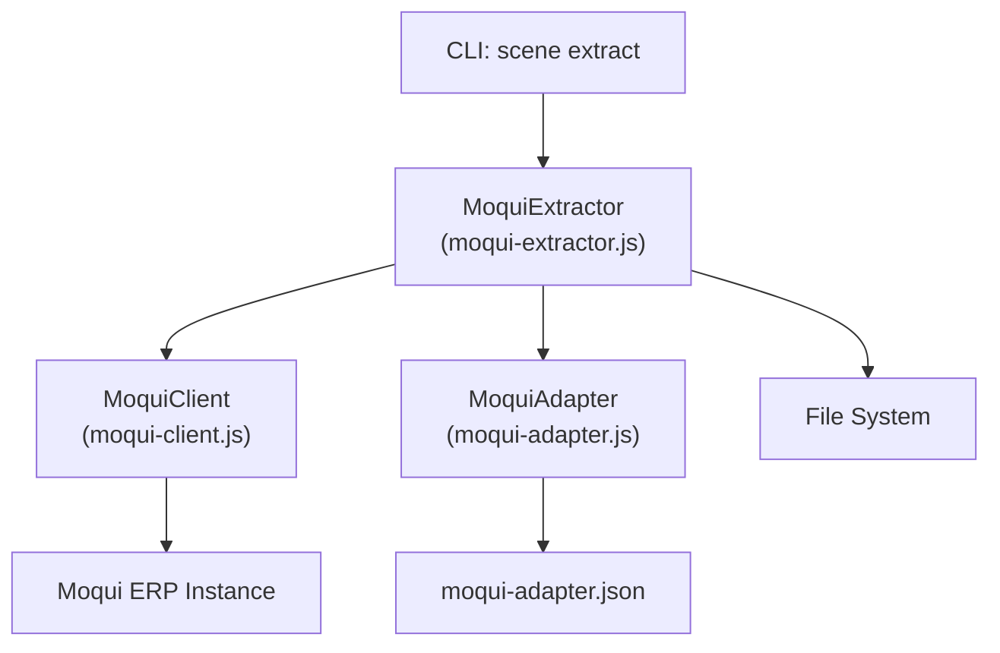
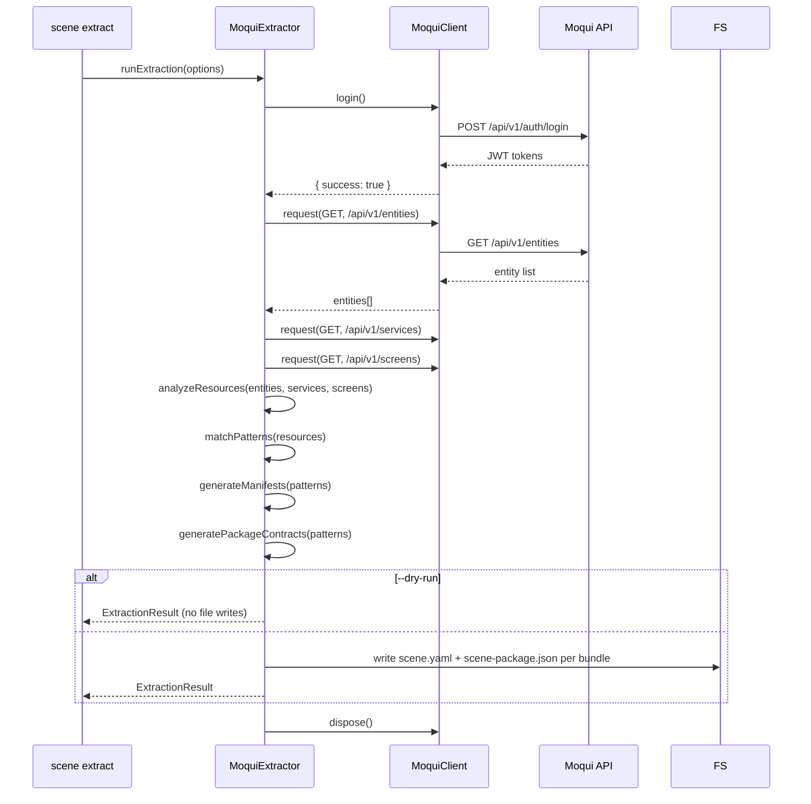

# Design Document: Moqui Scene Template Extractor

## Overview

The Moqui Scene Template Extractor adds a `scene extract` CLI command and a `moqui-extractor.js` module that connects to a live Moqui ERP instance (via Spec 90's MoquiClient), discovers available resources, identifies business patterns, and generates reusable scene templates.

The pipeline follows four stages:
1. **Connect** — Authenticate with Moqui using existing MoquiClient
2. **Discover** — Retrieve entity/service/screen catalogs via Moqui REST API
3. **Analyze** — Match discovered resources against built-in pattern rules
4. **Generate** — Produce scene manifests (YAML) and package contracts (JSON)

No new external dependencies. All YAML serialization uses a minimal built-in serializer (simple key-value YAML output sufficient for scene manifests). The module lives at `lib/scene-runtime/moqui-extractor.js` and the CLI command is added to `lib/commands/scene.js`.

## Architecture



### Pipeline Flow



## Components and Interfaces

### Module: MoquiExtractor (`lib/scene-runtime/moqui-extractor.js`)

#### Constants

```javascript
const SUPPORTED_PATTERNS = ['crud', 'query', 'workflow'];

const HEADER_ITEM_SUFFIXES = [
  { header: 'Header', item: 'Item' },
  { header: 'Header', item: 'Detail' },
  { header: 'Master', item: 'Detail' }
];

const SCENE_API_VERSION = 'kse.scene/v0.2';
const PACKAGE_API_VERSION = 'kse.scene.package/v0.1';
```

#### Core Functions

```javascript
/**
 * Run the full extraction pipeline.
 * @param {Object} options - Extraction options
 * @param {string} [options.config] - Path to moqui-adapter.json
 * @param {string} [options.type] - Filter: 'entities' | 'services' | 'screens'
 * @param {string} [options.pattern] - Filter: 'crud' | 'query' | 'workflow'
 * @param {string} [options.out] - Output directory path
 * @param {boolean} [options.dryRun] - Preview without writing files
 * @param {Object} [dependencies] - { projectRoot, fileSystem, client }
 * @returns {Promise<ExtractionResult>}
 */
async function runExtraction(options = {}, dependencies = {}) {}

/**
 * Discover resources from Moqui instance.
 * Reuses the same endpoint logic as scene discover command.
 * @param {MoquiClient} client - Authenticated MoquiClient
 * @param {Object} options - { type }
 * @returns {Promise<DiscoveryPayload>}
 */
async function discoverResources(client, options = {}) {}

/**
 * Analyze discovered resources and identify business patterns.
 * @param {DiscoveryPayload} discovery - Discovered resources
 * @param {Object} options - { pattern }
 * @returns {PatternMatch[]}
 */
function analyzeResources(discovery, options = {}) {}

/**
 * Group related entities by header/item suffix patterns.
 * E.g., OrderHeader + OrderItem → { base: 'Order', entities: ['OrderHeader', 'OrderItem'] }
 * @param {string[]} entityNames - List of entity names
 * @returns {EntityGroup[]}
 */
function groupRelatedEntities(entityNames) {}

/**
 * Match an entity group against pattern rules.
 * @param {EntityGroup} group - Grouped entity info
 * @param {string[]} services - Available service names
 * @returns {PatternMatch|null}
 */
function matchEntityPattern(group, services = []) {}

/**
 * Match services against workflow pattern rules.
 * @param {string[]} services - Service names
 * @param {string[]} entities - Entity names
 * @returns {PatternMatch[]}
 */
function matchWorkflowPatterns(services, entities = []) {}

/**
 * Generate a scene manifest YAML object for a pattern match.
 * @param {PatternMatch} match - Matched pattern
 * @returns {Object} Scene manifest object
 */
function generateSceneManifest(match) {}

/**
 * Generate a package contract JSON object for a pattern match.
 * @param {PatternMatch} match - Matched pattern
 * @returns {Object} Package contract object
 */
function generatePackageContract(match) {}

/**
 * Serialize a scene manifest object to YAML string.
 * Uses a minimal built-in serializer (no external deps).
 * @param {Object} manifest - Scene manifest object
 * @returns {string} YAML string
 */
function serializeManifestToYaml(manifest) {}

/**
 * Parse a YAML string back into an object.
 * Handles the subset of YAML used by scene manifests.
 * @param {string} yamlString - YAML content
 * @returns {Object} Parsed object
 */
function parseYaml(yamlString) {}

/**
 * Write template bundles to the output directory.
 * @param {TemplateBundleOutput[]} bundles - Generated bundles
 * @param {string} outDir - Output directory path
 * @param {Object} [fileSystem] - fs-extra compatible file system
 * @returns {Promise<WriteResult[]>}
 */
async function writeTemplateBundles(bundles, outDir, fileSystem) {}

/**
 * Derive a bundle directory name from pattern and resource.
 * @param {PatternMatch} match - Pattern match
 * @returns {string} Directory name in kebab-case
 */
function deriveBundleDirName(match) {}

/**
 * Derive a package name from pattern and resource.
 * @param {PatternMatch} match - Pattern match
 * @returns {string} Package name in kebab-case
 */
function derivePackageName(match) {}
```

### CLI Integration (additions to `lib/commands/scene.js`)

```javascript
function normalizeSceneExtractOptions(options = {}) {
  return {
    config: options.config ? String(options.config).trim() : undefined,
    type: options.type ? String(options.type).trim() : undefined,
    pattern: options.pattern ? String(options.pattern).trim() : undefined,
    out: options.out ? String(options.out).trim() : '.kiro/templates/extracted',
    dryRun: options.dryRun === true,
    json: options.json === true
  };
}

function validateSceneExtractOptions(options) {
  if (options.type && !['entities', 'services', 'screens'].includes(options.type)) {
    return `invalid --type "${options.type}", must be entities, services, or screens`;
  }
  if (options.pattern && !SUPPORTED_PATTERNS.includes(options.pattern)) {
    return `invalid --pattern "${options.pattern}", must be one of: ${SUPPORTED_PATTERNS.join(', ')}`;
  }
  return null;
}

async function runSceneExtractCommand(rawOptions = {}, dependencies = {}) {
  // 1. normalize + validate options
  // 2. loadAdapterConfig + validateAdapterConfig
  // 3. create MoquiClient, login
  // 4. call runExtraction() from moqui-extractor.js
  // 5. printSceneExtractSummary(options, payload)
  // 6. dispose client in finally block
}

function printSceneExtractSummary(options, payload) {
  // JSON mode: console.log(JSON.stringify(payload, null, 2))
  // Human mode: summary of templates generated, patterns found, output paths
}
```

## Data Models

### DiscoveryPayload

```javascript
{
  entities: ['OrderHeader', 'OrderItem', 'Product', 'Inventory', ...],
  services: ['PlaceOrder', 'ReserveInventory', ...],
  screens: ['OrderEntry', 'ProductCatalog', ...]
}
```

### EntityGroup

```javascript
{
  base: 'Order',                          // Base name without suffix
  entities: ['OrderHeader', 'OrderItem'], // Related entity names
  isComposite: true                       // Has header+item pair
}
```

### PatternMatch

```javascript
{
  pattern: 'crud',                        // 'crud' | 'query' | 'workflow'
  primaryResource: 'Order',               // Primary resource name
  entities: ['OrderHeader', 'OrderItem'], // Involved entities
  services: [],                           // Involved services
  bindingRefs: [                          // Generated binding refs
    'moqui.OrderHeader.list',
    'moqui.OrderHeader.get',
    'moqui.OrderHeader.create',
    'moqui.OrderHeader.update',
    'moqui.OrderHeader.delete'
  ],
  modelScope: {
    read: ['moqui.OrderHeader.orderId', 'moqui.OrderHeader.statusId'],
    write: ['moqui.OrderHeader.statusId']
  },
  governance: {
    riskLevel: 'medium',
    approvalRequired: true,
    idempotencyRequired: true,
    idempotencyKey: 'orderId'
  }
}
```

### ExtractionResult

```javascript
{
  success: true,
  templates: [
    {
      bundleDir: 'crud-order',
      manifest: { /* scene manifest object */ },
      contract: { /* package contract object */ },
      manifestYaml: '...yaml string...',
      contractJson: '...json string...'
    }
  ],
  summary: {
    totalTemplates: 3,
    patterns: { crud: 2, query: 1, workflow: 0 },
    outputDir: '.kiro/templates/extracted'
  },
  warnings: [],
  error: null
}
```

### Generated Scene Manifest (example for "crud" pattern)

```yaml
apiVersion: kse.scene/v0.2
kind: scene
metadata:
  obj_id: scene.extracted.crud-order
  obj_version: 0.1.0
  title: CRUD Order Template
spec:
  domain: erp
  intent:
    goal: Full CRUD operations for Order entity
  model_scope:
    read:
      - moqui.OrderHeader.orderId
      - moqui.OrderHeader.statusId
    write:
      - moqui.OrderHeader.statusId
  capability_contract:
    bindings:
      - type: query
        ref: moqui.OrderHeader.list
        timeout_ms: 2000
        retry: 0
      - type: query
        ref: moqui.OrderHeader.get
        timeout_ms: 2000
        retry: 0
      - type: mutation
        ref: moqui.OrderHeader.create
        side_effect: true
        timeout_ms: 3000
        retry: 0
      - type: mutation
        ref: moqui.OrderHeader.update
        side_effect: true
        timeout_ms: 3000
        retry: 0
      - type: mutation
        ref: moqui.OrderHeader.delete
        side_effect: true
        timeout_ms: 3000
        retry: 0
  governance_contract:
    risk_level: medium
    approval:
      required: true
    idempotency:
      required: true
      key: orderId
```

### Generated Package Contract (example)

```json
{
  "apiVersion": "kse.scene.package/v0.1",
  "kind": "scene-template",
  "metadata": {
    "group": "kse.scene",
    "name": "crud-order",
    "version": "0.1.0",
    "summary": "CRUD template for Order entity extracted from Moqui ERP"
  },
  "compatibility": {
    "kse_version": ">=1.39.0",
    "scene_api_version": "kse.scene/v0.2"
  },
  "parameters": [
    {
      "id": "timeout_ms",
      "type": "number",
      "required": false,
      "default": 2000,
      "description": "Request timeout in milliseconds"
    },
    {
      "id": "retry_count",
      "type": "number",
      "required": false,
      "default": 0,
      "description": "Number of retry attempts"
    }
  ],
  "artifacts": {
    "entry_scene": "scene.yaml",
    "generates": ["scene.yaml", "scene-package.json"]
  },
  "governance": {
    "risk_level": "medium",
    "approval_required": true,
    "rollback_supported": true
  }
}
```

### Pattern Rules

| Pattern | Entity Match | Service Match | Governance |
|---------|-------------|---------------|------------|
| `crud` | Entity with ≥1 name; generates all 5 ops | N/A | risk: medium, approval: true |
| `query` | Entity with ≥1 name; generates list+get only | N/A | risk: low, approval: false |
| `workflow` | Entities referenced by services | Service names present | risk: medium, approval: true |

### YAML Serializer Design

The built-in YAML serializer handles the subset of YAML used by scene manifests:
- Nested objects with string/number/boolean values
- Arrays of objects and strings
- No multi-line strings, anchors, or aliases needed

```javascript
// serializeManifestToYaml produces:
// - 2-space indentation
// - Array items with "- " prefix
// - String values unquoted unless they contain special chars
// - Consistent key ordering matching template examples

// parseYaml handles:
// - Indentation-based nesting
// - "- " array items
// - key: value pairs
// - Boolean (true/false), number, and string values
```


## Correctness Properties

*A property is a characteristic or behavior that should hold true across all valid executions of a system — essentially, a formal statement about what the system should do. Properties serve as the bridge between human-readable specifications and machine-verifiable correctness guarantees.*

### Property 1: Entity grouping preserves all entities

*For any* list of entity names, `groupRelatedEntities` should produce groups where: (a) every input entity appears in exactly one group, (b) entities sharing a header/item suffix pair (e.g., "OrderHeader" + "OrderItem") are in the same group, and (c) the total count of entities across all groups equals the input count.

**Validates: Requirements 2.4**

### Property 2: Pattern classification consistency

*For any* list of entity names, `analyzeResources` should produce pattern matches where each match's `pattern` field is one of the supported patterns ("crud", "query", "workflow"), and each match's `entities` array is a non-empty subset of the input entities.

**Validates: Requirements 2.2**

### Property 3: Pattern filter restricts output

*For any* discovery payload and any supported pattern filter value, running `analyzeResources` with the pattern filter should produce a result where every match has `pattern` equal to the filter value. The filtered result should be a subset of the unfiltered result.

**Validates: Requirements 2.3**

### Property 4: Manifest generation correctness

*For any* valid PatternMatch, `generateSceneManifest` should produce a manifest where: (a) `apiVersion` is `kse.scene/v0.2` and `kind` is `scene`, (b) "crud" patterns have exactly 5 bindings (list, get, create, update, delete), (c) "query" patterns have exactly 2 bindings (list, get), (d) "workflow" patterns have at least one service invoke binding, and (e) governance fields match the pattern rules (query → risk_level "low", crud/workflow → risk_level "medium").

**Validates: Requirements 3.1, 3.2, 3.3, 3.4, 3.5**

### Property 5: Contract generation correctness

*For any* valid PatternMatch, `generatePackageContract` should produce a contract where: (a) `apiVersion` is `kse.scene.package/v0.1`, (b) `kind` is `scene-template`, (c) metadata contains non-empty `name`, `version`, `group`, and `summary` fields, (d) the name is in kebab-case derived from the pattern and primary resource, and (e) parameters array contains at least `timeout_ms` and `retry_count` entries.

**Validates: Requirements 4.1, 4.2, 4.3, 4.4, 4.5**

### Property 6: YAML serialization round-trip

*For any* valid scene manifest object, `parseYaml(serializeManifestToYaml(manifest))` should produce an object equivalent to the original manifest.

**Validates: Requirements 3.6, 8.2**

### Property 7: ExtractionResult JSON round-trip

*For any* valid ExtractionResult object, `JSON.parse(JSON.stringify(result))` should produce an equivalent object.

**Validates: Requirements 8.1, 8.3**

### Property 8: File writing structure

*For any* non-empty list of template bundles and any output directory path, `writeTemplateBundles` should create exactly one subdirectory per bundle (named `{pattern}-{primaryResource}` in kebab-case), each containing exactly two files: `scene.yaml` and `scene-package.json`.

**Validates: Requirements 5.1, 5.2, 5.3**

### Property 9: Dry-run produces no file writes

*For any* extraction options with `dryRun: true`, `runExtraction` should return a valid ExtractionResult with templates populated but the file system should have zero write operations.

**Validates: Requirements 5.4**

### Property 10: Partial failure resilience

*For any* set of template bundles where a subset of file writes fail, `writeTemplateBundles` should still write the remaining bundles successfully and include exactly one warning per failed bundle in the result.

**Validates: Requirements 1.4, 7.3**

### Property 11: Option validation rejects invalid values

*For any* string not in `['entities', 'services', 'screens']` as `--type`, or any string not in `['crud', 'query', 'workflow']` as `--pattern`, `validateSceneExtractOptions` should return a non-null error string describing the invalid option.

**Validates: Requirements 6.5, 6.6**

## Error Handling

### Error Categories

| Error Code | Trigger | Recovery |
|------------|---------|----------|
| `AUTH_FAILED` | MoquiClient login fails | User checks credentials in moqui-adapter.json |
| `NETWORK_ERROR` | Connection refused, DNS failure, timeout | User checks Moqui instance availability |
| `CONFIG_NOT_FOUND` | moqui-adapter.json missing | User creates config file |
| `CONFIG_INVALID` | Config JSON malformed or missing required fields | User fixes config |
| `EXTRACT_FAILED` | Unrecoverable extraction error | Check error details |
| `WRITE_FAILED` | File system write error for a bundle | Included as warning; other bundles still written |

### Error Propagation

- All errors are wrapped into ExtractionResult with `success: false`
- The extractor never throws exceptions — all errors are returned as result objects
- CLI command catches errors and sets `process.exitCode = 1`
- MoquiClient is always disposed in a `finally` block

### Partial Failure Strategy

- If one catalog endpoint fails during discovery, other endpoints are still queried
- If one template bundle fails to write, remaining bundles are still written
- Warnings array in ExtractionResult collects all non-fatal issues

## Testing Strategy

### Property-Based Tests (fast-check)

Each correctness property maps to one property-based test with minimum 100 iterations. Tests are placed in `tests/unit/scene-runtime/moqui-extractor.test.js`.

| Property | Test Description | Generator Strategy |
|----------|-----------------|-------------------|
| P1 | Entity grouping | Generate random lists of entity names, some with header/item suffixes |
| P2 | Pattern classification | Generate random entity/service lists, verify match consistency |
| P3 | Pattern filter | Generate random discovery payloads + filter values, compare filtered vs unfiltered |
| P4 | Manifest generation | Generate random PatternMatch objects per pattern type, verify manifest fields |
| P5 | Contract generation | Generate random PatternMatch objects, verify contract fields |
| P6 | YAML round-trip | Generate random scene manifest objects, serialize and parse back |
| P7 | JSON round-trip | Generate random ExtractionResult objects, JSON stringify and parse |
| P8 | File writing structure | Generate random bundle lists + output dirs, verify mock FS calls |
| P9 | Dry-run no writes | Generate random options with dryRun=true, verify zero FS writes |
| P10 | Partial failure | Generate random bundles with some write failures injected, verify warnings |
| P11 | Option validation | Generate random invalid type/pattern strings, verify error returned |

### Unit Tests (Jest)

Unit tests cover specific examples, edge cases, and integration points:

- **groupRelatedEntities**: empty list, single entity, header+item pair, multiple groups, no matches
- **analyzeResources**: empty discovery, entities only, services only, mixed resources
- **generateSceneManifest**: one example per pattern type, verify YAML structure
- **generatePackageContract**: one example per pattern type, verify JSON structure
- **serializeManifestToYaml / parseYaml**: specific manifest examples, edge cases (empty arrays, nested objects)
- **derivePackageName / deriveBundleDirName**: various resource names, special characters
- **CLI normalize/validate**: each option variant, invalid combinations
- **CLI run command**: mocked extraction with success/failure paths
- **CLI print summary**: JSON mode and human-readable mode

### Test Configuration

- Property-based tests: `fast-check` library, 100+ iterations per property
- Each property test tagged: `Feature: 91-00-moqui-scene-template-extractor, Property N: {title}`
- Mocking: MoquiClient mocked for extractor tests; extractor mocked for CLI tests
- File system: mock `fs-extra` for write tests
- No real Moqui instance required for any test
