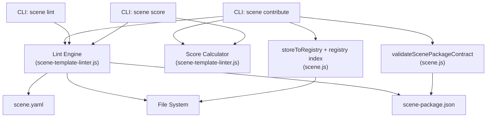
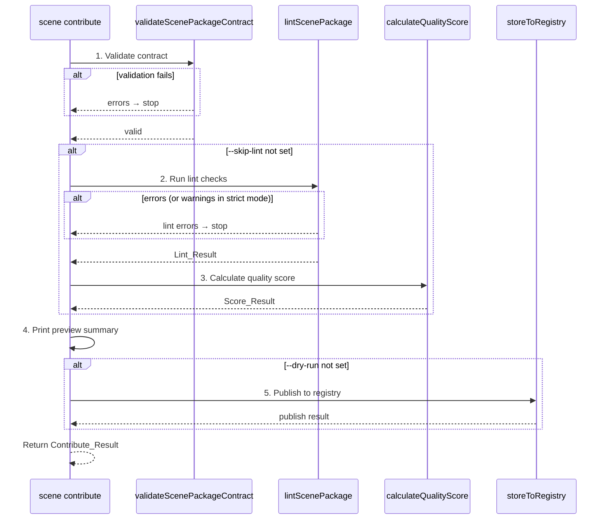

# Design Document: Scene Template Contribute Pipeline

## Overview

Scene Template Contribute Pipeline 为 KSE 添加三个新 CLI 子命令（`scene contribute`、`scene lint`、`scene score`）和一个核心模块 `scene-template-linter.js`。该模块包含模板 Lint 引擎和质量评分计算器两个核心功能。

设计遵循以下原则：
1. **复用优先** — 复用已有的 `validateScenePackageContract`、`validateScenePackageDirectory`、`validatePackageForPublish`、`storeToRegistry` 等函数
2. **模块分离** — Lint 引擎和评分计算器放在独立模块 `lib/scene-runtime/scene-template-linter.js`，CLI 集成放在 `lib/commands/scene.js`
3. **一致模式** — 所有命令遵循 normalize → validate → run → print 模式
4. **零新依赖** — 不引入任何新的外部依赖

## Architecture



### Contribute Pipeline Flow



## Components and Interfaces

### Module: scene-template-linter.js (`lib/scene-runtime/scene-template-linter.js`)

#### Constants

```javascript
const KNOWN_BINDING_REF_PREFIXES = ['moqui.', 'spec.erp.', 'kse.scene.'];
const VALID_RISK_LEVELS = ['low', 'medium', 'high'];
const KEBAB_CASE_PATTERN = /^[a-z][a-z0-9]*(-[a-z0-9]+)*$/;
const SEMVER_PATTERN = /^\d+\.\d+\.\d+(?:[-+][0-9A-Za-z.-]+)?$/;

const REQUIRED_PACKAGE_FIELDS = ['apiVersion', 'kind', 'metadata', 'capabilities', 'artifacts', 'governance'];
const REQUIRED_MANIFEST_FIELDS = ['apiVersion', 'kind', 'metadata', 'spec'];

const SCORE_WEIGHTS = {
  contractValidity: 30,
  lintPassRate: 30,
  documentationQuality: 20,
  governanceCompleteness: 20
};
```

#### Lint Engine Functions

```javascript
/**
 * 执行完整的模板 lint 检查。
 * @param {string} packageDir - 场景包目录路径
 * @param {Object} [options] - { fileSystem }
 * @returns {Promise<LintResult>}
 */
async function lintScenePackage(packageDir, options = {}) {}

/**
 * 检查 scene-package.json manifest 完整性。
 * @param {Object} contract - 已解析的 scene-package.json 对象
 * @returns {LintItem[]}
 */
function checkManifestCompleteness(contract) {}

/**
 * 检查 scene.yaml manifest 完整性。
 * @param {Object} manifest - 已解析的 scene.yaml 对象
 * @returns {LintItem[]}
 */
function checkSceneManifestCompleteness(manifest) {}

/**
 * 验证 binding ref 格式。
 * @param {Object} contract - scene-package.json 或 scene.yaml 对象
 * @returns {LintItem[]}
 */
function checkBindingRefFormat(contract) {}

/**
 * 检查 governance contract 合理性。
 * @param {Object} governance - governance 对象
 * @returns {LintItem[]}
 */
function checkGovernanceReasonableness(governance) {}

/**
 * 检查 package contract 一致性（name kebab-case, version semver, entry_scene 存在）。
 * @param {Object} contract - scene-package.json 对象
 * @param {string} packageDir - 包目录路径
 * @param {Object} [fileSystem] - fs-extra 兼容文件系统
 * @returns {Promise<LintItem[]>}
 */
async function checkPackageConsistency(contract, packageDir, fileSystem) {}

/**
 * 检查模板变量 schema 完整性。
 * @param {Object} contract - scene-package.json 对象
 * @returns {LintItem[]}
 */
function checkTemplateVariables(contract) {}

/**
 * 检查文档存在性（README.md 或 description）。
 * @param {Object} contract - scene-package.json 对象
 * @param {string} packageDir - 包目录路径
 * @param {Object} [fileSystem] - fs-extra 兼容文件系统
 * @returns {Promise<LintItem[]>}
 */
async function checkDocumentation(contract, packageDir, fileSystem) {}

/**
 * 创建一个 LintItem。
 * @param {'error'|'warning'|'info'} level
 * @param {string} code
 * @param {string} message
 * @returns {LintItem}
 */
function createLintItem(level, code, message) {}
```

#### Score Calculator Functions

```javascript
/**
 * 基于 Lint_Result 计算质量评分。
 * @param {LintResult} lintResult - lint 检查结果
 * @param {Object} [options] - { threshold }
 * @returns {ScoreResult}
 */
function calculateQualityScore(lintResult, options = {}) {}

/**
 * 计算合约有效性维度分数（30 分）。
 * @param {LintResult} lintResult
 * @returns {{ score: number, details: Object }}
 */
function scoreContractValidity(lintResult) {}

/**
 * 计算 lint 通过率维度分数（30 分）。
 * @param {LintResult} lintResult
 * @returns {{ score: number, details: Object }}
 */
function scoreLintPassRate(lintResult) {}

/**
 * 计算文档质量维度分数（20 分）。
 * @param {LintResult} lintResult
 * @returns {{ score: number, details: Object }}
 */
function scoreDocumentationQuality(lintResult) {}

/**
 * 计算治理完整性维度分数（20 分）。
 * @param {LintResult} lintResult
 * @returns {{ score: number, details: Object }}
 */
function scoreGovernanceCompleteness(lintResult) {}
```

### CLI Integration (additions to `lib/commands/scene.js`)

```javascript
// ── scene lint ──
function normalizeSceneLintOptions(options = {}) {
  return {
    package: options.package ? String(options.package).trim() : '.',
    json: options.json === true,
    strict: options.strict === true
  };
}

function validateSceneLintOptions(options) {
  // package 目录存在性在 run 阶段检查
  return null;
}

async function runSceneLintCommand(rawOptions = {}, dependencies = {}) {}
function printSceneLintSummary(options, payload, projectRoot) {}

// ── scene score ──
function normalizeSceneScoreOptions(options = {}) {
  return {
    package: options.package ? String(options.package).trim() : '.',
    json: options.json === true,
    threshold: typeof options.threshold === 'number' ? options.threshold : 60
  };
}

function validateSceneScoreOptions(options) {
  if (typeof options.threshold !== 'number' || options.threshold < 0 || options.threshold > 100) {
    return 'threshold must be a number between 0 and 100';
  }
  return null;
}

async function runSceneScoreCommand(rawOptions = {}, dependencies = {}) {}
function printSceneScoreSummary(options, payload, projectRoot) {}

// ── scene contribute ──
function normalizeSceneContributeOptions(options = {}) {
  return {
    package: options.package ? String(options.package).trim() : '.',
    registry: options.registry ? String(options.registry).trim() : '.kiro/registry',
    dryRun: options.dryRun === true,
    strict: options.strict === true,
    json: options.json === true,
    skipLint: options.skipLint === true,
    force: options.force === true
  };
}

function validateSceneContributeOptions(options) {
  return null;
}

async function runSceneContributeCommand(rawOptions = {}, dependencies = {}) {}
function printSceneContributeSummary(options, payload, projectRoot) {}
```

## Data Models

### LintItem

```javascript
{
  level: 'error',        // 'error' | 'warning' | 'info'
  code: 'MISSING_FIELD', // 机器可读的错误代码
  message: 'metadata.name is required' // 人类可读的描述
}
```

### LintResult

```javascript
{
  valid: true,           // 无 error 级别项时为 true
  errors: [LintItem],   // level === 'error' 的项
  warnings: [LintItem], // level === 'warning' 的项
  info: [LintItem],     // level === 'info' 的项
  summary: {
    error_count: 0,
    warning_count: 1,
    info_count: 2,
    checks_run: 7        // 执行的检查类别数
  },
  // 以下字段供 Score Calculator 使用，避免重复读取文件
  _context: {
    contract: { /* scene-package.json 对象 */ },
    manifest: { /* scene.yaml 对象, 可能为 null */ },
    hasReadme: true,
    contractErrors: [],   // validateScenePackageContract 的 errors
    manifestErrors: []    // scene.yaml 结构检查的 errors
  }
}
```

### ScoreResult

```javascript
{
  score: 85,
  pass: true,
  threshold: 60,
  dimensions: {
    contract_validity: {
      score: 30,
      max: 30,
      details: {
        package_contract: 15,
        scene_manifest: 15
      }
    },
    lint_pass_rate: {
      score: 24,
      max: 30,
      details: {
        error_deductions: 0,
        warning_deductions: 6
      }
    },
    documentation_quality: {
      score: 15,
      max: 20,
      details: {
        readme_present: 10,
        description_present: 5,
        variable_descriptions: 0
      }
    },
    governance_completeness: {
      score: 16,
      max: 20,
      details: {
        risk_level: 5,
        approval: 5,
        idempotency: 5,
        rollback: 1
      }
    }
  }
}
```

### ContributeResult

```javascript
{
  success: true,
  published: true,
  dry_run: false,
  stages: {
    validation: {
      passed: true,
      errors: [],
      warnings: []
    },
    lint: {
      passed: true,
      skipped: false,
      result: { /* LintResult */ }
    },
    score: {
      passed: true,
      skipped: false,
      result: { /* ScoreResult */ }
    },
    publish: {
      completed: true,
      skipped: false,
      overwritten: false,
      coordinate: 'kse.scene/crud-order@0.1.0',
      tarball: {
        path: '.kiro/registry/packages/crud-order/crud-order-0.1.0.tgz',
        size: 2048,
        file_count: 3,
        integrity: 'sha512-...'
      }
    }
  }
}
```

### Lint Code Reference

| Code | Level | Check Category | Description |
|------|-------|---------------|-------------|
| `MANIFEST_READ_FAILED` | error | manifest | scene-package.json 读取/解析失败 |
| `SCENE_YAML_READ_FAILED` | warning | manifest | scene.yaml 读取/解析失败 |
| `MISSING_PACKAGE_FIELD` | error | completeness | scene-package.json 缺少必需字段 |
| `MISSING_MANIFEST_FIELD` | warning | completeness | scene.yaml 缺少必需字段 |
| `INVALID_BINDING_REF` | warning | binding | binding ref 不匹配已知前缀 |
| `INVALID_RISK_LEVEL` | error | governance | risk_level 不是 low/medium/high |
| `MISSING_APPROVAL` | warning | governance | approval.required 未设置 |
| `MISSING_IDEMPOTENCY` | warning | governance | idempotency.required 未设置 |
| `NAME_NOT_KEBAB` | error | consistency | metadata.name 不是 kebab-case |
| `INVALID_VERSION` | error | consistency | metadata.version 不是有效 semver |
| `ENTRY_SCENE_MISSING` | error | consistency | artifacts.entry_scene 文件不存在 |
| `VARIABLE_MISSING_TYPE` | warning | variables | 模板变量缺少 type 字段 |
| `VARIABLE_MISSING_DESC` | warning | variables | 模板变量缺少 description 字段 |
| `NO_DOCUMENTATION` | warning | documentation | 无 README.md 且无 description |
| `HAS_README` | info | documentation | README.md 存在 |
| `HAS_DESCRIPTION` | info | documentation | metadata.description 存在 |


## Correctness Properties

*A property is a characteristic or behavior that should hold true across all valid executions of a system — essentially, a formal statement about what the system should do. Properties serve as the bridge between human-readable specifications and machine-verifiable correctness guarantees.*

### Property 1: Lint 结果结构不变量

*For any* package directory input (valid or invalid), `lintScenePackage` should return a LintResult where: (a) `errors`, `warnings`, `info` are arrays of LintItem objects, (b) each LintItem has `level`, `code`, and `message` string fields, (c) `valid` equals `errors.length === 0`, (d) `summary.error_count` equals `errors.length`, `summary.warning_count` equals `warnings.length`, `summary.info_count` equals `info.length`.

**Validates: Requirements 1.1, 1.8**

### Property 2: 缺失必需字段产生错误

*For any* scene-package.json object with a random subset of required fields (`apiVersion`, `kind`, `metadata`, `capabilities`, `artifacts`, `governance`) removed, `checkManifestCompleteness` should produce at least one error-level LintItem for each missing field. The number of error items should be greater than or equal to the number of removed fields.

**Validates: Requirements 1.2**

### Property 3: Binding ref 格式验证

*For any* binding ref string, `checkBindingRefFormat` should produce a warning-level LintItem if and only if the ref does not start with any of the known prefixes (`moqui.`, `spec.erp.`, `kse.scene.`). Refs matching a known prefix should produce zero warnings.

**Validates: Requirements 1.3**

### Property 4: Governance 合理性检查

*For any* governance object, `checkGovernanceReasonableness` should: (a) produce an error if `risk_level` is not one of `['low', 'medium', 'high']`, (b) produce a warning if `approval.required` is not a boolean, (c) produce a warning if `idempotency.required` is not a boolean. Valid governance objects should produce zero errors.

**Validates: Requirements 1.4**

### Property 5: Package 一致性检查

*For any* metadata.name string, `checkPackageConsistency` should produce an error-level LintItem with code `NAME_NOT_KEBAB` if and only if the name does not match the kebab-case pattern `/^[a-z][a-z0-9]*(-[a-z0-9]+)*$/`. *For any* metadata.version string, it should produce an error with code `INVALID_VERSION` if and only if the version is not valid semver.

**Validates: Requirements 1.5**

### Property 6: 模板变量验证

*For any* array of template variable objects, `checkTemplateVariables` should produce a warning for each variable missing a non-empty `type` field and a warning for each variable missing a non-empty `description` field. The total warning count should equal the count of variables missing type plus the count of variables missing description.

**Validates: Requirements 1.6**

### Property 7: 文档存在性检查

*For any* combination of (hasReadme: boolean, hasDescription: boolean), `checkDocumentation` should produce a warning with code `NO_DOCUMENTATION` if and only if both `hasReadme` is false and `hasDescription` is false. When either is present, no `NO_DOCUMENTATION` warning should appear.

**Validates: Requirements 1.7**

### Property 8: 评分总分不变量

*For any* valid LintResult, `calculateQualityScore` should return a ScoreResult where: (a) `score` equals the sum of all four dimension scores, (b) `0 <= score <= 100`, (c) each dimension score is between 0 and its maximum weight, (d) `pass` equals `score >= threshold`.

**Validates: Requirements 2.1, 2.6**

### Property 9: 评分维度公式正确性

*For any* valid LintResult, the score dimensions should follow these formulas: (a) contract_validity: 15 points if zero package contract errors, plus 15 points if zero manifest errors, (b) lint_pass_rate: `max(0, 30 - 10 * error_count - 3 * warning_count)`, (c) documentation_quality: 10 for README + 5 for description + 5 for all variables having descriptions, (d) governance_completeness: 5 each for risk_level, approval, idempotency, rollback_supported being set.

**Validates: Requirements 2.2, 2.3, 2.4, 2.5**

### Property 10: Strict 模式将警告视为错误

*For any* LintResult containing warnings, when strict mode is enabled, the pipeline (contribute or lint command) should treat those warnings as errors and report failure. Specifically, a LintResult with zero errors but non-zero warnings should cause `success: false` in strict mode but `success: true` in normal mode.

**Validates: Requirements 3.4, 4.3**

### Property 11: Dry-run 阻止发布

*For any* valid package directory and contribute options with `dryRun: true`, the ContributeResult should have `published: false` and `stages.publish.skipped: true`. No registry write operations should occur.

**Validates: Requirements 3.3**

### Property 12: Skip-lint 跳过 lint 和评分阶段

*For any* contribute options with `skipLint: true`, the ContributeResult should have `stages.lint.skipped: true` and `stages.score.skipped: true`. The pipeline should proceed directly from validation to publishing.

**Validates: Requirements 3.5**

### Property 13: 流水线在验证/lint 失败时停止

*For any* package directory where contract validation produces errors, the ContributeResult should have `success: false` and `stages.publish.completed: false`. *For any* package where lint produces errors (or warnings in strict mode), the same should hold.

**Validates: Requirements 3.9, 3.10**

### Property 14: Normalize 保留所有 CLI 选项

*For any* raw options object containing valid values for all contribute/lint/score options, the corresponding normalize function should preserve all option values in the returned normalized object. Default values should be applied only for missing options.

**Validates: Requirements 3.2, 4.1, 5.1**

### Property 15: 评分阈值决定通过/失败

*For any* ScoreResult with score `s` and threshold `t`, `pass` should equal `s >= t`. When `pass` is false, the CLI should set `process.exitCode` to 1.

**Validates: Requirements 5.3, 5.6**

### Property 16: JSON 序列化往返一致性

*For any* valid LintResult, ScoreResult, or ContributeResult, `JSON.parse(JSON.stringify(result))` should produce a deeply equal object.

**Validates: Requirements 6.1, 6.2, 6.3**

## Error Handling

### Error Categories

| Error Code | Trigger | Recovery |
|------------|---------|----------|
| `MANIFEST_READ_FAILED` | scene-package.json 不存在或 JSON 解析失败 | 用户检查文件路径和 JSON 格式 |
| `SCENE_YAML_READ_FAILED` | scene.yaml 不存在或解析失败 | 用户检查文件；lint 继续执行其他检查 |
| `PACKAGE_DIR_NOT_FOUND` | 指定的 Package_Dir 不存在 | 用户检查 --package 路径 |
| `VALIDATION_FAILED` | validateScenePackageContract 返回错误 | 用户修复 scene-package.json |
| `LINT_FAILED` | lint 检查产生 error 级别项 | 用户根据 lint 报告修复问题 |
| `PUBLISH_FAILED` | 注册表写入失败 | 用户检查注册表目录权限 |

### Error Propagation

- Lint 引擎永远不抛异常 — 所有错误封装在 LintResult 中返回
- Score 计算器接收 LintResult 作为输入，不直接访问文件系统
- CLI 命令在 try/catch 中执行，捕获异常后设置 `process.exitCode = 1`
- Contribute 流水线在任何阶段失败时立即停止并返回 ContributeResult

### Partial Failure Strategy

- scene.yaml 读取失败时，lint 继续基于 scene-package.json 执行剩余检查
- 评分计算器在 manifest 缺失时将 scene_manifest 维度评为 0 分，不影响其他维度

## Testing Strategy

### Property-Based Tests (fast-check)

每个正确性属性映射到一个 property-based test，最少 100 次迭代。测试位于 `tests/unit/scene-runtime/scene-template-linter.test.js`。

| Property | Test Description | Generator Strategy |
|----------|-----------------|-------------------|
| P1 | Lint 结果结构 | 生成随机 mock 文件系统（有/无 scene-package.json, scene.yaml），验证结果结构 |
| P2 | 缺失字段检测 | 生成随机 scene-package.json 对象，随机移除必需字段子集 |
| P3 | Binding ref 验证 | 生成随机字符串作为 binding ref，混合有效/无效前缀 |
| P4 | Governance 检查 | 生成随机 governance 对象，随机设置有效/无效字段值 |
| P5 | Package 一致性 | 生成随机 name 字符串（kebab/非 kebab）和 version 字符串（semver/非 semver） |
| P6 | 变量验证 | 生成随机变量数组，随机包含/缺失 type 和 description |
| P7 | 文档检查 | 生成随机 (hasReadme, hasDescription) 布尔组合 |
| P8 | 评分总分 | 生成随机 LintResult，验证总分 = 各维度之和，0-100 范围 |
| P9 | 维度公式 | 生成随机 LintResult，验证各维度分数符合公式 |
| P10 | Strict 模式 | 生成随机 LintResult（含 warnings），验证 strict/normal 模式行为差异 |
| P11 | Dry-run | 生成随机有效包 + dryRun=true，验证无发布操作 |
| P12 | Skip-lint | 生成随机选项 + skipLint=true，验证 lint/score 阶段被跳过 |
| P13 | 失败停止 | 生成随机无效包，验证流水线在失败阶段停止 |
| P14 | Normalize | 生成随机选项对象，验证 normalize 保留所有值 |
| P15 | 阈值判定 | 生成随机 (score, threshold) 对，验证 pass = score >= threshold |
| P16 | JSON 往返 | 生成随机 LintResult/ScoreResult/ContributeResult，验证 JSON 往返一致 |

### Unit Tests (Jest)

单元测试覆盖具体示例、边界情况和集成点，位于 `tests/unit/scene-runtime/scene-template-linter.test.js` 和 `tests/unit/commands/scene.test.js`。

**Linter 单元测试**:
- `lintScenePackage`: 完整有效包、缺失 scene-package.json、缺失 scene.yaml、空目录
- `checkManifestCompleteness`: 完整对象、空对象、部分字段缺失
- `checkBindingRefFormat`: 有效 ref（moqui.Order.list）、无效 ref（unknown.ref）、空 bindings
- `checkGovernanceReasonableness`: 有效 governance、缺失字段、无效 risk_level
- `checkPackageConsistency`: 有效 kebab-case name、大写 name、有效 semver、无效 version
- `checkTemplateVariables`: 完整变量、缺失 type、缺失 description、空数组
- `checkDocumentation`: 有 README、有 description、两者都无、两者都有

**Score 单元测试**:
- `calculateQualityScore`: 满分包（100分）、空包（0分）、中等质量包
- 各维度计算: 边界值测试（0分、满分）

**CLI 单元测试** (在 scene.test.js 中):
- `runSceneLintCommand`: 成功路径、失败路径、strict 模式、json 输出
- `runSceneScoreCommand`: 成功路径、低于阈值、json 输出
- `runSceneContributeCommand`: 完整流水线、dry-run、skip-lint、strict、validation 失败、lint 失败
- normalize/validate 函数: 各选项组合、默认值、无效输入

### Test Configuration

- Property-based tests: `fast-check` 库，每个属性测试 100+ 次迭代
- 每个属性测试标注: `Feature: 92-00-scene-template-contribute, Property N: {title}`
- Mock: 文件系统使用 mock fs-extra；注册表操作使用 mock
- 不需要真实文件系统或注册表
