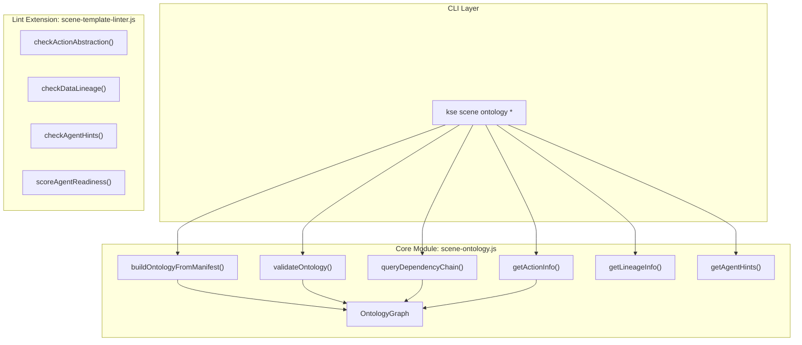

# 设计文档：Scene Ontology Enhancement

## 概述

本设计为 KSE Scene Runtime 引入 Palantir Foundry 启发的四项增强：

1. **Ontology Layer** — 将 binding refs 建模为语义关联图（OntologyGraph），支持关系查询和推理
2. **Action Abstraction** — 为 binding 增加 intent/preconditions/postconditions 声明
3. **Data Lineage** — 在 governance_contract 中追踪数据流转路径
4. **Agent-Ready Metadata** — 增加 agent_hints 字段提升 AI 可读性

核心模块为 `lib/scene-runtime/scene-ontology.js`，通过扩展现有 lint 引擎和评分计算器集成检查能力，通过 `kse scene ontology` 子命令组提供 CLI 访问。

## 架构



设计遵循现有项目模式：
- 纯函数 + 类导出，无副作用
- CLI 遵循 normalize → validate → run → print 模式
- 所有函数支持依赖注入（fileSystem 参数）
- Lint 检查返回 `{ level, code, message }` 格式

## 组件与接口

### 1. OntologyGraph 类

```javascript
// lib/scene-runtime/scene-ontology.js

class OntologyGraph {
  constructor()
  
  // 节点操作
  addNode(ref, metadata = {})    // 添加节点，ref 为字符串，metadata 为任意对象
  getNode(ref)                    // 返回 { ref, metadata } 或 null
  getAllNodes()                   // 返回所有节点数组
  
  // 边操作
  addEdge(sourceRef, targetRef, relationType)  // 添加有向边
  getEdges(ref)                                // 返回指定节点的所有出边
  getAllEdges()                                // 返回所有边数组
  
  // 序列化
  toJSON()                       // 返回 { nodes: [...], edges: [...] }
  static fromJSON(json)          // 从 JSON 重建图
}
```

内部存储：
- `this._nodes`: `Map<string, { ref: string, metadata: object }>`
- `this._edges`: `Map<string, Array<{ source: string, target: string, type: string }>>`

Relation_Type 常量：
```javascript
const VALID_RELATION_TYPES = ['depends_on', 'composes', 'extends', 'produces'];
```

### 2. Manifest 解析函数

```javascript
/**
 * 从 scene-package.json 构建 OntologyGraph
 * @param {Object} contract - 解析后的 scene-package.json 对象
 * @returns {OntologyGraph}
 */
function buildOntologyFromManifest(contract)
```

推断逻辑：
1. 遍历 `capability_contract.bindings`，为每个 binding 创建节点（metadata 包含 type、timeout_ms、intent、preconditions、postconditions）
2. 共享前缀推断：将 ref 按 `.` 分割，取前 N-1 段作为前缀。相同前缀的 refs 之间建立 `composes` 关系
3. 显式 `depends_on` 字段：若 binding 包含 `depends_on: "other.ref"`，创建 `depends_on` 边

### 3. 验证函数

```javascript
/**
 * 验证 OntologyGraph 一致性
 * @param {OntologyGraph} graph
 * @returns {{ valid: boolean, errors: Array<{ code: string, message: string, details: object }> }}
 */
function validateOntology(graph)
```

检查项：
- **DANGLING_EDGE_TARGET**: 边的目标节点不存在于图中
- **CYCLE_DETECTED**: `depends_on` 关系中存在循环（使用 DFS 检测）

### 4. 依赖链查询

```javascript
/**
 * 查询 ref 的完整 depends_on 依赖链（BFS 遍历）
 * @param {OntologyGraph} graph
 * @param {string} ref
 * @returns {{ ref: string, chain: string[], hasCycle: boolean }}
 */
function queryDependencyChain(graph, ref)
```

### 5. Action Abstraction 查询

```javascript
/**
 * 获取指定 ref 的 action abstraction 信息
 * @param {OntologyGraph} graph
 * @param {string} ref
 * @returns {{ ref: string, intent: string|null, preconditions: string[], postconditions: string[] }}
 */
function getActionInfo(graph, ref)
```

### 6. Data Lineage 解析与查询

```javascript
/**
 * 解析 governance_contract.data_lineage
 * @param {Object} contract - scene-package.json 对象
 * @returns {{ sources: Array, transforms: Array, sinks: Array } | null}
 */
function parseDataLineage(contract)

/**
 * 查询指定 ref 参与的 lineage 路径
 * @param {Object} contract - scene-package.json 对象
 * @param {string} ref
 * @returns {{ ref: string, asSource: Array, asSink: Array }}
 */
function getLineageInfo(contract, ref)
```

### 7. Agent Hints 解析

```javascript
/**
 * 解析 agent_hints 字段
 * @param {Object} contract - scene-package.json 对象
 * @returns {Object|null}
 */
function getAgentHints(contract)
```

有效 complexity 值：`['low', 'medium', 'high']`

### 8. Lint 扩展函数（添加到 scene-template-linter.js）

```javascript
// 新增 lint 检查函数
function checkActionAbstraction(contract)    // 返回 LintItem[]
function checkDataLineage(contract)          // 返回 LintItem[]
function checkAgentHints(contract)           // 返回 LintItem[]

// 新增评分函数
function scoreAgentReadiness(lintResult)     // 返回 { score, details }
```

Lint codes:
| Code | Level | 触发条件 |
|------|-------|---------|
| `EMPTY_INTENT` | warning | binding.intent 为空字符串 |
| `INVALID_PRECONDITIONS` | error | binding.preconditions 不是字符串数组 |
| `INVALID_POSTCONDITIONS` | error | binding.postconditions 不是字符串数组 |
| `LINEAGE_SOURCE_NOT_IN_BINDINGS` | warning | lineage source ref 不在 bindings 中 |
| `LINEAGE_SINK_NOT_IN_BINDINGS` | warning | lineage sink ref 不在 bindings 中 |
| `EMPTY_AGENT_SUMMARY` | warning | agent_hints.summary 为空字符串 |
| `INVALID_AGENT_COMPLEXITY` | error | agent_hints.complexity 不是有效值 |
| `INVALID_AGENT_DURATION` | error | agent_hints.estimated_duration_ms 不是正整数 |

### 9. CLI 命令注册

在 `lib/commands/scene.js` 中注册 `ontology` 子命令组：

```javascript
const ontologyCmd = sceneCmd
  .command('ontology')
  .description('Manage scene ontology graph and semantic relationships');

ontologyCmd.command('show')
  .option('-p, --package <path>', 'Path to scene package directory', '.')
  .option('--json', 'Print result as JSON')

ontologyCmd.command('deps')
  .requiredOption('--ref <ref>', 'Binding ref to query')
  .option('-p, --package <path>', 'Path to scene package directory', '.')
  .option('--json', 'Print result as JSON')

ontologyCmd.command('validate')
  .option('-p, --package <path>', 'Path to scene package directory', '.')
  .option('--json', 'Print result as JSON')

ontologyCmd.command('actions')
  .requiredOption('--ref <ref>', 'Binding ref to query')
  .option('-p, --package <path>', 'Path to scene package directory', '.')
  .option('--json', 'Print result as JSON')

ontologyCmd.command('lineage')
  .requiredOption('--ref <ref>', 'Binding ref to query')
  .option('-p, --package <path>', 'Path to scene package directory', '.')
  .option('--json', 'Print result as JSON')

ontologyCmd.command('agent-info')
  .option('-p, --package <path>', 'Path to scene package directory', '.')
  .option('--json', 'Print result as JSON')
```

每个子命令遵循 normalize → validate → run → print 模式，与现有 lint/score 命令一致。

## 数据模型

### 扩展后的 scene-package.json Schema

```json
{
  "apiVersion": "kse.scene.package/v0.1",
  "kind": "ScenePackage",
  "metadata": { "name": "...", "version": "...", "description": "..." },
  "capabilities": { "read": [], "write": [] },
  "capability_contract": {
    "bindings": [
      {
        "type": "query",
        "ref": "moqui.OrderHeader.list",
        "timeout_ms": 2000,
        "retry": 0,
        "depends_on": "moqui.Auth.validate",
        "intent": "Fetch all pending orders for approval",
        "preconditions": ["user.hasRole('viewer')"],
        "postconditions": ["result.length >= 0"]
      }
    ]
  },
  "governance_contract": {
    "risk_level": "medium",
    "approval": { "required": true },
    "idempotency": { "required": true, "key": "orderId" },
    "data_lineage": {
      "sources": [
        { "ref": "moqui.OrderHeader.list", "fields": ["orderId", "statusId"] }
      ],
      "transforms": [
        { "operation": "filter", "condition": "statusId == 'APPROVED'" }
      ],
      "sinks": [
        { "ref": "moqui.OrderItem.create", "fields": ["orderId"] }
      ]
    }
  },
  "agent_hints": {
    "summary": "Order approval workflow with inventory check",
    "complexity": "medium",
    "estimated_duration_ms": 5000,
    "required_permissions": ["order.approve", "inventory.read"],
    "suggested_sequence": ["check-inventory", "validate-order", "approve-order"],
    "rollback_strategy": "reverse-sequence"
  },
  "artifacts": { "entry_scene": "scene.yaml", "generates": [] },
  "variables": []
}
```

### OntologyGraph JSON 格式

```json
{
  "nodes": [
    { "ref": "moqui.OrderHeader.list", "metadata": { "type": "query", "intent": "..." } },
    { "ref": "moqui.OrderHeader.update", "metadata": { "type": "mutation" } }
  ],
  "edges": [
    { "source": "moqui.OrderHeader.update", "target": "moqui.OrderHeader.list", "type": "depends_on" },
    { "source": "moqui.OrderHeader.list", "target": "moqui.OrderHeader.update", "type": "composes" }
  ]
}
```

### 验证结果格式

```json
{
  "valid": false,
  "errors": [
    { "code": "DANGLING_EDGE_TARGET", "message": "Edge target 'x.y.z' does not exist as a node", "details": { "source": "a.b.c", "target": "x.y.z" } },
    { "code": "CYCLE_DETECTED", "message": "Cycle detected in depends_on: a → b → a", "details": { "cycle": ["a", "b", "a"] } }
  ]
}
```


## 正确性属性

*属性（Property）是在系统所有有效执行中都应成立的特征或行为——本质上是关于系统应该做什么的形式化陈述。属性是人类可读规范与机器可验证正确性保证之间的桥梁。*

### Property 1: 节点添加/获取往返一致性

*For any* 字符串 ref 和任意 metadata 对象，调用 `addNode(ref, metadata)` 后，`getNode(ref)` 应返回包含相同 ref 和 metadata 的节点对象。

**Validates: Requirements 1.1, 1.5**

### Property 2: 边添加/获取往返一致性与类型验证

*For any* 两个已存在的节点 ref 和有效的 relationType，调用 `addEdge(source, target, type)` 后，`getEdges(source)` 应包含该边。对于无效的 relationType（不在 `VALID_RELATION_TYPES` 中的字符串），addEdge 应抛出错误。对于引用不存在节点的边，addEdge 应返回错误。

**Validates: Requirements 1.2, 1.3, 1.4, 1.6**

### Property 3: OntologyGraph 序列化往返一致性

*For any* 有效的 OntologyGraph 实例（包含任意数量的节点和边），`OntologyGraph.fromJSON(graph.toJSON())` 应产生与原始图等价的图——节点集合、边集合、元数据均相同。

**Validates: Requirements 1.7, 1.8, 13.1**

### Property 4: Manifest 到 Graph 构建正确性

*For any* 有效的 scene-package.json 对象，`buildOntologyFromManifest(contract)` 应为每个 binding ref 创建恰好一个节点；共享前缀的 refs 之间应存在 `composes` 边；声明了 `depends_on` 的 binding 应产生对应的 `depends_on` 边。

**Validates: Requirements 2.1, 2.2, 2.3**

### Property 5: 悬空引用检测

*For any* OntologyGraph，`validateOntology(graph)` 应检测所有边中目标节点不存在的情况。当且仅当图中无悬空引用且无循环时，`valid` 应为 `true`。

**Validates: Requirements 3.1, 3.2, 3.5**

### Property 6: 循环依赖检测

*For any* OntologyGraph 中包含 `depends_on` 类型的循环路径，`validateOntology(graph)` 应检测到该循环并在 errors 中返回包含循环路径的 `CYCLE_DETECTED` 错误。

**Validates: Requirements 3.3, 3.4**

### Property 7: 依赖链完整性

*For any* OntologyGraph 和其中的节点 ref，`queryDependencyChain(graph, ref)` 返回的 chain 应包含该 ref 通过 `depends_on` 边可达的所有传递依赖。当存在循环时，函数应终止并标记 `hasCycle: true`。

**Validates: Requirements 4.1, 4.3**

### Property 8: Action Abstraction 存储与查询往返一致性

*For any* 包含 intent/preconditions/postconditions 字段的 binding，通过 `buildOntologyFromManifest` 构建图后，`getActionInfo(graph, ref)` 应返回与原始 binding 中相同的 intent、preconditions 和 postconditions 值。

**Validates: Requirements 5.1, 5.2, 5.3**

### Property 9: Action Abstraction Lint 检查正确性

*For any* 包含 bindings 的 contract，`checkActionAbstraction(contract)` 应：对 intent 为空字符串的 binding 产生 `EMPTY_INTENT` warning；对 preconditions 不是字符串数组的 binding 产生 `INVALID_PRECONDITIONS` error；对 postconditions 不是字符串数组的 binding 产生 `INVALID_POSTCONDITIONS` error。

**Validates: Requirements 6.1, 6.2, 6.3**

### Property 10: Lineage Ref 一致性 Lint 检查

*For any* 包含 data_lineage 和 bindings 的 contract，`checkDataLineage(contract)` 应对 lineage 中 source/sink ref 不存在于 bindings 中的情况产生对应的 `LINEAGE_SOURCE_NOT_IN_BINDINGS` 或 `LINEAGE_SINK_NOT_IN_BINDINGS` warning。

**Validates: Requirements 8.1, 8.2**

### Property 11: Agent Hints Lint 检查正确性

*For any* 包含 agent_hints 的 contract，`checkAgentHints(contract)` 应：对 summary 为空字符串产生 `EMPTY_AGENT_SUMMARY` warning；对 complexity 不在有效值中产生 `INVALID_AGENT_COMPLEXITY` error；对 estimated_duration_ms 不是正整数产生 `INVALID_AGENT_DURATION` error。

**Validates: Requirements 10.1, 10.2, 10.3**

### Property 12: Agent Readiness 评分正确性

*For any* lint result 和对应的 contract，`scoreAgentReadiness(lintResult)` 的分数应在 0-10 之间，且满足：summary 非空加 4 分、complexity 有效加 3 分、suggested_sequence 非空数组加 3 分。agent_hints 不存在时为 0 分。

**Validates: Requirements 11.1, 11.2, 11.3, 11.4**

## 错误处理

| 场景 | 处理方式 |
|------|---------|
| scene-package.json 不存在或解析失败 | CLI 输出错误信息，exitCode = 1 |
| binding ref 格式无效 | lint 产生 warning，不阻断 |
| addEdge 引用不存在的节点 | 抛出 Error，包含缺失节点信息 |
| addEdge 使用无效 relationType | 抛出 Error，包含有效类型列表 |
| 循环依赖检测 | validateOntology 返回 CYCLE_DETECTED 错误 |
| queryDependencyChain 遇到循环 | 终止遍历，返回 hasCycle: true |
| ref 不存在于图中 | getNode 返回 null，queryDependencyChain 返回错误 |
| data_lineage 结构无效 | parseDataLineage 返回 null，lint 产生对应错误 |
| agent_hints 字段类型错误 | lint 产生对应 error/warning |

## 测试策略

### 测试框架

- **单元测试**: Jest
- **属性测试**: fast-check（项目已有依赖）
- **最小迭代次数**: 每个属性测试 100 次

### 测试文件

- `tests/unit/scene-runtime/scene-ontology.test.js` — 核心模块单元测试 + 属性测试
- `tests/unit/commands/scene.test.js` — CLI 命令集成测试（扩展现有文件）

### 双重测试策略

**属性测试**（验证普遍正确性）：
- 每个 Correctness Property 对应一个 fast-check 属性测试
- 使用 `fc.string()`、`fc.record()`、`fc.array()` 生成随机输入
- 标签格式：`Feature: scene-ontology-enhancement, Property N: {title}`

**单元测试**（验证具体示例和边界情况）：
- 空 bindings 数组 → 空图
- 单节点无边 → 验证基本操作
- 已知循环结构 → 验证检测
- 缺失 action 字段 → 验证默认值
- agent_hints 不存在 → 验证 null 返回
- CLI --json 输出格式验证

### 属性测试标签

每个属性测试必须包含注释引用设计文档属性：

```javascript
// Feature: scene-ontology-enhancement, Property 1: 节点添加/获取往返一致性
test.prop('addNode then getNode returns same node', [fc.string(), fc.anything()], (ref, meta) => {
  // ...
});
```
