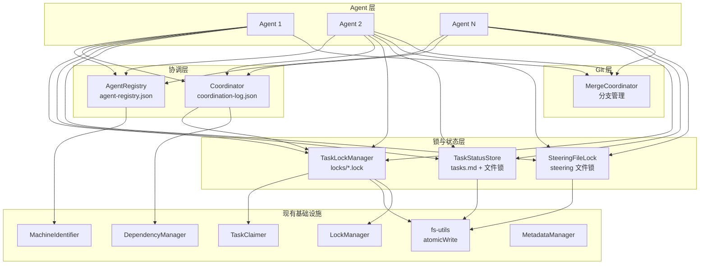

# 设计文档：Multi-Agent Parallel Coordination

## 概述

本设计为 kiro-spec-engine 引入多 Agent 并行协调能力，解决多个 AI Agent 同时驱动同一项目时的 5 个核心冲突点：tasks.md 状态写冲突、Spec 级锁粒度太粗、CURRENT_CONTEXT.md 单点写冲突、Git commit/push 冲突、测试执行干扰。

设计遵循三个核心原则：
1. **向后兼容** - 单 Agent 模式零影响，多 Agent 功能通过显式启用
2. **渐进式增强** - 各组件独立可用，从简单锁到完整协调器逐步采用
3. **最小侵入** - 最大化复用现有 LockManager、TaskClaimer、MetadataManager 等基础设施

## 架构

### 整体架构



### 模式切换

系统通过 `.kiro/config/multi-agent.json` 配置文件控制模式：

```json
{
  "enabled": true,
  "heartbeatIntervalMs": 60000,
  "heartbeatTimeoutMs": 180000,
  "coordinatorEnabled": false
}
```

- 文件不存在或 `enabled: false` → 单 Agent 模式（现有行为不变）
- `enabled: true` → 多 Agent 模式（启用注册、任务锁、冲突避免）
- `coordinatorEnabled: true` → 额外启用中央协调器

## 组件与接口

### 1. AgentRegistry（Agent 注册表）

**文件**: `lib/collab/agent-registry.js`

**职责**: 管理 Agent 注册、心跳、生命周期

```javascript
class AgentRegistry {
  constructor(workspaceRoot, machineIdentifier)

  // 注册新 Agent，返回分配的 AgentID
  async register(options = {}) → { agentId, registeredAt }

  // 注销 Agent，释放所有关联资源
  async deregister(agentId) → { success, releasedLocks[] }

  // 更新心跳
  async heartbeat(agentId) → { success, lastHeartbeat }

  // 获取所有活跃 Agent
  async getActiveAgents() → Agent[]

  // 检测并清理不活跃 Agent
  async cleanupInactive() → { cleaned[], releasedLocks[] }

  // 获取指定 Agent 信息
  async getAgent(agentId) → Agent | null
}
```

**存储**: `.kiro/config/agent-registry.json`

```json
{
  "version": "1.0.0",
  "agents": {
    "abc123:0": {
      "agentId": "abc123:0",
      "machineId": "abc123",
      "instanceIndex": 0,
      "hostname": "dev-machine",
      "registeredAt": "2026-02-11T10:00:00Z",
      "lastHeartbeat": "2026-02-11T10:05:00Z",
      "status": "active",
      "currentTask": { "specName": "94-00-xxx", "taskId": "2.1" }
    }
  }
}
```

### 2. TaskLockManager（任务级锁管理器）

**文件**: `lib/lock/task-lock-manager.js`

**职责**: 提供任务级细粒度锁，替代 Spec 级排他锁

```javascript
class TaskLockManager {
  constructor(workspaceRoot, machineIdentifier)

  // 锁定任务
  async acquireTaskLock(specName, taskId, agentId, options = {}) → LockResult

  // 释放任务锁
  async releaseTaskLock(specName, taskId, agentId) → UnlockResult

  // 释放指定 Agent 的所有任务锁
  async releaseAllLocks(agentId) → { released[] }

  // 获取任务锁状态
  async getTaskLockStatus(specName, taskId) → TaskLockStatus

  // 列出 Spec 下所有锁
  async listLockedTasks(specName) → TaskLockStatus[]

  // 检查是否为多 Agent 模式
  async isMultiAgentMode() → boolean
}
```

**锁文件路径**: `.kiro/specs/{specName}/locks/{taskId}.lock`

**锁文件格式**:
```json
{
  "agentId": "abc123:0",
  "machineId": "abc123",
  "hostname": "dev-machine",
  "taskId": "2.1",
  "specName": "94-00-xxx",
  "acquiredAt": "2026-02-11T10:00:00Z",
  "reason": "executing task"
}
```

**与现有系统集成**:
- 多 Agent 模式：使用任务级锁文件
- 单 Agent 模式：委托给现有 LockManager（Spec 级锁）

### 3. TaskStatusStore（任务状态安全存储）

**文件**: `lib/task/task-status-store.js`

**职责**: 提供 tasks.md 的并发安全读写

```javascript
class TaskStatusStore {
  constructor(workspaceRoot)

  // 安全更新任务状态（带锁和重试）
  async updateStatus(specName, taskId, status, options = {}) → UpdateResult

  // 安全认领任务（带锁和重试）
  async claimTask(specName, taskId, agentId, username) → ClaimResult

  // 安全释放任务（带锁和重试）
  async unclaimTask(specName, taskId, agentId, username) → UnclaimResult

  // 检查是否为多 Agent 模式
  async isMultiAgentMode() → boolean
}
```

**并发控制策略**:
1. 获取 tasks.md 的文件级锁（`.kiro/specs/{specName}/tasks.md.lock`）
2. 读取当前 tasks.md 内容
3. 验证目标行未被修改（行内容比对）
4. 应用变更并原子写入
5. 释放文件级锁
6. 失败时指数退避重试（最多 5 次，初始 100ms）

### 4. SteeringFileLock（Steering 文件锁）

**文件**: `lib/lock/steering-file-lock.js`

**职责**: 保护 Steering 文件的并发写入

```javascript
class SteeringFileLock {
  constructor(workspaceRoot)

  // 获取 Steering 文件写入锁
  async acquireLock(filename) → { success, lockId }

  // 释放 Steering 文件写入锁
  async releaseLock(filename, lockId) → { success }

  // 带锁执行写入操作
  async withLock(filename, callback) → result

  // 写入 pending 文件（锁获取失败时的降级方案）
  async writePending(filename, content, agentId) → { pendingPath }
}
```

**锁文件路径**: `.kiro/steering/{filename}.lock`

### 5. MergeCoordinator（Git 合并协调器）

**文件**: `lib/collab/merge-coordinator.js`

**职责**: 管理 Agent 分支和合并

```javascript
class MergeCoordinator {
  constructor(workspaceRoot)

  // 为 Agent 创建工作分支
  async createAgentBranch(agentId, specName) → { branchName }

  // 检测合并冲突
  async detectConflicts(branchName, targetBranch) → { hasConflicts, files[] }

  // 执行自动合并
  async merge(branchName, targetBranch) → MergeResult

  // 清理已合并分支
  async cleanupBranch(branchName) → { success }

  // 检查是否为多 Agent 模式
  async isMultiAgentMode() → boolean
}
```

**分支命名**: `agent/{agentId}/{specName}`

### 6. Coordinator（中央协调器）

**文件**: `lib/collab/coordinator.js`

**职责**: 可选的智能任务分配和进度汇总

```javascript
class Coordinator {
  constructor(workspaceRoot, dependencyManager, agentRegistry, taskLockManager)

  // 获取可并行执行的就绪任务
  async getReadyTasks(specName) → Task[]

  // 为 Agent 分配任务
  async assignTask(agentId) → { specName, taskId, task } | null

  // 标记任务完成，更新依赖图
  async completeTask(specName, taskId, agentId) → { newReadyTasks[] }

  // 获取进度汇总
  async getProgress() → ProgressSummary

  // 记录分配日志
  async logAssignment(agentId, specName, taskId, action) → void
}
```

**日志文件**: `.kiro/config/coordination-log.json`

## 数据模型

### Agent 注册记录

```typescript
interface AgentRecord {
  agentId: string;           // "{machineId}:{instanceIndex}"
  machineId: string;         // MachineIdentifier 生成的 ID
  instanceIndex: number;     // 同一机器上的实例序号
  hostname: string;          // 机器主机名
  registeredAt: string;      // ISO 8601 时间戳
  lastHeartbeat: string;     // ISO 8601 时间戳
  status: 'active' | 'inactive' | 'shutting-down';
  currentTask: {
    specName: string;
    taskId: string;
  } | null;
}
```

### 任务锁记录

```typescript
interface TaskLockRecord {
  agentId: string;
  machineId: string;
  hostname: string;
  taskId: string;
  specName: string;
  acquiredAt: string;        // ISO 8601 时间戳
  reason: string | null;
}
```

### 多 Agent 配置

```typescript
interface MultiAgentConfig {
  enabled: boolean;
  heartbeatIntervalMs: number;   // 默认 60000
  heartbeatTimeoutMs: number;    // 默认 180000
  coordinatorEnabled: boolean;   // 默认 false
  maxRetries: number;            // 默认 5
  retryBaseDelayMs: number;      // 默认 100
}
```

### 协调日志记录

```typescript
interface CoordinationLogEntry {
  timestamp: string;
  agentId: string;
  action: 'assign' | 'complete' | 'release' | 'timeout';
  specName: string;
  taskId: string;
  details: Record<string, unknown>;
}
```

### 进度汇总

```typescript
interface ProgressSummary {
  specs: {
    [specName: string]: {
      totalTasks: number;
      completedTasks: number;
      inProgressTasks: number;
      percentage: number;
    };
  };
  agents: {
    [agentId: string]: {
      status: string;
      currentTask: { specName: string; taskId: string } | null;
      completedCount: number;
    };
  };
}
```


## 正确性属性

*正确性属性是一种在系统所有有效执行中都应成立的特征或行为——本质上是关于系统应该做什么的形式化陈述。属性作为人类可读规范与机器可验证正确性保证之间的桥梁。*

### Property 1: Agent 注册完整性

*For any* Agent 注册请求（包含有效的机器信息），注册后 Agent_Registry 中应存在一条包含 agentId、machineId、hostname、registeredAt 和 lastHeartbeat 字段的完整记录。

**Validates: Requirements 1.1**

### Property 2: 不活跃 Agent 检测

*For any* Agent 记录，当其 lastHeartbeat 与当前时间的差值超过配置的 heartbeatTimeoutMs 时，cleanupInactive 应将其标记为 inactive 状态；差值未超过时应保持 active 状态。

**Validates: Requirements 1.3**

### Property 3: 不活跃 Agent 锁清理

*For any* 被标记为不活跃的 Agent，清理操作应释放该 Agent 持有的所有 Task_Lock，且释放后这些锁不再存在于锁目录中。

**Validates: Requirements 1.4, 2.4**

### Property 4: Agent ID 唯一性

*For any* 数量 N（N ≥ 1）的来自同一台机器的 Agent 注册请求，所有生成的 Agent_ID 应互不相同。

**Validates: Requirements 1.5**

### Property 5: Agent 注销清理

*For any* 已注册的 Agent，执行 deregister 后，该 Agent 的记录应从 Agent_Registry 中移除，且该 Agent 持有的所有 Task_Lock 应被释放。

**Validates: Requirements 1.6**

### Property 6: 任务锁互斥性

*For any* 两个不同的 Agent 和任意一个任务，当第一个 Agent 持有该任务的锁时，第二个 Agent 的锁定请求应失败并返回包含第一个 Agent 信息的持有者详情。

**Validates: Requirements 2.1, 2.2**

### Property 7: 任务锁获取-释放往返

*For any* Agent 和任意任务，获取锁后再释放锁，该任务的锁文件应不再存在，且后续任何 Agent 应能成功获取该任务的锁。

**Validates: Requirements 2.3**

### Property 8: 单 Agent 模式向后兼容

*For any* 锁操作，当多 Agent 模式未启用时，TaskLockManager 应委托给现有 LockManager 执行 Spec 级锁，不创建任务级锁文件。

**Validates: Requirements 2.6, 7.2**

### Property 9: 并发任务状态更新无丢失

*For any* 一组针对不同任务的并发状态更新，所有更新完成后 tasks.md 应包含每个更新的正确状态值。

**Validates: Requirements 3.1**

### Property 10: tasks.md 格式往返兼容

*For any* 有效的 tasks.md 内容，通过 TaskStatusStore 读取后再写回，文件内容应与原始内容在语义上等价（任务 ID、状态、标题保持一致）。

**Validates: Requirements 3.6**

### Property 11: Agent 分支命名规范

*For any* agentId 和 specName，创建的分支名称应严格遵循 `agent/{agentId}/{specName}` 格式。

**Validates: Requirements 4.1**

### Property 12: Steering 文件写入串行化

*For any* 一组针对同一 Steering 文件的并发写入操作，最终文件内容应是某一次完整写入的结果（不出现部分写入或内容混合）。

**Validates: Requirements 5.1**

### Property 13: 依赖驱动的就绪任务计算

*For any* 依赖图和任意一组已完成的任务，就绪任务集合应恰好等于所有前置依赖均已完成且自身未完成的任务集合。

**Validates: Requirements 6.1, 6.3**

### Property 14: 任务分配来自未锁定就绪集

*For any* 就绪任务集合（部分已锁定），分配给 Agent 的任务应属于未锁定的就绪任务子集。

**Validates: Requirements 6.2**

### Property 15: 进度汇总正确性

*For any* 一组任务（各有不同状态），进度汇总中的 totalTasks、completedTasks、inProgressTasks 计数应与实际状态匹配，percentage 应等于 completedTasks / totalTasks * 100。

**Validates: Requirements 6.4**

### Property 16: 协调日志持久化

*For any* 任务分配操作，执行后 coordination-log.json 应包含一条与该操作对应的日志记录（包含正确的 agentId、specName、taskId 和 action）。

**Validates: Requirements 6.6**

## 错误处理

### 锁获取失败

- 任务锁被占用：返回 `{ success: false, holder: AgentRecord }` 供调用方决策
- 文件系统错误：捕获异常，清理临时文件，返回错误结果
- 锁文件损坏：删除损坏的锁文件，允许重新获取

### 并发写入冲突

- tasks.md 写冲突：指数退避重试（100ms, 200ms, 400ms, 800ms, 1600ms），最多 5 次
- Steering 文件写冲突：指数退避重试（100ms, 200ms, 400ms），最多 3 次
- 重试耗尽：返回冲突错误，不修改原始文件；Steering 文件降级写入 pending 文件

### Agent 生命周期异常

- Agent 崩溃（心跳超时）：cleanupInactive 自动释放锁和资源
- Agent 注册表损坏：重建空注册表，已有 Agent 需重新注册
- 心跳更新失败：本地重试，连续 3 次失败则 Agent 自行重新注册

### Git 操作失败

- 分支创建失败：记录错误，降级为在当前分支工作
- 合并冲突：记录冲突文件列表，通知 Agent，不自动解决
- 远程推送失败：本地保留分支，等待下次重试

### 配置文件异常

- multi-agent.json 不存在：视为单 Agent 模式
- multi-agent.json 格式错误：使用默认配置，记录警告
- agent-registry.json 损坏：重建空注册表

## 测试策略

### 属性测试（Property-Based Testing）

使用 `fast-check` 库进行属性测试，每个属性至少运行 100 次迭代。

每个正确性属性对应一个独立的属性测试，测试标签格式：
**Feature: 94-00-multi-agent-parallel-coordination, Property {N}: {property_text}**

属性测试重点覆盖：
- Agent 注册/注销的完整性和唯一性（Property 1, 4, 5）
- 任务锁的互斥性和往返一致性（Property 6, 7）
- 不活跃检测和清理的正确性（Property 2, 3）
- tasks.md 格式兼容性（Property 10）
- 依赖图就绪任务计算（Property 13）
- 进度汇总数学正确性（Property 15）

### 单元测试

单元测试覆盖具体示例和边缘情况：
- Agent_Registry 文件不存在时自动创建（Requirements 1.7）
- 单 Agent 模式下各组件的退化行为（Requirements 7.1-7.5）
- 重试耗尽后的错误返回和文件完整性（Requirements 3.5）
- Steering 文件 pending 降级写入（Requirements 5.4）
- 协调器禁用时的无操作行为（Requirements 6.5）
- 首次启用多 Agent 模式的初始化（Requirements 7.4）

### 并发测试

- 模拟多 Agent 并发锁定不同任务（Property 9）
- 模拟多 Agent 并发更新 tasks.md（Property 9, 12）
- 模拟多 Agent 并发写入 Steering 文件（Property 12）

### 集成测试

- TaskLockManager 与 TaskClaimer 的集成
- AgentRegistry 与 TaskLockManager 的清理联动
- Coordinator 与 DependencyManager 的任务分配流程
- MergeCoordinator 的 Git 分支操作（需要 Git 仓库环境）

### 测试配置

- 属性测试库：`fast-check`（已在项目中使用）
- 每个属性测试最少 100 次迭代
- 并发测试使用 `Promise.all` 模拟并行操作
- Git 集成测试使用临时仓库
