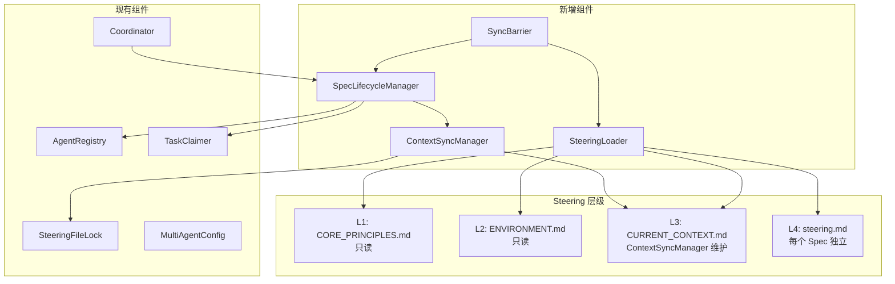
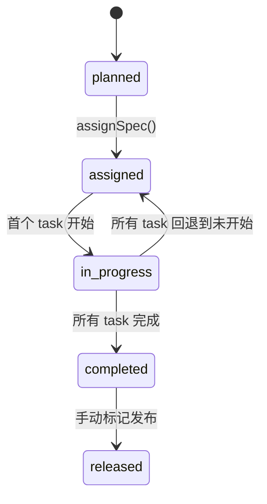

# 设计文档

## 概述

本设计为 kiro-spec-engine 引入 Spec 级 Steering 约束层（L4）和多 Agent 友好的 CURRENT_CONTEXT 同步机制。核心思路：

1. 每个 Spec 目录下新增 `steering.md`，作为该 Spec 的独立约束文件，天然避免多 Agent 写冲突
2. 新增 `SteeringLoader` 统一加载 L1-L4 四层约束
3. 改造 `CURRENT_CONTEXT.md` 为结构化的多 Spec 进度汇总格式，由 `ContextSyncManager` 通过 `SteeringFileLock` 安全更新
4. 新增 `SpecLifecycleManager` 管理 Spec 状态机（planned → assigned → in-progress → completed → released）
5. 新增 `SyncBarrier` 确保 Agent 切换 Spec 时基于一致的代码库和 Steering

所有新组件在单 Agent 模式下零开销（通过 `MultiAgentConfig.isEnabled()` 守卫）。

## 架构





## 组件与接口

### 1. SpecSteering（`lib/steering/spec-steering.js`）

负责 Spec 级 `steering.md` 的 CRUD 操作和模板管理。

```javascript
class SpecSteering {
  constructor(workspaceRoot) {}

  /**
   * 为指定 Spec 生成 steering.md 模板文件。
   * 仅在多 Agent 模式下执行。
   * @param {string} specName
   * @returns {Promise<{created: boolean, path: string}>}
   */
  async createTemplate(specName) {}

  /**
   * 读取并解析 Spec 的 steering.md 为结构化对象。
   * @param {string} specName
   * @returns {Promise<{constraints: string[], notes: string[], decisions: string[]}|null>}
   */
  async read(specName) {}

  /**
   * 将结构化对象写回 steering.md（原子写）。
   * @param {string} specName
   * @param {{constraints: string[], notes: string[], decisions: string[]}} data
   * @returns {Promise<void>}
   */
  async write(specName, data) {}

  /**
   * 解析 steering.md Markdown 内容为结构化对象。
   * @param {string} content - Markdown 字符串
   * @returns {{constraints: string[], notes: string[], decisions: string[]}}
   */
  parse(content) {}

  /**
   * 将结构化对象格式化为 steering.md Markdown 字符串。
   * @param {{constraints: string[], notes: string[], decisions: string[]}} data
   * @returns {string}
   */
  format(data) {}
}
```

### 2. SteeringLoader（`lib/steering/steering-loader.js`）

统一加载并合并 L1-L4 四层 Steering 约束。

```javascript
class SteeringLoader {
  constructor(workspaceRoot) {}

  /**
   * 加载所有层级的 Steering 内容。
   * 单 Agent 模式下跳过 L4。
   * @param {string|null} specName - 当前 Spec 名称，null 时跳过 L4
   * @returns {Promise<{
   *   l1: string|null,
   *   l2: string|null,
   *   l3: string|null,
   *   l4: {constraints: string[], notes: string[], decisions: string[]}|null
   * }>}
   */
  async load(specName = null) {}

  /**
   * 加载并合并所有层级，L4 覆盖 L1-L3 的冲突项。
   * @param {string|null} specName
   * @returns {Promise<{layers: object, merged: string}>}
   */
  async loadMerged(specName = null) {}
}
```

### 3. ContextSyncManager（`lib/steering/context-sync-manager.js`）

维护 CURRENT_CONTEXT.md 为多 Spec 进度汇总格式。

```javascript
class ContextSyncManager {
  constructor(workspaceRoot, steeringFileLock) {}

  /**
   * 更新指定 Spec 的进度条目。
   * 使用 SteeringFileLock 保护并发写。
   * 单 Agent 模式下为 no-op。
   * @param {string} specName
   * @param {{status: string, progress: number, summary: string}} entry
   * @returns {Promise<{success: boolean}>}
   */
  async updateSpecProgress(specName, entry) {}

  /**
   * 读取当前 CURRENT_CONTEXT.md 并解析为结构化对象。
   * @returns {Promise<{version: string|null, globalStatus: string|null, specs: object}>}
   */
  async readContext() {}

  /**
   * 将结构化上下文对象写回 CURRENT_CONTEXT.md。
   * @param {object} context
   * @returns {Promise<void>}
   */
  async writeContext(context) {}

  /**
   * 基于 tasks.md 计算指定 Spec 的进度百分比。
   * @param {string} specName
   * @returns {Promise<number>} 0-100
   */
  async computeProgress(specName) {}

  /**
   * 解析多 Spec 进度汇总格式的 CURRENT_CONTEXT.md。
   * @param {string} content
   * @returns {{version: string|null, globalStatus: string|null, specs: object}}
   */
  parseContext(content) {}

  /**
   * 将结构化上下文格式化为 CURRENT_CONTEXT.md Markdown。
   * @param {object} context
   * @returns {string}
   */
  formatContext(context) {}
}
```

### 4. SpecLifecycleManager（`lib/collab/spec-lifecycle-manager.js`）

管理 Spec 生命周期状态机。

```javascript
const VALID_TRANSITIONS = {
  planned:     ['assigned'],
  assigned:    ['in-progress', 'planned'],
  'in-progress': ['completed', 'assigned'],
  completed:   ['released'],
  released:    [],
};

class SpecLifecycleManager {
  constructor(workspaceRoot, contextSyncManager, agentRegistry) {}

  /**
   * 获取 Spec 当前生命周期状态。
   * @param {string} specName
   * @returns {Promise<string>} 状态字符串
   */
  async getStatus(specName) {}

  /**
   * 转换 Spec 状态。验证合法路径后持久化。
   * @param {string} specName
   * @param {string} newStatus
   * @returns {Promise<{success: boolean, oldStatus: string, newStatus: string, error?: string}>}
   */
  async transition(specName, newStatus) {}

  /**
   * 检测 Spec 是否所有任务已完成，自动触发 completed 转换。
   * @param {string} specName
   * @returns {Promise<{completed: boolean, transitioned: boolean}>}
   */
  async checkCompletion(specName) {}

  /**
   * 读取 lifecycle.json。
   * @param {string} specName
   * @returns {Promise<{status: string, transitions: Array}>}
   */
  async readLifecycle(specName) {}

  /**
   * 写入 lifecycle.json（原子写）。
   * @param {string} specName
   * @param {object} lifecycle
   * @returns {Promise<void>}
   */
  async writeLifecycle(specName, lifecycle) {}
}
```

### 5. SyncBarrier（`lib/collab/sync-barrier.js`）

Agent 切换 Spec 时的同步屏障。

```javascript
class SyncBarrier {
  constructor(workspaceRoot, steeringLoader) {}

  /**
   * 执行 Spec 切换前的同步检查。
   * 单 Agent 模式下为 no-op（返回 {ready: true}）。
   * @param {string} specName - 目标 Spec
   * @returns {Promise<{ready: boolean, error?: string, steering?: object}>}
   */
  async prepareSwitch(specName) {}

  /**
   * 检查工作区是否有未提交的更改。
   * @returns {Promise<boolean>}
   */
  async hasUncommittedChanges() {}
}
```

## 数据模型

### steering.md 模板格式

```markdown
# Spec Steering: {spec-name}

## 约束 (Constraints)

- [约束条目]

## 注意事项 (Notes)

- [注意事项条目]

## 决策记录 (Decisions)

- [决策条目]
```

### steering.md 结构化对象

```javascript
{
  constraints: ['约束条目1', '约束条目2'],
  notes: ['注意事项1'],
  decisions: ['决策1: 原因...']
}
```

### lifecycle.json

```javascript
{
  "specName": "95-00-spec-level-steering-and-context-sync",
  "status": "in-progress",
  "transitions": [
    { "from": "planned", "to": "assigned", "timestamp": "2026-02-11T10:00:00Z", "agentId": "abc:0" },
    { "from": "assigned", "to": "in-progress", "timestamp": "2026-02-11T10:05:00Z", "agentId": "abc:0" }
  ]
}
```

### CURRENT_CONTEXT.md 多 Agent 格式

```markdown
# 当前场景

**版本**: v1.43.1 已发布
**状态**: ✅ 2361 tests | 88 suites

## Spec 进度

| Spec | 状态 | 进度 | 摘要 |
|------|------|------|------|
| 94-00-multi-agent-parallel-coordination | completed | 100% | 多 Agent 并行协调基础设施 |
| 95-00-spec-level-steering-and-context-sync | in-progress | 40% | Spec 级 Steering 与上下文同步 |

---

v32.0 | 2026-02-12 | 自动更新
```

### CURRENT_CONTEXT 结构化对象

```javascript
{
  version: 'v1.43.1 已发布',
  globalStatus: '✅ 2361 tests | 88 suites',
  specs: {
    '94-00-multi-agent-parallel-coordination': {
      status: 'completed',
      progress: 100,
      summary: '多 Agent 并行协调基础设施'
    },
    '95-00-spec-level-steering-and-context-sync': {
      status: 'in-progress',
      progress: 40,
      summary: 'Spec 级 Steering 与上下文同步'
    }
  }
}
```


## 正确性属性

*属性（Property）是一个在系统所有合法执行中都应成立的特征或行为——本质上是关于系统应该做什么的形式化陈述。属性是人类可读规范与机器可验证正确性保证之间的桥梁。*

### Property 1: steering.md 往返一致性

*For any* 合法的 steering.md 结构化对象（包含 constraints、notes、decisions 数组），将其格式化为 Markdown 字符串后再解析回结构化对象，应产生与原始对象等价的结果。

**Validates: Requirements 1.4, 7.2, 7.3, 7.4**

### Property 2: CURRENT_CONTEXT 往返一致性

*For any* 合法的 CURRENT_CONTEXT 结构化对象（包含 version、globalStatus、specs 映射），将其格式化为 Markdown 字符串后再解析回结构化对象，应产生与原始对象等价的结果。

**Validates: Requirements 3.1**

### Property 3: Steering 合并优先级

*For any* 四层 Steering 内容，当 L4 层级存在内容时，SteeringLoader 的合并结果中 L4 的内容应出现在最终输出中，且 L4 的内容应排在 L1-L3 之后（即后加载的层级可覆盖先加载的层级）。

**Validates: Requirements 1.2, 2.3**

### Property 4: Spec 间写隔离

*For any* 两个不同的 Spec 名称 A 和 B，向 Spec A 的 steering.md 写入内容后，Spec B 的 steering.md 内容应保持不变。

**Validates: Requirements 1.3**

### Property 5: Context 更新隔离

*For any* 两个不同的 Spec 名称 A 和 B，通过 ContextSyncManager 更新 Spec A 的进度条目后，Spec B 的进度条目应保持不变。

**Validates: Requirements 3.2**

### Property 6: 进度计算正确性

*For any* tasks.md 中包含 N 个任务且其中 M 个已完成的 Spec，ContextSyncManager 计算的进度百分比应等于 round(M / N * 100)。

**Validates: Requirements 3.4**

### Property 7: 非法状态转换拒绝

*For any* Spec 当前状态 S 和目标状态 T，若 (S, T) 不在合法转换路径中，则 SpecLifecycleManager.transition() 应返回 success: false 并包含错误信息。

**Validates: Requirements 4.5**

### Property 8: 生命周期持久化往返一致性

*For any* Spec 生命周期状态转换序列，写入 lifecycle.json 后再读取，应产生与写入时等价的状态和转换历史。

**Validates: Requirements 4.6**

### Property 9: 自动完成检测

*For any* 处于 in-progress 状态的 Spec，当且仅当其所有任务状态为 completed 时，checkCompletion() 应将状态转换为 completed。

**Validates: Requirements 4.2**

### Property 10: 单 Agent 模式零开销

*For any* 组件操作（SpecSteering.createTemplate、ContextSyncManager.updateSpecProgress、SpecLifecycleManager.transition、SyncBarrier.prepareSwitch），在单 Agent 模式下（MultiAgentConfig.isEnabled() 返回 false），应为 no-op 或返回默认值，不创建额外文件。

**Validates: Requirements 3.5, 5.4, 6.1, 6.2, 6.3, 6.4**

### Property 11: 缺失文件优雅降级

*For any* L1-L4 层级文件的子集缺失，SteeringLoader 应成功返回结果，缺失层级的值为 null，其余层级正常加载。

**Validates: Requirements 2.4, 2.5**

### Property 12: 未提交更改阻止切换

*For any* 存在未提交本地更改的工作区，SyncBarrier.prepareSwitch() 应返回 ready: false 并包含错误信息。

**Validates: Requirements 5.3**

## 错误处理

| 场景 | 处理方式 |
|------|----------|
| steering.md 损坏/格式无效 | 返回空结构化对象 `{constraints:[], notes:[], decisions:[]}`，记录 `console.warn` |
| lifecycle.json 损坏 | 返回默认状态 `planned`，重建文件 |
| CURRENT_CONTEXT.md 写锁获取失败 | 通过 SteeringFileLock 重试（最多 3 次指数退避），失败后写入 pending 文件 |
| tasks.md 不存在 | computeProgress 返回 0，checkCompletion 返回 `{completed: false}` |
| 非法状态转换 | 返回 `{success: false, error: '...'}` 不抛异常 |
| Git 命令失败（SyncBarrier） | 返回 `{ready: false, error: '...'}` 不抛异常 |
| 单 Agent 模式下调用多 Agent 功能 | 静默返回默认值/no-op，不报错 |

## 测试策略

### 属性测试（Property-Based Testing）

使用 `fast-check` 库，每个属性测试最少运行 100 次迭代。

每个正确性属性对应一个独立的属性测试：

- **Feature: spec-level-steering-and-context-sync, Property 1**: steering.md 往返一致性
- **Feature: spec-level-steering-and-context-sync, Property 2**: CURRENT_CONTEXT 往返一致性
- **Feature: spec-level-steering-and-context-sync, Property 3**: Steering 合并优先级
- **Feature: spec-level-steering-and-context-sync, Property 4**: Spec 间写隔离
- **Feature: spec-level-steering-and-context-sync, Property 5**: Context 更新隔离
- **Feature: spec-level-steering-and-context-sync, Property 6**: 进度计算正确性
- **Feature: spec-level-steering-and-context-sync, Property 7**: 非法状态转换拒绝
- **Feature: spec-level-steering-and-context-sync, Property 8**: 生命周期持久化往返一致性
- **Feature: spec-level-steering-and-context-sync, Property 9**: 自动完成检测
- **Feature: spec-level-steering-and-context-sync, Property 10**: 单 Agent 模式零开销
- **Feature: spec-level-steering-and-context-sync, Property 11**: 缺失文件优雅降级
- **Feature: spec-level-steering-and-context-sync, Property 12**: 未提交更改阻止切换

### 单元测试

单元测试聚焦于具体示例和边界情况：

- SpecSteering 模板生成：验证生成的模板包含三个区域
- SteeringLoader 四层加载：验证所有层级都被加载
- SpecLifecycleManager 五状态识别：验证所有状态被正确识别
- ContextSyncManager 写锁集成：验证 SteeringFileLock 被正确调用
- SyncBarrier Git 检查：验证 prepareSwitch 调用 Git 命令
- 状态转换完成后触发 ContextSyncManager 更新
- 状态转换完成后通知其他活跃 Agent

### 测试文件组织

```
tests/unit/steering/
  spec-steering.test.js          — SpecSteering 单元测试 + Property 1, 4
  steering-loader.test.js        — SteeringLoader 单元测试 + Property 3, 11
  context-sync-manager.test.js   — ContextSyncManager 单元测试 + Property 2, 5, 6
tests/unit/collab/
  spec-lifecycle-manager.test.js — SpecLifecycleManager 单元测试 + Property 7, 8, 9
  sync-barrier.test.js           — SyncBarrier 单元测试 + Property 10, 12
```
