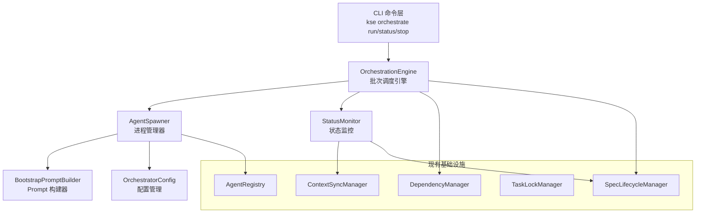
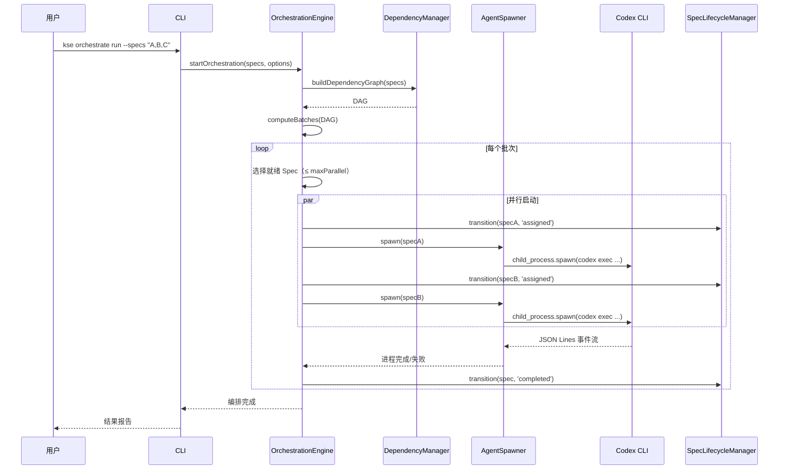

# 设计文档：Agent Orchestrator

## 概述

Agent Orchestrator 是 kse 的主动调度层，填补现有多 Agent 协调基础设施（Spec 94/95）与实际自动化执行之间的空白。编排器通过 Node.js child_process 启动 Codex CLI 子进程，基于 Spec 间依赖图（DAG）进行批次调度，实现 Spec 的自动化并行执行。

核心设计目标：
- 与现有 AgentRegistry、TaskLockManager、SpecLifecycleManager、ContextSyncManager 无缝集成
- 基于 DAG 的批次调度，最大化并行度同时保证依赖正确性
- 健壮的进程生命周期管理（启动、监控、超时、终止、重试）
- 可扩展的 agent 后端抽象（MVP 支持 Codex CLI，后续可扩展 Claude Code 等）

## 架构



### 执行流程



## 组件与接口

### 1. OrchestratorConfig — 配置管理

负责读取和管理 `.kiro/config/orchestrator.json` 配置文件。

```javascript
class OrchestratorConfig {
  constructor(workspaceRoot)
  
  // 读取配置，不存在时返回默认值
  async getConfig(): Promise<OrchestratorConfigData>
  
  // 更新配置（合并写入）
  async updateConfig(updates: Partial<OrchestratorConfigData>): Promise<OrchestratorConfigData>
  
  // 获取 bootstrap prompt 模板
  async getBootstrapTemplate(): Promise<string>
}
```

### 2. BootstrapPromptBuilder — Prompt 构建器

为每个子 agent 构建包含完整上下文的初始化 prompt。

```javascript
class BootstrapPromptBuilder {
  constructor(workspaceRoot, orchestratorConfig)
  
  // 构建指定 Spec 的 bootstrap prompt
  async buildPrompt(specName: string): Promise<string>
}
```

### 3. AgentSpawner — 进程管理器

通过 Node.js child_process.spawn 启动和管理 Codex CLI 子进程。

```javascript
class AgentSpawner {
  constructor(workspaceRoot, orchestratorConfig, agentRegistry, bootstrapPromptBuilder)
  
  // 启动一个 Codex CLI 子进程执行指定 Spec
  async spawn(specName: string): Promise<SpawnedAgent>
  
  // 终止指定子进程
  async kill(agentId: string): Promise<void>
  
  // 终止所有子进程
  async killAll(): Promise<void>
  
  // 获取所有活跃子进程
  getActiveAgents(): Map<string, SpawnedAgent>
  
  // 事件：'agent:completed', 'agent:failed', 'agent:timeout', 'agent:output'
}
```

### 4. StatusMonitor — 状态监控

解析 Codex JSON Lines 输出，追踪进度，更新外部状态。

```javascript
class StatusMonitor {
  constructor(specLifecycleManager, contextSyncManager)
  
  // 处理 JSON Lines 事件
  handleEvent(agentId: string, event: CodexEvent): void
  
  // 获取编排整体状态
  getOrchestrationStatus(): OrchestrationStatus
  
  // 获取指定 Spec 的状态
  getSpecStatus(specName: string): SpecExecutionStatus
  
  // 更新外部系统状态（SpecLifecycleManager, ContextSyncManager）
  async syncExternalStatus(specName: string, status: string): Promise<void>
}
```

### 5. OrchestrationEngine — 编排引擎（核心）

基于依赖图的批次调度引擎，协调所有组件。

```javascript
class OrchestrationEngine extends EventEmitter {
  constructor(workspaceRoot, options: {
    agentSpawner: AgentSpawner,
    dependencyManager: DependencyManager,
    specLifecycleManager: SpecLifecycleManager,
    statusMonitor: StatusMonitor,
    orchestratorConfig: OrchestratorConfig,
    agentRegistry: AgentRegistry
  })
  
  // 启动编排执行
  async start(specNames: string[], options?: { maxParallel?: number }): Promise<OrchestrationResult>
  
  // 停止编排（优雅终止所有子进程）
  async stop(): Promise<void>
  
  // 获取编排状态
  getStatus(): OrchestrationStatus
  
  // 事件：'batch:start', 'batch:complete', 'spec:start', 'spec:complete', 'spec:failed', 'orchestration:complete'
}
```

## 数据模型

### OrchestratorConfigData

```javascript
// .kiro/config/orchestrator.json
{
  "agentBackend": "codex",           // agent 后端类型
  "maxParallel": 3,                   // 最大并行度
  "timeoutSeconds": 600,              // 子进程超时（秒）
  "maxRetries": 2,                    // 最大重试次数
  "apiKeyEnvVar": "CODEX_API_KEY",   // API key 环境变量名
  "bootstrapTemplate": null,          // 自定义 bootstrap prompt 模板路径（null 使用默认）
  "codexArgs": []                     // 额外 Codex CLI 参数
}
```

### SpawnedAgent

```javascript
{
  agentId: string,          // AgentRegistry 中的 ID
  specName: string,         // 执行的 Spec 名称
  process: ChildProcess,    // Node.js 子进程引用
  status: 'running' | 'completed' | 'failed' | 'timeout',
  startedAt: string,        // ISO 时间戳
  completedAt: string|null, // ISO 时间戳
  exitCode: number|null,    // 进程退出码
  retryCount: number,       // 已重试次数
  stderr: string,           // stderr 输出缓冲
  events: CodexEvent[]      // 收集的 JSON Lines 事件
}
```

### OrchestrationStatus

```javascript
{
  status: 'idle' | 'running' | 'completed' | 'failed' | 'stopped',
  startedAt: string|null,
  completedAt: string|null,
  totalSpecs: number,
  completedSpecs: number,
  failedSpecs: number,
  runningSpecs: number,
  currentBatch: number,
  totalBatches: number,
  specs: {
    [specName]: {
      status: 'pending' | 'running' | 'completed' | 'failed' | 'timeout' | 'skipped',
      batch: number,
      agentId: string|null,
      retryCount: number,
      error: string|null
    }
  }
}
```

### CodexEvent（JSON Lines 事件）

```javascript
{
  type: 'thread.started' | 'turn.started' | 'turn.completed' | 'item.*' | 'error',
  timestamp: string,
  // 其他字段取决于事件类型
}
```

### ExecutionPlan（执行计划）

```javascript
{
  specs: string[],              // 所有待执行 Spec
  batches: string[][],          // 按依赖分组的批次 [[batch0_specs], [batch1_specs], ...]
  dependencies: {               // 依赖关系映射
    [specName]: string[]        // 该 Spec 依赖的 Spec 列表
  },
  hasCycle: boolean,            // 是否存在环形依赖
  cyclePath: string[]|null      // 环形依赖路径（如有）
}
```


## 正确性属性

*正确性属性是系统在所有有效执行中都应保持为真的特征或行为——本质上是关于系统应该做什么的形式化陈述。属性是人类可读规格与机器可验证正确性保证之间的桥梁。*

### Property 1：进程退出码 → 状态映射

*对于任何* 子 agent 进程，如果退出码为 0 则最终状态应为 completed，如果退出码非 0 则最终状态应为 failed。退出码与状态之间存在确定性映射。

**Validates: Requirements 1.4, 1.5**

### Property 2：Bootstrap Prompt 包含所有必要上下文

*对于任何* Spec 名称，BootstrapPromptBuilder 生成的 prompt 应同时包含：该 Spec 的路径（`.kiro/specs/{specName}/`）、kse 项目规范/steering 上下文引用、以及任务执行指令。

**Validates: Requirements 2.1, 2.2, 2.3**

### Property 3：批次内 Spec 无互相依赖

*对于任何* 有效的依赖图（DAG），computeBatches 生成的批次中，同一批次内的任意两个 Spec 之间不应存在直接或间接依赖关系。

**Validates: Requirements 3.3**

### Property 4：并行度不变量

*对于任何* 编排执行过程和任意配置的 maxParallel 值 N，任意时刻同时处于 running 状态的子 agent 数量不应超过 N。

**Validates: Requirements 3.5**

### Property 5：失败传播

*对于任何* 依赖图（DAG），当一个 Spec 最终失败时，所有直接或间接依赖该 Spec 的后续 Spec 都应被标记为 skipped，不应被调度执行。

**Validates: Requirements 3.6**

### Property 6：环形依赖检测

*对于任何* 包含环形依赖的 Spec 集合，OrchestrationEngine 应拒绝执行并报告环形路径。*对于任何* 不包含环形依赖的 Spec 集合，OrchestrationEngine 应正常构建执行计划。

**Validates: Requirements 3.2**

### Property 7：重试策略正确性

*对于任何* 失败的 Spec 执行，如果当前重试次数小于 maxRetries，则应触发重试；如果当前重试次数等于 maxRetries，则应标记为最终失败且不再重试。

**Validates: Requirements 5.2, 5.3**

### Property 8：JSON Lines 事件解析

*对于任何* 有效的 Codex JSON Lines 事件字符串，StatusMonitor 应能正确解析出事件类型和关键字段。*对于任何* 无效的 JSON 字符串，解析应优雅失败而不抛出异常。

**Validates: Requirements 4.2**

### Property 9：状态报告完整性

*对于任何* 编排执行状态，getOrchestrationStatus 返回的报告应包含所有参与编排的 Spec，且每个 Spec 的状态值应为有效枚举值（pending、running、completed、failed、timeout、skipped）之一。

**Validates: Requirements 4.1, 4.5**

### Property 10：配置解析健壮性

*对于任何* 配置对象（包含有效字段、无效字段、未知字段的任意组合），OrchestratorConfig 应正确加载所有已知的有效字段，忽略未知字段，并对缺失字段使用默认值。

**Validates: Requirements 7.4, 7.5**

### Property 11：不存在 Spec 的错误报告

*对于任何* 包含不存在 Spec 名称的输入列表，OrchestrationEngine 应报告具体哪些 Spec 未找到，且不应启动任何执行。

**Validates: Requirements 6.4**

## 错误处理

### 进程级错误

| 错误场景 | 处理策略 |
|---------|---------|
| 子进程异常退出（exit code 非 0） | 记录 stderr，根据重试策略决定重试或标记失败 |
| 子进程超时 | SIGTERM → 等待 5s → SIGKILL，标记为 timeout |
| 子进程 spawn 失败 | 记录错误，标记为 failed，触发重试 |
| CODEX_API_KEY 未设置 | 启动前检查，报告明确错误并拒绝执行 |

### 调度级错误

| 错误场景 | 处理策略 |
|---------|---------|
| 环形依赖 | 拒绝执行，报告环形路径 |
| Spec 不存在 | 报告具体哪些 Spec 未找到，拒绝执行 |
| 依赖 Spec 失败 | 跳过所有后续依赖 Spec，标记为 skipped |
| 所有 Spec 失败 | 编排标记为 failed，输出汇总报告 |

### 配置级错误

| 错误场景 | 处理策略 |
|---------|---------|
| 配置文件不存在 | 使用默认配置 |
| 配置文件 JSON 无效 | 警告并回退到默认配置 |
| maxParallel < 1 | 警告并使用默认值 3 |

### 集成级错误

| 错误场景 | 处理策略 |
|---------|---------|
| AgentRegistry 操作失败 | 记录警告，继续执行（非致命） |
| SpecLifecycleManager 状态转换失败 | 记录警告，继续执行（非致命） |
| ContextSyncManager 更新失败 | 记录警告，继续执行（非致命） |

## 测试策略

### 测试框架

- 单元测试和集成测试：Jest（项目现有框架）
- 属性测试：fast-check（JavaScript 属性测试库）
- 每个属性测试最少运行 100 次迭代

### 单元测试

重点覆盖：
- OrchestratorConfig：配置读取、默认值、无效配置处理
- BootstrapPromptBuilder：prompt 生成、模板替换
- StatusMonitor：JSON Lines 解析、状态聚合
- AgentSpawner：进程启动参数、状态转换（mock child_process）
- OrchestrationEngine：批次计算、调度逻辑、失败传播

### 属性测试

每个正确性属性对应一个属性测试，使用 fast-check 生成随机输入：

- **Feature: 96-00-agent-orchestrator, Property 1: 进程退出码 → 状态映射** — 生成随机退出码，验证状态映射
- **Feature: 96-00-agent-orchestrator, Property 2: Bootstrap Prompt 完整性** — 生成随机 Spec 名称，验证 prompt 内容
- **Feature: 96-00-agent-orchestrator, Property 3: 批次内无依赖** — 生成随机 DAG，验证批次分组
- **Feature: 96-00-agent-orchestrator, Property 4: 并行度不变量** — 生成随机调度序列，验证并行度约束
- **Feature: 96-00-agent-orchestrator, Property 5: 失败传播** — 生成随机 DAG + 失败节点，验证跳过逻辑
- **Feature: 96-00-agent-orchestrator, Property 6: 环形依赖检测** — 生成随机图（含环/无环），验证检测
- **Feature: 96-00-agent-orchestrator, Property 7: 重试策略** — 生成随机重试次数和上限，验证决策
- **Feature: 96-00-agent-orchestrator, Property 8: JSON Lines 解析** — 生成随机 JSON Lines，验证解析
- **Feature: 96-00-agent-orchestrator, Property 9: 状态报告完整性** — 生成随机状态集，验证报告
- **Feature: 96-00-agent-orchestrator, Property 10: 配置解析健壮性** — 生成随机配置对象，验证解析
- **Feature: 96-00-agent-orchestrator, Property 11: 不存在 Spec 错误报告** — 生成随机 Spec 列表（含不存在的），验证错误

### 集成测试

- AgentSpawner + AgentRegistry 集成：验证进程启动时注册、完成时注销
- OrchestrationEngine + SpecLifecycleManager 集成：验证状态转换流程
- CLI 命令端到端测试：验证 `kse orchestrate run/status/stop` 命令行为
