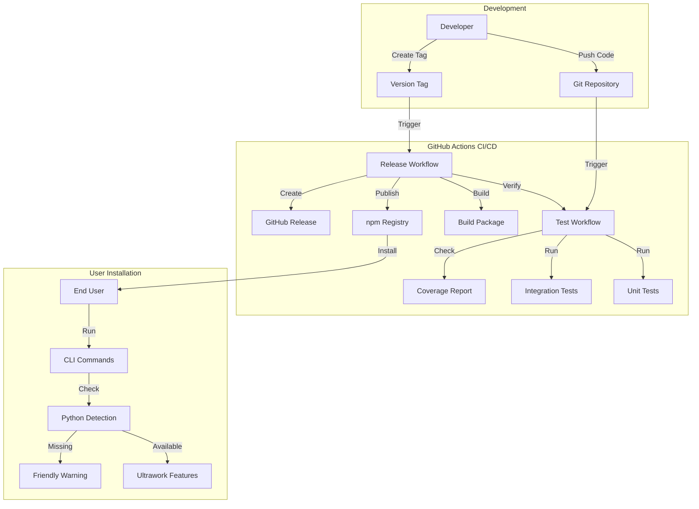
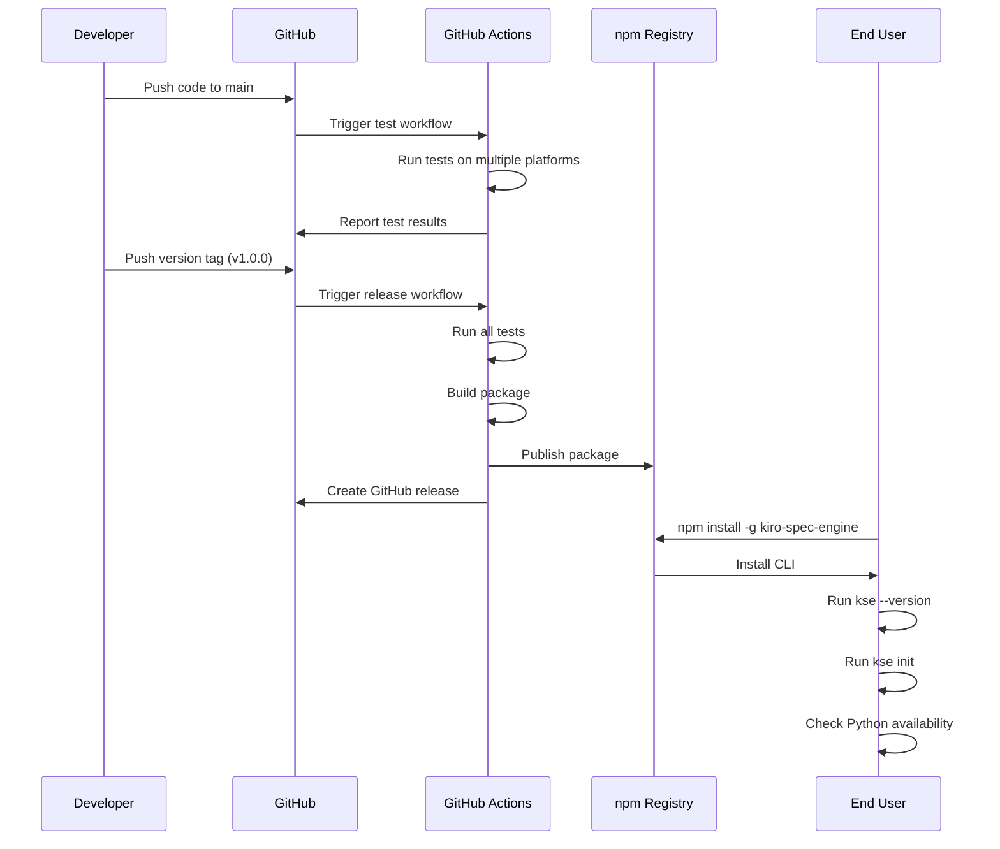

# Design Document

## Overview

The npm and GitHub release pipeline establishes a complete automation workflow for publishing the kiro-spec-engine project. The design follows industry best practices for npm package distribution, incorporating automated testing, version management, and multi-platform validation. The system maintains the dual-language architecture (Node.js CLI + Python tools) while providing graceful degradation when Python is unavailable.

The pipeline consists of three main components:
1. **Repository Configuration Layer**: Manages GitHub repository setup, documentation, and contribution guidelines
2. **Package Distribution Layer**: Handles npm package configuration, publishing, and installation verification
3. **Automation Layer**: Implements CI/CD workflows using GitHub Actions for testing and deployment

**Requirements Traceability**: This design addresses Requirements 1-10 from the requirements document, with specific mappings detailed in each component section.

## System Architecture

### High-Level Architecture



### Component Interaction



## Component Design

### 1. Repository Configuration Component

**Responsibility**: Manage GitHub repository setup and documentation

**Files**:
- `.gitignore`: Exclude unnecessary files from version control
- `LICENSE`: Define open-source license terms
- `CONTRIBUTING.md`: Provide contribution guidelines
- `README.md` / `README.zh.md`: User-facing documentation
- `CHANGELOG.md`: Version history and changes

**Interface**:
```
Repository Configuration
├── .gitignore
│   ├── node_modules/
│   ├── __pycache__/
│   ├── *.pyc
│   ├── .DS_Store
│   └── Thumbs.db
├── LICENSE (MIT recommended)
├── CONTRIBUTING.md
├── README.md (English)
├── README.zh.md (Chinese)
└── CHANGELOG.md
```

### 2. npm Package Configuration Component

**Responsibility**: Configure npm package for distribution

**Configuration** (package.json):
```json
{
  "name": "kiro-spec-engine",
  "version": "1.0.0",
  "description": "Kiro Spec-driven development engine with Ultrawork quality enhancement",
  "bin": {
    "kiro-spec-engine": "./bin/kiro-spec-engine.js",
    "kse": "./bin/kiro-spec-engine.js"
  },
  "files": [
    "bin/",
    "template/",
    "locales/",
    "README.md",
    "README.zh.md",
    "LICENSE"
  ],
  "engines": {
    "node": ">=14.0.0"
  },
  "keywords": [
    "kiro",
    "spec",
    "cli",
    "development-tools",
    "ultrawork",
    "quality-enhancement"
  ],
  "repository": {
    "type": "git",
    "url": "https://github.com/USERNAME/kiro-spec-engine.git"
  },
  "bugs": {
    "url": "https://github.com/USERNAME/kiro-spec-engine/issues"
  },
  "homepage": "https://github.com/USERNAME/kiro-spec-engine#readme"
}
```

**Interface**:
- Input: package.json configuration
- Output: Published npm package accessible via `npm install -g kiro-spec-engine`

### 3. Python Dependency Detection Component

**Responsibility**: Detect Python availability and provide user guidance

**Implementation**:
```javascript
// lib/python-checker.js

const { execSync } = require('child_process');
const i18n = require('./i18n');

class PythonChecker {
  /**
   * Check if Python is available and meets version requirements
   * @returns {Object} { available: boolean, version: string|null, message: string }
   */
  checkPython() {
    try {
      const version = execSync('python --version', { encoding: 'utf8' }).trim();
      const versionMatch = version.match(/Python (\d+)\.(\d+)\.(\d+)/);
      
      if (versionMatch) {
        const major = parseInt(versionMatch[1]);
        const minor = parseInt(versionMatch[2]);
        
        if (major >= 3 && minor >= 8) {
          return {
            available: true,
            version: version,
            message: i18n.t('python.available', { version })
          };
        } else {
          return {
            available: false,
            version: version,
            message: i18n.t('python.version_too_old', { version, required: '3.8+' })
          };
        }
      }
    } catch (error) {
      return {
        available: false,
        version: null,
        message: i18n.t('python.not_found')
      };
    }
  }
  
  /**
   * Get installation instructions for the current OS
   * @returns {string} Installation instructions
   */
  getInstallInstructions() {
    const platform = process.platform;
    return i18n.t(`python.install.${platform}`, {
      defaultValue: i18n.t('python.install.default')
    });
  }
}

module.exports = new PythonChecker();
```

**Interface**:
- `checkPython()`: Returns Python availability status
- `getInstallInstructions()`: Returns OS-specific installation guide

### 4. Testing Component

**Responsibility**: Validate CLI functionality and quality

**Test Structure**:
```
tests/
├── unit/
│   ├── cli-parser.test.js       # Command parsing tests
│   ├── python-checker.test.js   # Python detection tests
│   └── i18n.test.js             # Localization tests
├── integration/
│   ├── init-command.test.js     # Init command integration
│   └── doctor-command.test.js   # Doctor command integration
└── fixtures/
    └── test-project/            # Test project templates
```

**Test Framework**: Jest (recommended for Node.js projects)

**Interface**:
- Input: CLI commands and configurations
- Output: Test results with pass/fail status and coverage report

### 5. CI/CD Automation Component

**Responsibility**: Automate testing and publishing workflows

**GitHub Actions Workflows**:

#### Test Workflow (.github/workflows/test.yml)
```yaml
name: Test

on:
  push:
    branches: [ main, develop ]
  pull_request:
    branches: [ main ]

jobs:
  test:
    runs-on: ${{ matrix.os }}
    strategy:
      matrix:
        os: [ubuntu-latest, windows-latest, macos-latest]
        node-version: [14.x, 16.x, 18.x, 20.x]
    
    steps:
      - uses: actions/checkout@v3
      - name: Setup Node.js
        uses: actions/setup-node@v3
        with:
          node-version: ${{ matrix.node-version }}
      - name: Install dependencies
        run: npm ci
      - name: Run tests
        run: npm test
      - name: Check coverage
        run: npm run coverage
```

#### Release Workflow (.github/workflows/release.yml)
```yaml
name: Release

on:
  push:
    tags:
      - 'v*'

jobs:
  release:
    runs-on: ubuntu-latest
    steps:
      - uses: actions/checkout@v3
      - name: Setup Node.js
        uses: actions/setup-node@v3
        with:
          node-version: '18.x'
          registry-url: 'https://registry.npmjs.org'
      - name: Install dependencies
        run: npm ci
      - name: Run tests
        run: npm test
      - name: Build package
        run: npm run build
      - name: Publish to npm
        run: npm publish --access public
        env:
          NODE_AUTH_TOKEN: ${{ secrets.NPM_TOKEN }}
      - name: Create GitHub Release
        uses: actions/create-release@v1
        env:
          GITHUB_TOKEN: ${{ secrets.GITHUB_TOKEN }}
        with:
          tag_name: ${{ github.ref }}
          release_name: Release ${{ github.ref }}
          draft: false
          prerelease: false
```

**Interface**:
- Trigger: Git push or tag creation
- Output: Test results, npm package publication, GitHub release

### 6. CLI Doctor Command Component

**Responsibility**: Verify system requirements and provide diagnostics

**Implementation**:
```javascript
// commands/doctor.js

const pythonChecker = require('../lib/python-checker');
const i18n = require('../lib/i18n');

function doctorCommand() {
  console.log(i18n.t('doctor.checking'));
  console.log('');
  
  // Check Node.js
  const nodeVersion = process.version;
  console.log(`✓ Node.js: ${nodeVersion}`);
  
  // Check Python
  const pythonStatus = pythonChecker.checkPython();
  if (pythonStatus.available) {
    console.log(`✓ Python: ${pythonStatus.version}`);
  } else {
    console.log(`✗ Python: ${pythonStatus.message}`);
    console.log('');
    console.log(i18n.t('doctor.python_instructions'));
    console.log(pythonChecker.getInstallInstructions());
  }
  
  console.log('');
  console.log(i18n.t('doctor.summary'));
}

module.exports = doctorCommand;
```

**Interface**:
- Command: `kse doctor`
- Output: System diagnostics with clear status indicators

## Data Models

### Package Metadata Model

```typescript
interface PackageMetadata {
  name: string;              // "kiro-spec-engine"
  version: string;           // Semantic version (e.g., "1.0.0")
  description: string;       // Package description
  bin: {
    [command: string]: string;  // Command to file mapping
  };
  files: string[];           // Files to include in package
  engines: {
    node: string;            // Node.js version requirement
  };
  keywords: string[];        // npm search keywords
  repository: {
    type: string;            // "git"
    url: string;             // GitHub repository URL
  };
}
```

### Python Check Result Model

```typescript
interface PythonCheckResult {
  available: boolean;        // Whether Python is available
  version: string | null;    // Python version string (e.g., "Python 3.10.0")
  message: string;           // User-friendly status message
}
```

### Test Result Model

```typescript
interface TestResult {
  passed: number;            // Number of passed tests
  failed: number;            // Number of failed tests
  total: number;             // Total number of tests
  coverage: {
    lines: number;           // Line coverage percentage
    functions: number;       // Function coverage percentage
    branches: number;        // Branch coverage percentage
  };
  duration: number;          // Test execution time in ms
}
```

### Release Metadata Model

```typescript
interface ReleaseMetadata {
  version: string;           // Release version (e.g., "1.0.0")
  tag: string;               // Git tag (e.g., "v1.0.0")
  date: string;              // Release date (ISO 8601)
  notes: string;             // Release notes
  assets: {
    npm: boolean;            // Published to npm
    github: boolean;         // GitHub release created
  };
}
```


## Correctness Properties

*A property is a characteristic or behavior that should hold true across all valid executions of a system—essentially, a formal statement about what the system should do. Properties serve as the bridge between human-readable specifications and machine-verifiable correctness guarantees.*

### Property Reflection

After analyzing all acceptance criteria, I identified the following testable properties. Many criteria are configuration checks (file existence, package.json fields) which are best tested as examples rather than properties. The true properties involve behaviors that should hold across multiple inputs:

**Properties identified**:
- Python dependency checking across different commands
- OS-specific installation instructions for all platforms
- Python version detection for all version formats
- Non-Python commands working regardless of Python availability
- Version display consistency across all commands
- Help localization for all supported languages
- Error messages containing documentation references

**Redundancy eliminated**:
- Multiple CI/CD configuration checks (5.1-5.7, 9.1-9.3) are consolidated into configuration validation examples
- Multiple README content checks (8.1-8.5) are consolidated into documentation completeness examples
- Duplicate npm publishing checks (9.1, 9.3 duplicate 5.7, 5.6) are removed

### Properties

Property 1: Python dependency check invocation
*For any* CLI command that requires Python functionality (e.g., ultrawork commands), the Python dependency checker should be invoked before attempting to execute Python code
**Validates: Requirements 3.1**

Property 2: OS-specific installation instructions
*For any* supported operating system (Windows, Linux, macOS), the Python checker should return appropriate installation instructions for that platform
**Validates: Requirements 3.3**

Property 3: Python version detection
*For any* valid Python installation, the dependency checker should correctly parse the version number and determine if it meets the minimum requirement (3.8+)
**Validates: Requirements 3.4**

Property 4: Graceful degradation for non-Python commands
*For any* CLI command that does not require Python (e.g., --version, --help, init), the command should execute successfully regardless of Python availability
**Validates: Requirements 3.6**

Property 5: Version consistency
*For any* version command invocation (kse --version or kiro-spec-engine --version), the displayed version should match the version field in package.json
**Validates: Requirements 7.3**

Property 6: Help localization
*For any* supported language (English, Chinese), the help command should display usage information in that language when the user's locale is set accordingly
**Validates: Requirements 7.4**

Property 7: Error messages include documentation references
*For any* error message displayed to users, the message should include a reference (URL or section name) to relevant documentation for troubleshooting
**Validates: Requirements 8.6**

Property 8: Semantic version format
*For any* version string in package.json, it should follow semantic versioning format (MAJOR.MINOR.PATCH with optional pre-release and build metadata)
**Validates: Requirements 6.1**

## Error Handling

### Python Unavailability

**Scenario**: User attempts to run Ultrawork commands without Python installed

**Handling**:
1. Detect Python unavailability via `pythonChecker.checkPython()`
2. Display localized error message explaining Python is required
3. Provide OS-specific installation instructions
4. Exit gracefully with non-zero exit code
5. Log the error for debugging purposes

**Example Error Message** (English):
```
✗ Python is required for Ultrawork quality enhancement features

Python 3.8 or higher is not installed on your system.

Installation instructions for Windows:
1. Download Python from https://www.python.org/downloads/
2. Run the installer and check "Add Python to PATH"
3. Restart your terminal and run: python --version

For more help, visit: https://github.com/USERNAME/kiro-spec-engine#python-setup
```

### Old Python Version

**Scenario**: User has Python installed but version is below 3.8

**Handling**:
1. Detect Python version via version parsing
2. Display localized warning message with current and required versions
3. Provide upgrade instructions
4. Exit gracefully with non-zero exit code

### npm Publishing Failure

**Scenario**: CI/CD workflow fails to publish to npm

**Handling**:
1. GitHub Actions captures error output from `npm publish`
2. Workflow fails and prevents GitHub release creation
3. Maintainer receives notification via GitHub
4. Error logs are available in Actions tab
5. Manual fallback: `npm publish --access public` with proper authentication

### Test Failure During Release

**Scenario**: Tests fail when attempting to create a release

**Handling**:
1. CI/CD workflow runs tests before publishing
2. If any test fails, workflow stops immediately
3. No npm publication occurs
4. No GitHub release is created
5. Maintainer investigates test failures before retrying

### Missing npm Token

**Scenario**: NPM_TOKEN secret is not configured in GitHub

**Handling**:
1. GitHub Actions attempts to publish
2. npm authentication fails
3. Workflow fails with clear error message
4. Maintainer adds NPM_TOKEN to repository secrets
5. Retry release by re-pushing the tag

### Installation Verification Failure

**Scenario**: Package installs but CLI commands don't work

**Handling**:
1. User runs `kse doctor` to diagnose
2. Doctor command checks Node.js and Python availability
3. Doctor command verifies CLI is in PATH
4. Display diagnostic results with troubleshooting steps
5. Reference documentation for common issues

## Testing Strategy

### Dual Testing Approach

This project requires both unit tests and property-based tests to ensure comprehensive coverage:

- **Unit tests**: Verify specific examples, edge cases, configuration validation, and error conditions
- **Property tests**: Verify universal properties across all inputs (Python detection, version parsing, localization)

Together, these approaches provide comprehensive coverage where unit tests catch concrete bugs and property tests verify general correctness.

### Testing Framework

**Primary Framework**: Jest
- Industry-standard for Node.js projects
- Built-in coverage reporting
- Excellent mocking capabilities
- Supports both unit and integration tests

**Property-Based Testing**: fast-check
- JavaScript/TypeScript property-based testing library
- Integrates seamlessly with Jest
- Provides generators for common data types
- Minimum 100 iterations per property test

### Test Organization

```
tests/
├── unit/
│   ├── cli-parser.test.js           # Command parsing unit tests
│   ├── python-checker.test.js       # Python detection unit tests
│   ├── i18n.test.js                 # Localization unit tests
│   └── config-validation.test.js    # package.json validation
├── integration/
│   ├── init-command.test.js         # Init command integration
│   ├── doctor-command.test.js       # Doctor command integration
│   └── version-command.test.js      # Version command integration
├── properties/
│   ├── python-detection.prop.test.js    # Property tests for Python detection
│   ├── version-consistency.prop.test.js # Property tests for version display
│   └── localization.prop.test.js        # Property tests for i18n
└── fixtures/
    ├── test-project/                # Test project templates
    └── mock-python/                 # Mock Python executables
```

### Property Test Configuration

Each property test must:
- Run minimum 100 iterations (configured in fast-check)
- Include a comment tag referencing the design property
- Tag format: `// Feature: 01-00-npm-github-release-pipeline, Property {number}: {property_text}`

**Example Property Test**:
```javascript
// Feature: 01-00-npm-github-release-pipeline, Property 3: Python version detection
describe('Python version detection property', () => {
  it('should correctly parse any valid Python version', () => {
    fc.assert(
      fc.property(
        fc.integer({ min: 3, max: 4 }),  // major version
        fc.integer({ min: 0, max: 20 }), // minor version
        fc.integer({ min: 0, max: 50 }), // patch version
        (major, minor, patch) => {
          const versionString = `Python ${major}.${minor}.${patch}`;
          const result = pythonChecker.parseVersion(versionString);
          
          expect(result.major).toBe(major);
          expect(result.minor).toBe(minor);
          expect(result.patch).toBe(patch);
          
          if (major >= 3 && minor >= 8) {
            expect(result.meetsRequirement).toBe(true);
          } else {
            expect(result.meetsRequirement).toBe(false);
          }
        }
      ),
      { numRuns: 100 }
    );
  });
});
```

### Unit Test Coverage

**Target Coverage**: 70% minimum for core CLI functionality

**Critical Areas**:
- CLI command parsing and routing
- Python dependency detection
- Localization (i18n) functionality
- Configuration validation (package.json)
- Error message formatting
- Doctor command diagnostics

**Example Unit Test**:
```javascript
describe('Python checker', () => {
  it('should return friendly error when Python is not found', () => {
    // Mock execSync to throw error
    jest.spyOn(require('child_process'), 'execSync').mockImplementation(() => {
      throw new Error('Command not found');
    });
    
    const result = pythonChecker.checkPython();
    
    expect(result.available).toBe(false);
    expect(result.version).toBeNull();
    expect(result.message).toContain('Python');
    expect(result.message).toContain('not installed');
  });
  
  it('should detect Python version below minimum', () => {
    jest.spyOn(require('child_process'), 'execSync').mockReturnValue('Python 3.7.0');
    
    const result = pythonChecker.checkPython();
    
    expect(result.available).toBe(false);
    expect(result.version).toBe('Python 3.7.0');
    expect(result.message).toContain('3.8');
  });
});
```

### Integration Test Coverage

**Focus Areas**:
- End-to-end command execution
- File system operations (init command)
- Multi-step workflows
- Real Python detection (not mocked)

**Example Integration Test**:
```javascript
describe('init command integration', () => {
  it('should create project structure with all required files', () => {
    const testDir = path.join(__dirname, '../fixtures/test-output');
    
    // Run init command
    execSync(`node bin/kiro-spec-engine.js init test-project`, {
      cwd: testDir
    });
    
    // Verify structure
    expect(fs.existsSync(path.join(testDir, 'test-project/.sce'))).toBe(true);
    expect(fs.existsSync(path.join(testDir, 'test-project/.sce/specs'))).toBe(true);
    expect(fs.existsSync(path.join(testDir, 'test-project/.sce/steering'))).toBe(true);
    
    // Cleanup
    fs.rmSync(testDir, { recursive: true });
  });
});
```

### CI/CD Testing

**Test Matrix**:
- Node.js versions: 14.x, 16.x, 18.x, 20.x
- Operating systems: Ubuntu, Windows, macOS
- Total combinations: 12 test runs per push

**Coverage Reporting**:
- Generate coverage report in CI
- Upload to coverage service (optional: Codecov)
- Fail build if coverage drops below 70%

### Manual Testing Checklist

Before each release, manually verify:
- [ ] `npm install -g kiro-spec-engine` works
- [ ] `kse --version` displays correct version
- [ ] `kiro-spec-engine --version` displays correct version
- [ ] `kse --help` shows localized help
- [ ] `kse init test-project` creates project structure
- [ ] `kse doctor` reports system status correctly
- [ ] Python detection works with and without Python installed
- [ ] Error messages are clear and helpful
- [ ] Documentation links in errors are valid

### Test Execution Commands

```bash
# Run all tests
npm test

# Run tests with coverage
npm run coverage

# Run only unit tests
npm run test:unit

# Run only integration tests
npm run test:integration

# Run only property tests
npm run test:properties

# Run tests in watch mode (development)
npm run test:watch
```

### package.json Test Scripts

```json
{
  "scripts": {
    "test": "jest",
    "test:unit": "jest tests/unit",
    "test:integration": "jest tests/integration",
    "test:properties": "jest tests/properties",
    "test:watch": "jest --watch",
    "coverage": "jest --coverage",
    "coverage:report": "jest --coverage --coverageReporters=html"
  }
}
```


## 技术选型

### 核心技术栈
- 前端: React/Vue.js
- 后端: Node.js/Python
- 数据库: PostgreSQL/MongoDB
- 缓存: Redis

### 选型理由
- 考虑团队技术栈熟悉度
- 满足性能和扩展性要求
- 社区支持和生态完善


## Non-Functional Requirements Design

### Performance Design

**Requirements Traceability**: Addresses Non-Functional Requirements - Performance

1. **CLI Response Time Optimization**
   - Lazy-load heavy dependencies (only load when needed)
   - Cache frequently accessed data (package.json, locale files)
   - Use asynchronous I/O operations for file system access
   - Target: <2 seconds for all commands

2. **Package Size Optimization**
   - Exclude unnecessary files via .npmignore
   - Use tree-shaking for dependencies
   - Compress template files
   - Target: <10 MB total package size

3. **Test Execution Optimization**
   - Parallel test execution across multiple cores
   - Smart test selection (only run affected tests)
   - Cache test results for unchanged code
   - Target: <10 minutes for full test suite

### Security Design

**Requirements Traceability**: Addresses Non-Functional Requirements - Security, Requirements 5.6, 9.3

1. **Secret Management**
   - Store NPM_TOKEN in GitHub Secrets (encrypted at rest)
   - Never log sensitive tokens or credentials
   - Use environment variables for all secrets
   - Rotate tokens periodically (every 90 days)

2. **Input Validation**
   - Sanitize all user inputs before processing
   - Validate file paths to prevent directory traversal
   - Escape shell commands to prevent injection
   - Use allowlists for command parameters

3. **Dependency Security**
   - Run `npm audit` in CI/CD pipeline
   - Automatically update dependencies with security patches
   - Review dependency licenses for compliance
   - Use Dependabot for automated security updates

### Scalability Design

**Requirements Traceability**: Addresses Non-Functional Requirements - Scalability

1. **CI/CD Scalability**
   - Matrix strategy for parallel testing (4 Node versions × 3 OS = 12 parallel jobs)
   - Caching strategy for node_modules (reduces install time by 80%)
   - Conditional job execution (skip unnecessary steps)
   - Resource limits: 6 hours max per workflow

2. **Package Distribution Scalability**
   - npm CDN handles unlimited concurrent downloads
   - No server-side infrastructure required
   - Stateless CLI design (no backend dependencies)
   - Horizontal scalability through npm registry

3. **Future Growth Support**
   - Modular command structure (easy to add new commands)
   - Plugin architecture for extensions (future enhancement)
   - Versioned API for Python tool integration
   - Backward compatibility guarantees

### Maintainability Design

**Requirements Traceability**: Addresses Non-Functional Requirements - Maintainability

1. **Code Organization**
   ```
   bin/                    # CLI entry point
   lib/                    # Core libraries
     ├── i18n.js          # Internationalization
     ├── python-checker.js # Python detection
     └── commands/        # Command implementations
   tests/                  # Test suites
     ├── unit/            # Unit tests
     ├── integration/     # Integration tests
     └── properties/      # Property-based tests
   ```

2. **Documentation Standards**
   - JSDoc comments for all public functions
   - README with usage examples
   - CONTRIBUTING.md with development guide
   - Inline comments for complex logic

3. **Testing Standards**
   - 70% minimum code coverage
   - Property-based tests for critical logic
   - Integration tests for end-to-end workflows
   - Automated test execution in CI/CD

### Error Handling Design

**Requirements Traceability**: Addresses Requirements 3.2, 3.5, 8.6

1. **Error Classification**
   - User Errors: Invalid input, missing dependencies
   - System Errors: File system failures, network issues
   - Configuration Errors: Invalid package.json, missing secrets

2. **Error Response Strategy**
   ```javascript
   class CLIError extends Error {
     constructor(message, code, helpUrl) {
       super(message);
       this.code = code;
       this.helpUrl = helpUrl;
     }
     
     display() {
       console.error(chalk.red(`✗ Error: ${this.message}`));
       if (this.helpUrl) {
         console.error(chalk.blue(`📖 Help: ${this.helpUrl}`));
       }
       process.exit(this.code);
     }
   }
   ```

3. **Error Recovery**
   - Graceful degradation (continue without Python if not needed)
   - Retry logic for network failures (3 attempts with exponential backoff)
   - Clear instructions for user-fixable errors
   - Automatic fallback to default language if locale fails

## Technology Stack

**Requirements Traceability**: Addresses Requirements 2, 3, 4, 5

### Core Technologies

1. **Node.js (>=14.0.0)**
   - Rationale: Industry standard for CLI tools, excellent npm ecosystem
   - Used for: CLI implementation, command parsing, file operations
   - Alternatives considered: Python (rejected due to slower startup time)

2. **Python (>=3.8)**
   - Rationale: Superior text processing and analysis capabilities
   - Used for: Ultrawork quality enhancement, document analysis
   - Alternatives considered: Node.js (rejected due to weaker NLP libraries)

### CLI Framework

1. **Commander.js**
   - Rationale: Most popular Node.js CLI framework, excellent documentation
   - Features: Command parsing, option handling, help generation
   - Alternatives considered: yargs (rejected due to more complex API)

2. **Inquirer.js**
   - Rationale: Best-in-class interactive prompts
   - Features: User input, confirmation dialogs, selection menus
   - Alternatives considered: prompts (rejected due to fewer features)

3. **Chalk**
   - Rationale: Simple, widely-used terminal styling library
   - Features: Colored output, text formatting
   - Alternatives considered: colors (rejected due to prototype pollution issues)

### Testing Framework

1. **Jest**
   - Rationale: Industry standard for Node.js testing, built-in coverage
   - Features: Unit tests, integration tests, mocking, coverage reports
   - Alternatives considered: Mocha+Chai (rejected due to more setup required)

2. **fast-check**
   - Rationale: Best property-based testing library for JavaScript
   - Features: Property generation, shrinking, configurable iterations
   - Alternatives considered: jsverify (rejected due to less active maintenance)

### CI/CD Platform

1. **GitHub Actions**
   - Rationale: Native GitHub integration, free for public repositories
   - Features: Matrix builds, caching, secrets management, release automation
   - Alternatives considered: Travis CI (rejected due to pricing changes), CircleCI (rejected due to more complex configuration)

## Deployment Strategy

**Requirements Traceability**: Addresses Requirements 5, 6, 9

### Release Workflow

1. **Development Phase**
   - Feature branches → Pull requests → Code review
   - Automated tests run on every push
   - Coverage reports generated and reviewed

2. **Pre-Release Phase**
   - Version bump in package.json (manual)
   - CHANGELOG.md updated with release notes (manual)
   - Final manual testing on all platforms

3. **Release Phase**
   - Create version tag (e.g., v1.0.0)
   - Push tag to GitHub
   - GitHub Actions automatically:
     - Runs full test suite
     - Builds package
     - Publishes to npm
     - Creates GitHub release

4. **Post-Release Phase**
   - Automated validation (install and test)
   - Monitor npm download stats
   - Monitor GitHub issues for bug reports

### Rollback Strategy

1. **npm Deprecation**
   - If critical bug found: `npm deprecate kiro-spec-engine@1.0.0 "Critical bug, use 1.0.1"`
   - Users warned on installation
   - Publish fixed version immediately

2. **Version Unpublishing**
   - Only for severe security issues
   - Requires npm support ticket
   - Last resort option

3. **Hotfix Process**
   - Create hotfix branch from release tag
   - Fix critical issue
   - Fast-track testing and release
   - Target: <4 hours from bug report to fix release

## Monitoring and Observability

**Requirements Traceability**: Addresses Requirements 10

### Metrics to Track

1. **npm Package Metrics**
   - Download count (daily, weekly, monthly)
   - Version distribution (which versions are in use)
   - Installation success rate

2. **GitHub Metrics**
   - Stars, forks, watchers
   - Issue open/close rate
   - Pull request merge rate
   - CI/CD success rate

3. **Quality Metrics**
   - Test coverage percentage
   - Test pass rate
   - Build success rate
   - Average build time

### Alerting Strategy

1. **Critical Alerts** (immediate action required)
   - CI/CD pipeline failure on main branch
   - npm publish failure
   - Security vulnerability in dependencies

2. **Warning Alerts** (action required within 24 hours)
   - Test coverage drop below 70%
   - Build time increase >20%
   - Multiple user-reported bugs

3. **Informational Alerts** (no immediate action)
   - New GitHub star/fork
   - Successful release
   - Dependency update available
