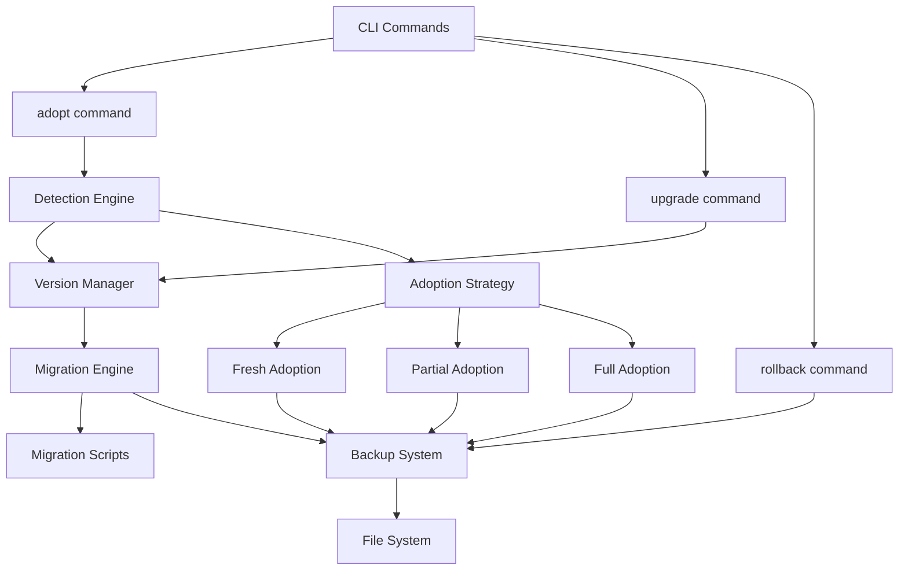

# Design: Project Adoption and Upgrade System

## Overview

The Project Adoption and Upgrade System provides intelligent onboarding for existing projects and smooth version migration for kiro-spec-engine (kse). The system consists of four core subsystems:

1. **Detection Engine**: Analyzes project structure and determines adoption strategy
2. **Version Manager**: Tracks versions and manages compatibility
3. **Migration Engine**: Executes upgrades with migration scripts
4. **Backup System**: Creates and manages backups with rollback capability

**Design Philosophy**:
- **Safety First**: All operations are reversible with automatic backups
- **User Control**: Interactive prompts with clear options and dry-run mode
- **Incremental Adoption**: Support partial adoption without forcing full migration
- **Extensibility**: Plugin architecture for future migration scripts

---

## Architecture

### High-Level Architecture



### Component Interaction Flow

**Adoption Flow**:
```
User runs `kse adopt`
  ↓
Detection Engine analyzes project
  ↓
Version Manager checks existing version
  ↓
Adoption Strategy selected (Fresh/Partial/Full)
  ↓
Backup System creates snapshot
  ↓
Strategy executes changes
  ↓
Version Manager updates version.json
  ↓
Validation runs
  ↓
Report generated
```

**Upgrade Flow**:
```
User runs `kse upgrade`
  ↓
Version Manager detects version gap
  ↓
Migration Engine plans upgrade path
  ↓
User confirms upgrade plan
  ↓
Backup System creates snapshot
  ↓
Migration Engine executes migrations sequentially
  ↓
Version Manager updates version.json
  ↓
Validation runs
  ↓
Report generated
```

---

## Components and Interfaces

### 1. Detection Engine

**Responsibility**: Analyze project structure and determine adoption strategy

**Interface**:
```javascript
class DetectionEngine {
  /**
   * Analyzes project directory and returns detection result
   * @param {string} projectPath - Absolute path to project
   * @returns {Promise<DetectionResult>}
   */
  async analyze(projectPath) {}
  
  /**
   * Determines which adoption strategy to use
   * @param {DetectionResult} result
   * @returns {AdoptionMode}
   */
  determineStrategy(result) {}
  
  /**
   * Detects project type (Node.js, Python, mixed)
   * @param {string} projectPath
   * @returns {Promise<ProjectType>}
   */
  async detectProjectType(projectPath) {}
}
```

**Key Methods**:
- `analyze()`: Scans `.sce/` directory, checks for specs/, steering/, tools/
- `determineStrategy()`: Returns 'fresh', 'partial', or 'full' based on analysis
- `detectProjectType()`: Checks for package.json, requirements.txt, etc.

**Detection Logic**:
```javascript
// Pseudocode
if (!exists('.sce/')) {
  return 'fresh';
} else if (!exists('.sce/version.json')) {
  return 'partial';
} else {
  return 'full';
}
```

### 2. Version Manager

**Responsibility**: Track project versions and manage compatibility

**Interface**:
```javascript
class VersionManager {
  /**
   * Reads version information from project
   * @param {string} projectPath
   * @returns {Promise<VersionInfo|null>}
   */
  async readVersion(projectPath) {}
  
  /**
   * Writes version information to project
   * @param {string} projectPath
   * @param {VersionInfo} versionInfo
   * @returns {Promise<void>}
   */
  async writeVersion(projectPath, versionInfo) {}
  
  /**
   * Checks if upgrade is needed
   * @param {string} projectVersion
   * @param {string} kseVersion
   * @returns {boolean}
   */
  needsUpgrade(projectVersion, kseVersion) {}
  
  /**
   * Checks compatibility between versions
   * @param {string} fromVersion
   * @param {string} toVersion
   * @returns {CompatibilityResult}
   */
  checkCompatibility(fromVersion, toVersion) {}
  
  /**
   * Calculates upgrade path for version gap
   * @param {string} fromVersion
   * @param {string} toVersion
   * @returns {string[]} - Array of intermediate versions
   */
  calculateUpgradePath(fromVersion, toVersion) {}
}
```

**Version File Structure** (`.sce/version.json`):
```json
{
  "kse-version": "1.0.0",
  "template-version": "1.0.0",
  "created": "2026-01-23T10:00:00Z",
  "last-upgraded": "2026-01-23T10:00:00Z",
  "upgrade-history": [
    {
      "from": "1.0.0",
      "to": "1.1.0",
      "date": "2026-02-01T10:00:00Z",
      "success": true
    }
  ]
}
```

**Compatibility Matrix** (embedded in kse):
```javascript
const COMPATIBILITY_MATRIX = {
  "1.0.0": { compatible: ["1.0.0", "1.1.0", "1.2.0"], breaking: false },
  "1.1.0": { compatible: ["1.0.0", "1.1.0", "1.2.0"], breaking: false },
  "2.0.0": { compatible: ["2.0.0"], breaking: true, migration: "required" }
};
```

### 3. Adoption Strategy

**Responsibility**: Execute adoption based on detected mode

**Interface**:
```javascript
class AdoptionStrategy {
  /**
   * Executes adoption for given mode
   * @param {string} projectPath
   * @param {AdoptionMode} mode
   * @param {AdoptionOptions} options
   * @returns {Promise<AdoptionResult>}
   */
  async execute(projectPath, mode, options) {}
}

class FreshAdoption extends AdoptionStrategy {
  async execute(projectPath, mode, options) {
    // Create complete .sce/ structure
    // Initialize with default templates
    // Create version.json
  }
}

class PartialAdoption extends AdoptionStrategy {
  async execute(projectPath, mode, options) {
    // Preserve existing specs/ and steering/
    // Add missing components
    // Merge steering rules
    // Update version.json
  }
}

class FullAdoption extends AdoptionStrategy {
  async execute(projectPath, mode, options) {
    // Detect version from version.json
    // Upgrade components to current version
    // Preserve all user content
    // Create backup before changes
  }
}
```

**Template Structure** (embedded in kse):
```
templates/
  kiro/
    steering/
      CORE_PRINCIPLES.md
      ENVIRONMENT.md
      CURRENT_CONTEXT.md
      RULES_GUIDE.md
    tools/
      ultrawork_enhancer.py
    README.md
    ultrawork-application-guide.md
```

### 4. Migration Engine

**Responsibility**: Execute version upgrades with migration scripts

**Interface**:
```javascript
class MigrationEngine {
  /**
   * Plans upgrade from current to target version
   * @param {string} fromVersion
   * @param {string} toVersion
   * @returns {Promise<UpgradePlan>}
   */
  async planUpgrade(fromVersion, toVersion) {}
  
  /**
   * Executes upgrade plan
   * @param {string} projectPath
   * @param {UpgradePlan} plan
   * @param {UpgradeOptions} options
   * @returns {Promise<UpgradeResult>}
   */
  async executeUpgrade(projectPath, plan, options) {}
  
  /**
   * Loads migration script for version transition
   * @param {string} fromVersion
   * @param {string} toVersion
   * @returns {Promise<MigrationScript|null>}
   */
  async loadMigration(fromVersion, toVersion) {}
  
  /**
   * Validates upgrade result
   * @param {string} projectPath
   * @returns {Promise<ValidationResult>}
   */
  async validate(projectPath) {}
}
```

**Migration Script Interface**:
```javascript
// migrations/1.0.0-to-1.1.0.js
module.exports = {
  version: "1.1.0",
  breaking: false,
  description: "Add Ultrawork tools and update steering structure",
  
  /**
   * Executes migration
   * @param {string} projectPath
   * @param {MigrationContext} context
   * @returns {Promise<MigrationResult>}
   */
  async migrate(projectPath, context) {
    // Migration logic
    // Return list of changes made
  },
  
  /**
   * Rolls back migration
   * @param {string} projectPath
   * @param {MigrationContext} context
   * @returns {Promise<void>}
   */
  async rollback(projectPath, context) {
    // Rollback logic
  }
};
```

**Upgrade Plan Structure**:
```javascript
{
  fromVersion: "1.0.0",
  toVersion: "1.2.0",
  path: ["1.0.0", "1.1.0", "1.2.0"],
  migrations: [
    { from: "1.0.0", to: "1.1.0", breaking: false, script: "1.0.0-to-1.1.0.js" },
    { from: "1.1.0", to: "1.2.0", breaking: false, script: "1.1.0-to-1.2.0.js" }
  ],
  estimatedTime: "30 seconds",
  backupRequired: true
}
```

### 5. Backup System

**Responsibility**: Create, manage, and restore backups

**Interface**:
```javascript
class BackupSystem {
  /**
   * Creates backup of .sce/ directory
   * @param {string} projectPath
   * @param {BackupOptions} options
   * @returns {Promise<BackupInfo>}
   */
  async createBackup(projectPath, options) {}
  
  /**
   * Lists available backups
   * @param {string} projectPath
   * @returns {Promise<BackupInfo[]>}
   */
  async listBackups(projectPath) {}
  
  /**
   * Restores from backup
   * @param {string} projectPath
   * @param {string} backupId
   * @returns {Promise<RestoreResult>}
   */
  async restore(projectPath, backupId) {}
  
  /**
   * Validates backup integrity
   * @param {string} backupPath
   * @returns {Promise<boolean>}
   */
  async validateBackup(backupPath) {}
  
  /**
   * Cleans old backups (keep last N)
   * @param {string} projectPath
   * @param {number} keepCount
   * @returns {Promise<void>}
   */
  async cleanOldBackups(projectPath, keepCount) {}
}
```

**Backup Structure**:
```
.sce/backups/
  adopt-2026-01-23-100000/
    version.json
    steering/
    tools/
    specs/
  upgrade-2026-01-23-110000/
    version.json
    steering/
    tools/
    specs/
```

**Backup Metadata** (`.sce/backups/backup-id/metadata.json`):
```json
{
  "id": "adopt-2026-01-23-100000",
  "type": "adopt",
  "created": "2026-01-23T10:00:00Z",
  "version": "1.0.0",
  "size": 1024000,
  "files": 42
}
```

### 6. CLI Commands

**Responsibility**: Provide user interface for adoption and upgrade

**Commands**:

```javascript
// kse adopt
async function adoptCommand(options) {
  const projectPath = process.cwd();
  
  // 1. Detect project structure
  const detection = await detectionEngine.analyze(projectPath);
  
  // 2. Determine strategy
  const strategy = detectionEngine.determineStrategy(detection);
  
  // 3. Show plan to user
  console.log(`📦 Adoption Mode: ${strategy}`);
  console.log(`📁 Project Type: ${detection.projectType}`);
  
  // 4. Confirm with user (unless --auto)
  if (!options.auto) {
    const confirmed = await promptUser("Proceed with adoption?");
    if (!confirmed) return;
  }
  
  // 5. Create backup
  const backup = await backupSystem.createBackup(projectPath, { type: 'adopt' });
  
  // 6. Execute adoption
  const result = await adoptionStrategy.execute(projectPath, strategy, options);
  
  // 7. Validate
  const validation = await validate(projectPath);
  
  // 8. Report
  console.log(`✅ Adoption complete!`);
  console.log(`📦 Backup: ${backup.id}`);
}

// kse upgrade
async function upgradeCommand(options) {
  const projectPath = process.cwd();
  
  // 1. Read current version
  const currentVersion = await versionManager.readVersion(projectPath);
  const targetVersion = options.to || getCurrentKseVersion();
  
  // 2. Check if upgrade needed
  if (!versionManager.needsUpgrade(currentVersion.kseVersion, targetVersion)) {
    console.log(`✅ Already up to date (${currentVersion.kseVersion})`);
    return;
  }
  
  // 3. Plan upgrade
  const plan = await migrationEngine.planUpgrade(
    currentVersion.kseVersion,
    targetVersion
  );
  
  // 4. Show plan to user
  console.log(`📦 Upgrade Plan:`);
  console.log(`   From: ${plan.fromVersion}`);
  console.log(`   To: ${plan.toVersion}`);
  console.log(`   Path: ${plan.path.join(' → ')}`);
  console.log(`   Estimated time: ${plan.estimatedTime}`);
  
  // 5. Dry run mode
  if (options.dryRun) {
    console.log(`🔍 Dry run complete. No changes made.`);
    return;
  }
  
  // 6. Confirm with user (unless --auto)
  if (!options.auto) {
    const confirmed = await promptUser("Proceed with upgrade?");
    if (!confirmed) return;
  }
  
  // 7. Create backup
  const backup = await backupSystem.createBackup(projectPath, { type: 'upgrade' });
  
  // 8. Execute upgrade
  const result = await migrationEngine.executeUpgrade(projectPath, plan, options);
  
  // 9. Validate
  const validation = await migrationEngine.validate(projectPath);
  
  // 10. Report
  console.log(`✅ Upgrade complete!`);
  console.log(`📦 Backup: ${backup.id}`);
  console.log(`💡 Run 'kse rollback' if you encounter issues`);
}

// kse rollback
async function rollbackCommand(options) {
  const projectPath = process.cwd();
  
  // 1. List available backups
  const backups = await backupSystem.listBackups(projectPath);
  
  if (backups.length === 0) {
    console.log(`❌ No backups found`);
    return;
  }
  
  // 2. Show backups to user
  console.log(`📦 Available backups:`);
  backups.forEach((backup, index) => {
    console.log(`   ${index + 1}. ${backup.id} (${backup.type}, ${backup.created})`);
  });
  
  // 3. Select backup
  const backupId = options.backup || await promptUser("Select backup:");
  
  // 4. Confirm
  if (!options.auto) {
    const confirmed = await promptUser(`Restore from ${backupId}?`);
    if (!confirmed) return;
  }
  
  // 5. Create backup of current state
  const currentBackup = await backupSystem.createBackup(projectPath, { 
    type: 'pre-rollback' 
  });
  
  // 6. Restore
  const result = await backupSystem.restore(projectPath, backupId);
  
  // 7. Report
  console.log(`✅ Rollback complete!`);
  console.log(`📦 Current state backed up to: ${currentBackup.id}`);
}
```

---

## Data Models

### DetectionResult

```typescript
interface DetectionResult {
  hasKiroDir: boolean;
  hasVersionFile: boolean;
  hasSpecs: boolean;
  hasSteering: boolean;
  hasTools: boolean;
  projectType: ProjectType;
  existingVersion: string | null;
  conflicts: FileConflict[];
}

type ProjectType = 'nodejs' | 'python' | 'mixed' | 'unknown';

interface FileConflict {
  path: string;
  type: 'file' | 'directory';
  existingContent: string;
  templateContent: string;
}
```

### VersionInfo

```typescript
interface VersionInfo {
  kseVersion: string;
  templateVersion: string;
  created: string; // ISO 8601
  lastUpgraded: string; // ISO 8601
  upgradeHistory: UpgradeHistoryEntry[];
}

interface UpgradeHistoryEntry {
  from: string;
  to: string;
  date: string; // ISO 8601
  success: boolean;
  error?: string;
}
```

### AdoptionResult

```typescript
interface AdoptionResult {
  success: boolean;
  mode: AdoptionMode;
  filesCreated: string[];
  filesUpdated: string[];
  filesSkipped: string[];
  backupId: string;
  errors: string[];
  warnings: string[];
}

type AdoptionMode = 'fresh' | 'partial' | 'full';
```

### UpgradeResult

```typescript
interface UpgradeResult {
  success: boolean;
  fromVersion: string;
  toVersion: string;
  migrationsExecuted: MigrationResult[];
  backupId: string;
  errors: string[];
  warnings: string[];
}

interface MigrationResult {
  from: string;
  to: string;
  success: boolean;
  changes: string[];
  error?: string;
}
```

### BackupInfo

```typescript
interface BackupInfo {
  id: string;
  type: 'adopt' | 'upgrade' | 'pre-rollback';
  created: string; // ISO 8601
  version: string;
  size: number; // bytes
  files: number;
  path: string;
}
```

---

## Correctness Properties

*A property is a characteristic or behavior that should hold true across all valid executions of a system—essentially, a formal statement about what the system should do. Properties serve as the bridge between human-readable specifications and machine-verifiable correctness guarantees.*

### Property 1: Detection Accuracy

*For any* project directory structure, the detection engine should correctly identify whether `.sce/` exists, whether `version.json` exists, and which components (specs/, steering/, tools/) are present.

**Validates: Requirements 1.1**

### Property 2: Version File Structure Invariant

*For any* adoption or upgrade operation that completes successfully, the resulting `version.json` file should contain all required fields (kse-version, template-version, created, last-upgraded, upgrade-history) with valid values.

**Validates: Requirements 1.2 (Mode A), 2.1**

### Property 3: User Content Preservation

*For any* adoption or upgrade operation, all existing user-created files in `specs/` and custom files outside the template structure should remain unchanged after the operation completes.

**Validates: Requirements 1.2 (Mode B, Mode C), 3.2**

### Property 4: Adoption Mode Selection

*For any* project directory, the adoption mode should be 'fresh' if no `.sce/` exists, 'partial' if `.sce/` exists but `version.json` is missing, and 'full' if both exist.

**Validates: Requirements 1.2**

### Property 5: Conflict Detection

*For any* project with existing files that match template file paths, the detection engine should identify these as conflicts and include them in the conflict list.

**Validates: Requirements 1.3**

### Property 6: Backup Creation Requirement

*For any* destructive operation (adoption with existing .sce/, upgrade, or rollback), a valid backup should be created before any changes are made to the project.

**Validates: Requirements 3.2, 5.1**

### Property 7: Backup Integrity

*For any* backup created by the system, validating the backup should confirm that all files from the original `.sce/` directory are present and readable in the backup.

**Validates: Requirements 5.1**

### Property 8: Version Mismatch Detection

*For any* project version and installed kse version, if the versions differ, the version manager should correctly identify this as a mismatch requiring upgrade.

**Validates: Requirements 2.2**

### Property 9: Compatibility Check Correctness

*For any* two versions in the compatibility matrix, the compatibility check should return the correct breaking/non-breaking status as defined in the matrix.

**Validates: Requirements 2.3**

### Property 10: Upgrade Path Calculation

*For any* version gap between current and target version, the calculated upgrade path should include all intermediate versions in ascending order.

**Validates: Requirements 3.3**

### Property 11: Migration Execution Order

*For any* upgrade plan with multiple migrations, the migrations should be executed in the exact order specified by the upgrade path, and execution should stop if any migration fails.

**Validates: Requirements 3.4**

### Property 12: Rollback Restoration

*For any* valid backup, rolling back to that backup should restore the `.sce/` directory to the exact state it was in when the backup was created.

**Validates: Requirements 4.3**

### Property 13: Post-Operation Validation

*For any* completed adoption or upgrade operation, validation should run and verify that all required files exist and have valid structure.

**Validates: Requirements 1.4, 3.2**

### Property 14: Version History Preservation

*For any* upgrade operation, the upgrade-history array in `version.json` should grow by exactly one entry, and all previous entries should remain unchanged.

**Validates: Requirements 2.1**

### Property 15: Atomic Operation Consistency

*For any* operation that fails partway through, the project should either be in the original state (if backup exists) or in a consistent state where version.json accurately reflects what was completed.

**Validates: Requirements 5.4**

---

## Error Handling

### Error Categories

**1. Pre-Operation Errors** (fail fast, no changes made):
- Invalid project path
- Insufficient permissions
- Missing dependencies (Python for Ultrawork)
- Incompatible kse version

**2. Operation Errors** (rollback to backup):
- File system errors during adoption/upgrade
- Migration script failures
- Validation failures after changes

**3. Backup Errors** (block operation):
- Cannot create backup directory
- Insufficient disk space
- Backup validation fails

**4. Rollback Errors** (critical, require manual intervention):
- Backup corrupted or missing
- Cannot restore files
- Permission errors during restore

### Error Handling Strategy

```javascript
async function safeOperation(operation, projectPath) {
  let backup = null;
  
  try {
    // 1. Pre-operation validation
    await validatePreConditions(projectPath);
    
    // 2. Create backup
    backup = await backupSystem.createBackup(projectPath, { 
      type: operation.type 
    });
    
    // 3. Validate backup
    const isValid = await backupSystem.validateBackup(backup.path);
    if (!isValid) {
      throw new Error('Backup validation failed');
    }
    
    // 4. Execute operation
    const result = await operation.execute(projectPath);
    
    // 5. Validate result
    const validation = await validatePostConditions(projectPath);
    if (!validation.success) {
      throw new Error(`Validation failed: ${validation.errors.join(', ')}`);
    }
    
    return result;
    
  } catch (error) {
    // Rollback if backup exists
    if (backup) {
      console.log(`❌ Operation failed: ${error.message}`);
      console.log(`🔄 Rolling back to backup: ${backup.id}`);
      
      try {
        await backupSystem.restore(projectPath, backup.id);
        console.log(`✅ Rollback successful`);
      } catch (rollbackError) {
        console.log(`❌ CRITICAL: Rollback failed: ${rollbackError.message}`);
        console.log(`📦 Manual restore required from: ${backup.path}`);
        throw new CriticalError('Rollback failed', { backup, rollbackError });
      }
    }
    
    throw error;
  }
}
```

### Error Messages

**Format**:
```
❌ Error: {Brief description}

Details:
  - {Specific detail 1}
  - {Specific detail 2}

Recovery:
  1. {Step 1}
  2. {Step 2}

Backup: {backup-id} (if applicable)
```

**Examples**:

```
❌ Error: Adoption failed - file conflict detected

Details:
  - Existing file: .sce/steering/CORE_PRINCIPLES.md
  - Template file: templates/kiro/steering/CORE_PRINCIPLES.md
  - Conflict resolution required

Recovery:
  1. Review existing file content
  2. Run 'kse adopt --merge' to merge files
  3. Or run 'kse adopt --replace' to use template (backup created)

Backup: adopt-2026-01-23-100000
```

```
❌ Error: Upgrade failed - migration script error

Details:
  - Migration: 1.0.0 → 1.1.0
  - Script: migrations/1.0.0-to-1.1.0.js
  - Error: Cannot read property 'version' of undefined

Recovery:
  1. Project rolled back to version 1.0.0
  2. Report issue: https://github.com/kse/issues
  3. Include backup ID in report

Backup: upgrade-2026-01-23-110000
```

### Graceful Degradation

**Interrupted Operations** (Ctrl+C):
```javascript
process.on('SIGINT', async () => {
  console.log('\n⚠️  Operation interrupted by user');
  
  if (currentOperation && currentOperation.backup) {
    console.log('🔄 Rolling back changes...');
    await backupSystem.restore(projectPath, currentOperation.backup.id);
    console.log('✅ Rollback complete');
  }
  
  process.exit(0);
});
```

**Partial Failures**:
- If template file copy fails: continue with other files, report at end
- If migration step fails: rollback entire migration, don't proceed to next
- If validation fails: rollback operation, report specific validation errors

---

## Testing Strategy

### Dual Testing Approach

This system requires both **unit tests** and **property-based tests** for comprehensive coverage:

- **Unit tests**: Verify specific examples, edge cases, and error conditions
- **Property tests**: Verify universal properties across all inputs

Together, they provide comprehensive coverage where unit tests catch concrete bugs and property tests verify general correctness.

### Property-Based Testing

**Library**: Use `fast-check` for JavaScript/TypeScript property-based testing

**Configuration**:
- Minimum 100 iterations per property test
- Each test references its design document property
- Tag format: `Feature: project-adoption-and-upgrade, Property {number}: {property_text}`

**Example Property Test**:
```javascript
const fc = require('fast-check');

// Feature: project-adoption-and-upgrade, Property 1: Detection Accuracy
test('Detection engine correctly identifies project structure', () => {
  fc.assert(
    fc.property(
      fc.record({
        hasKiroDir: fc.boolean(),
        hasVersionFile: fc.boolean(),
        hasSpecs: fc.boolean(),
        hasSteering: fc.boolean(),
        hasTools: fc.boolean()
      }),
      async (structure) => {
        // Create project with given structure
        const projectPath = await createTestProject(structure);
        
        // Run detection
        const result = await detectionEngine.analyze(projectPath);
        
        // Verify detection matches structure
        expect(result.hasKiroDir).toBe(structure.hasKiroDir);
        expect(result.hasVersionFile).toBe(structure.hasVersionFile);
        expect(result.hasSpecs).toBe(structure.hasSpecs);
        expect(result.hasSteering).toBe(structure.hasSteering);
        expect(result.hasTools).toBe(structure.hasTools);
        
        // Cleanup
        await cleanupTestProject(projectPath);
      }
    ),
    { numRuns: 100 }
  );
});
```

### Unit Testing

**Focus Areas**:
- Specific adoption scenarios (fresh, partial, full)
- Error conditions (missing permissions, disk full)
- Edge cases (empty version.json, corrupted backup)
- Integration between components

**Example Unit Test**:
```javascript
describe('Fresh Adoption', () => {
  test('creates complete .sce/ structure', async () => {
    const projectPath = await createEmptyProject();
    
    const result = await adoptCommand({ auto: true });
    
    expect(result.success).toBe(true);
    expect(fs.existsSync(path.join(projectPath, '.sce'))).toBe(true);
    expect(fs.existsSync(path.join(projectPath, '.sce/version.json'))).toBe(true);
    expect(fs.existsSync(path.join(projectPath, '.sce/steering'))).toBe(true);
    expect(fs.existsSync(path.join(projectPath, '.sce/tools'))).toBe(true);
  });
  
  test('handles existing .sce/ directory gracefully', async () => {
    const projectPath = await createProjectWithKiroDir();
    
    const result = await adoptCommand({ auto: true });
    
    expect(result.mode).toBe('partial');
    expect(result.filesSkipped.length).toBeGreaterThan(0);
  });
});
```

### Test Coverage Goals

- **Detection Engine**: 100% coverage (critical for correct mode selection)
- **Version Manager**: 100% coverage (critical for data integrity)
- **Migration Engine**: 95% coverage (complex logic, many edge cases)
- **Backup System**: 100% coverage (critical for data safety)
- **CLI Commands**: 90% coverage (integration tests)

### Integration Testing

**Scenarios**:
1. Fresh adoption → upgrade → rollback
2. Partial adoption → upgrade with migration → validate
3. Full adoption with conflicts → merge → upgrade
4. Interrupted upgrade → automatic rollback
5. Multiple sequential upgrades → version history validation

### Manual Testing Checklist

- [ ] Test on Windows, macOS, Linux
- [ ] Test with Node.js 16, 18, 20
- [ ] Test with Python 3.8, 3.9, 3.10, 3.11
- [ ] Test with various project structures (Node.js only, Python only, mixed)
- [ ] Test with large projects (1000+ files in .sce/)
- [ ] Test with slow file systems (network drives)
- [ ] Test with insufficient disk space
- [ ] Test with read-only files
- [ ] Test interrupt handling (Ctrl+C at various stages)

---

## Implementation Notes

### File System Operations

**Use atomic operations where possible**:
```javascript
// Bad: non-atomic
fs.writeFileSync(versionPath, JSON.stringify(versionInfo));

// Good: atomic write
const tempPath = versionPath + '.tmp';
fs.writeFileSync(tempPath, JSON.stringify(versionInfo));
fs.renameSync(tempPath, versionPath); // Atomic on most systems
```

### Backup Strategy

**Incremental backups** (future optimization):
- First backup: full copy
- Subsequent backups: only changed files
- Maintain manifest for reconstruction

**Compression** (future optimization):
- Compress backups older than 7 days
- Keep last 3 backups uncompressed for fast rollback

### Performance Considerations

**Large Projects**:
- Stream file copies instead of loading into memory
- Use parallel file operations (with concurrency limit)
- Show progress bar for operations > 5 seconds

**Caching**:
- Cache detection results during single command execution
- Cache compatibility matrix (embedded in code)
- Don't cache version.json (always read fresh)

### Security Considerations

**Path Traversal Prevention**:
```javascript
function validatePath(projectPath, filePath) {
  const resolved = path.resolve(projectPath, filePath);
  if (!resolved.startsWith(projectPath)) {
    throw new Error('Path traversal detected');
  }
  return resolved;
}
```

**Backup Validation**:
- Verify backup contains expected files
- Check file sizes match
- Validate JSON files parse correctly

---

## Future Enhancements

### Phase 2 Features

1. **Cloud Sync**: Sync project settings across machines
2. **Team Collaboration**: Share project configurations
3. **Auto-Update**: Optional automatic upgrades for non-breaking changes
4. **Plugin System**: Allow third-party extensions to hook into adoption/upgrade

### Phase 3 Features

1. **Differential Upgrades**: Only download changed files
2. **Rollback History**: Keep multiple rollback points
3. **Upgrade Scheduling**: Schedule upgrades for specific times
4. **Health Monitoring**: Continuous validation of project structure

---

**Version**: 1.0  
**Created**: 2026-01-23  
**Status**: Draft
