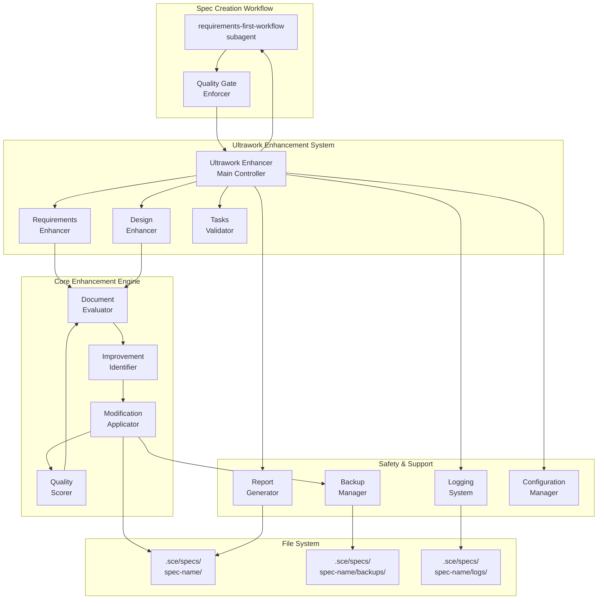
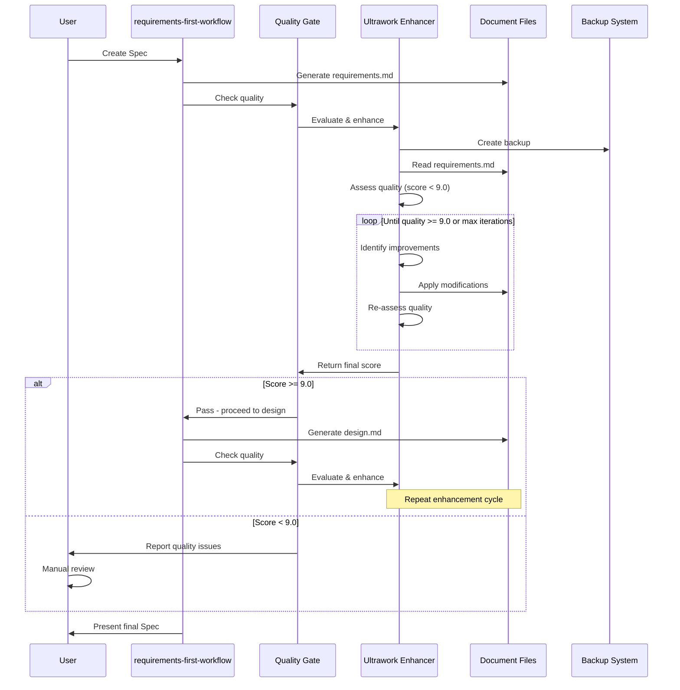

# Design Document

## Overview

This design specifies the architecture for integrating Ultrawork quality automation into the kiro-spec-engine (kse) project. The system enhances the existing Ultrawork tool (`ultrawork_enhancer.py`) to actually modify Spec documents (not just identify improvements) and integrates quality checks into the Spec creation workflow to ensure all generated Specs meet professional-grade standards (9.0/10 quality score).

### Key Design Goals

1. **Document Modification**: Transform Ultrawork from an analysis tool to an active document enhancement tool
2. **Quality Automation**: Integrate quality checks into the requirements-first-workflow subagent
3. **Convergence Guarantee**: Ensure improvement cycles terminate with quality thresholds or iteration limits
4. **Backward Compatibility**: Support both standalone and integrated operation modes
5. **Reliability**: Provide robust error handling, backup/restore, and detailed logging

### Design Approach

The design follows a layered architecture:
- **Enhancement Layer**: Document analysis, improvement identification, and modification logic
- **Workflow Integration Layer**: Quality gates and automated enhancement in Spec creation
- **Safety Layer**: Backup/restore, error handling, and validation
- **Reporting Layer**: Logging, quality reports, and user feedback

## Architecture

### System Architecture Diagram




### Component Interaction Flow



## Components and Interfaces

### 1. Ultrawork Enhancer (Main Controller)

**Responsibility**: Orchestrates the document enhancement process, manages improvement cycles, and coordinates with other components.

**Interface**:
```python
class UltraworkEnhancer:
    def __init__(self, config: Optional[Config] = None):
        """Initialize with optional configuration"""
        
    def enhance_requirements_quality(self, requirements_path: str) -> EnhancementResult:
        """Enhance requirements document to meet quality standards"""
        
    def enhance_design_completeness(self, design_path: str, requirements_path: str) -> EnhancementResult:
        """Enhance design document with requirements traceability"""
        
    def enhance_task_execution(self, tasks_path: str) -> ValidationResult:
        """Validate tasks document completeness"""
        
    def set_quality_threshold(self, threshold: float):
        """Configure quality threshold (0-10)"""
        
    def set_max_iterations(self, max_iter: int):
        """Configure maximum improvement iterations"""
```

**Key Responsibilities**:
- Manage improvement cycle lifecycle
- Enforce convergence conditions (max iterations, score plateau, threshold reached)
- Coordinate backup creation before modifications
- Generate enhancement reports
- Handle errors and exceptions gracefully

**Validates: Requirements 1.1, 1.7, 5.1, 5.2, 5.3, 5.4, 5.5, 8.4, 12.1, 12.2**


### 2. Document Evaluator

**Responsibility**: Analyzes document structure and content to assess quality and identify areas for improvement.

**Interface**:
```python
class DocumentEvaluator:
    def assess_requirements_quality(self, content: str, language: str = 'en') -> QualityAssessment:
        """Evaluate requirements document quality (0-10 score)"""
        
    def assess_design_quality(self, design_content: str, requirements_content: str, language: str = 'en') -> QualityAssessment:
        """Evaluate design document quality with requirements traceability check"""
        
    def assess_tasks_quality(self, content: str) -> QualityAssessment:
        """Evaluate tasks document completeness"""
```

**Quality Assessment Structure**:
```python
@dataclass
class QualityAssessment:
    score: float  # 0-10
    criteria_scores: Dict[str, float]  # Individual criterion scores
    missing_sections: List[str]
    incomplete_sections: List[str]
    issues: List[Issue]
    language: str
```

**Scoring Criteria**:

**Requirements Document**:
- Structure completeness (20%): Introduction, Glossary, Requirements sections
- EARS pattern compliance (20%): Proper use of WHEN/WHILE/IF/WHERE/THE/SHALL
- User story quality (20%): "As a... I want... so that..." format
- Acceptance criteria clarity (20%): Specific, measurable, testable
- Non-functional requirements (10%): Performance, security, reliability, usability
- Glossary completeness (10%): All technical terms defined

**Design Document**:
- Architecture completeness (25%): Overview, Components, Data Models, Error Handling
- Component detail (20%): Interfaces, responsibilities, dependencies
- Requirements traceability (20%): Bidirectional references to requirements
- Correctness properties (15%): Property-based test specifications
- Design rationale (10%): Explanations for key decisions
- Diagrams and visualizations (10%): Mermaid diagrams, architecture views

**Validates: Requirements 4.1, 4.2, 4.3, 4.4, 4.5**

### 3. Improvement Identifier

**Responsibility**: Analyzes quality assessment results to identify specific improvements needed.

**Interface**:
```python
class ImprovementIdentifier:
    def identify_requirements_improvements(self, content: str, assessment: QualityAssessment) -> List[Improvement]:
        """Identify specific improvements for requirements document"""
        
    def identify_design_improvements(self, design_content: str, requirements_content: str, assessment: QualityAssessment) -> List[Improvement]:
        """Identify specific improvements for design document"""
```

**Improvement Structure**:
```python
@dataclass
class Improvement:
    type: ImprovementType  # ADD_SECTION, ENHANCE_CRITERIA, ADD_TRACEABILITY, etc.
    target_section: str
    description: str
    priority: Priority  # HIGH, MEDIUM, LOW
    template: Optional[str]  # Template content to add
    metadata: Dict[str, Any]
```

**Improvement Types**:
- `ADD_SECTION`: Add missing document section
- `ENHANCE_CRITERIA`: Improve acceptance criteria with EARS patterns
- `ADD_NFR`: Add non-functional requirements
- `ADD_ERROR_HANDLING`: Add error handling requirements
- `ADD_EDGE_CASES`: Add boundary condition criteria
- `ADD_GLOSSARY_TERM`: Define undefined terms
- `ADD_COMPONENT_DETAIL`: Expand component descriptions
- `ADD_TRACEABILITY`: Add requirements references
- `ADD_PROPERTIES`: Generate correctness properties
- `ADD_RATIONALE`: Add design decision explanations
- `ADD_DIAGRAM`: Add architecture or design diagrams

**Validates: Requirements 2.1, 2.2, 2.3, 2.4, 2.5, 2.6, 3.1, 3.2, 3.3, 3.4, 3.5, 3.6**


### 4. Modification Applicator

**Responsibility**: Applies identified improvements to documents while preserving existing content and structure.

**Interface**:
```python
class ModificationApplicator:
    def apply_requirements_improvements(self, content: str, improvements: List[Improvement]) -> ModificationResult:
        """Apply improvements to requirements document"""
        
    def apply_design_improvements(self, content: str, improvements: List[Improvement], requirements_content: str) -> ModificationResult:
        """Apply improvements to design document with requirements context"""
```

**Modification Result**:
```python
@dataclass
class ModificationResult:
    modified_content: str
    applied_improvements: List[Improvement]
    failed_improvements: List[Tuple[Improvement, Exception]]
    modification_report: str  # Markdown report of changes
```

**Modification Strategies**:

1. **Section Addition**: Insert new sections at appropriate locations
   - Detect document structure (markdown headers)
   - Find insertion point based on section hierarchy
   - Add section with template content
   - Preserve existing formatting style

2. **Content Enhancement**: Improve existing content
   - Parse existing acceptance criteria
   - Rewrite using EARS patterns
   - Add specific, measurable conditions
   - Preserve original intent

3. **Traceability Addition**: Add requirements references
   - Parse design components
   - Match to requirements based on keywords and context
   - Add "Validates: Requirements X.Y" annotations
   - Ensure bidirectional traceability

4. **Property Generation**: Create correctness properties from acceptance criteria
   - Analyze acceptance criteria for testability
   - Generate "For all..." property statements
   - Add requirements validation references
   - Follow property-based testing patterns

**Preservation Rules**:
- Never delete existing content
- Preserve markdown formatting (headers, lists, code blocks)
- Maintain existing section order
- Keep custom sections unchanged
- Follow document's existing style (indentation, spacing)

**Validates: Requirements 1.1, 1.2, 1.3, 1.4, 1.5, 1.6, 11.1, 11.2, 11.3**

### 5. Quality Scorer

**Responsibility**: Calculates quality scores based on weighted criteria and provides detailed scoring breakdowns.

**Interface**:
```python
class QualityScorer:
    def score_requirements(self, content: str, language: str = 'en') -> ScoringResult:
        """Calculate requirements document quality score"""
        
    def score_design(self, design_content: str, requirements_content: str, language: str = 'en') -> ScoringResult:
        """Calculate design document quality score"""
        
    def configure_weights(self, weights: Dict[str, float]):
        """Configure scoring criterion weights"""
```

**Scoring Result**:
```python
@dataclass
class ScoringResult:
    total_score: float  # 0-10
    criterion_scores: Dict[str, CriterionScore]
    language: str
    scoring_breakdown: str  # Detailed explanation
```

**Scoring Algorithm**:
```python
total_score = sum(criterion_weight * criterion_score for each criterion)
```

**Language-Specific Scoring**:
- English: Check for EARS patterns, "As a... I want... so that..."
- Chinese: Check for "作为...我希望...以便...", "当...时...系统应..."
- Both: Structure, completeness, traceability (language-independent)

**Validates: Requirements 4.1, 4.2, 4.3, 4.4, 4.6, 12.4**


### 6. Quality Gate Enforcer

**Responsibility**: Integrates Ultrawork enhancement into the Spec creation workflow and enforces quality thresholds.

**Interface**:
```python
class QualityGateEnforcer:
    def __init__(self, ultrawork_enhancer: UltraworkEnhancer):
        """Initialize with Ultrawork enhancer instance"""
        
    def check_requirements_gate(self, requirements_path: str) -> GateResult:
        """Check if requirements meet quality gate (9.0/10)"""
        
    def check_design_gate(self, design_path: str, requirements_path: str) -> GateResult:
        """Check if design meets quality gate (9.0/10)"""
        
    def check_tasks_gate(self, tasks_path: str) -> GateResult:
        """Check if tasks meet quality gate (8.0/10)"""
```

**Gate Result**:
```python
@dataclass
class GateResult:
    passed: bool
    score: float
    threshold: float
    enhancement_result: Optional[EnhancementResult]
    message: str
```

**Integration with requirements-first-workflow**:

The Quality Gate Enforcer will be invoked at three points in the workflow:
1. After requirements.md generation → enhance to 9.0/10
2. After design.md generation → enhance to 9.0/10
3. After tasks.md generation → validate 8.0/10

**Implementation Approach**:
- Modify the requirements-first-workflow subagent to call Quality Gate Enforcer
- Add quality check hooks after each document generation
- Block workflow progression if quality gates fail
- Generate quality reports for user review

**Validates: Requirements 6.1, 6.2, 6.3, 6.4, 6.5, 6.6, 7.1, 7.2, 7.3, 7.4, 7.5, 7.6**

### 7. Backup Manager

**Responsibility**: Creates and manages document backups before modifications to enable rollback on failure.

**Interface**:
```python
class BackupManager:
    def create_backup(self, file_path: str, reason: str) -> str:
        """Create backup and return backup ID"""
        
    def restore_backup(self, backup_id: str):
        """Restore file from backup"""
        
    def cleanup_backup(self, backup_id: str):
        """Remove backup after successful operation"""
        
    def list_backups(self, file_path: str) -> List[BackupInfo]:
        """List available backups for a file"""
```

**Backup Strategy**:
- Create backup before any modification
- Store in `.sce/specs/{spec-name}/backups/`
- Backup naming: `{filename}.backup-{timestamp}`
- Include metadata: original path, timestamp, reason
- Automatic cleanup on success
- Retain on failure for manual recovery

**Validates: Requirements 8.5, 8.6**

### 8. Logging System

**Responsibility**: Provides comprehensive logging of enhancement activities for debugging and audit trails.

**Interface**:
```python
class EnhancementLogger:
    def log_cycle_start(self, document_type: str, initial_score: float, issues: List[str]):
        """Log start of improvement cycle"""
        
    def log_improvement_applied(self, improvement: Improvement, success: bool, details: str):
        """Log individual improvement application"""
        
    def log_iteration_complete(self, iteration: int, new_score: float, score_delta: float):
        """Log completion of iteration"""
        
    def log_cycle_stop(self, reason: str, final_score: float, iterations: int):
        """Log end of improvement cycle"""
        
    def set_verbose(self, verbose: bool):
        """Enable/disable verbose logging"""
```

**Logging Outputs**:
- Console: Progress indicators, key events, errors
- Log file: Detailed logs in `.sce/specs/{spec-name}/logs/ultrawork-{timestamp}.log`
- Verbose mode: Include scoring breakdowns, evaluation criteria, modification details

**Validates: Requirements 9.1, 9.2, 9.3, 9.4, 9.5, 9.6**


### 9. Report Generator

**Responsibility**: Generates comprehensive quality reports showing enhancement results and quality metrics.

**Interface**:
```python
class ReportGenerator:
    def generate_enhancement_report(self, enhancement_results: List[EnhancementResult]) -> str:
        """Generate Markdown report of enhancement activities"""
        
    def generate_quality_summary(self, spec_path: str) -> str:
        """Generate quality summary for entire Spec"""
```

**Report Structure**:
```markdown
# Quality Enhancement Report

## Summary
- Spec: {spec-name}
- Generated: {timestamp}
- Overall Status: {Quality Assured / Needs Review}

## Requirements Document
- Initial Score: {score}/10
- Final Score: {score}/10
- Iterations: {count}
- Status: {PASS / FAIL}

### Improvements Applied
1. {improvement type}: {description}
   - Before: {excerpt}
   - After: {excerpt}

## Design Document
- Initial Score: {score}/10
- Final Score: {score}/10
- Iterations: {count}
- Status: {PASS / FAIL}

### Improvements Applied
...

## Tasks Document
- Score: {score}/10
- Status: {PASS / FAIL}

## Quality Gates
- Requirements Gate (9.0/10): {PASS / FAIL}
- Design Gate (9.0/10): {PASS / FAIL}
- Tasks Gate (8.0/10): {PASS / FAIL}

## Recommendations
{Any manual review recommendations}
```

**Validates: Requirements 1.7, 10.1, 10.2, 10.3, 10.4, 10.5, 10.6, 10.7**

### 10. Configuration Manager

**Responsibility**: Manages configuration settings for quality thresholds, iteration limits, and enhancement behavior.

**Interface**:
```python
class ConfigurationManager:
    def load_config(self, config_path: Optional[str] = None) -> Config:
        """Load configuration from file or use defaults"""
        
    def save_config(self, config: Config, config_path: str):
        """Save configuration to file"""
```

**Configuration Structure**:
```python
@dataclass
class Config:
    # Quality thresholds
    requirements_threshold: float = 9.0
    design_threshold: float = 9.0
    tasks_threshold: float = 8.0
    
    # Iteration limits
    max_iterations: int = 10
    plateau_iterations: int = 3  # Stop if no improvement for N iterations
    
    # Enhancement types
    enable_requirements_enhancement: bool = True
    enable_design_enhancement: bool = True
    enable_tasks_validation: bool = True
    
    # Scoring weights
    requirements_weights: Dict[str, float] = field(default_factory=dict)
    design_weights: Dict[str, float] = field(default_factory=dict)
    
    # Logging
    verbose_logging: bool = False
    log_to_file: bool = True
    
    # Backup
    create_backups: bool = True
    cleanup_backups_on_success: bool = True
```

**Configuration File Location**:
- Project-level: `.sce/ultrawork-config.json`
- Spec-level: `.sce/specs/{spec-name}/ultrawork-config.json` (overrides project-level)
- Defaults: Used if no config file exists

**Validates: Requirements 12.1, 12.2, 12.3, 12.4, 12.5, 12.6**

## Data Models

### Enhancement Result

```python
@dataclass
class EnhancementResult:
    success: bool
    document_type: str  # 'requirements', 'design', 'tasks'
    initial_score: float
    final_score: float
    iterations: int
    improvements_applied: List[Improvement]
    improvements_failed: List[Tuple[Improvement, Exception]]
    stopping_reason: str  # 'threshold_reached', 'max_iterations', 'plateau', 'no_improvements'
    modification_report: str
    timestamp: datetime
```

### Issue

```python
@dataclass
class Issue:
    severity: Severity  # ERROR, WARNING, INFO
    category: str  # 'structure', 'content', 'format', 'traceability'
    description: str
    location: Optional[str]  # Section or line reference
    suggestion: Optional[str]
```

### Backup Info

```python
@dataclass
class BackupInfo:
    backup_id: str
    original_path: str
    backup_path: str
    timestamp: datetime
    reason: str
    size_bytes: int
```


## Correctness Properties

*A property is a characteristic or behavior that should hold true across all valid executions of a system—essentially, a formal statement about what the system should do. Properties serve as the bridge between human-readable specifications and machine-verifiable correctness guarantees.*

### Property 1: Document Enhancement Completeness

*For any* Spec document (requirements, design, or tasks) with quality score below threshold, after running the Ultrawork enhancement cycle, all identified improvements should either be successfully applied or logged as failed with clear error messages.

**Validates: Requirements 1.1, 1.2, 1.3, 1.4, 1.5, 2.1, 2.2, 2.3, 2.4, 2.5, 2.6, 3.1, 3.2, 3.3, 3.4, 3.5, 3.6**

### Property 2: Content Preservation Invariant

*For any* document modification operation, all existing content in the original document should be present in the modified document (no deletions), and all existing markdown structure (headers, lists, code blocks) should be preserved.

**Validates: Requirements 1.6, 11.1, 11.2, 11.3**

### Property 3: Quality Score Monotonicity

*For any* improvement cycle iteration where improvements are successfully applied, the quality score should either increase by at least 0.5 points or remain unchanged (if already at maximum), but never decrease.

**Validates: Requirements 4.6**

### Property 4: Convergence Guarantee

*For any* enhancement cycle, the cycle should terminate within the configured maximum iterations (default 10) or when one of the stopping conditions is met: (1) quality score >= threshold, (2) no improvements identified, or (3) score plateau for 3 consecutive iterations.

**Validates: Requirements 5.1, 5.2, 5.3, 5.4, 5.5**

### Property 5: Quality Threshold Achievement

*For any* document that undergoes enhancement, if the final quality score is >= 9.0 (for requirements/design) or >= 8.0 (for tasks), then the document should pass its quality gate and the workflow should proceed to the next phase.

**Validates: Requirements 2.7, 3.7, 4.5, 7.1, 7.2, 7.3, 7.4, 7.5, 7.6**

### Property 6: Workflow Integration Automation

*For any* Spec creation workflow execution, the Ultrawork tool should be automatically invoked after each document generation (requirements, design, tasks), and quality gates should block progression if thresholds are not met.

**Validates: Requirements 6.1, 6.2, 6.3, 6.4, 6.5, 6.6**

### Property 7: Backup Safety Guarantee

*For any* document modification operation, a backup should be created before any changes are applied, and if the operation fails, the original document should be restorable from the backup.

**Validates: Requirements 8.5, 8.6**

### Property 8: Error Resilience

*For any* error condition (file read error, malformed document, failed improvement application, unexpected exception), the Ultrawork tool should handle the error gracefully by logging the error, preserving document integrity, and either continuing with remaining operations or exiting cleanly without corruption.

**Validates: Requirements 8.1, 8.2, 8.3, 8.4**

### Property 9: Comprehensive Logging

*For any* enhancement cycle execution, all significant events should be logged including: cycle start with initial score, each improvement application with success/failure status, each iteration completion with new score, and cycle stop with final statistics and stopping reason.

**Validates: Requirements 9.1, 9.2, 9.3, 9.4, 9.6**

### Property 10: Quality Report Completeness

*For any* completed Spec creation workflow, a quality report should be generated containing: initial and final scores for each document, list of all improvements applied, iteration counts, quality gate results (pass/fail), and formatted in Markdown.

**Validates: Requirements 10.1, 10.2, 10.3, 10.4, 10.5, 10.6, 10.7**

### Property 11: Configuration Respect

*For any* Ultrawork tool execution with a configuration file present, all configured settings (thresholds, iteration limits, enhancement types, scoring weights) should be applied, and if no configuration exists, sensible defaults (9.0 threshold, 10 max iterations) should be used.

**Validates: Requirements 12.1, 12.2, 12.3, 12.4, 12.5, 12.6**

### Property 12: Dual Operation Mode Support

*For any* Ultrawork tool invocation, it should function correctly in both integrated mode (called by Spec creation workflow) and standalone mode (called manually via ultrawork.bat), with identical enhancement behavior in both modes.

**Validates: Requirements 11.4, 11.5**


## Error Handling

### Error Categories and Strategies

#### 1. File System Errors

**Errors**:
- File not found
- Permission denied
- Disk full
- File locked by another process

**Handling Strategy**:
- Catch file I/O exceptions
- Log detailed error with file path and operation
- Exit gracefully without modifying any files
- Provide clear error message to user with recovery steps

**Example**:
```python
try:
    with open(file_path, 'r', encoding='utf-8') as f:
        content = f.read()
except FileNotFoundError:
    logger.error(f"File not found: {file_path}")
    return EnhancementResult(success=False, error="File not found")
except PermissionError:
    logger.error(f"Permission denied: {file_path}")
    return EnhancementResult(success=False, error="Permission denied")
```

#### 2. Document Structure Errors

**Errors**:
- Malformed markdown
- Missing required sections
- Invalid EARS patterns
- Broken references

**Handling Strategy**:
- Attempt to parse what is possible
- Log structural issues as warnings
- Continue with partial enhancement
- Report structural problems in enhancement report

**Example**:
```python
try:
    sections = parse_markdown_sections(content)
except MarkdownParseError as e:
    logger.warning(f"Malformed markdown: {e}")
    # Attempt basic text processing
    sections = fallback_parse(content)
```

#### 3. Improvement Application Errors

**Errors**:
- Template rendering failure
- Section insertion conflict
- Content formatting error
- Traceability matching failure

**Handling Strategy**:
- Catch exceptions for each improvement
- Log failure with improvement details
- Skip failed improvement
- Continue with remaining improvements
- Report failed improvements in result

**Example**:
```python
for improvement in improvements:
    try:
        content = apply_improvement(content, improvement)
        applied.append(improvement)
    except Exception as e:
        logger.error(f"Failed to apply {improvement.type}: {e}")
        failed.append((improvement, e))
```

#### 4. Quality Scoring Errors

**Errors**:
- Invalid scoring criteria
- Division by zero in weighted average
- Language detection failure

**Handling Strategy**:
- Use default weights if custom weights invalid
- Handle edge cases (empty documents, missing sections)
- Fall back to English scoring if language detection fails
- Return minimum score (0.0) on catastrophic failure

#### 5. Backup/Restore Errors

**Errors**:
- Backup creation failure
- Backup corruption
- Restore failure

**Handling Strategy**:
- If backup creation fails, abort modification operation
- Validate backup integrity after creation
- If restore fails, log error and preserve backup for manual recovery
- Never delete backups on error

#### 6. Configuration Errors

**Errors**:
- Invalid configuration file format
- Out-of-range threshold values
- Missing required configuration keys

**Handling Strategy**:
- Validate configuration on load
- Use defaults for invalid values
- Log configuration errors as warnings
- Continue with valid configuration subset

### Error Recovery Procedures

**Scenario 1: Enhancement Fails Mid-Cycle**
1. Log the error with full stack trace
2. Restore document from backup
3. Return enhancement result with failure status
4. Preserve backup for manual inspection

**Scenario 2: Quality Gate Fails**
1. Log quality score and threshold
2. Generate detailed quality report
3. Present report to user
4. Offer options: manual review, adjust threshold, retry

**Scenario 3: Workflow Integration Error**
1. Log integration error
2. Fall back to manual enhancement mode
3. Notify user of integration failure
4. Provide manual enhancement command

## Testing Strategy

### Dual Testing Approach

This system requires both unit tests and property-based tests for comprehensive coverage:

**Unit Tests**: Verify specific examples, edge cases, and error conditions
- Specific document enhancement scenarios
- Error handling for known failure modes
- Configuration loading and validation
- Backup creation and restoration
- Report generation formatting

**Property Tests**: Verify universal properties across all inputs
- Document preservation invariants
- Quality score monotonicity
- Convergence guarantees
- Error resilience
- Configuration respect

### Property-Based Testing Configuration

**Testing Library**: Use `pytest` with `hypothesis` for Python property-based testing

**Test Configuration**:
- Minimum 100 iterations per property test
- Each test tagged with feature name and property number
- Tag format: `# Feature: 04-00-ultrawork-integration-and-quality-automation, Property {N}: {property_text}`

**Example Property Test**:
```python
from hypothesis import given, strategies as st
import pytest

# Feature: 04-00-ultrawork-integration-and-quality-automation, Property 2: Content Preservation Invariant
@given(st.text(min_size=100, max_size=5000))
def test_content_preservation(original_content):
    """For any document, modification should preserve all original content"""
    # Setup
    enhancer = UltraworkEnhancer()
    improvements = [Improvement(type=ImprovementType.ADD_SECTION, ...)]
    
    # Execute
    result = enhancer.apply_improvements(original_content, improvements)
    
    # Verify: All original content present in modified content
    assert all(line in result.modified_content for line in original_content.split('\n') if line.strip())
```

### Unit Test Coverage

**Core Components**:
- `UltraworkEnhancer`: Cycle management, convergence conditions
- `DocumentEvaluator`: Scoring accuracy for known documents
- `ImprovementIdentifier`: Identification of specific improvement types
- `ModificationApplicator`: Correct application of each improvement type
- `QualityScorer`: Scoring algorithm with various inputs
- `BackupManager`: Backup creation, restoration, cleanup
- `ReportGenerator`: Report formatting and completeness
- `ConfigurationManager`: Configuration loading and defaults

**Edge Cases**:
- Empty documents
- Documents with only headers
- Documents with custom sections
- Malformed markdown
- Very large documents (>10,000 lines)
- Documents in different languages
- Documents already at maximum quality

**Error Conditions**:
- File not found
- Permission denied
- Malformed configuration
- Invalid improvement templates
- Backup creation failure
- Scoring calculation errors

### Integration Testing

**Workflow Integration Tests**:
- End-to-end Spec creation with quality gates
- Requirements → Design → Tasks flow with enhancement
- Quality gate blocking behavior
- Report generation after workflow completion

**Standalone Mode Tests**:
- Manual invocation via command line
- Configuration file loading
- Backup and restore operations
- Error handling and recovery

### Test Data Generation

**Document Generators**:
- Generate random requirements documents with varying completeness
- Generate design documents with missing sections
- Generate documents in English and Chinese
- Generate malformed documents for error testing

**Improvement Generators**:
- Generate various improvement types
- Generate conflicting improvements
- Generate improvements that should fail


## Implementation Notes

### Technology Stack

**Primary Language**: Python 3.8+
- Chosen for compatibility with existing `ultrawork_enhancer.py`
- Rich ecosystem for text processing and testing
- Easy integration with Kiro IDE

**Key Libraries**:
- `pytest`: Testing framework
- `hypothesis`: Property-based testing
- `markdown`: Markdown parsing and manipulation
- `dataclasses`: Data structure definitions
- Standard library: `re`, `pathlib`, `json`, `logging`

### Refactoring Strategy for Existing Code

The current `ultrawork_enhancer.py` has placeholder methods that need implementation:

**Phase 1: Extract and Modularize**
1. Extract `_assess_requirements_quality()` → `DocumentEvaluator.assess_requirements_quality()`
2. Extract `_identify_requirements_improvements()` → `ImprovementIdentifier.identify_requirements_improvements()`
3. Extract `_apply_requirements_improvements()` → `ModificationApplicator.apply_requirements_improvements()`
4. Repeat for design and tasks methods

**Phase 2: Implement Core Logic**
1. Implement `ModificationApplicator` with actual document modification
2. Implement `QualityScorer` with weighted scoring algorithm
3. Implement `BackupManager` for safety
4. Implement `EnhancementLogger` for comprehensive logging

**Phase 3: Add New Components**
1. Implement `QualityGateEnforcer` for workflow integration
2. Implement `ReportGenerator` for quality reports
3. Implement `ConfigurationManager` for customization

**Phase 4: Integrate with Workflow**
1. Modify requirements-first-workflow subagent to call Quality Gate Enforcer
2. Add quality check hooks after each document generation
3. Test end-to-end workflow with quality gates

### Workflow Integration Approach

Since the requirements-first-workflow is a subagent (not a Python module), integration will be done through:

**Option 1: Steering File Modification** (Recommended)
- Add instructions to the requirements-first-workflow steering to invoke Ultrawork tool
- After generating each document, call `python .sce/tools/ultrawork_enhancer.py {command} {path}`
- Check exit code and quality score
- Block progression if quality gate fails

**Option 2: Wrapper Script**
- Create a wrapper script that orchestrates the workflow
- Call requirements-first-workflow subagent
- Intercept document generation
- Run Ultrawork enhancement
- Continue workflow if quality gates pass

**Option 3: Direct Integration** (Future Enhancement)
- Modify Kiro IDE to support quality gate hooks
- Register Ultrawork tool as a quality gate provider
- Automatic invocation during Spec creation

For this Spec, we'll use **Option 1** as it requires minimal changes to the existing system.

### Performance Considerations

**Document Size Limits**:
- Efficient for documents up to 10,000 lines
- For larger documents, use streaming or chunked processing
- Warn user if document exceeds recommended size

**Iteration Limits**:
- Default maximum 10 iterations prevents infinite loops
- Typical convergence in 2-4 iterations for most documents
- Plateau detection (3 iterations without improvement) provides early exit

**Backup Storage**:
- Backups stored in Spec directory, not project root
- Automatic cleanup on success reduces disk usage
- Retain failed backups for debugging

### Security Considerations

**File System Access**:
- Only read/write files within `.sce/specs/` directory
- Validate file paths to prevent directory traversal
- Use atomic writes to prevent corruption

**Configuration Validation**:
- Validate threshold values (0.0 to 10.0)
- Validate iteration limits (1 to 100)
- Sanitize user-provided templates

**Backup Safety**:
- Create backups before any modification
- Validate backup integrity after creation
- Never delete backups on error

### Extensibility Points

**Custom Improvement Types**:
- Define new `ImprovementType` enum values
- Implement corresponding application logic in `ModificationApplicator`
- Add templates for new improvement types

**Custom Scoring Criteria**:
- Add new criteria to `QualityScorer`
- Configure weights in configuration file
- Support domain-specific quality metrics

**Custom Document Types**:
- Extend `DocumentEvaluator` for new document types
- Add corresponding enhancement methods
- Register new document types in configuration

**Language Support**:
- Add language detection logic
- Implement language-specific scoring criteria
- Support additional languages beyond English and Chinese

### Migration Path for Existing Specs

**Backward Compatibility**:
- Existing Specs can be enhanced without modification
- Standalone mode (`ultrawork.bat`) works independently
- No breaking changes to existing workflows

**Gradual Adoption**:
1. Use standalone mode to enhance existing Specs manually
2. Verify quality improvements
3. Enable integrated mode for new Specs
4. Gradually migrate existing Specs to use quality gates

### Monitoring and Observability

**Metrics to Track**:
- Average quality scores before/after enhancement
- Number of iterations per document
- Most common improvement types
- Enhancement success rate
- Time to convergence

**Logging Levels**:
- ERROR: Critical failures, file system errors
- WARNING: Quality gate failures, structural issues
- INFO: Cycle start/stop, iteration completion
- DEBUG: Detailed scoring, improvement application

**Quality Reports**:
- Store in `.sce/specs/{spec-name}/quality-report.md`
- Include timestamp, scores, improvements
- Archive historical reports for trend analysis

---

**Design Version**: 1.0  
**Last Updated**: 2026-01-23  
**Status**: Ready for Implementation
