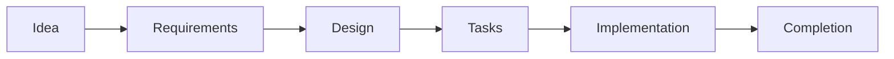
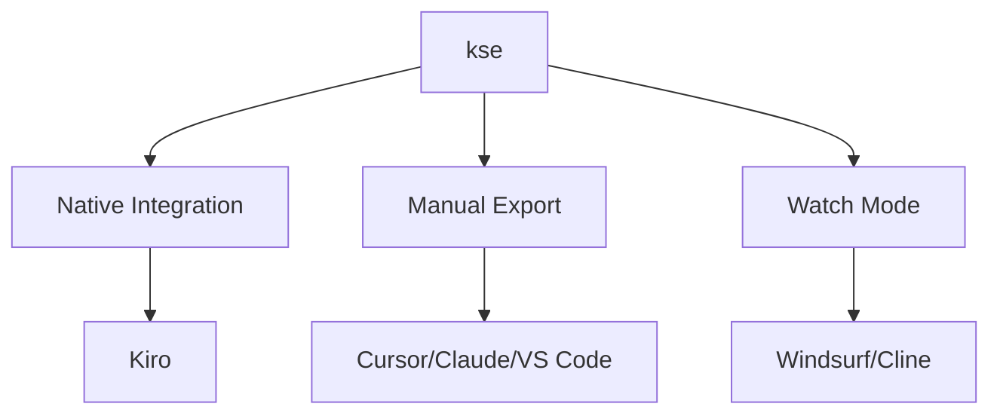
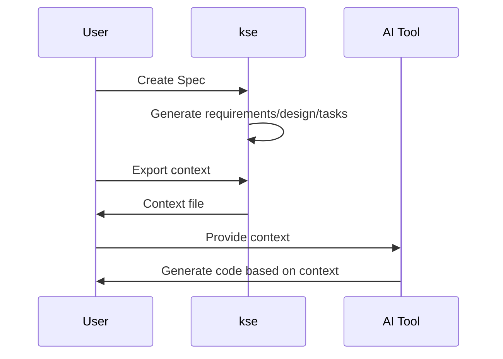

# Design Document

## Overview

This design addresses the user onboarding and documentation improvement for kse (Kiro Spec Engine). The goal is to create a comprehensive, user-friendly documentation system that helps users quickly understand kse's role as a context provider for AI tools and successfully integrate it into their workflow within 5 minutes.

The design focuses on restructuring existing documentation, creating tool-specific guides, adding visual aids, and ensuring consistency across all documentation. The approach is documentation-centric with no code changes required to kse itself - all improvements are in markdown files, diagrams, and examples.

**Key Design Principles:**
- **User-first**: Start with what users need to know, not what we want to tell them
- **Progressive disclosure**: Quick start first, details later
- **Tool-specific**: Recognize that different AI tools require different integration approaches
- **Visual**: Use diagrams to complement text
- **Example-driven**: Show, don't just tell
- **Bilingual**: Maintain parity between English and Chinese documentation

## Architecture

### Documentation Structure

The documentation system will be organized into three tiers:

**Tier 1: Entry Points (README.md)**
- Primary landing page for all users
- Concise overview of kse's purpose and value
- Quick start guide (5 minutes)
- Links to deeper documentation

**Tier 2: Core Guides**
- `docs/quick-start.md` - Expanded quick start with multiple examples
- `docs/integration-modes.md` - Detailed explanation of three integration modes
- `docs/spec-workflow.md` - Deep dive into Spec creation and execution
- `docs/troubleshooting.md` - Common issues and solutions
- `docs/faq.md` - Frequently asked questions

**Tier 3: Tool-Specific Guides**
- `docs/tools/cursor-guide.md` - Cursor IDE integration
- `docs/tools/claude-guide.md` - Claude Code integration
- `docs/tools/windsurf-guide.md` - Windsurf integration
- `docs/tools/kiro-guide.md` - Kiro native integration
- `docs/tools/vscode-guide.md` - VS Code + Copilot integration
- `docs/tools/generic-guide.md` - Generic AI tool integration

**Supporting Documentation**
- `docs/examples/` - Complete example Specs
- `docs/diagrams/` - Source files for diagrams
- `docs/zh/` - Chinese translations of all documentation

### Information Flow

```
User arrives → README.md → Quick Start (5 min) → Tool-Specific Guide → Advanced Topics
                    ↓
              Troubleshooting (as needed)
```

## Components and Interfaces

### Component 1: README.md Restructure

**Purpose**: Serve as the primary entry point that quickly orients users and directs them to appropriate resources.

**Structure**:
```markdown
# kse - Kiro Spec Engine

## What is kse?
[3 paragraphs: what it is, what it's NOT, who it's for]

## Quick Start (5 Minutes)
[Installation → Adoption → First Spec → Export Context]

## Core Concepts
[Specs, Requirements, Design, Tasks, Context Export]

## Integration with Your AI Tool
[Links to tool-specific guides with brief descriptions]

## Documentation
[Organized links to all guides]

## Contributing & Support
[Links to GitHub, issues, discussions]
```

**Key Changes from Current README**:
- Move detailed feature list to separate documentation
- Add "What kse is NOT" section to clarify positioning
- Embed quick start directly in README (not just link)
- Add visual workflow diagram
- Reorganize to prioritize getting started over comprehensive feature listing

### Component 2: Quick Start Guide

**Purpose**: Enable users to successfully create and use their first Spec within 5 minutes.

**Structure**:
```markdown
# Quick Start Guide

## Prerequisites
[Node.js version, basic CLI knowledge]

## Step 1: Install kse (30 seconds)
[npm install command with expected output]

## Step 2: Adopt kse in Your Project (1 minute)
[kse adopt command, what it creates, verification]

## Step 3: Create Your First Spec (2 minutes)
[Example: add-user-login feature]
[Show requirements.md creation]

## Step 4: Export Context for Your AI Tool (1 minute)
[kse context export command]
[How to use exported context with AI]

## Step 5: Next Steps (30 seconds)
[Links to tool-specific guides, advanced topics]

## Troubleshooting
[Common first-time issues]
```

**Example Spec**: "add-user-login" - a simple, relatable feature that demonstrates all three Spec documents without overwhelming complexity.

### Component 3: Tool-Specific Integration Guides

**Purpose**: Provide tailored instructions for each major AI tool, recognizing their different capabilities and integration patterns.

**Template Structure** (applied to each tool):
```markdown
# Using kse with [Tool Name]

## Overview
[Tool's capabilities, integration mode available]

## Integration Mode
[Native / Manual Export / Watch Mode]
[Why this mode for this tool]

## Setup
[Step-by-step setup instructions]
[Screenshots or code snippets]

## Workflow
[Typical development workflow with this tool]
[Example prompts to use with exported context]

## Tips & Best Practices
[Tool-specific tips]
[Common pitfalls]

## Examples
[Real examples of using kse with this tool]

## Troubleshooting
[Tool-specific issues]
```

**Tool-Specific Considerations**:

- **Cursor**: Emphasize manual export, show how to paste context into Composer
- **Claude Code**: Focus on conversation-based workflow, context in system prompt
- **Windsurf**: Highlight command execution capabilities, watch mode benefits
- **Kiro**: Native integration, no manual export needed
- **VS Code + Copilot**: Manual export, inline comments with context
- **Generic**: Flexible approach for any AI tool

### Component 4: Visual Workflow Diagrams

**Purpose**: Provide visual representations of kse processes and integration patterns.

**Diagrams to Create**:

1. **Spec Creation Workflow**


2. **Integration Modes**


3. **Context Flow**


**Implementation**: Use Mermaid syntax for all diagrams to ensure they render in GitHub and most markdown viewers.

### Component 5: Troubleshooting Guide

**Purpose**: Help users resolve common issues independently.

**Structure**:
```markdown
# Troubleshooting Guide

## Installation Issues
### Error: "npm install -g kse" fails
[Solutions for different platforms]

### Error: "kse: command not found"
[PATH configuration solutions]

## Adoption Issues
### Error: "Not a git repository"
[Explanation and solution]

### Error: "kse.json already exists"
[Upgrade vs fresh adoption]

## Command Issues
### Error: "No tasks found"
[Common causes and solutions]

### Error: "Context export failed"
[File permission issues, path problems]

## Integration Issues
### My AI tool doesn't understand the context
[Format issues, prompt engineering tips]

### Watch mode not detecting changes
[File system watcher issues]

## Platform-Specific Issues
### Windows
[CMD vs PowerShell, path separators]

### macOS
[Permission issues, Gatekeeper]

### Linux
[Permission issues, different shells]

## Getting More Help
[GitHub issues, discussions, community]
```

**Organization**: Group by problem category, use clear error messages as headings, provide step-by-step solutions.

### Component 6: FAQ Document

**Purpose**: Answer common questions about kse's purpose, usage, and relationship to other tools.

**Key Questions to Address**:
- What is kse and why do I need it?
- How is kse different from [other tool]?
- Do I need to use kse with Kiro, or can I use it with other AI tools?
- What's the difference between the three integration modes?
- Can I use kse for non-AI development?
- How do I update kse?
- How do I migrate existing projects to kse?
- What if my AI tool doesn't support file uploads?
- Can I customize the Spec templates?
- How do I share Specs with my team?

**Structure**: Question-answer format, organized by category (General, Integration, Workflow, Advanced).

### Component 7: Example Specs

**Purpose**: Provide complete, realistic examples that users can reference and learn from.

**Examples to Create**:

1. **API Feature Example**: `docs/examples/add-rest-api/`
   - Requirements: RESTful API with authentication
   - Design: Express.js architecture, JWT tokens
   - Tasks: Step-by-step implementation plan

2. **UI Feature Example**: `docs/examples/add-user-dashboard/`
   - Requirements: React dashboard with data visualization
   - Design: Component hierarchy, state management
   - Tasks: Component-by-component implementation

3. **CLI Feature Example**: `docs/examples/add-export-command/`
   - Requirements: New CLI command with options
   - Design: Command structure, argument parsing
   - Tasks: Implementation and testing plan

**Format**: Each example includes complete requirements.md, design.md, and tasks.md files with realistic content.

### Component 8: Documentation Index

**Purpose**: Provide a single page that lists all available documentation with descriptions.

**Structure**:
```markdown
# Documentation Index

## Getting Started
- [README](../README.md) - Project overview and quick start
- [Quick Start Guide](quick-start.md) - 5-minute tutorial
- [FAQ](faq.md) - Frequently asked questions

## Core Concepts
- [Spec Workflow](spec-workflow.md) - Understanding Specs
- [Integration Modes](integration-modes.md) - Three ways to integrate

## Tool-Specific Guides
- [Cursor](tools/cursor-guide.md) - Using kse with Cursor
- [Claude Code](tools/claude-guide.md) - Using kse with Claude
- [Windsurf](tools/windsurf-guide.md) - Using kse with Windsurf
- [Kiro](tools/kiro-guide.md) - Using kse with Kiro
- [VS Code](tools/vscode-guide.md) - Using kse with VS Code + Copilot
- [Generic AI Tools](tools/generic-guide.md) - Using kse with any AI tool

## Examples
- [API Feature Example](examples/add-rest-api/) - RESTful API Spec
- [UI Feature Example](examples/add-user-dashboard/) - React UI Spec
- [CLI Feature Example](examples/add-export-command/) - CLI command Spec

## Reference
- [Troubleshooting](troubleshooting.md) - Common issues and solutions
- [Command Reference](command-reference.md) - All kse commands
- [Configuration](configuration.md) - kse.json options

## Contributing
- [Contributing Guide](../CONTRIBUTING.md) - How to contribute
- [Development Setup](development.md) - Setting up for development
```

## Data Models

### Documentation File Metadata

Each major documentation file should include metadata at the top:

```markdown
---
title: [Document Title]
version: [Version Number]
last_updated: [YYYY-MM-DD]
audience: [Beginners / Intermediate / Advanced]
estimated_time: [Reading/completion time]
---
```

### Tool Integration Profile

Each tool-specific guide follows this data model:

```javascript
{
  toolName: string,           // "Cursor", "Claude Code", etc.
  integrationMode: string,    // "native", "manual", "watch"
  capabilities: {
    fileUpload: boolean,
    commandExecution: boolean,
    contextWindow: string     // "large", "medium", "small"
  },
  setupSteps: Step[],
  examplePrompts: string[],
  commonIssues: Issue[]
}
```

### Example Spec Structure

```javascript
{
  name: string,               // "add-rest-api"
  category: string,           // "API", "UI", "CLI"
  complexity: string,         // "simple", "moderate", "complex"
  files: {
    requirements: string,     // Full markdown content
    design: string,           // Full markdown content
    tasks: string             // Full markdown content
  },
  learningPoints: string[]    // Key concepts demonstrated
}
```

## Correctness Properties

*A property is a characteristic or behavior that should hold true across all valid executions of a system - essentially, a formal statement about what the system should do. Properties serve as the bridge between human-readable specifications and machine-verifiable correctness guarantees.*


### Prework Analysis Summary

After analyzing all acceptance criteria, we identified the following testable properties and examples:

**Properties (universal rules across documentation)**:
- Tool-specific guides completeness
- Bilingual documentation pairing
- Diagram format consistency (Mermaid)
- Diagram explanations
- Terminology consistency
- Metadata presence
- Command documentation examples
- Cross-document linking
- Heading structure consistency
- Descriptive file naming

**Examples (specific document checks)**:
- README structure and content
- Quick start guide content
- Specific diagrams existence
- Troubleshooting guide structure
- FAQ existence
- Integration modes documentation
- Example Specs existence
- Documentation index

**Non-testable (process/subjective)**:
- Time to complete (subjective)
- Update synchronization (process)
- Style consistency (too subjective)

### Correctness Properties

Property 1: Tool Guide Completeness
*For any* tool-specific integration guide, the document must contain sections explaining the integration mode, concrete command examples, and code snippets or screenshots demonstrating the integration.
**Validates: Requirements 2.2, 2.3, 2.4**

Property 2: Bilingual Documentation Pairing
*For any* English documentation file in the main docs directory, a corresponding Chinese translation must exist in the `docs/zh/` directory with the same filename.
**Validates: Requirements 2.5**

Property 3: Mermaid Diagram Format
*For any* workflow diagram in the documentation, the diagram must use Mermaid syntax (enclosed in ```mermaid code blocks) to ensure consistent rendering across platforms.
**Validates: Requirements 3.3**

Property 4: Diagram Explanations
*For any* Mermaid diagram in the documentation, there must be explanatory text either immediately before or after the diagram code block.
**Validates: Requirements 3.5**

Property 5: Terminology Consistency
*For any* key term (Spec, kse, Context_Provider, AI_Tool, Integration_Mode), the term must be used with consistent capitalization and spelling across all documentation files.
**Validates: Requirements 6.2**

Property 6: Documentation Metadata
*For any* major documentation file (guides, not examples), the file must include metadata containing a version number and last-updated date.
**Validates: Requirements 6.4**

Property 7: Command Documentation Examples
*For any* kse command documented in the documentation, the command description must include at least one example usage with a code block showing the command syntax.
**Validates: Requirements 8.2**

Property 8: Cross-Document Linking
*For any* documentation file in the docs directory, the file must contain at least one hyperlink to another related documentation file to enable navigation.
**Validates: Requirements 9.2**

Property 9: Heading Structure Consistency
*For any* documentation file, the file must follow a consistent heading hierarchy starting with a single h1 heading, followed by h2 headings for main sections, maintaining proper nesting levels.
**Validates: Requirements 9.4**

Property 10: Descriptive File Naming
*For any* documentation file, the filename must be descriptive and use kebab-case format (lowercase with hyphens), clearly indicating the content (e.g., "cursor-integration-guide.md" not "doc1.md").
**Validates: Requirements 9.5**

## Error Handling

Since this is a documentation-focused specification with no code changes to kse itself, error handling primarily concerns documentation validation and maintenance processes.

### Documentation Validation Errors

**Missing Required Sections**:
- Error: A tool-specific guide is missing the "Integration Mode" section
- Handling: Validation script should flag the missing section and provide a template

**Broken Links**:
- Error: A documentation file contains a link to a non-existent file
- Handling: Link checker should identify broken links and suggest corrections

**Missing Translations**:
- Error: An English documentation file has no corresponding Chinese translation
- Handling: Translation tracker should list missing translations for prioritization

**Inconsistent Terminology**:
- Error: The term "Spec" is capitalized in some files but lowercase in others
- Handling: Terminology checker should flag inconsistencies with file and line numbers

**Missing Metadata**:
- Error: A major documentation file lacks version or last-updated metadata
- Handling: Metadata validator should flag files missing required metadata

### User-Facing Errors

**Documentation Not Found**:
- Error: User follows a link to documentation that doesn't exist
- Handling: Provide a helpful 404-style message with links to the documentation index

**Outdated Information**:
- Error: User follows instructions that no longer work due to kse updates
- Handling: Include version numbers in all documentation and maintain a changelog

**Platform-Specific Issues**:
- Error: User on Windows encounters issues with commands shown for Unix
- Handling: Provide platform-specific examples or notes in troubleshooting guide

## Testing Strategy

This specification focuses on documentation quality, which requires a different testing approach than code. We will use a combination of automated validation and manual review.

### Automated Documentation Testing

**Validation Scripts**:
Create Node.js scripts to validate documentation properties:

1. **Structure Validator**: Checks that required sections exist in each document type
2. **Link Checker**: Verifies all internal links point to existing files
3. **Terminology Checker**: Ensures consistent use of key terms
4. **Metadata Validator**: Confirms all major docs have version and date metadata
5. **Translation Pairing Checker**: Verifies English-Chinese file pairing
6. **Diagram Format Checker**: Ensures all diagrams use Mermaid syntax
7. **Example Completeness Checker**: Verifies example Specs have all three files

**Property-Based Testing**:
While traditional property-based testing (with random input generation) doesn't directly apply to static documentation, we can adapt the concept:

- **Property Tests**: For each correctness property, write a test that checks the property across all relevant documentation files
- **Iteration Count**: Run validation across all documentation files (not randomized, but comprehensive)
- **Test Tags**: Each property test should reference its design property number

Example test structure:
```javascript
// Feature: user-onboarding-and-documentation, Property 1: Tool Guide Completeness
test('all tool guides contain required sections', () => {
  const toolGuides = getToolGuideFiles();
  toolGuides.forEach(guide => {
    const content = readFile(guide);
    expect(content).toContain('## Integration Mode');
    expect(content).toContain('## Setup');
    expect(content).toMatch(/```[\s\S]*```/); // Has code blocks
  });
});
```

### Manual Review Testing

**Review Checklist**:
For each documentation file, reviewers should verify:

- [ ] Content is accurate and up-to-date
- [ ] Examples work as described
- [ ] Tone is friendly and helpful
- [ ] Information is presented in logical order
- [ ] Screenshots (if any) are clear and relevant
- [ ] No grammatical or spelling errors
- [ ] Links work and point to correct destinations

**User Testing**:
- Recruit 3-5 users unfamiliar with kse
- Ask them to follow the Quick Start guide
- Observe where they get stuck or confused
- Collect feedback on clarity and completeness
- Iterate on documentation based on findings

### Testing Workflow

1. **Pre-commit**: Run automated validators on changed documentation files
2. **Pull Request**: Require validation scripts to pass before merge
3. **Manual Review**: At least one reviewer checks content quality
4. **User Testing**: Periodic testing with new users (quarterly)
5. **Feedback Loop**: Monitor GitHub issues for documentation-related problems

### Success Criteria

Documentation is considered complete and high-quality when:

- All automated validation scripts pass
- At least 3 new users successfully complete Quick Start guide without assistance
- No critical documentation issues reported in first month after release
- All 10 correctness properties validated across all documentation files

### Testing Tools

**Recommended Tools**:
- **markdown-link-check**: Validate internal and external links
- **markdownlint**: Ensure consistent markdown formatting
- **Custom Node.js scripts**: For property-specific validation
- **GitHub Actions**: Automate validation on pull requests

**Test Organization**:
```
tests/
├── documentation/
│   ├── structure-validator.test.js
│   ├── link-checker.test.js
│   ├── terminology-checker.test.js
│   ├── metadata-validator.test.js
│   ├── translation-pairing.test.js
│   ├── diagram-format.test.js
│   └── example-completeness.test.js
└── helpers/
    ├── markdown-parser.js
    └── file-finder.js
```

Each test file validates one or more correctness properties and includes clear comments referencing the property numbers from this design document.

## Implementation Notes

### Documentation Writing Guidelines

**Voice and Tone**:
- Use second person ("you") to address the reader directly
- Be conversational but professional
- Avoid jargon unless necessary, and define it when used
- Use active voice ("Create a Spec" not "A Spec should be created")

**Structure**:
- Start with the most important information
- Use short paragraphs (3-4 sentences max)
- Include plenty of headings for scannability
- Use bullet points and numbered lists for steps

**Code Examples**:
- Always show complete, runnable commands
- Include expected output when helpful
- Use syntax highlighting (specify language in code blocks)
- Provide context before and after code blocks

**Visual Elements**:
- Use diagrams to explain complex concepts
- Keep diagrams simple and focused
- Use consistent colors and shapes across diagrams
- Provide alt text for accessibility

### Maintenance Process

**Regular Updates**:
- Review documentation quarterly for accuracy
- Update version numbers and dates when content changes
- Check links monthly for broken references
- Monitor GitHub issues for documentation feedback

**Translation Workflow**:
1. Update English documentation first
2. Mark corresponding Chinese file as "needs update"
3. Translate updated content
4. Review translation for accuracy
5. Update metadata in both files

**Version Control**:
- Use semantic versioning for major documentation updates
- Include version in metadata: `version: 2.1.0`
- Maintain a CHANGELOG.md for documentation changes
- Tag documentation releases in git

### Accessibility Considerations

**Screen Reader Compatibility**:
- Use proper heading hierarchy (don't skip levels)
- Provide alt text for all images and diagrams
- Use descriptive link text (not "click here")
- Ensure code examples are properly formatted

**Internationalization**:
- Maintain English and Chinese versions
- Use UTF-8 encoding for all files
- Avoid idioms that don't translate well
- Consider right-to-left language support for future

**Readability**:
- Target 8th-grade reading level for general content
- Use shorter sentences and simpler words when possible
- Define technical terms on first use
- Provide glossary for complex terminology

## Conclusion

This design provides a comprehensive approach to improving kse's documentation and user onboarding experience. By restructuring existing documentation, creating tool-specific guides, adding visual aids, and implementing validation testing, we will significantly reduce the learning curve for new users.

The focus on three integration modes (native, manual export, watch mode) and tool-specific guidance ensures that users can quickly find relevant information for their specific AI development environment. The 5-minute Quick Start guide and progressive disclosure approach will help users get value from kse immediately while providing paths to deeper learning.

The correctness properties and automated validation ensure documentation quality remains high as the project evolves, while the bilingual approach makes kse accessible to both English and Chinese-speaking developers.
