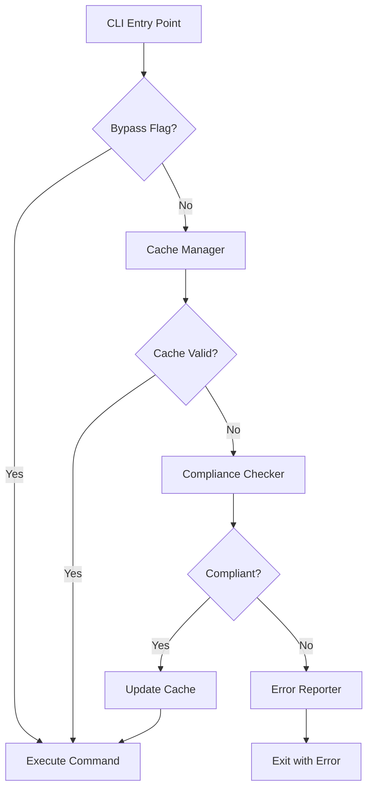

# Design Document

## Overview

The steering directory compliance check is a pre-execution validation system that ensures the `.sce/steering/` directory contains only approved files and no subdirectories. This prevents context pollution and excessive token consumption in AI sessions.

The design follows a layered approach:
1. **CLI Integration Layer**: Hooks into the main CLI entry point
2. **Compliance Checker**: Core validation logic
3. **Cache Manager**: Version-based check optimization
4. **Error Reporter**: User-friendly error messages

The system is designed to be fast (<50ms), non-intrusive when compliant, and helpful when violations are detected.

## Architecture



### Design Principles

1. **Fail-Safe**: Errors in the check itself should not block commands
2. **Performance**: Check must complete in <50ms
3. **User-Friendly**: Clear, actionable error messages
4. **Cacheable**: Avoid repeated checks for the same version
5. **Testable**: Each component independently testable

## Components and Interfaces

### 1. SteeringComplianceChecker

**Responsibility**: Core validation logic for steering directory compliance

**Interface**:
```javascript
class SteeringComplianceChecker {
  /**
   * Check if steering directory is compliant
   * @param {string} steeringPath - Path to steering directory
   * @returns {ComplianceResult} Result with status and violations
   */
  check(steeringPath)
  
  /**
   * Get list of allowed files
   * @returns {string[]} Array of allowed file names
   */
  getAllowedFiles()
}
```

**Methods**:
- `check(steeringPath)`: Main validation method
  - Returns `{ compliant: true }` if valid
  - Returns `{ compliant: false, violations: [...] }` if invalid
- `getAllowedFiles()`: Returns the allowlist

**Internal Logic**:
1. Check if directory exists (non-existence is compliant)
2. Read directory contents
3. Validate each entry against allowlist
4. Detect subdirectories
5. Collect all violations
6. Return result

### 2. ComplianceCache

**Responsibility**: Manage version-based check caching

**Interface**:
```javascript
class ComplianceCache {
  /**
   * Check if cache is valid for current version
   * @param {string} currentVersion - Current kse version
   * @returns {boolean} True if cache is valid
   */
  isValid(currentVersion)
  
  /**
   * Update cache with successful check
   * @param {string} version - kse version
   * @returns {boolean} True if update succeeded
   */
  update(version)
  
  /**
   * Clear the cache
   */
  clear()
}
```

**Cache File Location**: `~/.kse/steering-check-cache.json`

**Cache File Format**:
```json
{
  "version": "1.2.3",
  "timestamp": "2026-01-29T10:30:00.000Z",
  "lastCheck": "success"
}
```

**Methods**:
- `isValid(currentVersion)`: Compare cached version with current
- `update(version)`: Write new cache entry
- `clear()`: Remove cache file

### 3. ComplianceErrorReporter

**Responsibility**: Format and display compliance violations

**Interface**:
```javascript
class ComplianceErrorReporter {
  /**
   * Format compliance violations into user-friendly message
   * @param {ComplianceViolation[]} violations - List of violations
   * @returns {string} Formatted error message
   */
  formatError(violations)
  
  /**
   * Display error and exit
   * @param {ComplianceViolation[]} violations - List of violations
   */
  reportAndExit(violations)
}
```

**Error Message Format**:
```
❌ Steering Directory Compliance Check Failed

The .sce/steering/ directory contains files or subdirectories that are not allowed.
This directory is automatically loaded in every AI session, so keeping it clean is critical.

Violations Found:
  • Disallowed files:
    - analysis-report.md
    - temp-notes.txt
  • Subdirectories (not allowed):
    - archive/
    - old-rules/

Allowed Files:
  ✓ CORE_PRINCIPLES.md
  ✓ ENVIRONMENT.md
  ✓ CURRENT_CONTEXT.md
  ✓ RULES_GUIDE.md

Fix Suggestions:
  • Move analysis reports to: .sce/specs/{spec-name}/results/
  • Move historical data to: .sce/specs/{spec-name}/
  • Move detailed docs to: docs/
  • Delete temporary files

To bypass this check (not recommended):
  kse <command> --skip-steering-check
```

### 4. CLI Integration

**Responsibility**: Hook compliance check into command execution flow

**Integration Point**: Main CLI entry point (before command routing)

**Pseudocode**:
```javascript
async function main(argv) {
  // Parse flags
  const skipCheck = argv.includes('--skip-steering-check') || 
                    process.env.KSE_SKIP_STEERING_CHECK === '1';
  const forceCheck = argv.includes('--force-steering-check');
  
  // Run compliance check
  if (!skipCheck) {
    try {
      const checker = new SteeringComplianceChecker();
      const cache = new ComplianceCache();
      const reporter = new ComplianceErrorReporter();
      
      // Check cache unless forced
      if (!forceCheck && cache.isValid(getCurrentVersion())) {
        // Skip check, cache is valid
      } else {
        // Perform check
        const result = checker.check(getSteeringPath());
        
        if (!result.compliant) {
          reporter.reportAndExit(result.violations);
        }
        
        // Update cache on success
        cache.update(getCurrentVersion());
      }
    } catch (error) {
      // Log error but don't block execution
      console.warn('Warning: Steering compliance check failed:', error.message);
    }
  }
  
  // Continue with normal command execution
  await executeCommand(argv);
}
```

## Data Models

### ComplianceResult

```javascript
{
  compliant: boolean,
  violations: ComplianceViolation[]
}
```

### ComplianceViolation

```javascript
{
  type: 'disallowed_file' | 'subdirectory',
  name: string,
  path: string
}
```

### CacheEntry

```javascript
{
  version: string,      // kse version (e.g., "1.2.3")
  timestamp: string,    // ISO 8601 timestamp
  lastCheck: 'success'  // Status of last check
}
```

## Correctness Properties

*A property is a characteristic or behavior that should hold true across all valid executions of a system—essentially, a formal statement about what the system should do. Properties serve as the bridge between human-readable specifications and machine-verifiable correctness guarantees.*


### Property 1: Compliant Directories Allow Execution

*For any* steering directory containing only allowed files (CORE_PRINCIPLES.md, ENVIRONMENT.md, CURRENT_CONTEXT.md, RULES_GUIDE.md), the compliance check should pass and allow command execution to proceed.

**Validates: Requirements 1.2, 2.1**

### Property 2: Non-Compliant Directories Block Execution

*For any* steering directory containing disallowed files or subdirectories, the compliance check should fail and block command execution with a non-zero exit code.

**Validates: Requirements 1.3, 7.3**

### Property 3: Disallowed File Detection

*For any* file in the steering directory that is not in the allowlist, the compliance check should detect it and report it as a violation.

**Validates: Requirements 2.2**

### Property 4: Subdirectory Detection and Complete Reporting

*For any* set of subdirectories in the steering directory, the compliance check should detect all of them and include all their names in the violation report.

**Validates: Requirements 3.1, 3.2**

### Property 5: Multiple Violation Types Reported Together

*For any* steering directory containing both disallowed files and subdirectories, the compliance check should report both violation types in a single error message.

**Validates: Requirements 3.4**

### Property 6: Cache Creation on Success

*For any* successful compliance check, the system should create or update the cache file with the current kse version and timestamp.

**Validates: Requirements 4.1**

### Property 7: Cache Hit Skips Check

*For any* command execution where the cached version matches the current kse version, the compliance check should be skipped entirely.

**Validates: Requirements 4.2**

### Property 8: Cache Invalidation on Version Change

*For any* command execution where the cached version differs from the current kse version, the compliance check should run regardless of cache presence.

**Validates: Requirements 4.3**

### Property 9: Complete Violation Reporting

*For any* set of violations (disallowed files and subdirectories), all violation names should appear in the formatted error message.

**Validates: Requirements 5.1, 5.2**

### Property 10: Bypass Preserves Cache

*For any* command execution with bypass flags (--skip-steering-check or KSE_SKIP_STEERING_CHECK=1), the version cache should not be modified.

**Validates: Requirements 6.5**

### Property 11: Silent Operation When Compliant

*For any* compliant steering directory, the compliance check should not produce any output or modify the command's normal output.

**Validates: Requirements 7.5**

### Property 12: Cache Content Validation

*For any* cache file created by the system, it should contain exactly the required fields: version (string), timestamp (ISO 8601 string), and lastCheck (string).

**Validates: Requirements 8.4**

### Property 13: Cache Recovery

*For any* corrupted or invalid cache file, the system should perform a full compliance check and recreate the cache on success.

**Validates: Requirements 8.3**

### Property 14: Error Handling Resilience

*For any* unexpected error during the compliance check (file system errors, parsing errors, etc.), the system should log a warning and allow command execution to proceed without crashing.

**Validates: Requirements 9.2, 9.4, 9.5**

## Error Handling

### File System Errors

**Scenarios**:
- Steering directory not readable (permission denied)
- Cache directory not writable
- Disk full when writing cache

**Strategy**: Log warning and continue execution. The compliance check is a safety feature, not a blocker.

**Implementation**:
```javascript
try {
  // Perform compliance check
} catch (error) {
  if (error.code === 'EACCES' || error.code === 'ENOSPC') {
    console.warn(`Warning: Steering compliance check failed: ${error.message}`);
    console.warn('Continuing with command execution...');
    return; // Allow execution to proceed
  }
  throw error; // Re-throw unexpected errors
}
```

### Cache Errors

**Scenarios**:
- Cache file corrupted (invalid JSON)
- Cache file has unexpected format
- Cache file write fails

**Strategy**: Treat as cache miss and perform full check. If write fails, log warning but don't block.

**Implementation**:
```javascript
try {
  const cache = JSON.parse(fs.readFileSync(cachePath, 'utf8'));
  return cache.version === currentVersion;
} catch (error) {
  // Treat any cache read error as cache miss
  return false;
}
```

### Retry Logic for Specific Errors

**Target Error**: "The execution was not in an expected state at transition"

**Strategy**: Retry once with a small delay (100ms) before failing.

**Implementation**:
```javascript
async function checkWithRetry(steeringPath, maxRetries = 1) {
  for (let attempt = 0; attempt <= maxRetries; attempt++) {
    try {
      return await check(steeringPath);
    } catch (error) {
      if (error.message.includes('not in an expected state') && attempt < maxRetries) {
        await sleep(100);
        continue;
      }
      throw error;
    }
  }
}
```

### Non-Existent Directory

**Scenario**: `.sce/steering/` directory doesn't exist

**Strategy**: Treat as compliant. Users may not have created steering files yet.

**Implementation**:
```javascript
if (!fs.existsSync(steeringPath)) {
  return { compliant: true };
}
```

## Testing Strategy

### Dual Testing Approach

This feature requires both unit tests and property-based tests:

**Unit Tests**: Focus on specific examples, edge cases, and integration points
- Non-existent directory is compliant
- Empty directory is compliant
- Directory with only allowed files is compliant
- Directory with one disallowed file is non-compliant
- Directory with subdirectory is non-compliant
- Cache file creation and reading
- Bypass flags work correctly
- Error message formatting

**Property Tests**: Verify universal properties across all inputs
- Any directory with only allowed files passes (Property 1)
- Any directory with disallowed content fails (Property 2)
- All disallowed files are detected (Property 3)
- All subdirectories are detected and reported (Property 4)
- Cache behavior is consistent (Properties 6-8)
- Error handling never crashes (Property 14)

### Property-Based Testing Configuration

**Library**: fast-check (JavaScript property-based testing library)

**Configuration**:
- Minimum 100 iterations per property test
- Each test tagged with feature name and property number
- Tag format: `Feature: steering-directory-compliance-check, Property {N}: {description}`

**Example Property Test**:
```javascript
// Feature: steering-directory-compliance-check, Property 1: Compliant Directories Allow Execution
test('compliant directories allow execution', () => {
  fc.assert(
    fc.property(
      fc.subarray(ALLOWED_FILES), // Generate subsets of allowed files
      (files) => {
        const tempDir = createTempSteeringDir(files);
        const result = checker.check(tempDir);
        expect(result.compliant).toBe(true);
        cleanupTempDir(tempDir);
      }
    ),
    { numRuns: 100 }
  );
});
```

### Test Coverage Goals

- **Unit Test Coverage**: >90% line coverage for all components
- **Property Test Coverage**: All 14 correctness properties implemented
- **Integration Test Coverage**: CLI integration with real file system
- **Edge Case Coverage**: All edge cases from prework analysis

### Testing Phases

1. **Component Testing**: Test each class independently
   - SteeringComplianceChecker
   - ComplianceCache
   - ComplianceErrorReporter

2. **Integration Testing**: Test CLI integration
   - Check runs before command execution
   - Bypass flags work end-to-end
   - Cache persists across invocations

3. **Property Testing**: Verify universal properties
   - Run all 14 property tests
   - Ensure 100+ iterations each

4. **Edge Case Testing**: Test specific scenarios
   - Non-existent directory
   - Corrupted cache
   - File system errors
   - Retry logic for specific errors

## Implementation Notes

### Performance Considerations

**Target**: <50ms for compliance check

**Optimizations**:
1. **Synchronous File Operations**: Use `fs.readdirSync()` instead of async to avoid event loop overhead
2. **Early Exit**: Stop checking once first violation is found (optional, but may reduce clarity)
3. **Cache First**: Check cache before any file system operations
4. **Minimal Cache**: Store only version string, not full directory listing

**Measurement**:
```javascript
const start = Date.now();
const result = checker.check(steeringPath);
const duration = Date.now() - start;
if (duration > 50) {
  console.warn(`Compliance check took ${duration}ms (target: <50ms)`);
}
```

### Backward Compatibility

**First Release**: No existing cache files exist, so no migration needed

**Future Changes**: If cache format changes, include version field in cache:
```json
{
  "cacheVersion": 1,
  "version": "1.2.3",
  "timestamp": "2026-01-29T10:30:00.000Z"
}
```

### Security Considerations

**Path Traversal**: Ensure steering path is validated
```javascript
const steeringPath = path.resolve(projectRoot, '.sce/steering');
// Don't allow user-provided paths
```

**Cache Tampering**: Cache is advisory only, not security-critical. If user modifies cache, worst case is unnecessary check runs.

### Extensibility

**Future Enhancements**:
1. **Configurable Allowlist**: Allow projects to extend allowed files via config
2. **Warning Mode**: Option to warn instead of block
3. **Auto-Fix**: Offer to move disallowed files automatically
4. **Detailed Reporting**: Show file sizes, modification times in violations

**Design Accommodations**:
- Allowlist is centralized in `getAllowedFiles()` method
- Error reporter is separate component for easy customization
- Cache format includes `cacheVersion` for future migrations
