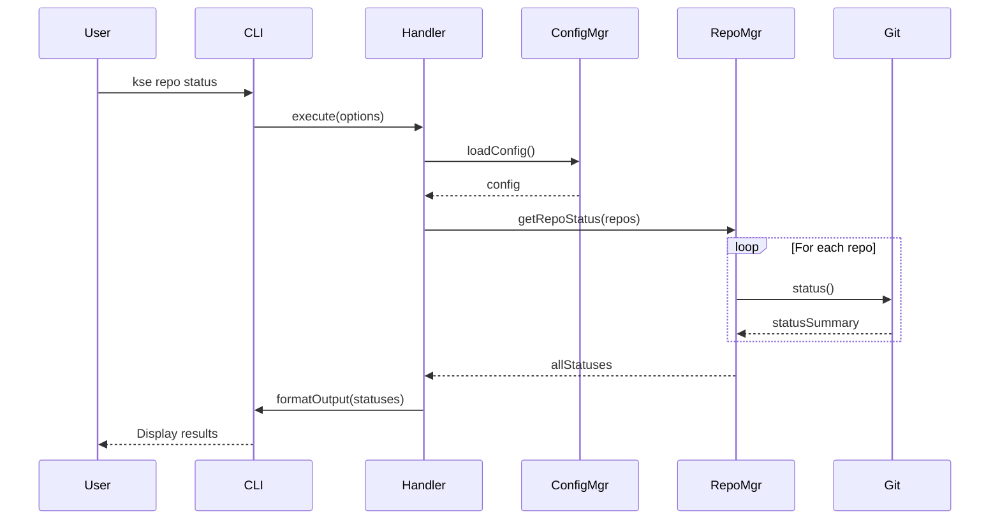

# Design Document: Multi-Repository Management

## Overview

The Multi-Repository Management feature extends KSE with capabilities to manage multiple Git subrepositories within a single project. The system provides a unified command-line interface for common operations like status checking, batch command execution, and health diagnostics across all configured repositories.

The design follows a modular architecture with clear separation between configuration management, Git operations, and command-line interface layers. It leverages the `simple-git` library for reliable cross-platform Git operations and implements robust error handling to ensure graceful degradation when individual repositories encounter issues.

## Architecture

### High-Level Architecture

```
┌─────────────────────────────────────────────────────────────┐
│                     CLI Layer (Commander)                    │
│  kse repo init | status | exec | health                     │
└────────────────────────┬────────────────────────────────────┘
                         │
┌────────────────────────▼────────────────────────────────────┐
│                  Command Handlers Layer                      │
│  InitHandler | StatusHandler | ExecHandler | HealthHandler  │
└────────────────────────┬────────────────────────────────────┘
                         │
┌────────────────────────▼────────────────────────────────────┐
│                   Core Services Layer                        │
│  ConfigManager | RepoManager | GitOperations                │
└────────────────────────┬────────────────────────────────────┘
                         │
┌────────────────────────▼────────────────────────────────────┐
│                   Infrastructure Layer                       │
│  FileSystem | simple-git | PathResolver                     │
└─────────────────────────────────────────────────────────────┘
```

### Component Interaction Flow



## Components and Interfaces

### 1. Configuration Manager (`lib/repo/config-manager.js`)

Manages the project-repos.json configuration file with validation and persistence.

```javascript
class ConfigManager {
  /**
   * Load and validate configuration from disk
   * @returns {Promise<ProjectConfig>}
   * @throws {ConfigError} if file is missing or invalid
   */
  async loadConfig()

  /**
   * Save configuration to disk
   * @param {ProjectConfig} config
   * @returns {Promise<void>}
   */
  async saveConfig(config)

  /**
   * Validate configuration structure and content
   * @param {ProjectConfig} config
   * @returns {ValidationResult}
   */
  validateConfig(config)

  /**
   * Check if configuration file exists
   * @returns {boolean}
   */
  configExists()

  /**
   * Get the configuration file path
   * @returns {string}
   */
  getConfigPath()
}
```

### 2. Repository Manager (`lib/repo/repo-manager.js`)

Orchestrates operations across multiple repositories using simple-git.

```javascript
class RepoManager {
  /**
   * Scan directory for Git repositories
   * @param {string} rootPath
   * @param {ScanOptions} options
   * @returns {Promise<DiscoveredRepo[]>}
   */
  async discoverRepositories(rootPath, options)

  /**
   * Get status for a single repository
   * @param {RepoConfig} repo
   * @returns {Promise<RepoStatus>}
   */
  async getRepoStatus(repo)

  /**
   * Get status for all repositories
   * @param {RepoConfig[]} repos
   * @returns {Promise<RepoStatus[]>}
   */
  async getAllRepoStatuses(repos)

  /**
   * Execute command in a repository
   * @param {RepoConfig} repo
   * @param {string} command
   * @returns {Promise<ExecResult>}
   */
  async execInRepo(repo, command)

  /**
   * Execute command in all repositories
   * @param {RepoConfig[]} repos
   * @param {string} command
   * @returns {Promise<ExecResult[]>}
   */
  async execInAllRepos(repos, command)

  /**
   * Perform health check on a repository
   * @param {RepoConfig} repo
   * @returns {Promise<HealthCheckResult>}
   */
  async checkRepoHealth(repo)

  /**
   * Perform health check on all repositories
   * @param {RepoConfig[]} repos
   * @returns {Promise<HealthCheckResult[]>}
   */
  async checkAllReposHealth(repos)
}
```

### 3. Git Operations (`lib/repo/git-operations.js`)

Low-level Git operations wrapper around simple-git.

```javascript
class GitOperations {
  /**
   * Create a simple-git instance for a repository
   * @param {string} repoPath
   * @returns {SimpleGit}
   */
  createGitInstance(repoPath)

  /**
   * Check if path is a valid Git repository
   * @param {string} path
   * @returns {Promise<boolean>}
   */
  async isGitRepo(path)

  /**
   * Get repository status
   * @param {string} repoPath
   * @returns {Promise<StatusSummary>}
   */
  async getStatus(repoPath)

  /**
   * Get current branch name
   * @param {string} repoPath
   * @returns {Promise<string>}
   */
  async getCurrentBranch(repoPath)

  /**
   * Get remote URL
   * @param {string} repoPath
   * @param {string} remoteName
   * @returns {Promise<string|null>}
   */
  async getRemoteUrl(repoPath, remoteName)

  /**
   * Get all remotes
   * @param {string} repoPath
   * @returns {Promise<Remote[]>}
   */
  async getRemotes(repoPath)

  /**
   * Check if remote is reachable
   * @param {string} repoPath
   * @param {string} remoteName
   * @returns {Promise<boolean>}
   */
  async isRemoteReachable(repoPath, remoteName)

  /**
   * Execute raw Git command
   * @param {string} repoPath
   * @param {string[]} args
   * @returns {Promise<string>}
   */
  async execRaw(repoPath, args)
}
```

### 4. Command Handlers

Each command has a dedicated handler that implements the business logic.

#### Init Handler (`lib/repo/handlers/init-handler.js`)

```javascript
class InitHandler {
  /**
   * Execute repository initialization
   * @param {InitOptions} options
   * @returns {Promise<InitResult>}
   */
  async execute(options)

  /**
   * Prompt user for confirmation if config exists
   * @returns {Promise<boolean>}
   */
  async confirmOverwrite()

  /**
   * Display initialization summary
   * @param {InitResult} result
   */
  displaySummary(result)
}
```

#### Status Handler (`lib/repo/handlers/status-handler.js`)

```javascript
class StatusHandler {
  /**
   * Execute status command
   * @param {StatusOptions} options
   * @returns {Promise<void>}
   */
  async execute(options)

  /**
   * Format status output as table
   * @param {RepoStatus[]} statuses
   * @returns {string}
   */
  formatStatusTable(statuses)

  /**
   * Format verbose status output
   * @param {RepoStatus[]} statuses
   * @returns {string}
   */
  formatVerboseStatus(statuses)
}
```

#### Exec Handler (`lib/repo/handlers/exec-handler.js`)

```javascript
class ExecHandler {
  /**
   * Execute command across repositories
   * @param {string} command
   * @param {ExecOptions} options
   * @returns {Promise<void>}
   */
  async execute(command, options)

  /**
   * Display execution results
   * @param {ExecResult[]} results
   */
  displayResults(results)

  /**
   * Display execution summary
   * @param {ExecResult[]} results
   */
  displaySummary(results)
}
```

#### Health Handler (`lib/repo/handlers/health-handler.js`)

```javascript
class HealthHandler {
  /**
   * Execute health check
   * @param {HealthOptions} options
   * @returns {Promise<void>}
   */
  async execute(options)

  /**
   * Display health check results
   * @param {HealthCheckResult[]} results
   */
  displayResults(results)

  /**
   * Display health summary
   * @param {HealthCheckResult[]} results
   */
  displaySummary(results)
}
```

### 5. Path Resolver (`lib/repo/path-resolver.js`)

Handles cross-platform path resolution and validation.

```javascript
class PathResolver {
  /**
   * Resolve repository path relative to project root
   * @param {string} repoPath
   * @param {string} projectRoot
   * @returns {string}
   */
  resolvePath(repoPath, projectRoot)

  /**
   * Normalize path to use forward slashes
   * @param {string} path
   * @returns {string}
   */
  normalizePath(path)

  /**
   * Check if path is absolute
   * @param {string} path
   * @returns {boolean}
   */
  isAbsolute(path)

  /**
   * Convert absolute path to relative
   * @param {string} absolutePath
   * @param {string} basePath
   * @returns {string}
   */
  toRelative(absolutePath, basePath)

  /**
   * Validate that paths don't overlap
   * @param {string[]} paths
   * @returns {ValidationResult}
   */
  validateNoOverlap(paths)
}
```

### 6. Output Formatter (`lib/repo/output-formatter.js`)

Provides consistent formatting for command output.

```javascript
class OutputFormatter {
  /**
   * Format data as table
   * @param {Object[]} data
   * @param {TableOptions} options
   * @returns {string}
   */
  formatTable(data, options)

  /**
   * Format success message
   * @param {string} message
   * @returns {string}
   */
  success(message)

  /**
   * Format error message
   * @param {string} message
   * @returns {string}
   */
  error(message)

  /**
   * Format warning message
   * @param {string} message
   * @returns {string}
   */
  warning(message)

  /**
   * Format info message
   * @param {string} message
   * @returns {string}
   */
  info(message)

  /**
   * Create progress indicator
   * @param {string} message
   * @returns {ProgressIndicator}
   */
  createProgress(message)
}
```

## Data Models

### ProjectConfig

```javascript
{
  "version": "1.0",
  "repositories": [
    {
      "name": "string",           // Unique repository identifier
      "path": "string",           // Relative or absolute path
      "remote": "string|null",    // Remote URL (null if no remote)
      "defaultBranch": "string",  // Default branch name
      "description": "string",    // Optional description
      "tags": ["string"],         // Optional tags for grouping
      "group": "string"           // Optional group name
    }
  ],
  "groups": {                     // Optional group definitions
    "groupName": {
      "description": "string",
      "color": "string"
    }
  },
  "settings": {                   // Optional global settings
    "defaultRemote": "origin",
    "scanDepth": 3
  }
}
```

### RepoStatus

```javascript
{
  "name": "string",
  "path": "string",
  "branch": "string",
  "isClean": "boolean",
  "modified": "number",
  "added": "number",
  "deleted": "number",
  "ahead": "number",
  "behind": "number",
  "error": "string|null"
}
```

### ExecResult

```javascript
{
  "name": "string",
  "path": "string",
  "command": "string",
  "success": "boolean",
  "output": "string",
  "error": "string|null",
  "exitCode": "number"
}
```

### HealthCheckResult

```javascript
{
  "name": "string",
  "path": "string",
  "checks": {
    "pathExists": "boolean",
    "isGitRepo": "boolean",
    "remoteReachable": "boolean",
    "branchExists": "boolean"
  },
  "errors": ["string"],
  "warnings": ["string"],
  "healthy": "boolean"
}
```

### DiscoveredRepo

```javascript
{
  "path": "string",
  "name": "string",
  "remote": "string|null",
  "branch": "string",
  "hasRemote": "boolean"
}
```

## Correctness Properties

*A property is a characteristic or behavior that should hold true across all valid executions of a system—essentially, a formal statement about what the system should do. Properties serve as the bridge between human-readable specifications and machine-verifiable correctness guarantees.*


### Property 1: Configuration Structure Completeness
*For any* created configuration, all required fields (name, path, remote, defaultBranch) must be present for each repository entry, and optional fields (description, tags, group) must be preserved when provided.
**Validates: Requirements 1.2, 10.3, 10.4, 10.5**

### Property 2: Path Resolution Consistency
*For any* repository path (relative or absolute), the resolved path must be consistent, platform-independent, and normalized to use forward slashes, with relative paths correctly resolved against the project root.
**Validates: Requirements 1.4, 1.5, 8.1, 8.6, 8.8**

### Property 3: Path Validation
*For any* specified repository path, validation must correctly identify whether the path exists and contains a valid Git repository, rejecting invalid paths with descriptive errors.
**Validates: Requirements 1.3**

### Property 4: Configuration Validation Completeness
*For any* configuration file, validation must detect and report all errors including: invalid JSON, missing required fields, invalid characters in names, duplicate names, duplicate paths, overlapping paths, and unsupported schema versions.
**Validates: Requirements 1.6, 6.1, 6.2, 6.3, 6.4, 6.5, 6.6, 6.7, 10.7**

### Property 5: Repository Discovery Completeness
*For any* project directory structure, scanning must discover all Git repositories (excluding .sce), correctly extracting their remote URLs and current branches.
**Validates: Requirements 2.1, 2.2**

### Property 6: Status Reporting Accuracy
*For any* repository, the status report must accurately reflect the current branch, number of modified/added/deleted files, commits ahead/behind remote, and error state for inaccessible repositories.
**Validates: Requirements 3.1, 3.2, 3.3, 3.4, 3.6**

### Property 7: Command Execution Across Repositories
*For any* valid Git command and set of repositories, the command must be executed in each repository sequentially, with failures in individual repositories not preventing execution in remaining repositories.
**Validates: Requirements 4.1, 4.3, 4.6**

### Property 8: Execution Summary Accuracy
*For any* batch command execution, the summary must accurately count successes and failures, and preserve exit codes from failed commands.
**Validates: Requirements 4.5, 4.8**

### Property 9: Health Check Completeness
*For any* repository, health checks must verify path existence, Git repository validity, and default branch existence, providing specific error messages for each failure type.
**Validates: Requirements 5.1, 5.2, 5.4, 5.5**

### Property 10: Error Handling and Continuation
*For any* operation encountering errors in individual repositories, the system must capture Git error messages, log detailed error information, continue processing remaining repositories, and provide a consolidated error summary.
**Validates: Requirements 7.1, 7.2, 7.6, 7.7**

### Property 11: Configuration Round-Trip Consistency
*For any* valid configuration, saving and then loading the configuration must produce an equivalent configuration object with all data preserved.
**Validates: Requirements 1.1, 10.1**

## Error Handling

### Error Categories

1. **Configuration Errors**
   - Missing configuration file → Suggest running `kse repo init`
   - Invalid JSON → Display JSON parse error with line number
   - Schema validation failure → Display all validation errors with suggestions
   - Unsupported version → Display upgrade instructions

2. **Repository Errors**
   - Path not found → Display path and suggest checking configuration
   - Not a Git repository → Display path and suggest initialization
   - Remote unreachable → Display network error and suggest checking connectivity
   - Branch not found → Display branch name and suggest checking configuration

3. **Git Operation Errors**
   - Command execution failure → Display Git error message and exit code
   - Permission denied → Display permission error and suggest checking file permissions
   - Merge conflicts → Display conflict information and suggest manual resolution
   - Network timeout → Display timeout error and suggest retrying

4. **System Errors**
   - File system errors → Display system error and suggest checking permissions
   - Process spawn errors → Display error and suggest checking Git installation
   - Out of memory → Display error and suggest reducing batch size

### Error Handling Strategy

1. **Fail Fast for Configuration**: Invalid configuration stops execution immediately
2. **Fail Soft for Repositories**: Errors in individual repositories don't stop batch operations
3. **Error Aggregation**: Collect all errors and display consolidated summary
4. **Actionable Messages**: Every error includes suggestion for resolution
5. **Detailed Logging**: All errors logged with full context for debugging

### Error Recovery

1. **Retry Logic**: Network operations retry up to 3 times with exponential backoff
2. **Partial Success**: Batch operations report partial success with detailed breakdown
3. **Rollback**: Configuration changes can be rolled back on validation failure
4. **Graceful Degradation**: Missing optional features don't prevent core functionality

## Testing Strategy

### Dual Testing Approach

The testing strategy employs both unit tests and property-based tests to ensure comprehensive coverage:

- **Unit tests**: Verify specific examples, edge cases, and error conditions
- **Property tests**: Verify universal properties across all inputs
- Both approaches are complementary and necessary for production-quality code

### Unit Testing Focus

Unit tests should focus on:
- Specific examples that demonstrate correct behavior (e.g., init with 3 repos)
- Integration points between components (e.g., ConfigManager ↔ RepoManager)
- Edge cases (e.g., repos without remotes, Windows drive letters)
- Error conditions (e.g., invalid JSON, missing files)

Avoid writing too many unit tests for scenarios that property tests can cover through randomization.

### Property-Based Testing Configuration

- **Library**: Use `fast-check` for JavaScript property-based testing
- **Iterations**: Minimum 100 iterations per property test
- **Tagging**: Each property test must reference its design document property
- **Tag format**: `// Feature: multi-repo-management, Property {number}: {property_text}`

### Test Coverage Requirements

1. **Configuration Management**
   - Property tests for validation rules (Property 4)
   - Property tests for path resolution (Property 2, 3)
   - Property tests for round-trip consistency (Property 11)
   - Unit tests for specific validation scenarios
   - Unit tests for error message quality

2. **Repository Discovery**
   - Property tests for discovery completeness (Property 5)
   - Unit tests for .sce exclusion
   - Unit tests for remote selection logic
   - Unit tests for edge cases (no remotes, multiple remotes)

3. **Status Reporting**
   - Property tests for status accuracy (Property 6)
   - Unit tests for clean state detection
   - Unit tests for verbose output
   - Unit tests for error handling

4. **Command Execution**
   - Property tests for execution across repos (Property 7)
   - Property tests for summary accuracy (Property 8)
   - Unit tests for dry-run mode
   - Unit tests for command parsing
   - Unit tests for output formatting

5. **Health Checks**
   - Property tests for check completeness (Property 9)
   - Unit tests for specific check types
   - Unit tests for error message quality

6. **Error Handling**
   - Property tests for error handling (Property 10)
   - Unit tests for each error category
   - Unit tests for error recovery mechanisms

7. **Cross-Platform Compatibility**
   - Unit tests for Windows path handling
   - Unit tests for Unix path handling
   - Unit tests for path normalization
   - Integration tests on multiple platforms

### Test Data Generation

For property-based tests, use generators for:
- Repository configurations (valid and invalid)
- File system paths (absolute, relative, nested)
- Git repository states (clean, dirty, ahead, behind)
- Git commands (valid and invalid)
- Error scenarios (missing files, invalid JSON, network failures)

### Integration Testing

Integration tests should verify:
- End-to-end workflows (init → status → exec → health)
- Interaction with real Git repositories
- File system operations
- Configuration persistence
- Error recovery across components

### Performance Testing

Performance tests should verify:
- Scanning performance with large directory trees
- Batch operation performance with many repositories
- Memory usage with large configurations
- Concurrent operation handling

## Implementation Notes

### Dependencies

- **simple-git**: Git operations wrapper (already used in KSE)
- **commander**: CLI framework (already used in KSE)
- **chalk**: Terminal colors (already used in KSE)
- **cli-table3**: Table formatting
- **fast-check**: Property-based testing

### File Structure

```
lib/repo/
├── config-manager.js
├── repo-manager.js
├── git-operations.js
├── path-resolver.js
├── output-formatter.js
├── handlers/
│   ├── init-handler.js
│   ├── status-handler.js
│   ├── exec-handler.js
│   └── health-handler.js
└── errors/
    ├── config-error.js
    ├── repo-error.js
    └── git-error.js

tests/unit/repo/
├── config-manager.test.js
├── repo-manager.test.js
├── git-operations.test.js
├── path-resolver.test.js
├── handlers/
│   ├── init-handler.test.js
│   ├── status-handler.test.js
│   ├── exec-handler.test.js
│   └── health-handler.test.js
└── properties/
    ├── config-properties.test.js
    ├── path-properties.test.js
    ├── status-properties.test.js
    ├── exec-properties.test.js
    └── health-properties.test.js
```

### Configuration Schema

The configuration file should be validated against a JSON schema to ensure consistency and provide better error messages. The schema should be versioned to support future evolution.

### Backward Compatibility

- Version 1.0 is the initial format
- Future versions must support migration from previous versions
- Unsupported versions should display clear upgrade instructions
- Configuration validation should check version compatibility

### Security Considerations

1. **Path Traversal**: Validate that repository paths don't escape project root
2. **Command Injection**: Sanitize Git commands to prevent injection attacks
3. **File Permissions**: Respect file system permissions and handle errors gracefully
4. **Remote URLs**: Validate remote URLs to prevent malicious repositories

### Performance Optimizations

1. **Parallel Operations**: Consider parallel execution for independent operations
2. **Caching**: Cache Git repository information to reduce repeated operations
3. **Lazy Loading**: Load repository information only when needed
4. **Progress Reporting**: Provide progress feedback for long-running operations

### Future Enhancements (Phase 2)

1. **Branch Management**
   - `kse repo branch create <name>` - Create branch in all repos
   - `kse repo branch checkout <name>` - Checkout branch in all repos
   - `kse repo branch delete <name>` - Delete branch in all repos

2. **Tag Management**
   - `kse repo tag create <name>` - Create tag in all repos
   - `kse repo tag push` - Push tags to all remotes

3. **Bulk Operations**
   - `kse repo push --all` - Push all repos
   - `kse repo pull --all` - Pull all repos
   - `kse repo fetch --all` - Fetch all repos

4. **Advanced Filtering**
   - Filter operations by group
   - Filter operations by tag
   - Filter operations by status

5. **Reporting**
   - Generate HTML reports
   - Export status to JSON/CSV
   - Integration with CI/CD systems
