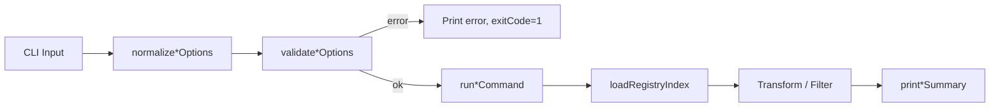

# Design Document: Scene Registry Query

## Overview

This feature adds two read-only CLI commands (`scene list` and `scene search`) for querying the local scene package registry. Both commands follow the established normalize → validate → run → print pattern and reuse the existing `loadRegistryIndex` function. The implementation lives entirely in `lib/commands/scene.js` with tests in `tests/unit/commands/scene.test.js`.

## Architecture

Both commands share a common flow:



The `scene list` command loads the registry index and transforms all package entries into a display payload. The `scene search` command does the same but applies a case-insensitive substring filter across name, description, and group fields before building the payload.

## Components and Interfaces

### scene list

```javascript
// Normalize raw CLI options into a clean options object
function normalizeSceneListOptions(options = {}) {
  return {
    registry: options.registry ? String(options.registry).trim() : '.sce/registry',
    json: options.json === true
  };
}

// Validate normalized options. Returns error string or null.
function validateSceneListOptions(options) {
  return null; // No required options
}

// Build list payload from registry index
// Returns { packages: [...], total: number } or null on error
async function runSceneListCommand(rawOptions = {}, dependencies = {}) { ... }

// Print human-readable table or JSON
function printSceneListSummary(options, payload, projectRoot = process.cwd()) { ... }
```

### scene search

```javascript
// Normalize raw CLI options into a clean options object
function normalizeSceneSearchOptions(options = {}) {
  return {
    query: options.query ? String(options.query).trim() : '',
    registry: options.registry ? String(options.registry).trim() : '.sce/registry',
    json: options.json === true
  };
}

// Validate normalized options. Returns error string or null.
function validateSceneSearchOptions(options) {
  return null; // Empty query is valid (returns all)
}

// Build search payload from registry index filtered by query
// Returns { query: string, packages: [...], total: number } or null on error
async function runSceneSearchCommand(rawOptions = {}, dependencies = {}) { ... }

// Print human-readable table or JSON
function printSceneSearchSummary(options, payload, projectRoot = process.cwd()) { ... }
```

### Shared Helper

```javascript
// Convert a registry index packages object into a sorted array of display records
function buildRegistryPackageList(registryPackages) {
  return Object.values(registryPackages || {})
    .map(pkg => ({
      name: pkg.name || '',
      group: pkg.group || '',
      description: pkg.description || '',
      latest: pkg.latest || '',
      version_count: Object.keys(pkg.versions || {}).length
    }))
    .sort((a, b) => a.name.localeCompare(b.name));
}

// Filter package list by case-insensitive substring match on name, description, group
function filterRegistryPackages(packageList, query) {
  if (!query) return packageList;
  const lowerQuery = query.toLowerCase();
  return packageList.filter(pkg =>
    pkg.name.toLowerCase().includes(lowerQuery) ||
    pkg.description.toLowerCase().includes(lowerQuery) ||
    pkg.group.toLowerCase().includes(lowerQuery)
  );
}
```

### Command Registration

Two new subcommands added to `registerSceneCommands`:

```javascript
sceneCmd
  .command('list')
  .description('List all packages in the local scene registry')
  .option('-r, --registry <path>', 'Registry root directory', '.sce/registry')
  .option('--json', 'Print result as JSON')
  .action(async (options) => {
    await runSceneListCommand(options);
  });

sceneCmd
  .command('search')
  .description('Search packages in the local scene registry')
  .requiredOption('-q, --query <term>', 'Search term (substring match on name, description, group)')
  .option('-r, --registry <path>', 'Registry root directory', '.sce/registry')
  .option('--json', 'Print result as JSON')
  .action(async (options) => {
    await runSceneSearchCommand(options);
  });
```

Note: `search` uses `requiredOption` for `--query` at the CLI level, but the `runSceneSearchCommand` function itself treats empty query as "list all" when called programmatically.

## Data Models

### List Payload

```javascript
{
  packages: [
    {
      name: 'my-package',
      group: 'kse.scene',
      description: 'A scene package',
      latest: '1.2.0',
      version_count: 2
    }
  ],
  total: 1
}
```

### Search Payload

```javascript
{
  query: 'my-pack',
  packages: [
    {
      name: 'my-package',
      group: 'kse.scene',
      description: 'A scene package',
      latest: '1.2.0',
      version_count: 2
    }
  ],
  total: 1
}
```

### Human-Readable Output (List)

```
Scene Registry (2 packages)
  Name              Latest   Versions  Description
  my-package        1.2.0    2         A scene package
  other-package     0.1.0    1         Another package
```

### Human-Readable Output (Search)

```
Scene Search: "my-pack" (1 match)
  Name              Latest   Versions  Description
  my-package        1.2.0    2         A scene package
```

### Empty States

```
No packages found
```

```
No packages matching 'nonexistent'
```


## Correctness Properties

*A property is a characteristic or behavior that should hold true across all valid executions of a system — essentially, a formal statement about what the system should do. Properties serve as the bridge between human-readable specifications and machine-verifiable correctness guarantees.*

### Property 1: Package list preserves all entries

*For any* registry index containing N package entries, `buildRegistryPackageList` shall produce an array of exactly N records, each containing the correct name, latest version, version_count, and description from the source entry.

**Validates: Requirements 1.2**

### Property 2: Search filter completeness

*For any* package list and any search term, if a package's name, description, or group contains the search term as a case-insensitive substring, then `filterRegistryPackages` shall include that package in the result.

**Validates: Requirements 2.2, 2.3, 2.4**

### Property 3: Empty query returns all packages

*For any* package list, calling `filterRegistryPackages` with an empty string shall return a list equal in length and content to the original list.

**Validates: Requirements 2.6**

### Property 4: JSON output round-trip

*For any* list or search payload, serializing it with `JSON.stringify` and parsing it back with `JSON.parse` shall produce an object deeply equal to the original payload.

**Validates: Requirements 1.4, 2.7**

## Error Handling

| Scenario | Behavior |
|---|---|
| `loadRegistryIndex` throws (missing file, corrupt JSON) | Print error message via `console.error`, set `process.exitCode = 1`, return `null` |
| Registry index has empty `packages` object | List: show "No packages found". Search: show "No packages matching '...'" |
| Package entry missing optional fields (description, group) | Default to empty string — no crash |

Error handling follows the same try/catch pattern used by `runSceneInstallCommand` and `runScenePackageRegistryPublishCommand`.

## Testing Strategy

### Property-Based Tests (fast-check)

Each correctness property maps to one property-based test with minimum 100 iterations.

| Property | Generator | Assertion |
|---|---|---|
| P1: Package list preserves all entries | Random registry index (1–20 packages, random names/versions) | Output length equals input length; all fields match |
| P2: Search filter completeness | Random package list + random query substring extracted from a random field | Matching package appears in filtered results |
| P3: Empty query returns all | Random package list | `filterRegistryPackages(list, '')` equals `list` |
| P4: JSON round-trip | Random payload object | `JSON.parse(JSON.stringify(payload))` deep-equals `payload` |

Tag format: `Feature: scene-registry-query, Property N: <title>`

### Unit Tests (Jest)

Unit tests cover specific examples and edge cases:

- `normalizeSceneListOptions` defaults and overrides
- `normalizeSceneSearchOptions` defaults and overrides
- `validateSceneListOptions` returns null
- `validateSceneSearchOptions` returns null
- `buildRegistryPackageList` with empty packages object
- `buildRegistryPackageList` sorts by name
- `filterRegistryPackages` case-insensitive matching
- `filterRegistryPackages` no matches
- `printSceneListSummary` human-readable output format
- `printSceneListSummary` JSON output
- `printSceneSearchSummary` human-readable with matches
- `printSceneSearchSummary` "No packages matching" message
- `runSceneListCommand` error handling (loadRegistryIndex throws)
- `runSceneSearchCommand` error handling (loadRegistryIndex throws)
- `runSceneListCommand` integration with mock fileSystem
- `runSceneSearchCommand` integration with mock fileSystem

### PBT Library

- Library: `fast-check` (already in devDependencies)
- Minimum iterations: 100 per property
- All tests in `tests/unit/commands/scene.test.js`
