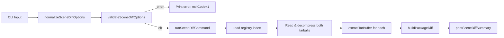

# Design Document: Scene Diff

## Overview

Adds `kse scene diff` command to compare two versions of a scene package in the local registry. Extracts tarballs, computes file-level diffs, and displays results. Follows normalize → validate → run → print pattern. All code in `lib/commands/scene.js`.

## Architecture



## Components

### normalizeSceneDiffOptions

```javascript
function normalizeSceneDiffOptions(options = {}) {
  return {
    name: options.name ? String(options.name).trim() : undefined,
    from: options.from ? String(options.from).trim() : undefined,
    to: options.to ? String(options.to).trim() : undefined,
    registry: options.registry ? String(options.registry).trim() : '.sce/registry',
    json: options.json === true,
    stat: options.stat === true
  };
}
```

### validateSceneDiffOptions

```javascript
function validateSceneDiffOptions(options) {
  if (!options.name) return '--name is required';
  if (!options.from) return '--from is required';
  if (!options.to) return '--to is required';
  if (options.from === options.to) return '--from and --to must be different versions';
  return null;
}
```

### buildPackageDiff

```javascript
function buildPackageDiff(fromFiles, toFiles) {
  // fromFiles/toFiles: Array<{ relativePath, content: Buffer }>
  // Returns: { added: [...], removed: [...], modified: [...], unchanged: [...] }
}
```

Compares file lists by relativePath. For modified files, computes changed line count by splitting content as UTF-8 and comparing lines.

### runSceneDiffCommand

1. Load registry index
2. Verify package and both versions exist
3. Read tarball files from registry paths
4. Decompress with `zlib.gunzipSync`
5. Extract with `extractTarBuffer`
6. Call `buildPackageDiff`
7. Build payload and call `printSceneDiffSummary`

### printSceneDiffSummary

Human-readable mode shows summary counts and file list with `+`/`-`/`~` prefixes.
JSON mode outputs structured payload.
Stat mode shows only counts and file names.

## Data Models

### Diff Payload

```javascript
{
  success: true,
  name: "my-package",
  fromVersion: "1.0.0",
  toVersion: "2.0.0",
  summary: { added: 2, removed: 1, modified: 3, unchanged: 5 },
  files: {
    added: ["new-file.js"],
    removed: ["old-file.js"],
    modified: [{ path: "scene-package.json", changedLines: 3 }],
    unchanged: ["config.yaml"]
  }
}
```

## Correctness Properties

### Property 1: Diff symmetry

*For any* two file sets A and B, files added in diff(A,B) equal files removed in diff(B,A), and vice versa.

**Validates: Requirements 2.1**

### Property 2: Diff completeness

*For any* two file sets, the total count of added + removed + modified + unchanged equals the union of all unique file paths.

**Validates: Requirements 2.1**

## Testing Strategy

- Property tests use `fast-check` with minimum 100 iterations
- Unit tests cover normalize, validate, buildPackageDiff, print functions
- All tests in `tests/unit/commands/scene.test.js`
- PBT library: `fast-check`
