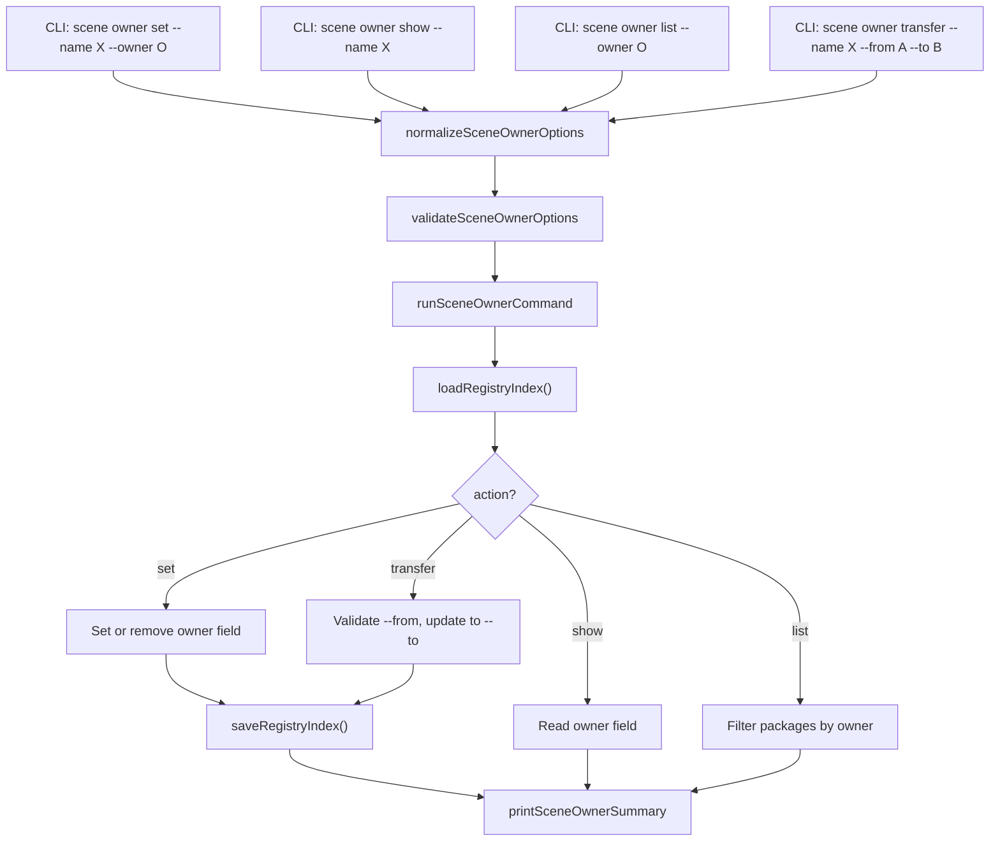

# Design Document: Scene Owner

## Overview

Adds a `kse scene owner` subcommand group to manage package ownership metadata in the local scene package registry. The group contains four sub-subcommands: `set`, `show`, `list`, and `transfer`. Each operates on the `owner` string field of package entries in `registry-index.json`. Follows the normalize → validate → run → print pattern. All code in `lib/commands/scene.js`. No new dependencies.

Since all four sub-subcommands share the same registry loading, option normalization, and output formatting patterns, the design consolidates them into a single `runSceneOwnerCommand` dispatcher that delegates to action-specific logic based on the `action` field. This reduces code duplication while maintaining the established pattern.

## Architecture



## Components and Interfaces

### normalizeSceneOwnerOptions

```javascript
function normalizeSceneOwnerOptions(options = {}) {
  return {
    action: options.action ? String(options.action).trim() : undefined,
    name: options.name ? String(options.name).trim() : undefined,
    owner: options.owner !== undefined ? String(options.owner).trim() : undefined,
    from: options.from ? String(options.from).trim() : undefined,
    to: options.to ? String(options.to).trim() : undefined,
    remove: options.remove === true,
    registry: options.registry ? String(options.registry).trim() : '.sce/registry',
    json: options.json === true
  };
}
```

### validateSceneOwnerOptions

```javascript
function validateSceneOwnerOptions(options) {
  if (!options.action) return '--action is required';
  const validActions = ['set', 'show', 'list', 'transfer'];
  if (!validActions.includes(options.action)) return `invalid action "${options.action}"`;

  if (options.action === 'set') {
    if (!options.name) return '--name is required';
    if (options.owner === undefined && !options.remove) return '--owner or --remove is required';
  }
  if (options.action === 'show') {
    if (!options.name) return '--name is required';
  }
  if (options.action === 'list') {
    if (options.owner === undefined) return '--owner is required';
  }
  if (options.action === 'transfer') {
    if (!options.name) return '--name is required';
    if (!options.from) return '--from is required';
    if (!options.to) return '--to is required';
  }
  return null;
}
```

### runSceneOwnerCommand

Core logic:
1. Normalize and validate options
2. Load registry index via `loadRegistryIndex`
3. Dispatch to action-specific logic:
   - **set**: Resolve package (error if not found). If `--remove` or `--owner ""`, delete `owner` field. Otherwise set `owner = value`. Save index.
   - **show**: Resolve package (error if not found). Read `owner` field.
   - **list**: Iterate all packages, collect those whose `owner` matches `--owner` (case-insensitive).
   - **transfer**: Resolve package (error if not found). Verify current `owner` matches `--from` (case-insensitive). If no owner set, error. If mismatch, error. Set `owner = --to`. Save index.
4. Build payload and print

```javascript
async function runSceneOwnerCommand(rawOptions = {}, dependencies = {}) {
  // normalize → validate → load → dispatch → save (if mutating) → print
}
```

### printSceneOwnerSummary

Human-readable output varies by action:
- **set**: Shows package name, owner set/removed, new value
- **show**: Shows package name and current owner (or "no owner set")
- **list**: Shows owner name and list of matching packages
- **transfer**: Shows package name, from, to

JSON mode outputs the full payload for all actions.

```javascript
function printSceneOwnerSummary(options, payload) {
  if (options.json) {
    console.log(JSON.stringify(payload, null, 2));
    return;
  }
  // Human-readable output based on payload.action
}
```

### CLI Registration

Register `scene owner` as a commander subcommand group with four sub-subcommands:

```javascript
const ownerCmd = sceneCmd
  .command('owner')
  .description('Manage package ownership in local registry');

ownerCmd
  .command('set')
  .description('Set or remove the owner of a package')
  .requiredOption('-n, --name <name>', 'Package name')
  .option('-o, --owner <owner>', 'Owner name to set')
  .option('--remove', 'Remove owner from package')
  .option('-r, --registry <path>', 'Registry root directory', '.sce/registry')
  .option('--json', 'Print result as JSON')
  .action(async (options) => {
    await runSceneOwnerCommand({ ...options, action: 'set' });
  });

ownerCmd
  .command('show')
  .description('Show the current owner of a package')
  .requiredOption('-n, --name <name>', 'Package name')
  .option('-r, --registry <path>', 'Registry root directory', '.sce/registry')
  .option('--json', 'Print result as JSON')
  .action(async (options) => {
    await runSceneOwnerCommand({ ...options, action: 'show' });
  });

ownerCmd
  .command('list')
  .description('List all packages owned by a specific owner')
  .requiredOption('-o, --owner <owner>', 'Owner name to filter by')
  .option('-r, --registry <path>', 'Registry root directory', '.sce/registry')
  .option('--json', 'Print result as JSON')
  .action(async (options) => {
    await runSceneOwnerCommand({ ...options, action: 'list' });
  });

ownerCmd
  .command('transfer')
  .description('Transfer package ownership from one owner to another')
  .requiredOption('-n, --name <name>', 'Package name')
  .requiredOption('--from <owner>', 'Current owner')
  .requiredOption('--to <owner>', 'New owner')
  .option('-r, --registry <path>', 'Registry root directory', '.sce/registry')
  .option('--json', 'Print result as JSON')
  .action(async (options) => {
    await runSceneOwnerCommand({ ...options, action: 'transfer' });
  });
```

## Data Models

### Package Entry with Owner (enhanced)

```javascript
// Existing package entry
{
  versions: {
    "1.0.0": { published_at: "...", integrity: "...", tarball: "..." }
  }
}

// With owner field
{
  owner: "alice",
  versions: {
    "1.0.0": { published_at: "...", integrity: "...", tarball: "..." }
  }
}
```

### Owner Command Payloads

**Set payload:**
```javascript
{
  success: true,
  action: "set",
  package: "my-package",
  owner: "alice",       // null when removed
  removed: false,       // true when owner was removed
  registry: ".sce/registry"
}
```

**Show payload:**
```javascript
{
  success: true,
  action: "show",
  package: "my-package",
  owner: "alice",       // null when no owner set
  registry: ".sce/registry"
}
```

**List payload:**
```javascript
{
  success: true,
  action: "list",
  owner: "alice",
  packages: ["pkg-a", "pkg-b"],
  registry: ".sce/registry"
}
```

**Transfer payload:**
```javascript
{
  success: true,
  action: "transfer",
  package: "my-package",
  from: "alice",
  to: "bob",
  registry: ".sce/registry"
}
```


## Correctness Properties

*A property is a characteristic or behavior that should hold true across all valid executions of a system — essentially, a formal statement about what the system should do. Properties serve as the bridge between human-readable specifications and machine-verifiable correctness guarantees.*

### Property 1: Set-then-show round trip

*For any* registry index containing a package and *for any* non-empty owner string, setting the owner on that package and then showing the owner SHALL return the exact same owner string.

**Validates: Requirements 1.1, 2.1**

### Property 2: Package-not-found error across all actions

*For any* package name not present in the registry index and *for any* action that requires `--name` (set, show, transfer), the command SHALL return an error (success=false) and leave the registry index unmodified.

**Validates: Requirements 1.4, 2.3, 4.3**

### Property 3: List filtering is exact

*For any* registry index with multiple packages having various owners and *for any* owner query string, the list action SHALL return exactly the set of packages whose owner field matches the query (case-insensitive) — no false positives and no false negatives.

**Validates: Requirements 3.1**

### Property 4: Transfer updates owner when from matches

*For any* registry index containing a package with a known owner and *for any* valid `--from` value matching the current owner (case-insensitive) and *for any* `--to` value, the transfer action SHALL update the owner field to the `--to` value and no other packages SHALL be modified.

**Validates: Requirements 4.1**

### Property 5: Transfer rejects mismatched from

*For any* registry index containing a package with owner X and *for any* `--from` value Y where Y does not match X (case-insensitive), the transfer action SHALL return an error (success=false) and leave the registry index unmodified.

**Validates: Requirements 4.2**

## Error Handling

| Scenario | Behavior |
|---|---|
| Package not found in registry | Report error, exit code 1, return null |
| Registry index file missing | `loadRegistryIndex` returns empty index, then package-not-found error |
| Registry index parse failure | Propagate `loadRegistryIndex` error, exit code 1 |
| `--name` missing for set/show/transfer | Validation error, exit code 1 |
| `--owner` and `--remove` both missing for set | Validation error, exit code 1 |
| `--from` or `--to` missing for transfer | Validation error, exit code 1 |
| `--owner` missing for list | Validation error, exit code 1 |
| Transfer with no current owner | Error "no current owner set", exit code 1 |
| Transfer with mismatched `--from` | Error "ownership mismatch", exit code 1 |
| Filesystem write failure | Catch error, report, exit code 1 |

## Testing Strategy

- PBT library: `fast-check`, minimum 100 iterations per property test
- All tests in `tests/unit/commands/scene.test.js`
- Tag format: **Feature: scene-owner, Property {N}: {title}**

### Unit Tests
- Set owner on a package persists the value
- Set owner with empty string removes the field
- Set owner with --remove removes the field
- Show owner returns current value
- Show owner when none set reports "no owner"
- List by owner returns matching packages (case-insensitive)
- List by owner with no matches returns empty list
- Transfer updates owner when --from matches
- Transfer fails when --from does not match
- Transfer fails when no owner is set
- Package not found returns error for set/show/transfer
- `--json` outputs valid JSON payload for all actions
- Normalize defaults registry to `.sce/registry`
- Validate rejects missing required options per action

### Property Tests
- Property 1: Generate random registry indexes with random packages, set random owner strings, then show — verify round trip
- Property 2: Generate random package names not in index, invoke set/show/transfer — verify error and index unchanged
- Property 3: Generate random indexes with random owners, list by random owner — verify exact match set
- Property 4: Generate random packages with known owners, transfer with matching from — verify update and isolation
- Property 5: Generate random packages with known owners, transfer with mismatched from — verify error and index unchanged
