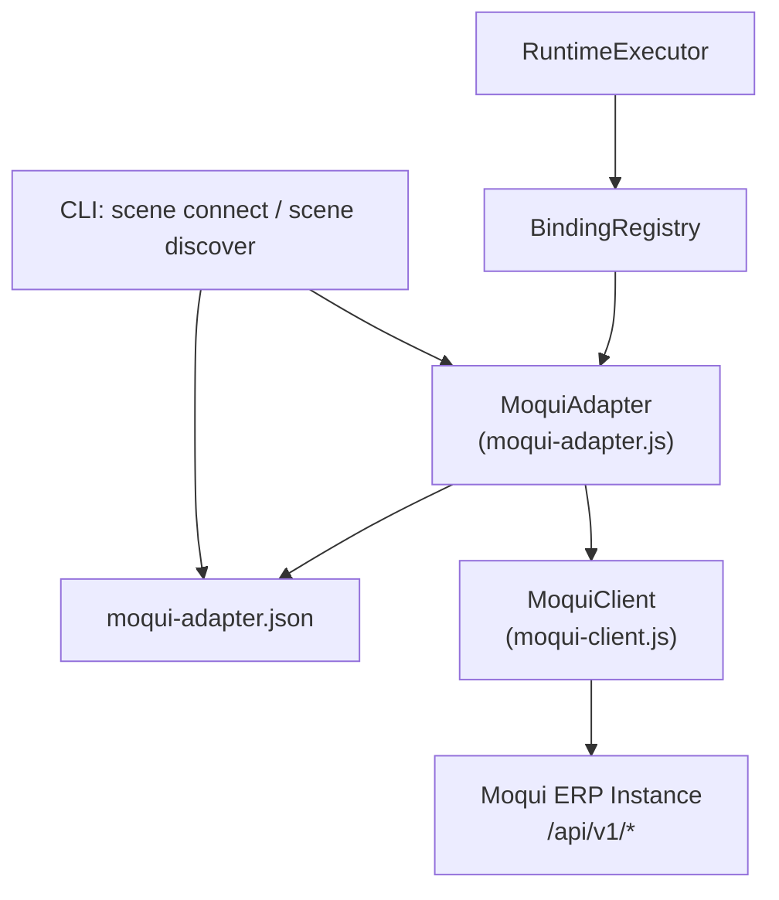

# Design Document: Moqui ERP Adapter

## Overview

The Moqui ERP Adapter integrates a live Moqui ERP instance into KSE's scene runtime. It consists of three modules:

1. **moqui-client.js** — Low-level HTTP client using Node.js built-in `http`/`https` modules. Handles JWT authentication lifecycle (login, token refresh, re-login, logout), request construction, retry logic, and response normalization.
2. **moqui-adapter.js** — Binding handler registered in `BindingRegistry`. Parses binding refs, routes operations to the correct Moqui REST endpoint (entity CRUD, service invocation, screen discovery), and maps Moqui responses to KSE `Execution_Result` format.
3. **scene.js additions** — Two new CLI subcommands (`scene connect`, `scene discover`) following the established normalize → validate → run → print pattern, registered in `registerSceneCommands`.

No external dependencies are added. All HTTP communication uses Node.js built-in `http`/`https` modules.

## Architecture



### Request Flow

1. `RuntimeExecutor.executeBindingNode(node, payload)` calls `BindingRegistry.execute(node, payload)`
2. `BindingRegistry.resolve(node)` matches `spec.erp.*` or `moqui.*` refs → returns `MoquiAdapter` handler
3. `MoquiAdapter.execute(node, payload)` parses the binding ref, determines operation type, delegates to `MoquiClient`
4. `MoquiClient` handles JWT auth, constructs HTTP request, applies retry logic, returns normalized response
5. `MoquiAdapter` maps the Moqui response to KSE `Execution_Result` format

### Readiness Flow

1. `BindingRegistry.checkReadiness(manifest, payload)` iterates adapter bindings
2. For `spec.erp.*` / `moqui.*` bindings, calls `MoquiAdapter.readiness(node, payload)`
3. `MoquiAdapter.readiness` loads config, attempts authentication via `MoquiClient`, returns `{ passed, reason }`

## Components and Interfaces

### Module 1: MoquiClient (`lib/scene-runtime/moqui-client.js`)

Stateful HTTP client managing connection to a single Moqui instance.

```javascript
class MoquiClient {
  /**
   * @param {Object} config - Adapter_Config object
   * @param {string} config.baseUrl - Moqui instance root URL
   * @param {Object} config.credentials - { username, password }
   * @param {number} [config.timeout=30000] - Request timeout in ms
   * @param {number} [config.retryCount=2] - Max retry attempts for retryable errors
   * @param {number} [config.retryDelay=1000] - Delay between retries in ms
   */
  constructor(config) {}

  /**
   * Authenticate with Moqui and store JWT token pair.
   * POST /api/v1/auth/login { username, password }
   * @returns {Promise<{ success: boolean, error?: string }>}
   */
  async login() {}

  /**
   * Refresh access token using stored refresh token.
   * POST /api/v1/auth/refresh { refreshToken }
   * @returns {Promise<boolean>} true if refresh succeeded
   */
  async refreshToken() {}

  /**
   * Invalidate current token pair.
   * POST /api/v1/auth/logout
   * @returns {Promise<void>}
   */
  async logout() {}

  /**
   * Send authenticated HTTP request with retry logic.
   * Automatically handles 401 → refresh → retry flow.
   * @param {string} method - HTTP method (GET, POST, PUT, DELETE)
   * @param {string} path - API path (e.g., '/api/v1/entities/OrderHeader')
   * @param {Object} [options] - { body, query, headers }
   * @returns {Promise<MoquiResponse>}
   */
  async request(method, path, options = {}) {}

  /**
   * Low-level HTTP request using Node.js built-in http/https.
   * @param {string} method
   * @param {string} fullUrl
   * @param {Object} options - { body, headers, timeout }
   * @returns {Promise<{ statusCode, headers, body }>}
   */
  async _httpRequest(method, fullUrl, options = {}) {}

  /**
   * Check if client is authenticated (has valid token pair).
   * @returns {boolean}
   */
  isAuthenticated() {}

  /**
   * Dispose client resources and logout.
   * @returns {Promise<void>}
   */
  async dispose() {}
}
```

#### Internal State

```javascript
{
  config: { baseUrl, credentials, timeout, retryCount, retryDelay },
  accessToken: string | null,
  refreshTokenValue: string | null,
  authenticated: boolean
}
```

### Module 2: MoquiAdapter (`lib/scene-runtime/moqui-adapter.js`)

Binding handler that bridges KSE binding nodes to Moqui REST API calls.

```javascript
/**
 * Load and validate adapter config from file.
 * @param {string} [configPath] - Path to moqui-adapter.json
 * @param {string} [projectRoot] - Project root for relative path resolution
 * @returns {{ config: Object, error?: string }}
 */
function loadAdapterConfig(configPath, projectRoot) {}

/**
 * Validate adapter config object.
 * @param {Object} config
 * @returns {{ valid: boolean, errors: string[] }}
 */
function validateAdapterConfig(config) {}

/**
 * Parse a binding ref into structured operation descriptor.
 * Examples:
 *   'moqui.OrderHeader.list' → { entity: 'OrderHeader', operation: 'list' }
 *   'moqui.OrderHeader.get'  → { entity: 'OrderHeader', operation: 'get' }
 *   'moqui.OrderHeader.create' → { entity: 'OrderHeader', operation: 'create' }
 *   'spec.erp.order-query-service' → { service: 'order-query-service', operation: 'invoke' }
 *   'moqui.service.PlaceOrder.invoke' → { service: 'PlaceOrder', operation: 'invoke' }
 *   'moqui.screen.catalog' → { operation: 'screen-catalog' }
 *   'moqui.screen.OrderEntry' → { screen: 'OrderEntry', operation: 'screen-definition' }
 * @param {string} bindingRef
 * @returns {{ entity?, service?, screen?, operation, mode? } | null}
 */
function parseBindingRef(bindingRef) {}

/**
 * Map Moqui API response to KSE Execution_Result.
 * @param {Object} moquiResponse - { success, data, meta, error }
 * @param {string} handlerId
 * @param {string} bindingRef
 * @returns {Object} Execution_Result
 */
function mapMoquiResponseToResult(moquiResponse, handlerId, bindingRef) {}

/**
 * Create a MoquiAdapter handler object for BindingRegistry.register().
 * @param {Object} [options] - { configPath, projectRoot, client }
 * @returns {Object} handler with { id, match, execute, readiness }
 */
function createMoquiAdapterHandler(options = {}) {}
```

#### Binding Ref Parsing Rules

The adapter supports two ref prefix families:

| Prefix | Pattern | Parsed Result |
|--------|---------|---------------|
| `moqui.{Entity}.{op}` | `moqui.OrderHeader.list` | `{ entity: 'OrderHeader', operation: 'list' }` |
| `moqui.{Entity}.{op}` | `moqui.OrderHeader.get` | `{ entity: 'OrderHeader', operation: 'get' }` |
| `moqui.{Entity}.{op}` | `moqui.OrderHeader.create` | `{ entity: 'OrderHeader', operation: 'create' }` |
| `moqui.{Entity}.{op}` | `moqui.OrderHeader.update` | `{ entity: 'OrderHeader', operation: 'update' }` |
| `moqui.{Entity}.{op}` | `moqui.OrderHeader.delete` | `{ entity: 'OrderHeader', operation: 'delete' }` |
| `moqui.service.{Name}.invoke` | `moqui.service.PlaceOrder.invoke` | `{ service: 'PlaceOrder', operation: 'invoke' }` |
| `moqui.service.{Name}.async` | `moqui.service.PlaceOrder.async` | `{ service: 'PlaceOrder', operation: 'invoke', mode: 'async' }` |
| `moqui.service.{Name}.job-status` | `moqui.service.PlaceOrder.job-status` | `{ service: 'PlaceOrder', operation: 'job-status' }` |
| `moqui.screen.catalog` | `moqui.screen.catalog` | `{ operation: 'screen-catalog' }` |
| `moqui.screen.{Path}` | `moqui.screen.OrderEntry` | `{ screen: 'OrderEntry', operation: 'screen-definition' }` |
| `spec.erp.{name}` | `spec.erp.order-query` | `{ service: 'order-query', operation: 'invoke' }` |

#### Operation → HTTP Mapping

| Operation | HTTP Method | Endpoint |
|-----------|-------------|----------|
| `list` | GET | `/api/v1/entities/{entityName}` |
| `get` | GET | `/api/v1/entities/{entityName}/{id}` |
| `create` | POST | `/api/v1/entities/{entityName}` |
| `update` | PUT | `/api/v1/entities/{entityName}/{id}` |
| `delete` | DELETE | `/api/v1/entities/{entityName}/{id}` |
| `invoke` (sync) | POST | `/api/v1/services/{serviceName}` |
| `invoke` (async) | POST | `/api/v1/services/{serviceName}` with `{ async: true }` |
| `job-status` | GET | `/api/v1/services/{serviceName}/jobs/{jobId}` |
| `screen-catalog` | GET | `/api/v1/screens` |
| `screen-definition` | GET | `/api/v1/screens/{screenPath}` |

### Module 3: CLI Commands (additions to `lib/commands/scene.js`)

#### Connect Command

```javascript
function normalizeSceneConnectOptions(options = {}) {
  return {
    config: options.config ? String(options.config).trim() : undefined,
    registry: options.registry ? String(options.registry).trim() : '.sce/registry',
    json: options.json === true
  };
}

function validateSceneConnectOptions(options) {
  // No required options — config defaults to 'moqui-adapter.json'
  return null;
}

async function runSceneConnectCommand(rawOptions = {}, dependencies = {}) {
  // 1. normalize + validate
  // 2. loadAdapterConfig(options.config, projectRoot)
  // 3. create MoquiClient, attempt login()
  // 4. build payload { success, baseUrl, authStatus, serverMeta?, error? }
  // 5. printSceneConnectSummary(options, payload)
  // 6. dispose client
}

function printSceneConnectSummary(options, payload) {
  // JSON mode or human-readable output
}
```

#### Discover Command

```javascript
function normalizeSceneDiscoverOptions(options = {}) {
  return {
    config: options.config ? String(options.config).trim() : undefined,
    type: options.type ? String(options.type).trim() : undefined,
    json: options.json === true
  };
}

function validateSceneDiscoverOptions(options) {
  if (options.type && !['entities', 'services', 'screens'].includes(options.type)) {
    return `invalid --type "${options.type}", must be entities, services, or screens`;
  }
  return null;
}

async function runSceneDiscoverCommand(rawOptions = {}, dependencies = {}) {
  // 1. normalize + validate
  // 2. loadAdapterConfig + create MoquiClient + login
  // 3. query catalog endpoints based on --type
  // 4. build payload { success, type?, entities?, services?, screens?, summary?, error? }
  // 5. printSceneDiscoverSummary(options, payload)
  // 6. dispose client
}

function printSceneDiscoverSummary(options, payload) {
  // JSON mode or human-readable output
}
```

## Data Models

### Adapter_Config Schema

```json
{
  "baseUrl": "http://localhost:8080",
  "credentials": {
    "username": "admin",
    "password": "moqui"
  },
  "timeout": 30000,
  "retryCount": 2,
  "retryDelay": 1000
}
```

Required fields: `baseUrl`, `credentials.username`, `credentials.password`
Optional fields: `timeout` (default 30000), `retryCount` (default 2), `retryDelay` (default 1000)

### JWT_Token_Pair

```javascript
{
  accessToken: 'eyJhbGciOiJIUzI1NiIs...',
  refreshToken: 'eyJhbGciOiJIUzI1NiIs...'
}
```

### Moqui_Response (from Moqui API)

```javascript
// Success
{ success: true, data: { /* entity/service result */ }, meta: { pageIndex, pageSize, totalCount } }

// Error
{ success: false, error: { code: 'ENTITY_NOT_FOUND', message: '...', details: '...' } }
```

### Execution_Result (KSE format)

```javascript
// Success
{
  status: 'success',
  handler_id: 'moqui.adapter',
  binding_ref: 'moqui.OrderHeader.list',
  data: { /* mapped from Moqui response */ },
  meta: { /* pagination, timing */ }
}

// Failure
{
  status: 'failed',
  handler_id: 'moqui.adapter',
  binding_ref: 'moqui.OrderHeader.list',
  error: { code: 'ENTITY_NOT_FOUND', message: '...', details: '...' }
}
```

### Parsed Binding Ref Descriptor

```javascript
{
  entity: 'OrderHeader',  // or undefined
  service: 'PlaceOrder',  // or undefined
  screen: 'OrderEntry',   // or undefined
  operation: 'list',       // list|get|create|update|delete|invoke|job-status|screen-catalog|screen-definition
  mode: 'sync'            // sync|async (only for invoke)
}
```

### Connect Command Payload

```javascript
{
  success: true,
  baseUrl: 'http://localhost:8080',
  authStatus: 'authenticated',
  serverMeta: { /* optional server info */ }
}
// or
{
  success: false,
  baseUrl: 'http://localhost:8080',
  error: { code: 'AUTH_FAILED', message: '...' }
}
```

### Discover Command Payload

```javascript
// With --type entities
{
  success: true,
  type: 'entities',
  entities: ['OrderHeader', 'OrderItem', ...],
  count: 42
}

// Without --type (summary)
{
  success: true,
  summary: {
    entities: { count: 42 },
    services: { count: 15 },
    screens: { count: 8 }
  }
}
```


## Correctness Properties

*A property is a characteristic or behavior that should hold true across all valid executions of a system — essentially, a formal statement about what the system should do. Properties serve as the bridge between human-readable specifications and machine-verifiable correctness guarantees.*

### Property 1: Config load round-trip

*For any* valid Adapter_Config object, writing it as JSON to a file and then loading it via `loadAdapterConfig` should produce an equivalent config object (with defaults filled in for missing optional fields).

**Validates: Requirements 1.1**

### Property 2: Config defaults for optional fields

*For any* Adapter_Config object that contains `baseUrl` and `credentials` but omits `timeout`, `retryCount`, or `retryDelay`, the loaded config should have `timeout` defaulting to 30000, `retryCount` defaulting to 2, and `retryDelay` defaulting to 1000.

**Validates: Requirements 1.4**

### Property 3: Config validation catches missing required fields

*For any* config object missing one or more of the required fields (`baseUrl`, `credentials`, `credentials.username`, `credentials.password`), `validateAdapterConfig` should return `{ valid: false }` with errors listing exactly the missing fields.

**Validates: Requirements 1.6**

### Property 4: Invalid JSON config produces descriptive error

*For any* string that is not valid JSON, attempting to load it as an Adapter_Config should return an error result containing a descriptive message about the JSON parse failure.

**Validates: Requirements 1.5**

### Property 5: parseBindingRef correctly extracts components

*For any* valid binding ref following the defined patterns (`moqui.{Entity}.{op}`, `moqui.service.{Name}.{mode}`, `moqui.screen.{path}`, `spec.erp.{name}`), `parseBindingRef` should return a descriptor with the correct `entity`, `service`, `screen`, `operation`, and `mode` fields matching the input segments.

**Validates: Requirements 6.6**

### Property 6: Binding ref matcher matches correct prefixes

*For any* binding ref string starting with `spec.erp.` or `moqui.`, the MoquiAdapter handler's match function should return true. *For any* binding ref string not starting with either prefix, the match function should return false.

**Validates: Requirements 6.1**

### Property 7: Operation descriptor maps to correct HTTP method and path

*For any* valid parsed binding ref descriptor, the constructed HTTP request should use the correct method (GET/POST/PUT/DELETE) and path (`/api/v1/entities/{name}`, `/api/v1/services/{name}`, `/api/v1/screens/{path}`) as defined in the operation-to-HTTP mapping table.

**Validates: Requirements 3.1, 3.2, 3.3, 3.4, 3.5, 4.1, 4.2, 4.3, 5.1, 5.2**

### Property 8: Moqui response maps to correct Execution_Result

*For any* Moqui response object, `mapMoquiResponseToResult` should produce an Execution_Result where: (a) `status` is `'success'` when `success: true` and `'failed'` when `success: false`, (b) `data` and `meta` fields are preserved from successful responses, and (c) `error.code`, `error.message`, and `error.details` are preserved from error responses.

**Validates: Requirements 3.6, 3.7, 7.5**

### Property 9: Retry logic respects retryCount

*For any* retryCount value N (0 ≤ N ≤ 5), when a retryable error occurs on every attempt, the MoquiClient should make exactly N + 1 total HTTP requests (1 initial + N retries) before returning the error.

**Validates: Requirements 7.3, 7.4**

## Error Handling

### Error Categories

| Error Code | Trigger | HTTP Status | Recovery |
|------------|---------|-------------|----------|
| `CONFIG_NOT_FOUND` | Config file missing | N/A | User fixes config path |
| `CONFIG_INVALID_JSON` | Malformed JSON in config | N/A | User fixes JSON syntax |
| `CONFIG_VALIDATION` | Missing required fields | N/A | User adds missing fields |
| `AUTH_FAILED` | Login + refresh both fail | 401 | User checks credentials |
| `NETWORK_ERROR` | Connection refused, DNS failure | N/A | User checks Moqui instance |
| `TIMEOUT` | Request exceeds timeout | N/A | User increases timeout or checks server |
| `MOQUI_ERROR` | Moqui returns `success: false` | 4xx/5xx | Depends on Moqui error code |

### Retry Strategy

- Retryable conditions: network errors, 5xx HTTP status codes
- Non-retryable: 4xx (except 401 which triggers token refresh), config errors
- Retry flow: wait `retryDelay` ms → retry → repeat up to `retryCount` times
- 401 flow: refresh token → retry once → if still 401, re-login → retry once → if still fails, return AUTH_FAILED

### Error Propagation

All errors are wrapped into KSE `Execution_Result` format with `status: 'failed'`. The adapter never throws exceptions — all errors are returned as result objects. CLI commands catch errors and set `process.exitCode = 1`.

## Testing Strategy

### Property-Based Tests (fast-check)

Each correctness property maps to one property-based test with minimum 100 iterations. Tests are placed in the existing test suite alongside unit tests.

| Property | Test Description | Generator Strategy |
|----------|-----------------|-------------------|
| P1 | Config round-trip | Generate random valid config objects with varying baseUrl, credentials, optional fields |
| P2 | Config defaults | Generate configs with random subsets of optional fields omitted |
| P3 | Config validation | Generate configs with random subsets of required fields removed |
| P4 | Invalid JSON error | Generate random non-JSON strings |
| P5 | parseBindingRef | Generate random entity names, service names, screen paths, operations from valid patterns |
| P6 | Binding ref matcher | Generate random strings with and without `spec.erp.`/`moqui.` prefixes |
| P7 | Operation-to-HTTP mapping | Generate all operation types with random entity/service/screen names |
| P8 | Response mapping | Generate random Moqui response objects (success and error variants) |
| P9 | Retry count | Generate retryCount values 0-5, mock always-failing requests |

### Unit Tests (Jest)

Unit tests cover specific examples, edge cases, and integration points:

- **Config loading**: file not found, empty file, valid file, custom path
- **Config validation**: each required field missing individually, all present, extra fields ignored
- **parseBindingRef**: each pattern variant, invalid refs return null, edge cases (empty string, no dots)
- **Response mapping**: specific Moqui response examples, missing fields handled gracefully
- **MoquiClient**: login success/failure, token refresh flow, 401 retry flow, dispose/logout
- **Connect command**: normalize/validate/run/print with mocked client
- **Discover command**: normalize/validate/run/print with mocked client, each --type variant
- **BindingRegistry integration**: handler registration, match resolution, execute delegation

### Test Configuration

- Property-based tests: `fast-check` library, 100+ iterations per property
- Each property test tagged: `Feature: 90-00-moqui-erp-adapter, Property N: {title}`
- Mocking: MoquiClient HTTP layer mocked for adapter tests; adapter mocked for CLI command tests
- No real Moqui instance required for any test
