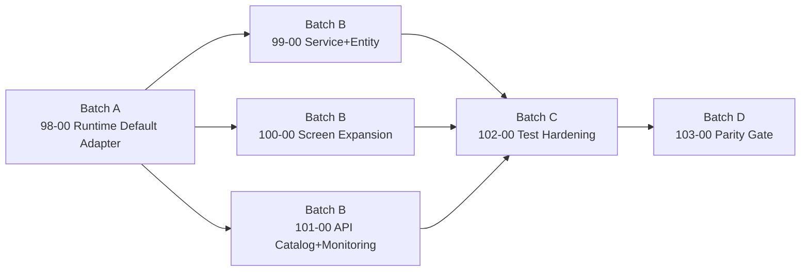

# 设计文档：Moqui Parity Program

## 概述

Program 采用“先接线、后扩展、再加固、最后验收”的四阶段模型，以降低并行开发冲突。

- Batch A：打通运行时默认链路与配置口径
- Batch B：并行补齐能力接口
- Batch C：集中补测试和回归护栏
- Batch D：统一验收与发布收口

## 批次架构

## 依赖策略

1. `98-00` 提供统一入口与配置语义，避免 B 批次并行时出现 handler 行为不一致。
2. `99-00`、`100-00`、`101-00` 可并行开发，边界分别是实体/服务、屏幕、目录与监控。
3. `102-00` 在接口稳定后集中补测，避免测试反复返工。
4. `103-00` 只做验收闭环，不引入新功能。

## 多 Agent 文件边界

为降低 Batch B 并行冲突，采用文件边界和函数边界双约束：

| Spec | 主责任文件 | 函数边界 |
|------|------------|----------|
| `99-00` | `lib/scene-runtime/moqui-adapter.js`, `tests/unit/scene-runtime/moqui-adapter.test.js` | service/entity 解析与 HTTP 映射 |
| `100-00` | `lib/scene-runtime/moqui-adapter.js`, `tests/unit/scene-runtime/moqui-adapter.test.js` | screen 解析与 HTTP 映射 |
| `101-00` | `lib/scene-runtime/moqui-adapter.js`, `lib/commands/scene.js`, `tests/unit/commands/scene.test.js` | api/monitor 命名空间与 discover 扩展 |

并行执行约束：

1. Batch B 各 agent 仅修改本 spec 对应函数块，不重排无关代码。
2. 每个 agent 提交前必须附带最小 diff 说明，标注修改的函数名和行区间。
3. 合并顺序固定为 `99-00 -> 100-00 -> 101-00`，每次合并后立即运行 `102-00` 规定的回归命令。

## 交付物清单

- 子 Spec 文档：`98-00` 到 `103-00`
- 批次执行记录：每批次一个 gate 结论
- parity 报告：能力矩阵、差异、风险、发布建议

## 风险与缓解

- 风险：并行批次修改同一文件（如 `lib/scene-runtime/moqui-adapter.js`）
- 缓解：在 Batch B 中按功能分段提交，合并前统一执行 `102-00` 回归

- 风险：331 基线接口存在环境差异
- 缓解：103 阶段采用“主路径 + 兼容回退”的验收策略
