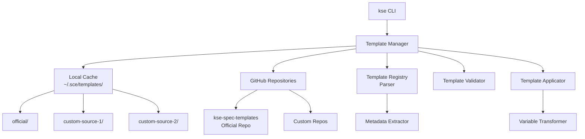
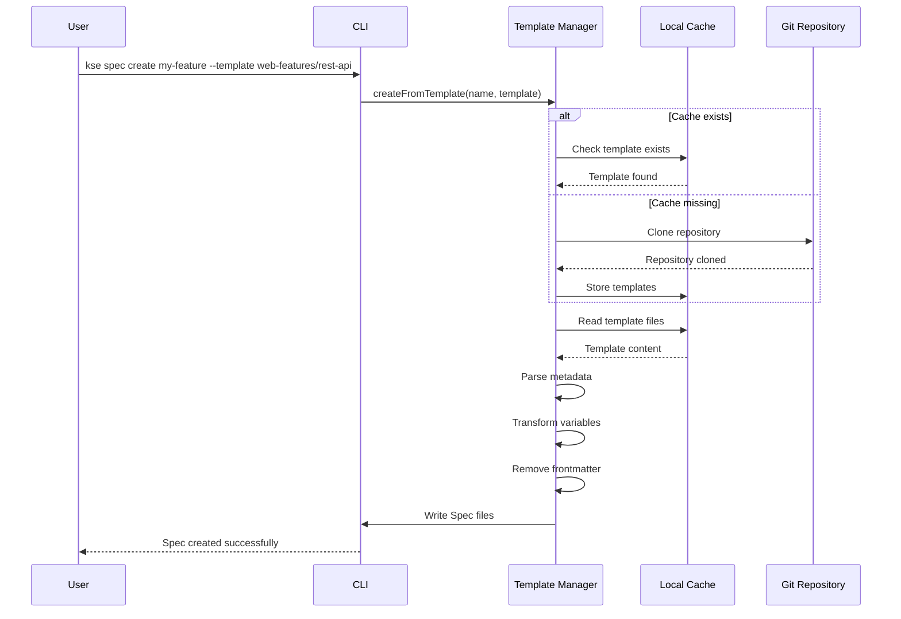

# Design Document

## Overview

The {{SPEC_NAME_TITLE}} feature consists of two main components:

1. **kse-spec-templates Repository**: A standalone GitHub repository containing categorized, high-quality Spec templates with metadata and examples
2. **Template Manager Module**: Integrated into kse CLI, responsible for template discovery, download, caching, and application

The design follows a distributed architecture where templates are stored in Git repositories (official and custom sources) and cached locally for offline use. The Template Manager provides a seamless CLI experience for browsing, downloading, and applying templates to new Spec creation.

## Architecture

### High-Level Architecture



### Component Interaction Flow



## Components and Interfaces

### 1. Template Manager (lib/templates/template-manager.js)

**Responsibilities**:
- Manage template sources (official and custom)
- Download and update template repositories
- Parse template registry and metadata
- Apply templates to new Specs
- Handle caching and offline support

**Key Methods**:
```javascript
class TemplateManager {
  // Source management
  async addSource(name, gitUrl)
  async removeSource(name)
  async listSources()
  
  // Template discovery
  async listTemplates(options = {})
  async searchTemplates(keyword)
  async showTemplate(templatePath)
  
  // Template operations
  async downloadTemplates(source = 'official')
  async updateTemplates(source = null, version = null)
  async applyTemplate(specName, templatePath, options = {})
  
  // Cache management
  async getCacheStatus()
  async clearCache(source = null)
  
  // Validation
  async validateTemplate(templatePath)
  async validateRegistry(registryPath)
}
```

### 2. Template Registry Parser (lib/templates/registry-parser.js)

**Responsibilities**:
- Parse template-registry.json files
- Extract and validate template metadata
- Build searchable template index
- Handle multiple registry sources

**Key Methods**:
```javascript
class RegistryParser {
  async parseRegistry(registryPath)
  async buildIndex(registries)
  async searchIndex(keyword, filters = {})
  validateRegistrySchema(registry)
  mergeRegistries(registries)
}
```

**Registry Schema**:
```json
{
  "version": "1.0.0",
  "templates": [
    {
      "id": "web-features/rest-api",
      "name": "REST API Feature",
      "category": "web-features",
      "description": "Template for RESTful API endpoints",
      "difficulty": "intermediate",
      "tags": ["api", "rest", "backend", "http"],
      "applicable_scenarios": [
        "Creating new API endpoints",
        "Implementing CRUD operations",
        "Building microservices"
      ],
      "files": [
        "requirements.md",
        "design.md",
        "tasks.md"
      ],
      "author": "kse-team",
      "created_at": "2025-01-15",
      "updated_at": "2025-01-20"
    }
  ]
}
```

### 3. Template Validator (lib/templates/template-validator.js)

**Responsibilities**:
- Validate template file structure
- Verify YAML frontmatter format
- Check template completeness
- Ensure quality standards compliance

**Key Methods**:
```javascript
class TemplateValidator {
  async validateTemplate(templatePath)
  validateFrontmatter(content)
  validateStructure(files)
  validateContent(content)
  generateValidationReport(errors)
}
```

**Validation Rules**:
- All three files (requirements.md, design.md, tasks.md) must exist
- YAML frontmatter must be valid and contain required fields
- Template must include guidance comments
- Template must include example content
- File structure must follow Spec standards

### 4. Template Applicator (lib/templates/template-applicator.js)

**Responsibilities**:
- Copy template files to Spec directory
- Transform template variables
- Remove YAML frontmatter
- Handle file conflicts

**Key Methods**:
```javascript
class TemplateApplicator {
  async applyTemplate(specName, templatePath, targetDir, options = {})
  transformVariables(content, variables)
  removeFrontmatter(content)
  async handleConflict(targetPath, strategy)
}
```

**Variable Transformation**:
```javascript
const variables = {
  '{{SPEC_NAME}}': specName,
  '{{SPEC_NAME_TITLE}}': toTitleCase(specName),
  '{{DATE}}': new Date().toISOString().split('T')[0],
  '{{YEAR}}': new Date().getFullYear(),
  '{{AUTHOR}}': getUserName(),
  '{{PROJECT_NAME}}': getProjectName()
};
```

### 5. Git Operations Handler (lib/templates/git-handler.js)

**Responsibilities**:
- Clone template repositories
- Pull updates from remote
- Handle Git errors and authentication
- Manage shallow clones for performance

**Key Methods**:
```javascript
class GitHandler {
  async cloneRepository(url, targetPath, options = {})
  async pullUpdates(repoPath)
  async getRepoVersion(repoPath)
  async checkoutVersion(repoPath, version)
  isGitRepository(path)
  async getRemoteUrl(repoPath)
}
```

### 6. Cache Manager (lib/templates/cache-manager.js)

**Responsibilities**:
- Manage local template cache
- Track cache metadata (last update, version)
- Handle cache invalidation
- Provide cache statistics

**Key Methods**:
```javascript
class CacheManager {
  async getCacheInfo(source)
  async updateCacheMetadata(source, metadata)
  async clearCache(source)
  async getCacheSize()
  async isStale(source, maxAge)
}
```

**Cache Structure**:
```
~/.sce/templates/
├── official/                    # Official template library
│   ├── .git/
│   ├── template-registry.json
│   ├── web-features/
│   │   ├── rest-api/
│   │   │   ├── requirements.md
│   │   │   ├── design.md
│   │   │   └── tasks.md
│   │   └── graphql-api/
│   ├── backend-features/
│   ├── infrastructure/
│   ├── devops/
│   └── testing/
├── custom-source-1/             # Custom template source
│   └── ...
├── .cache-metadata.json         # Cache metadata
└── .sources.json                # Configured sources
```

### 7. CLI Commands Integration (lib/commands/templates.js)

**Responsibilities**:
- Expose template operations via CLI
- Handle command-line arguments and options
- Provide user-friendly output and error messages
- Integrate with existing kse CLI structure

**Commands**:
```javascript
// List all templates
sce templates list [--category <category>] [--source <source>]

// Search templates
sce templates search <keyword> [--category <category>]

// Show template details
sce templates show <template-path>

// Update templates
sce templates update [--source <source>] [--version <version>]

// Add custom source
sce templates add-source <name> <git-url>

// Remove custom source
sce templates remove-source <name>

// List configured sources
sce templates sources

// Show cache status
sce templates cache [--clear] [--source <source>]

// Display template guide
sce templates guide

// Create Spec from template
kse spec create <name> --template <template-path> [--force]
```

## Data Models

### Template Metadata (YAML Frontmatter)

```yaml
---
name: REST API Feature
category: web-features
description: Template for creating RESTful API endpoints with proper error handling and validation
difficulty: intermediate
tags:
  - api
  - rest
  - backend
  - http
  - validation
applicable_scenarios:
  - Creating new API endpoints
  - Implementing CRUD operations
  - Building microservices
  - Adding authentication to APIs
author: kse-team
created_at: 2025-01-15
updated_at: 2025-01-20
version: 1.0.0
---
```

### Template Registry Entry

```typescript
interface TemplateEntry {
  id: string;                    // "web-features/rest-api"
  name: string;                  // "REST API Feature"
  category: string;              // "web-features"
  description: string;           // Template description
  difficulty: 'beginner' | 'intermediate' | 'advanced';
  tags: string[];                // ["api", "rest", "backend"]
  applicable_scenarios: string[]; // Use case descriptions
  files: string[];               // ["requirements.md", "design.md", "tasks.md"]
  author: string;                // "kse-team"
  created_at: string;            // ISO date
  updated_at: string;            // ISO date
  version?: string;              // Template version
}
```

### Template Source Configuration

```typescript
interface TemplateSource {
  name: string;                  // "official" or custom name
  type: 'official' | 'custom';
  url: string;                   // Git repository URL
  branch?: string;               // Default: "main"
  enabled: boolean;              // Whether source is active
  last_updated?: string;         // ISO timestamp
  version?: string;              // Current version/tag
}
```

### Cache Metadata

```typescript
interface CacheMetadata {
  sources: {
    [sourceName: string]: {
      last_updated: string;      // ISO timestamp
      version: string;           // Git tag or commit hash
      template_count: number;    // Number of templates
      size_bytes: number;        // Cache size
    }
  };
  last_check: string;            // Last update check timestamp
}
```

## Correctness Properties

*A property is a characteristic or behavior that should hold true across all valid executions of a system—essentially, a formal statement about what the system should do. Properties serve as the bridge between human-readable specifications and machine-verifiable correctness guarantees.*


### Property Reflection

After analyzing all acceptance criteria, I identified the following redundancies:

**Redundancy 1**: Requirements 1.2 and 8.1 both test template file completeness
- 1.2: Template must include requirements.md, design.md, tasks.md with frontmatter
- 8.1: Template must include complete frameworks for all three files
- **Resolution**: Combine into single property about template structure completeness

**Redundancy 2**: Requirements 2.1 and 2.4 both relate to frontmatter validation
- 2.1: Frontmatter must contain required fields
- 2.4: Invalid metadata must be rejected
- **Resolution**: Combine into single property about frontmatter validation (valid accepted, invalid rejected)

**Redundancy 3**: Requirements 3.1 and 3.2 both relate to template listing output
- 3.1: List must show all templates grouped by category
- 3.2: List must show name, description, difficulty, tags
- **Resolution**: Combine into single property about complete template listing

**Redundancy 4**: Requirements 4.2 and 4.4 both relate to error handling
- 4.2: Network errors must be handled gracefully
- 4.4: Download failures must provide clear error messages
- **Resolution**: Combine into single property about error handling with descriptive messages

**Redundancy 5**: Requirements 13.1, 13.2, and 13.3 all relate to error reporting
- 13.1: Errors must have descriptive messages with solutions
- 13.2: Different error types must be distinguished
- 13.3: Validation errors must list all errors with locations
- **Resolution**: Combine into single comprehensive property about error reporting quality

After reflection, the following properties provide unique validation value:

### Correctness Properties

**Property 1: Template Structure Completeness**
*For any* valid template in the template library, it must contain all three required files (requirements.md, design.md, tasks.md) with valid YAML frontmatter containing the required fields (name, description, category, difficulty, tags, applicable_scenarios).
**Validates: Requirements 1.2, 2.1, 8.1**

**Property 2: Template Validation Rejects Invalid Templates**
*For any* template with invalid or missing frontmatter fields, the Template_Manager must reject the template and report all validation errors with specific field names and file locations.
**Validates: Requirements 2.4, 13.3**

**Property 3: Template Registry Completeness**
*For any* template directory in the template library, the template-registry.json file must contain an entry for that template with all required metadata fields matching the template's frontmatter.
**Validates: Requirements 1.3**

**Property 4: Template Structure Validation**
*For any* template file, it must follow the standard Spec document structure with required sections (Introduction, Glossary for requirements; Overview, Architecture for design; Overview, Tasks for tasks).
**Validates: Requirements 2.5**

**Property 5: Template Listing Completeness**
*For any* set of cached templates, when listing templates, all templates must appear in the output grouped by category, with each entry showing name, description, difficulty level, and tags.
**Validates: Requirements 3.1, 3.2**

**Property 6: Template Search Accuracy**
*For any* search keyword and set of templates, all returned results must contain the keyword in at least one of: template name, description, or tags (case-insensitive matching).
**Validates: Requirements 3.3**

**Property 7: Template Detail Display Completeness**
*For any* template, when showing template details, the output must include all metadata fields: name, description, category, difficulty, tags, applicable_scenarios, author, and dates.
**Validates: Requirements 3.4**

**Property 8: Cache Usage Without Network**
*For any* template operation (list, search, show, apply) when templates are cached locally, the operation must complete successfully without any network access.
**Validates: Requirements 4.3, 9.1, 9.3**

**Property 9: Template Registry Integrity Validation**
*For any* downloaded template repository, if the template-registry.json file is missing, corrupted, or contains invalid entries, the Template_Manager must detect the issue and report it as an integrity validation failure.
**Validates: Requirements 4.5**

**Property 10: Template File Copying Completeness**
*For any* template application, all template files (requirements.md, design.md, tasks.md) must be copied to the target Spec directory with the correct directory structure (.sce/specs/<name>/).
**Validates: Requirements 5.1**

**Property 11: Frontmatter Removal in Applied Templates**
*For any* template file with YAML frontmatter, when applied to a new Spec, the resulting file must not contain any YAML frontmatter (content between --- markers).
**Validates: Requirements 5.2**

**Property 12: Variable Substitution Completeness**
*For any* template content containing placeholder variables ({{SPEC_NAME}}, {{DATE}}, {{YEAR}}, {{AUTHOR}}, {{PROJECT_NAME}}), when applied to a new Spec, all placeholders must be replaced with actual values and no placeholders should remain.
**Validates: Requirements 5.3**

**Property 13: Template Update Change Detection**
*For any* template repository update, the Template_Manager must correctly count and report the number of new templates (added), modified templates (changed), and deleted templates (removed) by comparing before and after states.
**Validates: Requirements 6.2**

**Property 14: Multi-Source Template Listing**
*For any* set of configured template sources, when listing templates, the output must include templates from all enabled sources with clear source indicators showing which source each template comes from.
**Validates: Requirements 7.2**

**Property 15: Template Name Conflict Disambiguation**
*For any* two templates with the same category and name from different sources, when listing or referencing templates, they must be distinguished using the format <source>:<category>/<template-name>.
**Validates: Requirements 7.3**

**Property 16: Custom Source Structure Validation**
*For any* custom template source, the Template_Manager must validate that it contains a valid template-registry.json file and follows the same directory structure as the official library, rejecting sources that don't comply.
**Validates: Requirements 7.5**

**Property 17: Cross-Platform Path Handling**
*For any* file path operation (reading, writing, copying), the Template_Manager must use platform-independent path separators and produce correct paths on Windows, Linux, and macOS.
**Validates: Requirements 10.2**

**Property 18: Line Ending Normalization**
*For any* template file, when applied to a new Spec, the resulting file must use LF (\\n) line endings regardless of the source file's line endings or the platform.
**Validates: Requirements 10.5**

**Property 19: Comprehensive Error Reporting**
*For any* error condition (network failure, validation failure, file operation failure), the Template_Manager must provide an error message that includes: error type classification, descriptive explanation, and suggested troubleshooting steps.
**Validates: Requirements 4.2, 4.4, 13.1, 13.2**

**Property 20: Error Logging Completeness**
*For any* error that occurs during template operations, the error details (timestamp, operation, error type, stack trace, context) must be logged to the log file for troubleshooting.
**Validates: Requirements 13.5**

## Error Handling

### Error Categories

1. **Network Errors**
   - Connection timeout
   - DNS resolution failure
   - Authentication failure (invalid credentials)
   - Repository not found (404)
   - Rate limiting (429)

2. **Validation Errors**
   - Missing required files
   - Invalid YAML frontmatter
   - Missing required metadata fields
   - Invalid registry schema
   - Template structure violations

3. **File System Errors**
   - Permission denied
   - Disk full
   - Path too long
   - File already exists (conflict)
   - Corrupted cache

4. **Git Errors**
   - Not a git repository
   - Merge conflicts
   - Detached HEAD state
   - Invalid remote URL
   - Shallow clone limitations

### Error Handling Strategy

```javascript
class TemplateError extends Error {
  constructor(type, message, details = {}) {
    super(message);
    this.name = 'TemplateError';
    this.type = type;  // 'network', 'validation', 'filesystem', 'git'
    this.details = details;
    this.suggestions = this.generateSuggestions();
  }
  
  generateSuggestions() {
    // Generate context-specific troubleshooting suggestions
    switch (this.type) {
      case 'network':
        return [
          'Check your internet connection',
          'Verify the repository URL is correct',
          'Try again later if the service is temporarily unavailable'
        ];
      case 'validation':
        return [
          'Review the template structure requirements',
          'Check the YAML frontmatter syntax',
          'Ensure all required fields are present'
        ];
      // ... more cases
    }
  }
}
```

### Error Recovery

- **Network failures**: Retry with exponential backoff (3 attempts)
- **Validation failures**: Report all errors at once (don't fail fast)
- **File conflicts**: Prompt user for resolution strategy (overwrite, skip, rename)
- **Cache corruption**: Offer automatic re-download
- **Git conflicts**: Preserve local changes, suggest manual resolution

### Logging

```javascript
// Log levels: ERROR, WARN, INFO, DEBUG
logger.error('Template validation failed', {
  template: 'web-features/rest-api',
  errors: validationErrors,
  timestamp: new Date().toISOString(),
  operation: 'applyTemplate',
  context: { specName, templatePath }
});
```

## Testing Strategy

### Unit Testing

**Focus Areas**:
- Template validation logic (frontmatter parsing, structure checking)
- Variable transformation (placeholder replacement)
- Registry parsing and indexing
- Path handling and normalization
- Error message generation

**Example Unit Tests**:
```javascript
describe('TemplateValidator', () => {
  test('rejects template with missing required frontmatter fields', () => {
    const invalidTemplate = '---\nname: Test\n---\nContent';
    expect(() => validator.validateFrontmatter(invalidTemplate))
      .toThrow(TemplateError);
  });
  
  test('accepts template with all required frontmatter fields', () => {
    const validTemplate = `---
name: Test Template
category: web-features
description: A test template
difficulty: beginner
tags: [test]
applicable_scenarios: [testing]
---
Content`;
    expect(() => validator.validateFrontmatter(validTemplate))
      .not.toThrow();
  });
});
```

### Property-Based Testing

**Configuration**: Minimum 100 iterations per property test

**Property Test Examples**:

```javascript
const fc = require('fast-check');

describe('Property Tests', () => {
  test('Property 1: Template Structure Completeness', () => {
    fc.assert(
      fc.property(
        fc.record({
          name: fc.string(),
          category: fc.constantFrom('web-features', 'backend-features', 'infrastructure'),
          description: fc.string(),
          difficulty: fc.constantFrom('beginner', 'intermediate', 'advanced'),
          tags: fc.array(fc.string(), { minLength: 1 }),
          applicable_scenarios: fc.array(fc.string(), { minLength: 1 })
        }),
        (metadata) => {
          const template = createTemplateWithMetadata(metadata);
          const validation = validator.validateTemplate(template);
          
          // Must have all three files
          expect(validation.files).toContain('requirements.md');
          expect(validation.files).toContain('design.md');
          expect(validation.files).toContain('tasks.md');
          
          // Each file must have valid frontmatter
          expect(validation.frontmatterValid).toBe(true);
          expect(validation.requiredFields).toEqual(
            expect.arrayContaining(['name', 'category', 'description', 'difficulty', 'tags', 'applicable_scenarios'])
          );
        }
      ),
      { numRuns: 100 }
    );
  });
  // Feature: {{SPEC_NAME}}, Property 1: Template Structure Completeness
  
  test('Property 6: Template Search Accuracy', () => {
    fc.assert(
      fc.property(
        fc.array(
          fc.record({
            name: fc.string({ minLength: 3 }),
            description: fc.string({ minLength: 10 }),
            tags: fc.array(fc.string({ minLength: 2 }), { minLength: 1, maxLength: 5 })
          }),
          { minLength: 5, maxLength: 20 }
        ),
        fc.string({ minLength: 2 }),
        (templates, keyword) => {
          const results = templateManager.searchTemplates(keyword, templates);
          
          // All results must contain the keyword
          results.forEach(result => {
            const matchesName = result.name.toLowerCase().includes(keyword.toLowerCase());
            const matchesDescription = result.description.toLowerCase().includes(keyword.toLowerCase());
            const matchesTags = result.tags.some(tag => 
              tag.toLowerCase().includes(keyword.toLowerCase())
            );
            
            expect(matchesName || matchesDescription || matchesTags).toBe(true);
          });
        }
      ),
      { numRuns: 100 }
    );
  });
  // Feature: {{SPEC_NAME}}, Property 6: Template Search Accuracy
  
  test('Property 12: Variable Substitution Completeness', () => {
    fc.assert(
      fc.property(
        fc.string({ minLength: 10, maxLength: 200 }),
        fc.record({
          specName: fc.string({ minLength: 3 }),
          date: fc.date(),
          author: fc.string({ minLength: 2 })
        }),
        (templateContent, variables) => {
          // Add placeholders to content
          const contentWithPlaceholders = 
            `{{SPEC_NAME}} ${templateContent} {{DATE}} {{AUTHOR}}`;
          
          const result = applicator.transformVariables(
            contentWithPlaceholders,
            variables
          );
          
          // No placeholders should remain
          expect(result).not.toMatch(/\{\{[A-Z_]+\}\}/);
          
          // Variables should be present
          expect(result).toContain(variables.specName);
          expect(result).toContain(variables.author);
        }
      ),
      { numRuns: 100 }
    );
  });
  // Feature: {{SPEC_NAME}}, Property 12: Variable Substitution Completeness
});
```

### Integration Testing

**Focus Areas**:
- End-to-end template application workflow
- Git operations (clone, pull, checkout)
- Multi-source template management
- Cache management and updates
- CLI command integration

**Example Integration Tests**:
```javascript
describe('Integration Tests', () => {
  test('complete template application workflow', async () => {
    // Setup: Clean cache
    await cacheManager.clearCache();
    
    // Step 1: First use triggers download
    await templateManager.applyTemplate(
      'my-feature',
      'web-features/rest-api'
    );
    
    // Verify: Cache populated
    expect(await cacheManager.getCacheInfo('official')).toBeDefined();
    
    // Verify: Files created
    expect(fs.existsSync('.sce/specs/my-feature/requirements.md')).toBe(true);
    expect(fs.existsSync('.sce/specs/my-feature/design.md')).toBe(true);
    expect(fs.existsSync('.sce/specs/my-feature/tasks.md')).toBe(true);
    
    // Verify: No frontmatter in created files
    const content = fs.readFileSync('.sce/specs/my-feature/requirements.md', 'utf8');
    expect(content).not.toMatch(/^---\n/);
    
    // Verify: Variables replaced
    expect(content).toContain('my-feature');
    expect(content).not.toMatch(/\{\{SPEC_NAME\}\}/);
  });
  
  test('offline mode with cached templates', async () => {
    // Setup: Populate cache
    await templateManager.downloadTemplates();
    
    // Simulate offline
    mockNetworkOffline();
    
    // Should work without network
    const templates = await templateManager.listTemplates();
    expect(templates.length).toBeGreaterThan(0);
    
    await templateManager.applyTemplate(
      'offline-feature',
      'web-features/rest-api'
    );
    
    expect(fs.existsSync('.sce/specs/offline-feature/requirements.md')).toBe(true);
  });
});
```

### Edge Cases and Error Conditions

**Test Coverage**:
- Empty cache (first use)
- Corrupted cache
- Network failures during download
- Invalid template structure
- Missing required files
- Malformed YAML frontmatter
- Template name conflicts
- File system permission errors
- Disk full scenarios
- Very large templates
- Special characters in template names
- Concurrent template operations

## Implementation Notes

### Performance Considerations

1. **Lazy Loading**: Only load template registry when needed
2. **Caching**: Cache parsed registry in memory during session
3. **Shallow Clones**: Use `--depth 1` for Git clones
4. **Parallel Operations**: Download multiple sources concurrently
5. **Incremental Updates**: Use `git pull` instead of re-cloning

### Security Considerations

1. **Input Validation**: Sanitize all user inputs (template names, URLs)
2. **Path Traversal**: Prevent directory traversal attacks in template paths
3. **Git URL Validation**: Validate Git URLs before cloning
4. **File Permissions**: Set appropriate permissions on cached files
5. **YAML Parsing**: Use safe YAML parser to prevent code injection

### Backward Compatibility

1. **Registry Schema Versioning**: Support multiple registry schema versions
2. **Template Format Evolution**: Detect and handle old template formats
3. **Migration Guides**: Provide clear migration paths for breaking changes
4. **Deprecation Warnings**: Warn users about deprecated features

### Future Enhancements

1. **Template Previews**: Show template content before applying
2. **Template Ratings**: Community ratings and reviews
3. **Template Analytics**: Track template usage statistics
4. **Template Variants**: Support template variations (e.g., TypeScript vs JavaScript)
5. **Interactive Template Creation**: Wizard for creating new templates
6. **Template Testing**: Automated testing of templates
7. **Template Marketplace**: Web interface for browsing templates

