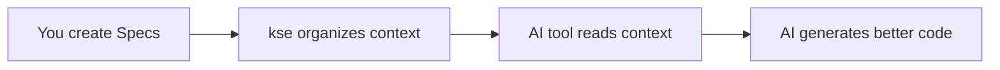

# kse - Kiro Spec Engine

[](https://badge.fury.io/js/kiro-spec-engine)
[](https://opensource.org/licenses/MIT)

> **⚠️ Important Clarification**: `kiro-spec-engine` (kse) is an **npm package and CLI tool** for spec-driven development.  
> It is **NOT** the Kiro IDE desktop application. If you're looking for Kiro IDE, visit https://kiro.dev

**A context provider for AI coding tools** - Structure your project requirements, design, and tasks so AI assistants can help you build better software.

**🚀 NEW: Autonomous Control** - Let AI independently manage entire development workflows from requirements to delivery.

English | [简体中文](README.zh.md)

---

## What is kse?

**kse (Kiro Spec Engine) is a context management system for AI-assisted development.** It helps you organize project information into structured "Specs" (Requirements → Design → Tasks) that AI tools can understand and use effectively.

Think of kse as a **librarian for your AI assistant** - it organizes and presents project context so your AI tool knows exactly what you're building, why, and how.

### How it Works



1. **You create Specs** - Write requirements, design, and tasks in structured markdown files
2. **kse organizes context** - Exports formatted context optimized for AI tools
3. **AI tool reads context** - Your AI assistant understands your project structure
4. **AI generates better code** - Code that matches your design and requirements

### What kse is NOT

- ❌ **Not a code generator** - kse doesn't write code; your AI tool does
- ❌ **Not an IDE** - kse works alongside your existing development tools
- ❌ **Not AI-specific** - Works with Claude, Cursor, Windsurf, Copilot, and any AI tool
- ❌ **Not a replacement for documentation** - It's a structured way to organize project context

### Who Should Use kse?

- ✅ Developers using AI coding assistants (Claude, Cursor, Copilot, etc.)
- ✅ Teams wanting structured project documentation
- ✅ Anyone building features that need clear requirements and design
- ✅ Projects that benefit from spec-driven development

---

## Quick Start

### The Simplest Way (30 seconds) ⚡

**Just tell your AI:**

```
Install kse and use it to manage this project with Spec-driven development.
```

**Your AI will:**
1. Install kse globally (`npm install -g kiro-spec-engine`)
2. Adopt it in your project (`kse adopt`)
3. Read the methodology guide (`.kiro/README.md`)
4. Start working according to Spec-driven approach

**That's it!** Your AI handles everything. No manual steps needed.

---

### Step-by-Step Guide (if you want details) 📋

<details>
<summary><b>Click to expand detailed steps</b></summary>

#### Step 1: Install kse (30 seconds)

```bash
npm install -g kiro-spec-engine
```

Verify installation:
```bash
kse --version
```

#### Step 2: Adopt kse in Your Project (30 seconds)

Navigate to your project directory and run:

```bash
cd your-project
kse adopt
```

This creates a `.kiro/` directory with:
- `README.md` - Project development guide for AI
- `specs/` - Where your Specs live
- `steering/` - Development rules (optional)

#### Step 3: Tell Your AI About the Methodology (30 seconds)

**In your AI tool (Cursor, Claude, Windsurf, Kiro, etc.), say:**

```
Please read .kiro/README.md to understand how this project works.
```

**Your AI will learn:**
- This project follows Spec-driven development
- Every feature starts with a Spec (requirements + design + tasks)
- How to work with this methodology
- When to use kse commands

#### Step 4: Start Building Features

**Just ask your AI to implement features naturally:**

```
I need a user login feature with email and password.
```

**Your AI will automatically:**
1. Create a Spec with requirements, design, and tasks
2. Implement according to the Spec
3. Update task status as work progresses
4. Use kse commands internally (you don't need to run them)

**Example conversation:**
- **You**: "I need user login with email and password"
- **AI**: "I'll create a Spec for this. Let me define the requirements..."
- **AI**: "Here's the design... Now I'll implement task 1.1..."
- **AI**: "Task 1.1 complete. Moving to task 1.2..."

</details>

---

**Key insight:** You don't "use kse" - your project "follows Spec-driven methodology" and kse helps enforce it. The AI handles all the kse commands for you.

### Step 5: Next Steps (30 seconds)

- 📖 Read the [Quick Start Guide](docs/quick-start.md) for detailed examples
- 🔧 Check your tool's integration guide: [Cursor](docs/tools/cursor-guide.md) | [Claude](docs/tools/claude-guide.md) | [Windsurf](docs/tools/windsurf-guide.md)
- 💡 Learn about [Integration Modes](docs/integration-modes.md)

---

## Core Concepts

### Specs

A **Spec** is a structured description of a feature or project component. Each Spec contains:

- **Requirements** (`requirements.md`) - What you're building and why
- **Design** (`design.md`) - How you'll build it (architecture, APIs, components)
- **Tasks** (`tasks.md`) - Step-by-step implementation checklist

### Context Export

**Context export** transforms your Spec into a format optimized for AI tools. It includes:
- All requirements, design decisions, and tasks
- Project structure and conventions
- Steering rules (optional) for AI behavior

### Integration Modes

kse supports three ways to work with AI tools:

1. **Native Integration** - AI tool directly accesses kse (Kiro IDE)
2. **Manual Export** - You export and paste context (Claude, ChatGPT, Cursor)
3. **Watch Mode** - Automatic context updates on file changes (all tools)

Learn more: [Integration Modes Guide](docs/integration-modes.md)

---

## Integration with Your AI Tool

kse works with any AI coding assistant. Choose your tool for specific guidance:

### Popular AI Tools

- **[Cursor](docs/tools/cursor-guide.md)** - IDE with AI pair programming
- **[Claude Code](docs/tools/claude-guide.md)** - Anthropic's coding assistant
- **[Windsurf](docs/tools/windsurf-guide.md)** - AI agent with command execution
- **[Kiro](docs/tools/kiro-guide.md)** - Native integration, no manual export needed
- **[VS Code + Copilot](docs/tools/vscode-guide.md)** - GitHub Copilot integration
- **[Generic AI Tools](docs/tools/generic-guide.md)** - Works with any AI assistant

### Integration Workflow


**Key insight:** You stay in your AI tool. The AI reads the Spec and generates code that matches your design.

---

## Documentation

### Getting Started
- 📖 **[Quick Start Guide](docs/quick-start.md)** - Detailed 5-minute tutorial
- 🤔 **[FAQ](docs/faq.md)** - Frequently asked questions
- 🔧 **[Troubleshooting](docs/troubleshooting.md)** - Common issues and solutions

### Core Guides
- 📋 **[Spec Workflow](docs/spec-workflow.md)** - Understanding Specs in depth
- 🔢 **[Spec Numbering Strategy](docs/spec-numbering-guide.md)** - How to number your Specs
- 📄 **[Document Governance](docs/document-governance.md)** - Automated document management
- 🌍 **[Environment Management](docs/environment-management-guide.md)** - Multi-environment configuration
- 📦 **[Multi-Repository Management](docs/multi-repo-management-guide.md)** - Manage multiple Git repositories
- 🔌 **[Integration Modes](docs/integration-modes.md)** - Three ways to integrate kse
- 📝 **[Command Reference](docs/command-reference.md)** - All kse commands

### Tool-Specific Guides
- [Cursor Integration](docs/tools/cursor-guide.md)
- [Claude Code Integration](docs/tools/claude-guide.md)
- [Windsurf Integration](docs/tools/windsurf-guide.md)
- [Kiro Integration](docs/tools/kiro-guide.md)
- [VS Code + Copilot Integration](docs/tools/vscode-guide.md)
- [Generic AI Tools](docs/tools/generic-guide.md)

### Examples
- [API Feature Example](docs/examples/add-rest-api/) - RESTful API Spec
- [UI Feature Example](docs/examples/add-user-dashboard/) - React dashboard Spec
- [CLI Feature Example](docs/examples/add-export-command/) - CLI command Spec

### Advanced Topics
- [Adoption Guide](docs/adoption-guide.md) - Adopting kse in existing projects
- [Upgrade Guide](docs/upgrade-guide.md) - Version upgrade instructions
- [Manual Workflows](docs/manual-workflows-guide.md) - Step-by-step workflows
- [Developer Guide](docs/developer-guide.md) - Contributing and extending kse

### Complete Documentation
- 📚 **[Documentation Index](docs/README.md)** - All documentation in one place

---

## Key Features

### Autonomous Control 🚀 NEW in v1.23.0
- **Fully Autonomous Execution**: AI independently manages entire development workflows from requirements to delivery
- **Intelligent Error Recovery**: Automatically diagnose and fix errors with 3 retry attempts and learning system
- **Strategic Checkpoints**: Pause only at meaningful milestones (phase boundaries, fatal errors, external resources)
- **Continuous Task Execution**: Execute multiple tasks without interruption between individual tasks
- **Learning System**: Improve over time by learning from successful and failed recovery strategies
- **Safety Boundaries**: Respect workspace boundaries, require confirmation for production/external operations
- **Three Execution Modes**: Conservative (safe), Balanced (default), Aggressive (fast)
- **Progress Tracking**: Real-time status, estimated completion time, detailed execution reports
- **Rollback Support**: Create checkpoints and rollback to previous states if needed
- **CORE_PRINCIPLES Compliance**: Follows Spec-driven development, file management, and quality standards

**Quick Start**:
```bash
# Create and execute a feature autonomously
kse auto create "user authentication with JWT tokens"

# Run existing Spec autonomously
kse auto run 33-00-ai-autonomous-control

# Check status
kse auto status

# Resume after pause
kse auto resume
```

[Learn more about Autonomous Control →](docs/autonomous-control-guide.md)

### Spec-Driven Development
Structure your work with Requirements → Design → Tasks workflow

### Multi-Workspace Management 🚀 NEW in v1.11.0
- **Workspace Registry**: Manage multiple kse projects from a single location
- **Quick Switching**: Switch between projects without directory navigation
- **Data Atomicity**: Single source of truth (`~/.kse/workspace-state.json`)
- **Cross-Platform**: Consistent path handling across Windows/Linux/macOS
- **Auto Migration**: Seamless upgrade from legacy workspace format

### Environment Configuration Management 🚀 NEW in v1.14.0
- **Environment Registry**: Manage multiple environment configurations (dev, test, staging, prod)
- **Quick Switching**: Switch between environments with automatic backup
- **Automatic Backup**: Create timestamped backups before each switch
- **Rollback Support**: Restore previous environment configuration instantly
- **Verification**: Validate environment configuration after switching
- **Command Execution**: Run commands in specific environment context
- **Cross-Platform**: Works seamlessly on Windows, Linux, and macOS

### Multi-Repository Management 🚀 NEW in v1.20.0
- **Unified Interface**: Manage multiple Git subrepositories from a single command
- **Auto-Discovery**: Automatically scan and configure all Git repositories in your project
- **Nested Repository Support**: Discover and manage Git repositories nested inside other repositories
- **Parent-Child Tracking**: Track relationships between parent and nested repositories
- **Batch Operations**: Execute Git commands across all repositories simultaneously
- **Status Overview**: View status of all repositories in a single table with parent relationships
- **Health Checks**: Verify repository configuration and connectivity
- **Cross-Platform**: Consistent path handling across Windows/Linux/macOS
- **Smart Exclusions**: Automatically skip common non-repository directories (node_modules, build, etc.)

### Spec-Level Collaboration 🚀 NEW in v1.22.0
- **Parallel Development**: Enable multiple AI instances to work on different Specs simultaneously
- **Dependency Management**: Define and track dependencies between Specs with circular dependency detection
- **Interface Contracts**: Formal API definitions ensuring compatibility between independently developed Specs
- **Status Tracking**: Monitor progress and assignments across all Specs in real-time
- **Integration Testing**: Run cross-Spec integration tests to verify modules work together
- **Dependency Visualization**: View dependency graphs with critical path highlighting
- **Backward Compatible**: Opt-in system that doesn't affect existing single-Spec workflows

[Learn more about Spec-Level Collaboration →](docs/spec-collaboration-guide.md)

### DevOps Integration Foundation 🚀
- **Operations Spec Management**: Standardized operations documentation (deployment, monitoring, troubleshooting, etc.)
- **Progressive AI Autonomy**: L1-L5 takeover levels for gradual AI operations control
- **Audit Logging**: Tamper-evident audit trail with SHA-256 integrity verification
- **Feedback Integration**: Automated user feedback processing and analytics
- **Permission Management**: Environment-based security controls (dev, test, pre-prod, prod)
- **Operations Validation**: Complete spec validation with clear error reporting

### Document Governance
- Automated document lifecycle management
- Clean project structure enforcement
- Temporary file cleanup
- Artifact organization
- Git hooks for compliance

### Multi-User Collaboration
- Personal workspaces for team members
- Task claiming and tracking
- Workspace synchronization

### Cross-Tool Compatibility
Export context for Claude Code, Cursor, Windsurf, Copilot, and more

### Watch Mode Automation
Automatic file monitoring and context updates

### Quality Enhancement
- Document quality scoring (0-10 scale)
- Intelligent improvement suggestions
- Professional standards enforcement

### Multi-Language Support
English and Chinese interfaces

---

## Command Overview

```bash
# Project setup
kse adopt                          # Adopt kse in existing project
kse create-spec <name>             # Create new Spec

# Context management
kse context export <spec-name>     # Export context for AI tools
kse prompt generate <spec> <task>  # Generate task-specific prompt

# Workspace management (NEW in v1.11.0)
kse workspace create <name> [path] # Register a new workspace
kse workspace list                 # List all workspaces
kse workspace switch <name>        # Switch active workspace
kse workspace info [name]          # Show workspace details
kse workspace remove <name>        # Remove workspace

# Environment management (NEW in v1.14.0)
kse env list                       # List all environments
kse env switch <name>              # Switch to environment (with backup)
kse env info                       # Show active environment details
kse env register <config-file>     # Register new environment
kse env unregister <name>          # Remove environment
kse env rollback                   # Rollback to previous environment
kse env verify                     # Verify current environment
kse env run "<command>"            # Run command in environment context

# Multi-repository management (NEW in v1.20.0)
kse repo init [--nested]           # Initialize repository configuration (nested scanning by default)
kse repo init --no-nested          # Initialize without nested repository scanning
kse repo status [--verbose]        # Show status of all repositories (including nested)
kse repo exec "<command>"          # Execute command in all repositories

# Spec-level collaboration (NEW in v1.22.0)
kse collab init <master> [options] # Initialize Master Spec with Sub-Specs
kse collab status [spec] [--graph] # Display collaboration status
kse collab assign <spec> <kiro>    # Assign Spec to Kiro instance
kse collab verify <spec>           # Verify interface contracts
kse collab integrate <specs...>    # Run integration tests
kse collab migrate <spec>          # Convert standalone Spec to collaborative
kse repo health                    # Check repository health

# DevOps operations
kse ops init <project-name>        # Initialize operations specs
kse ops validate [<project>]       # Validate operations completeness
kse ops audit [options]            # Query audit logs
kse ops takeover <action>          # Manage AI takeover levels
kse ops feedback <action>          # Manage user feedback

# Task management
kse task claim <spec> <task-id>    # Claim a task
kse task list <spec>               # List claimed tasks

# Document governance
kse docs diagnose                  # Check document compliance
kse docs cleanup                   # Remove temporary files
kse docs validate                  # Validate document structure
kse docs archive --spec <name>     # Organize Spec artifacts
kse docs hooks install             # Install Git pre-commit hooks

# Automation
kse watch start                    # Start watch mode
kse watch status                   # Check watch status

# Project info
kse status                         # Project status
kse workflows                      # List available workflows
```

See [Command Reference](docs/command-reference.md) for complete documentation.

---

## Contributing & Support

### Getting Help

- 📖 **Documentation**: Start with the [Quick Start Guide](docs/quick-start.md)
- 🐛 **Bug Reports**: [GitHub Issues](https://github.com/yourusername/kiro-spec-engine/issues)
- 💬 **Discussions**: [GitHub Discussions](https://github.com/yourusername/kiro-spec-engine/discussions)
- 📧 **Email**: support@example.com

### Contributing

We welcome contributions! See our [Contributing Guide](CONTRIBUTING.md) for:
- Code contributions
- Documentation improvements
- Bug reports and feature requests
- Translation help

### Development Setup

```bash
git clone https://github.com/yourusername/kiro-spec-engine.git
cd kiro-spec-engine
npm install
npm link  # For local development
npm test  # Run tests
```

---

## License

MIT License - see [LICENSE](LICENSE) file for details.

---

## Acknowledgments

- Inspired by the **Sisyphus** myth and the concept of noble struggle
- Built on the foundation of **Kiro** spec-driven development
- Influenced by **oh-my-opencode** and the Ultrawork Manifesto

---

**Ready to enhance your AI-assisted development?** 🚀

```bash
npm install -g kiro-spec-engine
kse adopt
kse create-spec 01-00-my-first-feature
```

---

## 💬 Community & Discussion

Join our community to discuss AI-driven development, Spec workflows, and best practices.

### WeChat Group


*Scan to add WeChat, note "kse" to join the group*

### Other Channels

- **GitHub Discussions**: [Join Discussion](https://github.com/heguangyong/kiro-spec-engine/discussions)
- **Issues**: [Report Issues](https://github.com/heguangyong/kiro-spec-engine/issues)

### Featured Article

📖 **[The Philosophy and Practice of AI-Driven Development](docs/articles/ai-driven-development-philosophy-and-practice.md)**

A deep conversation about AI development trends, Neo-Confucian philosophy, and software engineering practices. Based on 2000+ hours of AI-assisted programming experience.

[Read in English](docs/articles/ai-driven-development-philosophy-and-practice.en.md) | [中文版](docs/articles/ai-driven-development-philosophy-and-practice.md)

**Also available on:**
- [WeChat Official Account (微信公众号)](https://mp.weixin.qq.com/s/GRo0XQ6GvQ03T4_FTvAsKA)
- [Juejin (掘金)](https://juejin.cn/post/7598899986857377798)
- [Zhihu (知乎)](https://zhuanlan.zhihu.com/p/1999164891391624163)
- [X/Twitter](https://x.com/heguangyong/status/2015668235065229782)

---

**Version**: 1.4.0  
**Last Updated**: 2026-01-23
