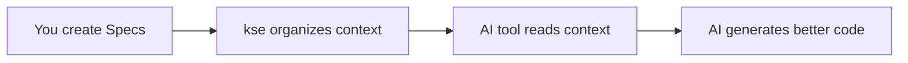
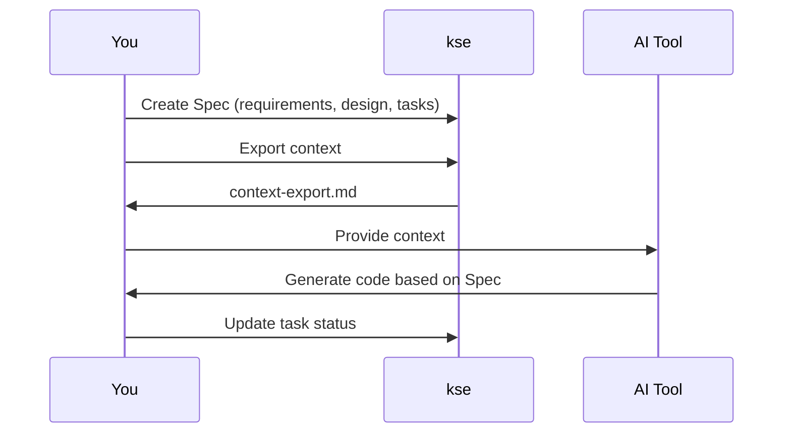

# kse - Kiro Spec Engine

[](https://badge.fury.io/js/kiro-spec-engine)
[](https://opensource.org/licenses/MIT)

**A context provider for AI coding tools** - Structure your project requirements, design, and tasks so AI assistants can help you build better software.

English | [简体中文](README.zh.md)

---

## What is kse?

**kse (Kiro Spec Engine) is a context management system for AI-assisted development.** It helps you organize project information into structured "Specs" (Requirements → Design → Tasks) that AI tools can understand and use effectively.

Think of kse as a **librarian for your AI assistant** - it organizes and presents project context so your AI tool knows exactly what you're building, why, and how.

### How it Works



1. **You create Specs** - Write requirements, design, and tasks in structured markdown files
2. **kse organizes context** - Exports formatted context optimized for AI tools
3. **AI tool reads context** - Your AI assistant understands your project structure
4. **AI generates better code** - Code that matches your design and requirements

### What kse is NOT

- ❌ **Not a code generator** - kse doesn't write code; your AI tool does
- ❌ **Not an IDE** - kse works alongside your existing development tools
- ❌ **Not AI-specific** - Works with Claude, Cursor, Windsurf, Copilot, and any AI tool
- ❌ **Not a replacement for documentation** - It's a structured way to organize project context

### Who Should Use kse?

- ✅ Developers using AI coding assistants (Claude, Cursor, Copilot, etc.)
- ✅ Teams wanting structured project documentation
- ✅ Anyone building features that need clear requirements and design
- ✅ Projects that benefit from spec-driven development

---

## Quick Start (5 Minutes)

### Step 1: Install kse (30 seconds)

```bash
npm install -g kiro-spec-engine
```

Verify installation:
```bash
kse --version
```

### Step 2: Adopt kse in Your Project (1 minute)

Navigate to your project directory and run:

```bash
cd your-project
kse adopt
```

This creates a `.kiro/` directory with:
- `specs/` - Where your Specs live
- `steering/` - Rules for AI behavior (optional)

### Step 3: Create Your First Spec (2 minutes)

```bash
kse create-spec 01-00-user-login
```

This creates three files in `.kiro/specs/01-00-user-login/`:

**requirements.md** - What you're building:
```markdown
# User Login Feature

## User Stories
- As a user, I want to log in with email and password
- As a user, I want to see an error if credentials are wrong

## Acceptance Criteria
- WHEN user enters valid credentials THEN they are logged in
- WHEN user enters invalid credentials THEN they see an error message
```

**design.md** - How you'll build it:
```markdown
# Design

## API Design
- POST /api/auth/login
- Request: { email: string, password: string }
- Response: { token: string } or { error: string }

## Components
- AuthController - handles login logic
- validateEmail() - validates email format
- validatePassword() - checks password requirements
```

**tasks.md** - Step-by-step implementation:
```markdown
- [ ] 1.1 Create AuthController class
- [ ] 1.2 Implement email validation
- [ ] 1.3 Implement password validation
- [ ] 1.4 Implement login endpoint
- [ ] 1.5 Write unit tests
```

### Step 4: Let Your AI Tool Use the Spec (1 minute)

Now your AI tool can access the Spec to generate better code.

**For AI tools with command execution (Cursor, Windsurf, Claude Desktop):**

Just tell your AI:
```
"I have a Spec at 01-00-user-login. Please implement task 1.1"
```

The AI will:
1. Execute `kse context export 01-00-user-login`
2. Read the Spec (requirements, design, tasks)
3. Generate code that follows your design
4. Update task status automatically

**For web-based AI tools (ChatGPT, Claude web):**

```bash
# Export context once
kse context export 01-00-user-login

# Copy to clipboard
cat .kiro/specs/01-00-user-login/context-export.md | pbcopy  # macOS
type .kiro\specs\01-00-user-login\context-export.md | clip  # Windows

# Paste into AI tool and say:
"Here's my Spec. Please implement task 1.1"
```

**The key insight:** You stay in your AI tool. The AI reads the Spec and generates code that matches your design.

### Step 5: Next Steps (30 seconds)

- 📖 Read the [Quick Start Guide](docs/quick-start.md) for detailed examples
- 🔧 Check your tool's integration guide: [Cursor](docs/tools/cursor-guide.md) | [Claude](docs/tools/claude-guide.md) | [Windsurf](docs/tools/windsurf-guide.md)
- 💡 Learn about [Integration Modes](docs/integration-modes.md)

---

## Core Concepts

### Specs

A **Spec** is a structured description of a feature or project component. Each Spec contains:

- **Requirements** (`requirements.md`) - What you're building and why
- **Design** (`design.md`) - How you'll build it (architecture, APIs, components)
- **Tasks** (`tasks.md`) - Step-by-step implementation checklist

### Context Export

**Context export** transforms your Spec into a format optimized for AI tools. It includes:
- All requirements, design decisions, and tasks
- Project structure and conventions
- Steering rules (optional) for AI behavior

### Integration Modes

kse supports three ways to work with AI tools:

1. **Native Integration** - AI tool directly accesses kse (Kiro IDE)
2. **Manual Export** - You export and paste context (Claude, ChatGPT, Cursor)
3. **Watch Mode** - Automatic context updates on file changes (all tools)

Learn more: [Integration Modes Guide](docs/integration-modes.md)

---

## Integration with Your AI Tool

kse works with any AI coding assistant. Choose your tool for specific guidance:

### Popular AI Tools

- **[Cursor](docs/tools/cursor-guide.md)** - IDE with AI pair programming
- **[Claude Code](docs/tools/claude-guide.md)** - Anthropic's coding assistant
- **[Windsurf](docs/tools/windsurf-guide.md)** - AI agent with command execution
- **[Kiro](docs/tools/kiro-guide.md)** - Native integration, no manual export needed
- **[VS Code + Copilot](docs/tools/vscode-guide.md)** - GitHub Copilot integration
- **[Generic AI Tools](docs/tools/generic-guide.md)** - Works with any AI assistant

### Integration Workflow



---

## Documentation

### Getting Started
- 📖 **[Quick Start Guide](docs/quick-start.md)** - Detailed 5-minute tutorial
- 🤔 **[FAQ](docs/faq.md)** - Frequently asked questions
- 🔧 **[Troubleshooting](docs/troubleshooting.md)** - Common issues and solutions

### Core Guides
- 📋 **[Spec Workflow](docs/spec-workflow.md)** - Understanding Specs in depth
- 🔌 **[Integration Modes](docs/integration-modes.md)** - Three ways to integrate kse
- 📝 **[Command Reference](docs/command-reference.md)** - All kse commands

### Tool-Specific Guides
- [Cursor Integration](docs/tools/cursor-guide.md)
- [Claude Code Integration](docs/tools/claude-guide.md)
- [Windsurf Integration](docs/tools/windsurf-guide.md)
- [Kiro Integration](docs/tools/kiro-guide.md)
- [VS Code + Copilot Integration](docs/tools/vscode-guide.md)
- [Generic AI Tools](docs/tools/generic-guide.md)

### Examples
- [API Feature Example](docs/examples/add-rest-api/) - RESTful API Spec
- [UI Feature Example](docs/examples/add-user-dashboard/) - React dashboard Spec
- [CLI Feature Example](docs/examples/add-export-command/) - CLI command Spec

### Advanced Topics
- [Adoption Guide](docs/adoption-guide.md) - Adopting kse in existing projects
- [Upgrade Guide](docs/upgrade-guide.md) - Version upgrade instructions
- [Manual Workflows](docs/manual-workflows-guide.md) - Step-by-step workflows
- [Developer Guide](docs/developer-guide.md) - Contributing and extending kse

### Complete Documentation
- 📚 **[Documentation Index](docs/README.md)** - All documentation in one place

---

## Key Features

### Spec-Driven Development
Structure your work with Requirements → Design → Tasks workflow

### Multi-User Collaboration
- Personal workspaces for team members
- Task claiming and tracking
- Workspace synchronization

### Cross-Tool Compatibility
Export context for Claude Code, Cursor, Windsurf, Copilot, and more

### Watch Mode Automation
Automatic file monitoring and context updates

### Quality Enhancement
- Document quality scoring (0-10 scale)
- Intelligent improvement suggestions
- Professional standards enforcement

### Multi-Language Support
English and Chinese interfaces

---

## Command Overview

```bash
# Project setup
kse adopt                          # Adopt kse in existing project
kse create-spec <name>             # Create new Spec

# Context management
kse context export <spec-name>     # Export context for AI tools
kse prompt generate <spec> <task>  # Generate task-specific prompt

# Task management
kse task claim <spec> <task-id>    # Claim a task
kse task list <spec>               # List claimed tasks

# Automation
kse watch start                    # Start watch mode
kse watch status                   # Check watch status

# Project info
kse status                         # Project status
kse workflows                      # List available workflows
```

See [Command Reference](docs/command-reference.md) for complete documentation.

---

## Contributing & Support

### Getting Help

- 📖 **Documentation**: Start with the [Quick Start Guide](docs/quick-start.md)
- 🐛 **Bug Reports**: [GitHub Issues](https://github.com/yourusername/kiro-spec-engine/issues)
- 💬 **Discussions**: [GitHub Discussions](https://github.com/yourusername/kiro-spec-engine/discussions)
- 📧 **Email**: support@example.com

### Contributing

We welcome contributions! See our [Contributing Guide](CONTRIBUTING.md) for:
- Code contributions
- Documentation improvements
- Bug reports and feature requests
- Translation help

### Development Setup

```bash
git clone https://github.com/yourusername/kiro-spec-engine.git
cd kiro-spec-engine
npm install
npm link  # For local development
npm test  # Run tests
```

---

## License

MIT License - see [LICENSE](LICENSE) file for details.

---

## Acknowledgments

- Inspired by the **Sisyphus** myth and the concept of noble struggle
- Built on the foundation of **Kiro** spec-driven development
- Influenced by **oh-my-opencode** and the Ultrawork Manifesto

---

**Ready to enhance your AI-assisted development?** 🚀

```bash
npm install -g kiro-spec-engine
kse adopt
kse create-spec 01-00-my-first-feature
```

---

**Version**: 1.4.0  
**Last Updated**: 2026-01-23
