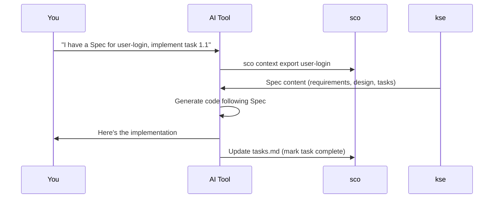

# SCO - Scene Capability Orchestrator

[](https://badge.fury.io/js/sco-engine)
[](https://opensource.org/licenses/MIT)

> **⚠️ Important Clarification**: `sco-engine` (`sco`) is an **npm package and CLI tool** for spec-driven development.  
> It is **NOT** the Kiro IDE desktop application. If you're looking for Kiro IDE, visit https://kiro.dev
> Legacy commands `kse` and `kiro-spec-engine` remain available for compatibility.

**A context provider for AI coding tools** - Structure your project requirements, design, and tasks so AI assistants can help you build better software.

**🚀 NEW: Autonomous Control** - Let AI independently manage entire development workflows from requirements to delivery.

English | [简体中文](README.zh.md)

---

## What is sco?

**SCO (Scene Capability Orchestrator) is a context management system for AI-assisted development.** It helps you organize project information into structured "Specs" (Requirements → Design → Tasks) that AI tools can understand and use effectively.

Think of sco as a **librarian for your AI assistant** - it organizes and presents project context so your AI tool knows exactly what you're building, why, and how.

### How it Works


1. **You create Specs** - Write requirements, design, and tasks in structured markdown files
2. **sco organizes context** - Exports formatted context optimized for AI tools
3. **AI tool reads context** - Your AI assistant understands your project structure
4. **AI generates better code** - Code that matches your design and requirements

### What sco is NOT

- ❌ **Not a code generator** - sco doesn't write code; your AI tool does
- ❌ **Not an IDE** - sco works alongside your existing development tools
- ❌ **Not AI-specific** - Works with Claude, Cursor, Windsurf, Copilot, and any AI tool
- ❌ **Not a replacement for documentation** - It's a structured way to organize project context

### Who Should Use sco?

- ✅ Developers using AI coding assistants (Claude, Cursor, Copilot, etc.)
- ✅ Teams wanting structured project documentation
- ✅ Anyone building features that need clear requirements and design
- ✅ Projects that benefit from spec-driven development

## Why sco Wins in AI Delivery

| Advantage | sco Capability | Practical Impact |
| --- | --- | --- |
| Structure-first execution | Requirements → Design → Tasks + gate checks | Lower rework and fewer requirement drifts |
| Autonomous close-loop delivery | One-command close loop (`auto close-loop`) | No step-by-step confirmation waits |
| Multi-agent scale-out | DAG orchestration (`orchestrate run/status/stop`) | Parallel delivery without manual terminal juggling |
| Auto portfolio decomposition | Master/Sub spec split + dependency wiring | Complex goals become executable parallel plans automatically |
| Program self-healing closure | `auto close-loop-program` auto recovery + learned remediation memory | Failed/partial runs continue autonomously until bounded convergence |
| Queue-driven autonomous runtime | `auto close-loop-controller` persistent queue drain | Program-scale backlogs continue without manual re-triggering |
| Autonomous convergence governance | Program gate (`min-success-rate` + `max-risk-level`) + audit JSON output | Program completion is policy-verified and traceable |
| Measurable outcomes | KPI automation (`value metrics snapshot/baseline/trend`) | Delivery quality can be tracked week-over-week |
| Tool-agnostic adoption | Works across Claude/Cursor/Windsurf/Copilot/Kiro | No lock-in to a single AI IDE |
| Built-in governance | Docs governance, lock management, audit, env/workspace controls | Team collaboration stays auditable and stable |

### 90-Second Value Proof

```bash
# 1) Adopt sco in current repo
sco adopt

# 2) Generate Spec workflow draft
sco spec bootstrap --name 01-00-demo-feature --non-interactive

# 3) Generate KPI input sample
sco value metrics sample --out ./kpi-input.json --json

# 4) Produce machine-readable KPI snapshot
sco value metrics snapshot --input ./kpi-input.json --json
```

---

## Quick Start

### The Simplest Way (30 seconds) ⚡

**Just tell your AI:**

```
Install sco and use it to manage this project with Spec-driven development.
```

**Your AI will:**
1. Install sco globally (`npm install -g sco-engine`)
2. Adopt it in your project (`sco adopt`)
3. Read the methodology guide (`.kiro/README.md`)
4. Start working according to Spec-driven approach

**That's it!** Your AI handles everything. No manual steps needed.

---

### Step-by-Step Guide (if you want details) 📋

<details>
<summary><b>Click to expand detailed steps</b></summary>

#### Step 1: Install sco (30 seconds)

```bash
npm install -g sco-engine
```

Verify installation:
```bash
sco --version
```

#### Step 2: Adopt sco in Your Project (30 seconds)

Navigate to your project directory and run:

```bash
cd your-project
sco adopt
```

This creates a `.kiro/` directory with:
- `README.md` - Project development guide for AI
- `specs/` - Where your Specs live
- `steering/` - Development rules (optional)

#### Step 3: Tell Your AI About the Methodology (30 seconds)

**In your AI tool (Cursor, Claude, Windsurf, Kiro, etc.), say:**

```
Please read .kiro/README.md to understand how this project works.
```

**Your AI will learn:**
- This project follows Spec-driven development
- Every feature starts with a Spec (requirements + design + tasks)
- How to work with this methodology
- When to use sco commands

#### Step 4: Start Building Features

**Just ask your AI to implement features naturally:**

```
I need a user login feature with email and password.
```

**Your AI will automatically:**
1. Create a Spec with requirements, design, and tasks
2. Implement according to the Spec
3. Update task status as work progresses
4. Use sco commands internally (you don't need to run them)

**Example conversation:**
- **You**: "I need user login with email and password"
- **AI**: "I'll create a Spec for this. Let me define the requirements..."
- **AI**: "Here's the design... Now I'll implement task 1.1..."
- **AI**: "Task 1.1 complete. Moving to task 1.2..."

</details>

---

**Key insight:** You don't "use sco" - your project "follows Spec-driven methodology" and sco helps enforce it. The AI handles all the sco commands for you.

### Step 5: Next Steps (30 seconds)

- 📖 Read the [Quick Start Guide](docs/quick-start.md) for detailed examples
- 🔧 Check your tool's integration guide: [Cursor](docs/tools/cursor-guide.md) | [Claude](docs/tools/claude-guide.md) | [Windsurf](docs/tools/windsurf-guide.md)
- 💡 Learn about [Integration Modes](docs/integration-modes.md)

---

## Core Concepts

### Specs

A **Spec** is a structured description of a feature or project component. Each Spec contains:

- **Requirements** (`requirements.md`) - What you're building and why
- **Design** (`design.md`) - How you'll build it (architecture, APIs, components)
- **Tasks** (`tasks.md`) - Step-by-step implementation checklist

### Context Export

**Context export** transforms your Spec into a format optimized for AI tools. It includes:
- All requirements, design decisions, and tasks
- Project structure and conventions
- Steering rules (optional) for AI behavior

### Integration Modes

sco supports three ways to work with AI tools:

1. **Native Integration** - AI tool directly accesses sco (Kiro IDE)
2. **Manual Export** - You export and paste context (Claude, ChatGPT, Cursor)
3. **Watch Mode** - Automatic context updates on file changes (all tools)

Learn more: [Integration Modes Guide](docs/integration-modes.md)

---

## Integration with Your AI Tool

sco works with any AI coding assistant. Choose your tool for specific guidance:

### Popular AI Tools

- **[Cursor](docs/tools/cursor-guide.md)** - IDE with AI pair programming
- **[Claude Code](docs/tools/claude-guide.md)** - Anthropic's coding assistant
- **[Windsurf](docs/tools/windsurf-guide.md)** - AI agent with command execution
- **[Kiro](docs/tools/kiro-guide.md)** - Native integration, no manual export needed
- **[VS Code + Copilot](docs/tools/vscode-guide.md)** - GitHub Copilot integration
- **[Generic AI Tools](docs/tools/generic-guide.md)** - Works with any AI assistant

### Integration Workflow



**Key insight:** You stay in your AI tool. The AI reads the Spec and generates code that matches your design.

---

## Documentation

### Getting Started
- 📖 **[Quick Start Guide](docs/quick-start.md)** - Detailed 5-minute tutorial
- 🤔 **[FAQ](docs/faq.md)** - Frequently asked questions
- 🔧 **[Troubleshooting](docs/troubleshooting.md)** - Common issues and solutions

### Core Guides
- 📋 **[Spec Workflow](docs/spec-workflow.md)** - Understanding Specs in depth
- 🔢 **[Spec Numbering Strategy](docs/spec-numbering-guide.md)** - How to number your Specs
- 📄 **[Document Governance](docs/document-governance.md)** - Automated document management
- 🌍 **[Environment Management](docs/environment-management-guide.md)** - Multi-environment configuration
- 📦 **[Multi-Repository Management](docs/multi-repo-management-guide.md)** - Manage multiple Git repositories
- 🎭 **[Scene Runtime](docs/scene-runtime-guide.md)** - Template engine, quality pipeline, ontology, Moqui ERP
- 🤖 **[Multi-Agent Coordination](docs/multi-agent-coordination-guide.md)** - Parallel agent coordination
- 📈 **[Value Observability](docs/value-observability-guide.md)** - KPI snapshot, baseline, trend, gate-ready evidence
- 🔌 **[Integration Modes](docs/integration-modes.md)** - Three ways to integrate sco
- 📝 **[Command Reference](docs/command-reference.md)** - All sco commands

### Tool-Specific Guides
- [Cursor Integration](docs/tools/cursor-guide.md)
- [Claude Code Integration](docs/tools/claude-guide.md)
- [Windsurf Integration](docs/tools/windsurf-guide.md)
- [Kiro Integration](docs/tools/kiro-guide.md)
- [VS Code + Copilot Integration](docs/tools/vscode-guide.md)
- [Generic AI Tools](docs/tools/generic-guide.md)

### Examples
- [API Feature Example](docs/examples/add-rest-api/) - RESTful API Spec
- [UI Feature Example](docs/examples/add-user-dashboard/) - React dashboard Spec
- [CLI Feature Example](docs/examples/add-export-command/) - CLI command Spec

### Advanced Topics
- [Adoption Guide](docs/adoption-guide.md) - Adopting sco in existing projects
- [Upgrade Guide](docs/upgrade-guide.md) - Version upgrade instructions
- [Release Archive](docs/releases/README.md) - Versioned release notes and validation report index
- [Release Notes v1.46.2](docs/releases/v1.46.2.md) - Current release highlights and impact
- [Validation Report v1.46.2](docs/releases/v1.46.2-validation.md) - Release-readiness evidence and verification results
- [Release Checklist](docs/release-checklist.md) - Repeatable pre-release verification flow
- [Manual Workflows](docs/manual-workflows-guide.md) - Step-by-step workflows
- [Developer Guide](docs/developer-guide.md) - Contributing and extending sco

### Complete Documentation
- 📚 **[Documentation Index](docs/README.md)** - All documentation in one place

---

## Key Features

### Autonomous Control 🚀 NEW in v1.23.0
- **Fully Autonomous Execution**: AI independently manages entire development workflows from requirements to delivery
- **Closed-Loop Program Execution**: `sco auto close-loop "<goal>"` runs from goal decomposition to terminal orchestration state without manual confirmation gates
- **Automatic Master/Sub Portfolio Split**: Large goals are auto-split into dependency-wired sub-specs and coordinated by a master spec
- **Semantic Decomposition + Live Stream**: Clause/category-aware goal parsing plus live orchestration status stream (disable via `--no-stream`)
- **Session Resume + Retention Hygiene**: Resume interrupted runs with `--resume interrupted` (or `--resume latest`) and maintain archives via `sco auto session list/prune`, `sco auto batch-session list/prune`, and `sco auto controller-session list/prune`
- **Intelligent Error Recovery**: Automatically diagnose and fix errors with 3 retry attempts and learning system
- **Strategic Checkpoints**: Pause only at meaningful milestones (phase boundaries, fatal errors, external resources)
- **Continuous Task Execution**: Execute multiple tasks without interruption between individual tasks
- **Learning System**: Improve over time by learning from successful and failed recovery strategies
- **Safety Boundaries**: Respect workspace boundaries, require confirmation for production/external operations
- **Three Execution Modes**: Conservative (safe), Balanced (default), Aggressive (fast)
- **Progress Tracking**: Real-time status, estimated completion time, detailed execution reports
- **Rollback Support**: Create checkpoints and rollback to previous states if needed
- **CORE_PRINCIPLES Compliance**: Follows Spec-driven development, file management, and quality standards

**Quick Start**:
```bash
# Decompose one broad goal into master/sub specs and run to closure
sco auto close-loop "build autonomous close-loop and master/sub multi-spec execution for sco"

# Create and execute a feature autonomously
sco auto create "user authentication with JWT tokens"

# Run existing Spec autonomously
sco auto run 33-00-ai-autonomous-control

# Check status
sco auto status

# Resume after pause
sco auto resume
```

[Learn more about Autonomous Control →](docs/autonomous-control-guide.md)

### Spec-Driven Development
Structure your work with Requirements → Design → Tasks workflow

### KPI Automation & Observability 🚀 NEW in v1.46.2
- **Unified Metric Contract**: Load and validate KPI definitions from `metric-definition.yaml`
- **Weekly Snapshot Pipeline**: Generate machine-readable snapshots with risk level and audit reasons
- **Baseline and Trend Analysis**: Build baseline from historical data and detect worsening trends automatically
- **Gate-Ready Summary**: Emit Day30/Day60-consumable summary payloads with evidence paths
- **CLI Commands**: `value metrics sample`, `value metrics snapshot`, `value metrics baseline`, `value metrics trend` with `--json` support

### Multi-Workspace Management 🚀 NEW in v1.11.0
- **Workspace Registry**: Manage multiple sco projects from a single location
- **Quick Switching**: Switch between projects without directory navigation
- **Data Atomicity**: Single source of truth (`~/.kse/workspace-state.json`)
- **Cross-Platform**: Consistent path handling across Windows/Linux/macOS
- **Auto Migration**: Seamless upgrade from legacy workspace format

### Environment Configuration Management 🚀 NEW in v1.14.0
- **Environment Registry**: Manage multiple environment configurations (dev, test, staging, prod)
- **Quick Switching**: Switch between environments with automatic backup
- **Automatic Backup**: Create timestamped backups before each switch
- **Rollback Support**: Restore previous environment configuration instantly
- **Verification**: Validate environment configuration after switching
- **Command Execution**: Run commands in specific environment context
- **Cross-Platform**: Works seamlessly on Windows, Linux, and macOS

### Multi-Repository Management 🚀 NEW in v1.20.0
- **Unified Interface**: Manage multiple Git subrepositories from a single command
- **Auto-Discovery**: Automatically scan and configure all Git repositories in your project
- **Nested Repository Support**: Discover and manage Git repositories nested inside other repositories
- **Parent-Child Tracking**: Track relationships between parent and nested repositories
- **Batch Operations**: Execute Git commands across all repositories simultaneously
- **Status Overview**: View status of all repositories in a single table with parent relationships
- **Health Checks**: Verify repository configuration and connectivity
- **Cross-Platform**: Consistent path handling across Windows/Linux/macOS
- **Smart Exclusions**: Automatically skip common non-repository directories (node_modules, build, etc.)

### Moqui ERP Integration 🚀 NEW in v1.39.0
- **Moqui ERP Adapter**: Connect KSE scene runtime to live Moqui ERP instances
  - `MoquiClient` — HTTP client with JWT auth lifecycle (login, refresh, re-login, logout) and retry logic
  - `MoquiAdapter` — Binding handler for `spec.erp.*` and `moqui.*` refs, entity CRUD, service invocation, screen discovery
- **Scene Template Extractor** (v1.40.0): Analyze Moqui resources, identify business patterns, generate reusable scene templates
  - Entity grouping by Header/Item suffix patterns (e.g., OrderHeader + OrderItem → composite)
  - Pattern-based manifest generation with governance contracts
- **CLI Commands**: `scene connect`, `scene discover`, `scene extract` with `--json` support

### Multi-Agent Parallel Coordination 🚀 NEW in v1.43.0
- **Agent Registry**: MachineIdentifier-based agent lifecycle with heartbeat monitoring and inactive cleanup
- **Task Lock Manager**: File-based task locking with atomic operations, single-agent backward compatibility
- **Task Status Store**: Concurrent-safe task status updates with exponential backoff retry
- **Steering File Lock**: Write serialization with pending-file degradation fallback
- **Merge Coordinator**: Git branch isolation per agent (`agent/{agentId}/{specName}`), conflict detection, auto-merge
- **Central Coordinator**: Dependency-driven ready task computation, task assignment, progress tracking
- **Zero Overhead**: All components are no-ops in single-agent mode (full backward compatibility)

[Learn more about Multi-Agent Coordination →](docs/multi-agent-coordination-guide.md)

### Agent Orchestrator 🚀 NEW in v1.45.0
- **Automated Multi-Agent Spec Execution**: Replace manual multi-terminal workflows with a single command
- **DAG-Based Scheduling**: Analyze Spec dependencies, compute execution batches via topological sort
- **Parallel Execution**: Run up to N Specs simultaneously via Codex CLI sub-agents (`--max-parallel`)
- **Failure Propagation**: Failed Spec's dependents automatically marked as skipped
- **Retry Mechanism**: Configurable automatic retry for failed Specs
- **Real-Time Monitoring**: Track per-Spec status and overall orchestration progress
- **Graceful Termination**: Stop all sub-agents cleanly (SIGTERM → SIGKILL)
- **Configurable**: Codex command, args, parallelism, timeout, retries via `.kiro/config/orchestrator.json`

**Quick Start**:
```bash
# Run 3 Specs in parallel via Codex CLI
sco orchestrate run --specs "spec-a,spec-b,spec-c" --max-parallel 3

# Check orchestration progress
sco orchestrate status

# Stop all sub-agents
sco orchestrate stop
```

Tip: `sco spec bootstrap|pipeline run|gate run --specs ...` now defaults to this orchestrate mode automatically.

**Recommended Codex-Orchestrator config (`.kiro/config/orchestrator.json`)**:
```json
{
  "agentBackend": "codex",
  "maxParallel": 3,
  "timeoutSeconds": 900,
  "maxRetries": 2,
  "rateLimitMaxRetries": 6,
  "rateLimitBackoffBaseMs": 1000,
  "rateLimitBackoffMaxMs": 30000,
  "rateLimitAdaptiveParallel": true,
  "rateLimitParallelFloor": 1,
  "rateLimitCooldownMs": 30000,
  "apiKeyEnvVar": "CODEX_API_KEY",
  "codexArgs": ["--skip-git-repo-check"],
  "codexCommand": "npx @openai/codex"
}
```

If Codex CLI is globally installed, you can set `"codexCommand": "codex"`.
Use the `rateLimit*` settings to absorb transient 429/too-many-requests failures without stalling orchestration.

### Spec-Level Steering & Context Sync 🚀 NEW in v1.44.0
- **Spec Steering (L4)**: Independent `steering.md` per Spec with constraints, notes, and decisions — zero cross-agent conflict
- **Steering Loader**: Unified L1-L4 four-layer steering loader with priority-based merging
- **Context Sync Manager**: Multi-agent friendly CURRENT_CONTEXT.md with structured Spec progress table, concurrent-safe updates
- **Spec Lifecycle Manager**: State machine (planned → assigned → in-progress → completed → released) with auto-completion detection
- **Sync Barrier**: Agent Spec-switch synchronization — uncommitted change check + steering reload
- **Coordinator Integration**: Auto Spec completion check on task complete, SyncBarrier on task assign

### Scene Ontology Enhancement 🚀 NEW in v1.42.0
- **OntologyGraph**: Semantic relationship graph for binding refs (depends_on, composes, extends, produces)
- **Action Abstraction**: Intent, preconditions, postconditions per binding for AI agent understanding
- **Data Lineage**: Source → transform → sink tracking in governance_contract
- **Agent-Ready Metadata**: `agent_hints` field with summary, complexity, duration, permissions, sequence
- **Agent Readiness Score**: Bonus quality dimension (max +10 points)
- **CLI Commands**: `scene ontology show|deps|validate|actions|lineage|agent-info` with `--json` support

### Scene Template Quality Pipeline 🚀 NEW in v1.41.0
- **Template Lint Engine**: 10-category quality checks for scene packages (manifest completeness, binding refs, governance, consistency, variables, documentation, action abstraction, data lineage, agent hints)
- **Quality Score Calculator**: 4-dimension scoring + agent_readiness bonus (contract validity, lint pass rate, documentation quality, governance completeness + agent readiness max +10) with 0-100+ scale
- **One-Stop Contribute Pipeline**: Validate → Lint → Score → Preview → Publish in a single command
- **CLI Commands**: `scene lint`, `scene score`, `scene contribute` with `--strict`, `--dry-run`, `--skip-lint`, `--json` support

### Scene Template Engine 🚀 NEW in v1.25.0
- **Template Variable Schema**: Define typed variables (string, number, boolean, enum, array) with validation rules in scene-package.json
- **Multi-File Rendering**: Recursive template processing with `{{variable}}` substitution, `{{#if}}` conditionals, `{{#each}}` loops
- **Three-Layer Inheritance**: L1-Capability / L2-Domain / L3-Instance package hierarchy with schema and file merging
- **CLI Commands**: `scene template-validate`, `scene template-resolve`, `scene template-render` with `--json` support

### Spec-Level Collaboration 🚀 NEW in v1.22.0
- **Parallel Development**: Enable multiple AI instances to work on different Specs simultaneously
- **Dependency Management**: Define and track dependencies between Specs with circular dependency detection
- **Interface Contracts**: Formal API definitions ensuring compatibility between independently developed Specs
- **Status Tracking**: Monitor progress and assignments across all Specs in real-time
- **Integration Testing**: Run cross-Spec integration tests to verify modules work together
- **Dependency Visualization**: View dependency graphs with critical path highlighting
- **Backward Compatible**: Opt-in system that doesn't affect existing single-Spec workflows

[Learn more about Spec-Level Collaboration →](docs/spec-collaboration-guide.md)

### Spec Locking Mechanism 🚀 NEW
- **Multi-User Coordination**: Prevent conflicts when multiple developers work on the same Spec
- **Machine Identification**: Unique machine IDs for accurate lock ownership tracking
- **Stale Lock Detection**: Automatic detection and cleanup of abandoned locks (default: 24h timeout)
- **Lock Status Integration**: View lock status in `sco status` output
- **Force Unlock**: Override locks when necessary with `--force` flag
- **Backward Compatible**: Locking is optional and doesn't affect existing workflows

**Quick Start**:
```bash
# Acquire a lock before editing
sco lock acquire my-feature --reason "Implementing auth module"

# Check lock status
sco lock status

# Release when done
sco unlock my-feature

# Clean up stale locks
sco lock cleanup

# View your machine ID
sco lock whoami
```

### DevOps Integration Foundation 🚀
- **Operations Spec Management**: Standardized operations documentation (deployment, monitoring, troubleshooting, etc.)
- **Progressive AI Autonomy**: L1-L5 takeover levels for gradual AI operations control
- **Audit Logging**: Tamper-evident audit trail with SHA-256 integrity verification
- **Feedback Integration**: Automated user feedback processing and analytics
- **Permission Management**: Environment-based security controls (dev, test, pre-prod, prod)
- **Operations Validation**: Complete spec validation with clear error reporting

### Document Governance
- Automated document lifecycle management
- Clean project structure enforcement
- Temporary file cleanup
- Artifact organization
- Git hooks for compliance

### Multi-User Collaboration
- Personal workspaces for team members
- Task claiming and tracking
- Workspace synchronization

### Cross-Tool Compatibility
Export context for Claude Code, Cursor, Windsurf, Copilot, and more

### Watch Mode Automation
Automatic file monitoring and context updates

### Quality Enhancement
- Document quality scoring (0-10 scale)
- Intelligent improvement suggestions
- Professional standards enforcement

### Multi-Language Support
English and Chinese interfaces

---

## Command Overview

```bash
# Project setup
sco adopt                          # Adopt sco in existing project
sco create-spec <name>             # Legacy: create empty Spec folder only

# Autonomous close-loop program (one command, no confirmation loop)
sco auto close-loop "<goal>"       # Auto split goal into master/sub specs and execute to closure
sco auto close-loop --resume interrupted # Resume from latest non-completed close-loop session
sco auto close-loop continue       # Shorthand: continue latest interrupted close-loop session
sco auto continue                  # Shortcut command: continue latest interrupted close-loop session
sco auto close-loop "<goal>" --dry-run --json  # Preview decomposition plan only
sco auto close-loop-program "<goal>" --program-govern-until-stable --program-govern-use-action 1 --json # Program-level recovery + governance with remediation action execution
sco auto close-loop-controller .kiro/auto/program-queue.lines --wait-on-empty --dequeue-limit 2 --json # Queue-driven autonomous controller for broad-goal backlogs
sco auto close-loop-controller --controller-resume latest --json # Resume autonomous controller from latest persisted checkpoint
sco auto controller-session list --limit 50 --json # Inspect persisted close-loop-controller summary sessions
sco auto controller-session prune --keep 20 --older-than-days 14 --dry-run --json # Prune old controller summaries by retention policy
sco auto observability snapshot --days 14 --json # Unified autonomous observability snapshot (sessions + governance + trend)
sco auto spec status 121-00-master --json # Agent-facing structured spec status interface
sco auto spec instructions 121-02-sub-track --json # Agent-facing execution instructions for one spec
sco auto schema check --json # Check autonomous archive schema compatibility
sco auto schema migrate --apply --json # Backfill/migrate schema_version for autonomous archives

# Spec workflow (recommended)
sco spec bootstrap --name <spec> --non-interactive         # Generate requirements/design/tasks draft
sco spec pipeline run --spec <spec>                         # Run staged workflow for one Spec
sco spec gate run --spec <spec> --json                      # Run standardized Spec gate checks
sco spec bootstrap --specs "<spec-a,spec-b>" --max-parallel <N>  # Multi-Spec defaults to orchestrate
sco spec pipeline run --specs "<spec-a,spec-b>" --max-parallel <N> # Multi-Spec defaults to orchestrate
sco spec gate run --specs "<spec-a,spec-b>" --max-parallel <N>     # Multi-Spec defaults to orchestrate

# Context management
sco context export <spec-name>     # Export context for AI tools
sco prompt generate <spec> <task>  # Generate task-specific prompt

# KPI automation and observability (NEW in v1.46.2)
sco value metrics sample --out <path> --json               # Generate sample KPI input JSON
sco value metrics snapshot --input <path> --json          # Generate weekly KPI snapshot + gate summary
sco value metrics baseline --from-history <N> --json      # Build baseline from earliest N snapshots
sco value metrics trend --window <N> --json               # Analyze trend/risk from latest N snapshots
sco auto kpi trend --weeks 8 --period week --json         # Aggregate autonomous delivery KPI trend (weekly/daily buckets + anomalies)
sco auto kpi trend --weeks 8 --period day --csv --out <path> # Export autonomous KPI trend as CSV
sco auto kpi trend --weeks 8 --mode controller --json     # Filter trend to close-loop-controller sessions only

# Workspace management (NEW in v1.11.0)
sco workspace create <name> [path] # Register a new workspace
sco workspace list                 # List all workspaces
sco workspace switch <name>        # Switch active workspace
sco workspace info [name]          # Show workspace details
sco workspace remove <name>        # Remove workspace

# Environment management (NEW in v1.14.0)
sco env list                       # List all environments
sco env switch <name>              # Switch to environment (with backup)
sco env info                       # Show active environment details
sco env register <config-file>     # Register new environment
sco env unregister <name>          # Remove environment
sco env rollback                   # Rollback to previous environment
sco env verify                     # Verify current environment
sco env run "<command>"            # Run command in environment context

# Multi-repository management (NEW in v1.20.0)
sco repo init [--nested]           # Initialize repository configuration (nested scanning by default)
sco repo init --no-nested          # Initialize without nested repository scanning
sco repo status [--verbose]        # Show status of all repositories (including nested)
sco repo exec "<command>"          # Execute command in all repositories

# Spec-level collaboration (NEW in v1.22.0)
sco collab init <master> [options] # Initialize Master Spec with Sub-Specs
sco collab status [spec] [--graph] # Display collaboration status
sco collab assign <spec> <kiro>    # Assign Spec to Kiro instance
sco collab verify <spec>           # Verify interface contracts
sco collab integrate <specs...>    # Run integration tests
sco collab migrate <spec>          # Convert standalone Spec to collaborative
sco repo health                    # Check repository health

# Scene template engine (NEW in v1.25.0)
sco scene template-validate --package <path>   # Validate template variable schema
sco scene template-resolve --package <name>    # Resolve inheritance chain and merged schema
sco scene template-render --package <name> --values <json> --out <dir>  # Render template files

# Moqui ERP integration (NEW in v1.39.0)
sco scene connect --config <path>              # Test connectivity to Moqui ERP instance
sco scene discover --config <path>             # Discover entities, services, screens from Moqui
sco scene extract --config <path> --out <dir>  # Extract scene templates from Moqui (v1.40.0)

# Scene template quality pipeline (NEW in v1.41.0)
sco scene lint --package <path>                # Lint scene package for quality issues
sco scene score --package <path>               # Calculate quality score (0-100)
sco scene contribute --package <path>          # One-stop validate → lint → score → publish

# Scene ontology (NEW in v1.42.0)
sco scene ontology show --package <path>       # Show ontology graph
sco scene ontology deps --ref <ref>            # Query dependency chain
sco scene ontology impact --ref <ref>          # Analyze reverse impact radius
sco scene ontology path --from <ref> --to <ref> # Query shortest ontology relation path
sco scene ontology validate --package <path>   # Validate graph consistency
sco scene ontology actions --ref <ref>         # Show action abstraction
sco scene ontology lineage --ref <ref>         # Show data lineage
sco scene ontology agent-info --package <path> # Show agent hints
sco scene contribute --package <path>          # One-stop validate → lint → score → publish

# Agent orchestration (NEW in v1.45.0)
sco orchestrate run --specs "<spec-list>" --max-parallel <N>  # Start multi-agent orchestration
sco orchestrate status                         # View orchestration progress
sco orchestrate stop                           # Stop all sub-agents

# DevOps operations
sco ops init <project-name>        # Initialize operations specs
sco ops validate [<project>]       # Validate operations completeness
sco ops audit [options]            # Query audit logs
sco ops takeover <action>          # Manage AI takeover levels
sco ops feedback <action>          # Manage user feedback

# Task management
sco task claim <spec> <task-id>    # Claim a task
sco task list <spec>               # List claimed tasks

# Spec locking (multi-user collaboration)
sco lock acquire <spec-name>       # Acquire lock on a Spec
sco lock release <spec-name>       # Release lock (or use: sco unlock)
sco lock status [spec-name]        # Show lock status
sco lock cleanup                   # Remove stale locks
sco lock whoami                    # Show machine identifier
sco unlock <spec-name> [--force]   # Release lock (alias)

# Document governance
sco docs diagnose                  # Check document compliance
sco docs cleanup                   # Remove temporary files
sco docs validate                  # Validate document structure
sco docs archive --spec <name>     # Organize Spec artifacts
sco docs hooks install             # Install Git pre-commit hooks

# Automation
sco watch start                    # Start watch mode
sco watch status                   # Check watch status

# Project info
sco status                         # Project status
sco workflows                      # List available workflows
```

See [Command Reference](docs/command-reference.md) for complete documentation.

---

## Contributing & Support

### Getting Help

- 📖 **Documentation**: Start with the [Quick Start Guide](docs/quick-start.md)
- 🐛 **Bug Reports**: [GitHub Issues](https://github.com/heguangyong/kiro-spec-engine/issues)
- 💬 **Discussions**: [GitHub Discussions](https://github.com/heguangyong/kiro-spec-engine/discussions)

### Contributing

We welcome contributions! See our [Contributing Guide](CONTRIBUTING.md) for:
- Code contributions
- Documentation improvements
- Bug reports and feature requests
- Translation help

### Development Setup

```bash
git clone https://github.com/heguangyong/kiro-spec-engine.git
cd kiro-spec-engine
npm install
npm link  # For local development
npm test  # Run tests
```

---

## License

MIT License - see [LICENSE](LICENSE) file for details.

---

## Acknowledgments

- Inspired by the **Sisyphus** myth and the concept of noble struggle
- Built on the foundation of **Kiro** spec-driven development
- Influenced by **oh-my-opencode** and the Ultrawork Manifesto

---

**Ready to enhance your AI-assisted development?** 🚀

```bash
npm install -g sco-engine
sco adopt
sco spec bootstrap --name 01-00-my-first-feature --non-interactive
```

---

## 💬 Community & Discussion

Join our community to discuss AI-driven development, Spec workflows, and best practices.

### WeChat Group


*Scan to add WeChat, note "sco" to join the group*

### Other Channels

- **GitHub Discussions**: [Join Discussion](https://github.com/heguangyong/kiro-spec-engine/discussions)
- **Issues**: [Report Issues](https://github.com/heguangyong/kiro-spec-engine/issues)

### Featured Article

📖 **[The Philosophy and Practice of AI-Driven Development](docs/articles/ai-driven-development-philosophy-and-practice.md)**

A deep conversation about AI development trends, Neo-Confucian philosophy, and software engineering practices. Based on 2000+ hours of AI-assisted programming experience.

[Read in English](docs/articles/ai-driven-development-philosophy-and-practice.en.md) | [中文版](docs/articles/ai-driven-development-philosophy-and-practice.md)

**Also available on:**
- [WeChat Official Account (微信公众号)](https://mp.weixin.qq.com/s/GRo0XQ6GvQ03T4_FTvAsKA)
- [Juejin (掘金)](https://juejin.cn/post/7598899986857377798)
- [Zhihu (知乎)](https://zhuanlan.zhihu.com/p/1999164891391624163)
- [X/Twitter](https://x.com/heguangyong/status/2015668235065229782)

---

**Version**: 2.0.0  
**Last Updated**: 2026-02-18

