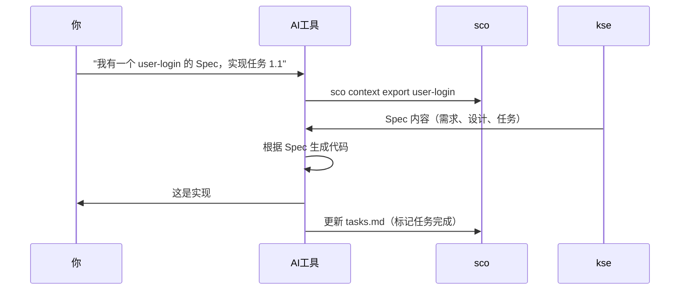

# SCO - Scene Capability Orchestrator

[](https://badge.fury.io/js/sco-engine)
[](https://opensource.org/licenses/MIT)

> **⚠️ 重要说明**: `sco-engine`（`sco`）是一个 **npm 包和 CLI 工具**，用于 Spec 驱动开发。  
> 它**不是** Kiro IDE 桌面应用程序。如果你在寻找 Kiro IDE，请访问 https://kiro.dev
> 兼容保留旧命令：`kse` 与 `kiro-spec-engine`。

**AI 编码工具的上下文提供者** - 结构化你的项目需求、设计和任务，让 AI 助手帮你构建更好的软件。

[English](README.md) | 简体中文

---

## 什么是 sco？

**SCO（场景能力编排引擎）是一个 AI 辅助开发的上下文管理系统。** 它帮助你将项目信息组织成结构化的 "Spec"（需求 → 设计 → 任务），让 AI 工具能够理解和有效使用。

把 sco 想象成 **AI 助手的图书管理员** - 它组织和呈现项目上下文，让你的 AI 工具准确知道你在构建什么、为什么构建以及如何构建。

### 工作原理


1. **你创建 Spec** - 在结构化的 markdown 文件中编写需求、设计和任务
2. **sco 组织上下文** - 导出为 AI 工具优化的格式
3. **AI 工具读取上下文** - 你的 AI 助手理解项目结构
4. **AI 生成更好的代码** - 符合你设计和需求的代码

### sco 不是什么

- ❌ **不是代码生成器** - sco 不写代码；你的 AI 工具写代码
- ❌ **不是 IDE** - sco 与你现有的开发工具配合使用
- ❌ **不是特定 AI 工具** - 适用于 Claude、Cursor、Windsurf、Copilot 等任何 AI 工具
- ❌ **不是文档的替代品** - 它是组织项目上下文的结构化方式

### 谁应该使用 sco？

- ✅ 使用 AI 编码助手的开发者（Claude、Cursor、Copilot 等）
- ✅ 需要结构化项目文档的团队
- ✅ 构建需要清晰需求和设计的功能的任何人
- ✅ 受益于 Spec 驱动开发的项目

## 为什么 sco 更有优势

| 优势点 | sco 能力 | 实际收益 |
| --- | --- | --- |
| 结构化先行 | 需求 → 设计 → 任务 + gate 检查 | 降低返工和需求漂移 |
| 自动闭环交付 | 单命令闭环（`auto close-loop`） | 不再分步骤等待人工确认 |
| 多 Agent 扩展 | DAG 编排（`orchestrate run/status/stop`） | 并行交付，不再手工开多终端 |
| 自动主从拆分 | 目标自动拆成 Master/Sub Spec 并建立依赖 | 复杂需求自动转成可并行执行计划 |
| 程序级自愈闭环 | `auto close-loop-program` 自动恢复 + 策略记忆 | 失败/部分失败会自动续跑，直到有界收敛 |
| 队列驱动自治执行 | `auto close-loop-controller` 持续消费目标队列 | 程序级积压目标无需人工反复触发 |
| 自治收敛治理 | Program Gate（最小成功率 + 最大风险）+ 审计 JSON 导出 | 完成结果可按策略验收且全程可追溯 |
| 结果可量化 | KPI 自动化（`value metrics snapshot/baseline/trend`） | 周度趋势可追踪、可审计 |
| 工具无锁定 | 兼容 Claude/Cursor/Windsurf/Copilot/Kiro | 团队可保留现有 AI 工具链 |
| 治理内建 | 文档治理、锁机制、审计、环境/工作区管理 | 协作更稳定，过程可回放 |

### 90 秒价值验证

```bash
# 1) 在当前仓库启用 sco
sco adopt

# 2) 生成 Spec 工作流草稿
sco spec bootstrap --name 01-00-demo-feature --non-interactive

# 3) 生成 KPI 输入样例
sco value metrics sample --out ./kpi-input.json --json

# 4) 产出机器可读 KPI 快照
sco value metrics snapshot --input ./kpi-input.json --json
```

---

## 快速开始

### 最简单的方式（30 秒）⚡

**只需告诉你的 AI：**

```
安装 sco 并用它以 Spec 驱动开发的方式管理这个项目。
```

**你的 AI 会：**
1. 全局安装 sco（`npm install -g sco-engine`）
2. 在项目中采用它（`sco adopt`）
3. 阅读方法论指南（`.kiro/README.md`）
4. 按照 Spec 驱动方式开始工作

**就这样！** 你的 AI 处理一切。不需要手动步骤。

---

### 分步指南（如果你想了解细节）📋

<details>
<summary><b>点击展开详细步骤</b></summary>

#### 步骤 1：安装 sco（30 秒）

```bash
npm install -g sco-engine
```

验证安装：
```bash
sco --version
```

#### 步骤 2：在项目中采用 sco（30 秒）

导航到项目目录并运行：

```bash
cd your-project
sco adopt
```

这会创建一个 `.kiro/` 目录，包含：
- `README.md` - 给 AI 的项目开发指南
- `specs/` - Spec 存放位置
- `steering/` - 开发规则（可选）

#### 步骤 3：告诉 AI 项目的开发方法（30 秒）

**在你的 AI 工具中（Cursor、Claude、Windsurf、Kiro 等），说：**

```
请阅读 .kiro/README.md 了解项目的开发方法。
```

**你的 AI 会学到：**
- 这个项目遵循 Spec 驱动开发
- 每个功能都从 Spec 开始（需求 + 设计 + 任务）
- 如何按照这个方法论工作
- 何时使用 sco 命令

#### 步骤 4：开始构建功能

**自然地让 AI 实现功能：**

```
我需要一个用邮箱和密码登录的功能。
```

**你的 AI 会自动：**
1. 创建包含需求、设计和任务的 Spec
2. 按照 Spec 实现
3. 随着工作进展更新任务状态
4. 内部使用 sco 命令（你不需要运行它们）

**示例对话：**
- **你**："我需要用邮箱和密码登录的功能"
- **AI**："我会为此创建一个 Spec。让我定义需求..."
- **AI**："这是设计... 现在我会实现任务 1.1..."
- **AI**："任务 1.1 完成。继续任务 1.2..."

</details>

---

**关键洞察：** 你不是"使用 sco" - 你的项目"遵循 Spec 驱动方法论"，sco 帮助执行它。AI 为你处理所有 sco 命令。

### 步骤 5：下一步（30 秒）

- 📖 阅读[快速开始指南](docs/zh/quick-start.md)获取详细示例
- 🔧 查看你的工具集成指南：[Cursor](docs/zh/tools/cursor-guide.md) | [Claude](docs/zh/tools/claude-guide.md) | [Windsurf](docs/zh/tools/windsurf-guide.md)
- 💡 了解[集成模式](docs/integration-modes.md)

---

## 核心概念

### Spec

**Spec** 是功能或项目组件的结构化描述。每个 Spec 包含：

- **需求** (`requirements.md`) - 你要构建什么以及为什么
- **设计** (`design.md`) - 如何构建（架构、API、组件）
- **任务** (`tasks.md`) - 分步实现清单

### 上下文导出

**上下文导出**将你的 Spec 转换为 AI 工具优化的格式。它包括：
- 所有需求、设计决策和任务
- 项目结构和约定
- Steering 规则（可选）用于 AI 行为

### 集成模式

sco 支持三种与 AI 工具协作的方式：

1. **原生集成** - AI 工具直接访问 sco（Kiro IDE）
2. **手动导出** - 你导出并粘贴上下文（Claude、ChatGPT、Cursor）
3. **Watch 模式** - 文件更改时自动更新上下文（所有工具）

了解更多：[集成模式指南](docs/integration-modes.md)

---

## 与 AI 工具集成

sco 适用于任何 AI 编码助手。选择你的工具获取具体指导：

### 流行的 AI 工具

- **[Cursor](docs/zh/tools/cursor-guide.md)** - 带 AI 结对编程的 IDE
- **[Claude Code](docs/zh/tools/claude-guide.md)** - Anthropic 的编码助手
- **[Windsurf](docs/zh/tools/windsurf-guide.md)** - 支持命令执行的 AI 代理
- **[Kiro](docs/zh/tools/kiro-guide.md)** - 原生集成，无需手动导出
- **[VS Code + Copilot](docs/zh/tools/vscode-guide.md)** - GitHub Copilot 集成
- **[通用 AI 工具](docs/zh/tools/generic-guide.md)** - 适用于任何 AI 助手

### 集成工作流



**关键洞察：** 你留在 AI 工具中。AI 读取 Spec 并生成符合你设计的代码。

---

## 文档

### 入门指南
- 📖 **[快速开始指南](docs/zh/quick-start.md)** - 详细的 5 分钟教程
- 🤔 **[常见问题](docs/faq.md)** - 常见问题解答
- 🔧 **[故障排除](docs/troubleshooting.md)** - 常见问题和解决方案

### 核心指南
- 📋 **[Spec 工作流](docs/spec-workflow.md)** - 深入理解 Spec
- 🔢 **[Spec 编号策略](docs/zh/spec-numbering-guide.md)** - 如何为 Spec 编号
- 📄 **[文档治理](docs/document-governance.md)** - 自动化文档管理
- 🎭 **[场景运行时指南](docs/scene-runtime-guide.md)** - 模板引擎、质量流水线、Ontology、Moqui ERP
- 🤖 **[多 Agent 协调指南](docs/multi-agent-coordination-guide.md)** - 多 Agent 并行协调
- 📈 **[Value 可观测指南](docs/zh/value-observability-guide.md)** - KPI 快照、基线、趋势与门禁证据
- 🔌 **[集成模式](docs/integration-modes.md)** - 三种集成 sco 的方式
- 📝 **[命令参考](docs/command-reference.md)** - 所有 sco 命令

### 工具特定指南
- [Cursor 集成](docs/zh/tools/cursor-guide.md)
- [Claude Code 集成](docs/zh/tools/claude-guide.md)
- [Windsurf 集成](docs/zh/tools/windsurf-guide.md)
- [Kiro 集成](docs/zh/tools/kiro-guide.md)
- [VS Code + Copilot 集成](docs/zh/tools/vscode-guide.md)
- [通用 AI 工具](docs/zh/tools/generic-guide.md)

### 示例
- [API 功能示例](docs/examples/add-rest-api/) - RESTful API Spec
- [UI 功能示例](docs/examples/add-user-dashboard/) - React 仪表板 Spec
- [CLI 功能示例](docs/examples/add-export-command/) - CLI 命令 Spec

### 高级主题
- [采用指南](docs/adoption-guide.md) - 在现有项目中采用 sco
- [升级指南](docs/upgrade-guide.md) - 版本升级说明
- [发布归档](docs/zh/releases/README.md) - 版本化发布说明与验证报告入口
- [发布说明 v1.46.2](docs/zh/releases/v1.46.2.md) - 当前版本更新亮点
- [验证报告 v1.46.2](docs/zh/releases/v1.46.2-validation.md) - 发布就绪验证与证据结果
- [发布检查清单](docs/zh/release-checklist.md) - 可重复执行的发版前核验流程
- [手动工作流](docs/manual-workflows-guide.md) - 分步工作流
- [开发者指南](docs/developer-guide.md) - 贡献和扩展 sco

### 完整文档
- 📚 **[文档索引](docs/zh/README.md)** - 所有文档集中在一处

---

## 主要功能

### Autonomous Control（自动闭环）🚀
- **自动闭环推进**：`sco auto close-loop "<目标>"` 从目标拆分到编排完成全程自动推进
- **自动主从拆分**：自动生成 Master/Sub Spec 组合、依赖关系与 Agent 分配
- **语义分解 + 实时状态流**：按目标语义自动归类拆分，并实时输出编排进度（可用 `--no-stream` 关闭）
- **会话恢复与归档治理**：支持 `--resume interrupted`（或 `--resume latest`）续跑，并可用 `sco auto session list/prune`、`sco auto batch-session list/prune`、`sco auto controller-session list/prune` 管理会话归档
- **终态收敛**：输出统一执行结果（completed/failed/stopped），避免中途等待人工逐步确认

### Spec 驱动开发
使用需求 → 设计 → 任务工作流结构化你的工作

### KPI 自动化与可观测 🚀 v1.46.2 新增
- **统一指标契约**：从 `metric-definition.yaml` 加载并校验 KPI 定义
- **周快照流水线**：生成包含风险级别和审计原因的 machine-readable 快照
- **基线与趋势分析**：基于历史快照生成 baseline，并自动识别连续恶化趋势
- **门禁可复用摘要**：输出 Day30/Day60 可直接消费的 summary 与证据路径
- **CLI 命令**：`value metrics sample`、`value metrics snapshot`、`value metrics baseline`、`value metrics trend`，支持 `--json`

### 多工作区管理 🚀 v1.11.0 新功能
- **工作区注册表**：从单一位置管理多个 sco 项目
- **快速切换**：无需目录导航即可在项目间切换
- **数据原子性**：单一数据源（`~/.kse/workspace-state.json`）
- **跨平台**：Windows/Linux/macOS 一致的路径处理
- **自动迁移**：从旧版工作区格式无缝升级

### 环境配置管理 🚀 v1.14.0 新功能
- **环境注册表**：管理多个环境配置（dev, test, staging, prod）
- **快速切换**：自动备份的环境切换
- **自动备份**：每次切换前创建时间戳备份
- **回滚支持**：即时恢复上一个环境配置
- **验证功能**：切换后验证环境配置
- **命令执行**：在特定环境上下文中运行命令
- **跨平台**：在 Windows、Linux 和 macOS 上无缝工作

### Moqui ERP 集成 🚀 v1.39.0 新增
- **Moqui ERP 适配器**: 将 KSE 场景运行时连接到 Moqui ERP 实例
  - `MoquiClient` — 支持 JWT 认证生命周期（登录、刷新、重登录、登出）和重试逻辑的 HTTP 客户端
  - `MoquiAdapter` — 处理 `spec.erp.*` 和 `moqui.*` 引用的绑定处理器，支持实体 CRUD、服务调用、屏幕发现
- **场景模板提取器**（v1.40.0）: 分析 Moqui 资源，识别业务模式，生成可复用场景模板
  - 按 Header/Item 后缀模式分组实体（如 OrderHeader + OrderItem → 复合模式）
  - 基于模式的清单生成，包含治理合约
- **CLI 命令**: `scene connect`、`scene discover`、`scene extract`，支持 `--json` 输出

### 多 Agent 并行协调 🚀 v1.43.0 新增
- **Agent 注册表**: 基于 MachineIdentifier 的 Agent 生命周期管理，心跳监控和不活跃清理
- **任务锁管理器**: 基于文件的任务锁定，原子操作，单 Agent 向后兼容
- **任务状态存储**: 并发安全的任务状态更新，指数退避重试
- **Steering 文件锁**: 写入串行化，pending 文件降级回退
- **合并协调器**: 每个 Agent 独立 Git 分支（`agent/{agentId}/{specName}`），冲突检测，自动合并
- **中央协调器**: 基于依赖的就绪任务计算，任务分配，进度跟踪
- **零开销**: 单 Agent 模式下所有组件为无操作（完全向后兼容）

[了解更多多 Agent 协调 →](docs/multi-agent-coordination-guide.md)

### Agent 编排器 🚀 v1.45.0 新增
- **自动化多 Agent Spec 执行**: 一条命令替代手工开多个终端分配 Spec 给 Codex Agent
- **DAG 依赖调度**: 分析 Spec 间依赖关系，拓扑排序计算执行批次
- **并行执行**: 通过 Codex CLI 子进程同时运行多个 Spec（`--max-parallel` 控制并行度）
- **失败传播**: 失败 Spec 的下游依赖自动标记为 skipped
- **重试机制**: 可配置的失败自动重试
- **实时监控**: 跟踪每个 Spec 状态和整体编排进度
- **优雅终止**: 干净停止所有子 Agent（SIGTERM → SIGKILL）
- **可配置**: 通过 `.kiro/config/orchestrator.json` 配置 Codex 命令、参数、并行度、超时、重试次数

**快速开始**:
```bash
# 并行运行 3 个 Spec
sco orchestrate run --specs "spec-a,spec-b,spec-c" --max-parallel 3

# 查看编排进度
sco orchestrate status

# 停止所有子 Agent
sco orchestrate stop
```

**推荐 Codex 编排配置（`.kiro/config/orchestrator.json`）**:
```json
{
  "agentBackend": "codex",
  "maxParallel": 3,
  "timeoutSeconds": 900,
  "maxRetries": 2,
  "rateLimitMaxRetries": 6,
  "rateLimitBackoffBaseMs": 1000,
  "rateLimitBackoffMaxMs": 30000,
  "rateLimitAdaptiveParallel": true,
  "rateLimitParallelFloor": 1,
  "rateLimitCooldownMs": 30000,
  "apiKeyEnvVar": "CODEX_API_KEY",
  "codexArgs": ["--skip-git-repo-check"],
  "codexCommand": "npx @openai/codex"
}
```

如果你已全局安装 Codex CLI，可将 `"codexCommand"` 改为 `"codex"`。
可通过 `rateLimit*` 配置吸收 429/too-many-requests 等限流抖动，避免编排流程卡死。

### Spec 级 Steering 与上下文同步 🚀 v1.44.0 新增
- **Spec Steering (L4)**: 每个 Spec 独立的 `steering.md`，包含约束、注意事项、决策记录 — 跨 Agent 零冲突
- **Steering 加载器**: 统一 L1-L4 四层 Steering 加载，优先级合并
- **上下文同步管理器**: 多 Agent 友好的 CURRENT_CONTEXT.md，结构化 Spec 进度表，并发安全更新
- **Spec 生命周期管理器**: 状态机（planned → assigned → in-progress → completed → released），自动完成检测
- **同步屏障**: Agent 切换 Spec 时的同步检查 — 未提交更改检测 + Steering 重新加载
- **Coordinator 集成**: 任务完成时自动检测 Spec 完成，任务分配时运行同步屏障

### 场景 Ontology 增强 🚀 v1.42.0 新增
- **OntologyGraph**: 绑定引用语义关系图（depends_on、composes、extends、produces）
- **Action Abstraction**: 每个绑定的 intent、preconditions、postconditions，提升 AI 可读性
- **Data Lineage**: governance_contract 中的数据血缘追踪（source → transform → sink）
- **Agent-Ready Metadata**: `agent_hints` 字段（summary、complexity、duration、permissions、sequence）
- **Agent Readiness 评分**: 质量评分新增可选加分维度（最高 +10 分）
- **CLI 命令**: `scene ontology show|deps|validate|actions|lineage|agent-info`，支持 `--json`

### 场景模板质量流水线 🚀 v1.41.0 新增
- **模板 Lint 引擎**: 10 类质量检查（清单完整性、绑定引用、治理合约、一致性、变量、文档、Action Abstraction、Data Lineage、Agent Hints）
- **质量评分计算器**: 4 维度评分 + agent_readiness 加分（合约有效性、lint 通过率、文档质量、治理完整性 + Agent Readiness 最高 +10），0-100+ 分制
- **一站式贡献流水线**: 验证 → Lint → 评分 → 预览 → 发布，一条命令完成
- **CLI 命令**: `scene lint`、`scene score`、`scene contribute`，支持 `--strict`、`--dry-run`、`--skip-lint`、`--json`

### 场景模板引擎 🚀 v1.25.0 新增
- **模板变量 Schema**: 在 scene-package.json 中定义类型化变量（string, number, boolean, enum, array）及验证规则
- **多文件渲染**: 递归模板处理，支持 `{{variable}}` 替换、`{{#if}}` 条件、`{{#each}}` 循环
- **三层继承**: L1-能力层 / L2-领域层 / L3-实例层包层级结构，支持 schema 和文件合并
- **CLI 命令**: `scene template-validate`、`scene template-resolve`、`scene template-render`，支持 `--json` 输出

### DevOps 集成基础 🚀
- **运维 Spec 管理**：标准化运维文档（部署、监控、故障排查等）
- **渐进式 AI 自主**：L1-L5 接管级别，逐步实现 AI 运维控制
- **审计日志**：基于 SHA-256 的防篡改审计追踪
- **反馈集成**：自动化用户反馈处理和分析
- **权限管理**：基于环境的安全控制（开发、测试、预生产、生产）
- **运维验证**：完整的 spec 验证和清晰的错误报告

### 文档治理
- 自动化文档生命周期管理
- 强制执行清洁项目结构
- 临时文件清理
- 产物组织
- Git hooks 合规性检查

### 多用户协作
- 团队成员的个人工作空间
- 任务认领和跟踪
- 工作空间同步

### 跨工具兼容性
为 Claude Code、Cursor、Windsurf、Copilot 等导出上下文

### Watch 模式自动化
自动文件监控和上下文更新

### 质量增强
- 文档质量评分（0-10 分）
- 智能改进建议
- 专业标准执行

### 多语言支持
英文和中文界面

---

## 命令概览

```bash
# 项目设置
sco adopt                          # 在现有项目中采用 sco
sco create-spec <name>             # 兼容旧版：仅创建空 Spec 目录

# 自动闭环主从编排（单命令）
sco auto close-loop "<目标>"        # 自动拆分 Master/Sub Spec 并推进到完成态
sco auto close-loop --resume interrupted # 从最近一个未完成 close-loop 会话续跑
sco auto close-loop 继续           # 简写：续跑最近一个未完成 close-loop 会话
sco auto continue                  # 快捷命令：续跑最近一个未完成 close-loop 会话
sco auto close-loop "<目标>" --dry-run --json  # 仅预览拆分与依赖计划
sco auto close-loop-program "<目标>" --program-govern-until-stable --program-govern-use-action 1 --json # 程序级自动恢复 + 治理循环（含 remediation action 执行）直到稳定
sco auto close-loop-controller .kiro/auto/program-queue.lines --wait-on-empty --dequeue-limit 2 --json # 队列驱动自治控制器，持续处理广义目标积压
sco auto close-loop-controller --controller-resume latest --json # 从最近一次 controller 检查点恢复自治推进
sco auto controller-session list --limit 50 --json # 查看持久化 close-loop-controller 摘要会话
sco auto controller-session prune --keep 20 --older-than-days 14 --dry-run --json # 按保留策略清理旧 controller 摘要
sco auto observability snapshot --days 14 --json # 统一自治可观测快照（会话 + 治理 + 趋势）
sco auto spec status 121-00-master --json # 面向 Agent 的结构化 Spec 状态接口
sco auto spec instructions 121-02-sub-track --json # 面向 Agent 的 Spec 执行指令接口
sco auto schema check --json # 检查自治归档 schema 兼容性
sco auto schema migrate --apply --json # 回填/迁移自治归档 schema_version

# Spec 工作流（推荐）
sco spec bootstrap --name <spec> --non-interactive          # 生成 requirements/design/tasks 初稿
sco spec pipeline run --spec <spec>                         # 对单个 Spec 执行分阶段流程
sco spec gate run --spec <spec> --json                      # 执行标准化 Spec 闸口检查
sco spec bootstrap --specs "<spec-a,spec-b>" --max-parallel <N>  # 多 Spec 默认转 orchestrate
sco spec pipeline run --specs "<spec-a,spec-b>" --max-parallel <N> # 多 Spec 默认转 orchestrate
sco spec gate run --specs "<spec-a,spec-b>" --max-parallel <N>     # 多 Spec 默认转 orchestrate

# 上下文管理
sco context export <spec-name>     # 为 AI 工具导出上下文
sco prompt generate <spec> <task>  # 生成任务特定提示

# KPI 自动化与可观测（v1.46.2 新增）
sco value metrics sample --out <path> --json               # 生成 KPI 输入样例 JSON
sco value metrics snapshot --input <path> --json          # 生成周度 KPI 快照 + gate 摘要
sco value metrics baseline --from-history <N> --json      # 从最早 N 个快照生成 baseline
sco value metrics trend --window <N> --json               # 基于最近 N 个快照分析趋势与风险
sco auto kpi trend --weeks 8 --period week --json         # 聚合自动交付 KPI 趋势（支持周/日桶 + 异常信号）
sco auto kpi trend --weeks 8 --period day --csv --out <path> # 以 CSV 导出自动 KPI 趋势
sco auto kpi trend --weeks 8 --mode controller --json     # 仅查看 close-loop-controller 会话趋势

# 工作区管理（v1.11.0 新增）
sco workspace create <name> [path] # 注册新工作区
sco workspace list                 # 列出所有工作区
sco workspace switch <name>        # 切换活动工作区
sco workspace info [name]          # 显示工作区详情
sco workspace remove <name>        # 删除工作区

# 环境管理（v1.14.0 新增）
sco env list                       # 列出所有环境
sco env switch <name>              # 切换到环境（自动备份）
sco env info                       # 显示活动环境详情
sco env register <config-file>     # 注册新环境
sco env unregister <name>          # 删除环境
sco env rollback                   # 回滚到上一个环境
sco env verify                     # 验证当前环境
sco env run "<command>"            # 在环境上下文中运行命令

# 场景模板引擎 (v1.25.0 新增)
sco scene template-validate --package <path>   # 验证模板变量 schema
sco scene template-resolve --package <name>    # 解析继承链和合并 schema
sco scene template-render --package <name> --values <json> --out <dir>  # 渲染模板文件

# Moqui ERP 集成 (v1.39.0 新增)
sco scene connect --config <path>              # 测试 Moqui ERP 实例连接
sco scene discover --config <path>             # 发现 Moqui 实体、服务、屏幕
sco scene extract --config <path> --out <dir>  # 从 Moqui 提取场景模板 (v1.40.0)

# 场景模板质量流水线 (v1.41.0 新增)
sco scene lint --package <path>                # Lint 场景包质量检查
sco scene score --package <path>               # 计算质量评分 (0-100)
sco scene contribute --package <path>          # 一站式验证 → lint → 评分 → 发布

# 场景 Ontology (v1.42.0 新增)
sco scene ontology show --package <path>       # 显示 Ontology 图
sco scene ontology deps --ref <ref>            # 查询依赖链
sco scene ontology impact --ref <ref>          # 分析反向影响面
sco scene ontology path --from <ref> --to <ref> # 查询最短关系路径
sco scene ontology validate --package <path>   # 验证图一致性
sco scene ontology actions --ref <ref>         # 显示 Action Abstraction
sco scene ontology lineage --ref <ref>         # 显示数据血缘
sco scene ontology agent-info --package <path> # 显示 Agent Hints

# Agent 编排 (v1.45.0 新增)
sco orchestrate run --specs "<spec列表>" --max-parallel <N>  # 启动多 Agent 编排
sco orchestrate status                         # 查看编排进度
sco orchestrate stop                           # 停止所有子 Agent

# 说明：当使用 --specs 调用 sco spec bootstrap/pipeline run/gate run 时，会默认转到 orchestrate 模式

# DevOps 运维
sco ops init <project-name>        # 初始化运维 specs
sco ops validate [<project>]       # 验证运维完整性
sco ops audit [options]            # 查询审计日志
sco ops takeover <action>          # 管理 AI 接管级别
sco ops feedback <action>          # 管理用户反馈

# 任务管理
sco task claim <spec> <task-id>    # 认领任务
sco task list <spec>               # 列出已认领任务

# 文档治理
sco docs diagnose                  # 检查文档合规性
sco docs cleanup                   # 删除临时文件
sco docs validate                  # 验证文档结构
sco docs archive --spec <name>     # 组织 Spec 产物
sco docs hooks install             # 安装 Git pre-commit hooks

# 自动化
sco watch start                    # 启动 watch 模式
sco watch status                   # 检查 watch 状态

# 项目信息
sco status                         # 项目状态
sco workflows                      # 列出可用工作流
```

查看[命令参考](docs/command-reference.md)获取完整文档。

---

## 贡献与支持

### 获取帮助

- 📖 **文档**：从[快速开始指南](docs/zh/quick-start.md)开始
- 🐛 **Bug 报告**：[GitHub Issues](https://github.com/heguangyong/kiro-spec-engine/issues)
- 💬 **讨论**：[GitHub Discussions](https://github.com/heguangyong/kiro-spec-engine/discussions)

### 贡献

我们欢迎贡献！查看我们的[贡献指南](CONTRIBUTING.md)了解：
- 代码贡献
- 文档改进
- Bug 报告和功能请求
- 翻译帮助

### 开发设置

```bash
git clone https://github.com/heguangyong/kiro-spec-engine.git
cd kiro-spec-engine
npm install
npm link  # 用于本地开发
npm test  # 运行测试
```

---

## 许可证

MIT 许可证 - 详见 [LICENSE](LICENSE) 文件。

---

## 致谢

- 受 **西西弗斯** 神话和高贵奋斗概念的启发
- 建立在 **Kiro** Spec 驱动开发的基础上
- 受 **oh-my-opencode** 和 Ultrawork 宣言的影响

---

**准备好增强你的 AI 辅助开发了吗？** 🚀

```bash
npm install -g sco-engine
sco adopt
sco spec bootstrap --name 01-00-my-first-feature --non-interactive
```

---

**版本**：2.0.0  
**最后更新**：2026-02-18


