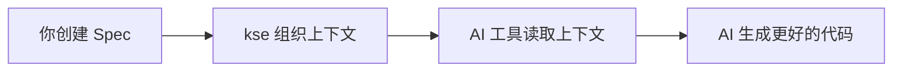
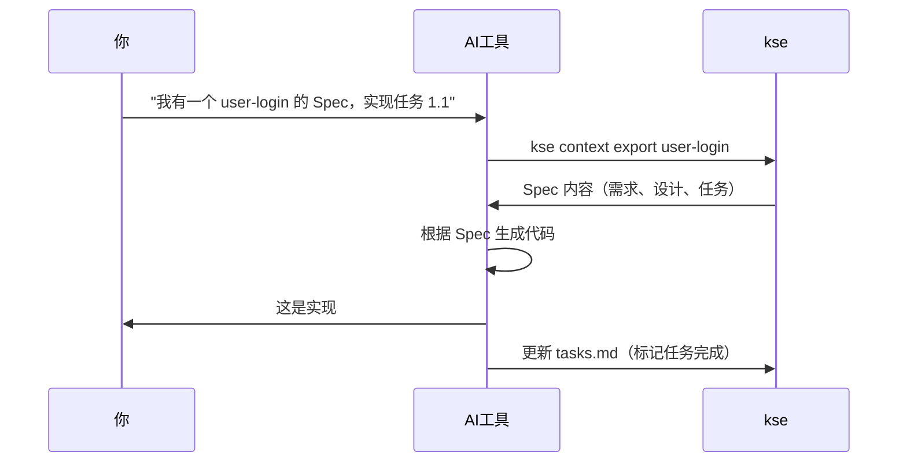

# kse - Kiro Spec Engine

[](https://badge.fury.io/js/kiro-spec-engine)
[](https://opensource.org/licenses/MIT)

**AI 编码工具的上下文提供者** - 结构化你的项目需求、设计和任务，让 AI 助手帮你构建更好的软件。

[English](README.md) | 简体中文

---

## 什么是 kse？

**kse (Kiro Spec Engine) 是一个 AI 辅助开发的上下文管理系统。** 它帮助你将项目信息组织成结构化的 "Spec"（需求 → 设计 → 任务），让 AI 工具能够理解和有效使用。

把 kse 想象成 **AI 助手的图书管理员** - 它组织和呈现项目上下文，让你的 AI 工具准确知道你在构建什么、为什么构建以及如何构建。

### 工作原理



1. **你创建 Spec** - 在结构化的 markdown 文件中编写需求、设计和任务
2. **kse 组织上下文** - 导出为 AI 工具优化的格式
3. **AI 工具读取上下文** - 你的 AI 助手理解项目结构
4. **AI 生成更好的代码** - 符合你设计和需求的代码

### kse 不是什么

- ❌ **不是代码生成器** - kse 不写代码；你的 AI 工具写代码
- ❌ **不是 IDE** - kse 与你现有的开发工具配合使用
- ❌ **不是特定 AI 工具** - 适用于 Claude、Cursor、Windsurf、Copilot 等任何 AI 工具
- ❌ **不是文档的替代品** - 它是组织项目上下文的结构化方式

### 谁应该使用 kse？

- ✅ 使用 AI 编码助手的开发者（Claude、Cursor、Copilot 等）
- ✅ 需要结构化项目文档的团队
- ✅ 构建需要清晰需求和设计的功能的任何人
- ✅ 受益于 Spec 驱动开发的项目

---

## 快速开始（5 分钟）

### 步骤 1：安装 kse（30 秒）

```bash
npm install -g kiro-spec-engine
```

验证安装：
```bash
kse --version
```

### 步骤 2：在项目中采用 kse（1 分钟）

导航到项目目录并运行：

```bash
cd your-project
kse adopt
```

这会创建一个 `.kiro/` 目录，包含：
- `specs/` - Spec 存放位置
- `steering/` - AI 行为规则（可选）

### 步骤 3：创建第一个 Spec（2 分钟）

```bash
kse create-spec 01-00-user-login
```

这会在 `.kiro/specs/01-00-user-login/` 中创建三个文件：

**requirements.md** - 你要构建什么：
```markdown
# 用户登录功能

## 用户故事
- 作为用户，我想用邮箱和密码登录
- 作为用户，我想在凭据错误时看到错误提示

## 验收标准
- 当用户输入有效凭据时，则用户登录成功
- 当用户输入无效凭据时，则显示错误消息
```

**design.md** - 如何构建：
```markdown
# 设计

## API 设计
- POST /api/auth/login
- 请求：{ email: string, password: string }
- 响应：{ token: string } 或 { error: string }

## 组件
- AuthController - 处理登录逻辑
- validateEmail() - 验证邮箱格式
- validatePassword() - 检查密码要求
```

**tasks.md** - 分步实现：
```markdown
- [ ] 1.1 创建 AuthController 类
- [ ] 1.2 实现邮箱验证
- [ ] 1.3 实现密码验证
- [ ] 1.4 实现登录端点
- [ ] 1.5 编写单元测试
```

### 步骤 4：让 AI 工具使用 Spec（1 分钟）

现在你的 AI 工具可以访问 Spec 来生成更好的代码。

**对于支持命令执行的 AI 工具（Cursor、Windsurf、Claude Desktop）：**

只需告诉你的 AI：
```
"我有一个 01-00-user-login 的 Spec。请实现任务 1.1"
```

AI 会：
1. 执行 `kse context export 01-00-user-login`
2. 读取 Spec（需求、设计、任务）
3. 生成遵循你设计的代码
4. 自动更新任务状态

**对于基于 Web 的 AI 工具（ChatGPT、Claude web）：**

```bash
# 导出上下文一次
kse context export 01-00-user-login

# 复制到剪贴板
cat .kiro/specs/01-00-user-login/context-export.md | pbcopy  # macOS
type .kiro\specs\01-00-user-login\context-export.md | clip  # Windows

# 粘贴到 AI 工具并说：
"这是我的 Spec。请实现任务 1.1"
```

**关键洞察：** 你留在 AI 工具中。AI 读取 Spec 并生成符合你设计的代码。

### 步骤 5：下一步（30 秒）

- 📖 阅读[快速开始指南](docs/zh/quick-start.md)获取详细示例
- 🔧 查看你的工具集成指南：[Cursor](docs/zh/tools/cursor-guide.md) | [Claude](docs/zh/tools/claude-guide.md) | [Windsurf](docs/zh/tools/windsurf-guide.md)
- 💡 了解[集成模式](docs/integration-modes.md)

---

## 核心概念

### Spec

**Spec** 是功能或项目组件的结构化描述。每个 Spec 包含：

- **需求** (`requirements.md`) - 你要构建什么以及为什么
- **设计** (`design.md`) - 如何构建（架构、API、组件）
- **任务** (`tasks.md`) - 分步实现清单

### 上下文导出

**上下文导出**将你的 Spec 转换为 AI 工具优化的格式。它包括：
- 所有需求、设计决策和任务
- 项目结构和约定
- Steering 规则（可选）用于 AI 行为

### 集成模式

kse 支持三种与 AI 工具协作的方式：

1. **原生集成** - AI 工具直接访问 kse（Kiro IDE）
2. **手动导出** - 你导出并粘贴上下文（Claude、ChatGPT、Cursor）
3. **Watch 模式** - 文件更改时自动更新上下文（所有工具）

了解更多：[集成模式指南](docs/integration-modes.md)

---

## 与 AI 工具集成

kse 适用于任何 AI 编码助手。选择你的工具获取具体指导：

### 流行的 AI 工具

- **[Cursor](docs/zh/tools/cursor-guide.md)** - 带 AI 结对编程的 IDE
- **[Claude Code](docs/zh/tools/claude-guide.md)** - Anthropic 的编码助手
- **[Windsurf](docs/zh/tools/windsurf-guide.md)** - 支持命令执行的 AI 代理
- **[Kiro](docs/zh/tools/kiro-guide.md)** - 原生集成，无需手动导出
- **[VS Code + Copilot](docs/zh/tools/vscode-guide.md)** - GitHub Copilot 集成
- **[通用 AI 工具](docs/zh/tools/generic-guide.md)** - 适用于任何 AI 助手

### 集成工作流



**关键洞察：** 你留在 AI 工具中。AI 读取 Spec 并生成符合你设计的代码。

---

## 文档

### 入门指南
- 📖 **[快速开始指南](docs/zh/quick-start.md)** - 详细的 5 分钟教程
- 🤔 **[常见问题](docs/faq.md)** - 常见问题解答
- 🔧 **[故障排除](docs/troubleshooting.md)** - 常见问题和解决方案

### 核心指南
- 📋 **[Spec 工作流](docs/spec-workflow.md)** - 深入理解 Spec
- 🔢 **[Spec 编号策略](docs/zh/spec-numbering-guide.md)** - 如何为 Spec 编号
- 📄 **[文档治理](docs/document-governance.md)** - 自动化文档管理
- 🔌 **[集成模式](docs/integration-modes.md)** - 三种集成 kse 的方式
- 📝 **[命令参考](docs/command-reference.md)** - 所有 kse 命令

### 工具特定指南
- [Cursor 集成](docs/zh/tools/cursor-guide.md)
- [Claude Code 集成](docs/zh/tools/claude-guide.md)
- [Windsurf 集成](docs/zh/tools/windsurf-guide.md)
- [Kiro 集成](docs/zh/tools/kiro-guide.md)
- [VS Code + Copilot 集成](docs/zh/tools/vscode-guide.md)
- [通用 AI 工具](docs/zh/tools/generic-guide.md)

### 示例
- [API 功能示例](docs/examples/add-rest-api/) - RESTful API Spec
- [UI 功能示例](docs/examples/add-user-dashboard/) - React 仪表板 Spec
- [CLI 功能示例](docs/examples/add-export-command/) - CLI 命令 Spec

### 高级主题
- [采用指南](docs/adoption-guide.md) - 在现有项目中采用 kse
- [升级指南](docs/upgrade-guide.md) - 版本升级说明
- [手动工作流](docs/manual-workflows-guide.md) - 分步工作流
- [开发者指南](docs/developer-guide.md) - 贡献和扩展 kse

### 完整文档
- 📚 **[文档索引](docs/zh/README.md)** - 所有文档集中在一处

---

## 主要功能

### Spec 驱动开发
使用需求 → 设计 → 任务工作流结构化你的工作

### 文档治理
- 自动化文档生命周期管理
- 强制执行清洁项目结构
- 临时文件清理
- 产物组织
- Git hooks 合规性检查

### 多用户协作
- 团队成员的个人工作空间
- 任务认领和跟踪
- 工作空间同步

### 跨工具兼容性
为 Claude Code、Cursor、Windsurf、Copilot 等导出上下文

### Watch 模式自动化
自动文件监控和上下文更新

### 质量增强
- 文档质量评分（0-10 分）
- 智能改进建议
- 专业标准执行

### 多语言支持
英文和中文界面

---

## 命令概览

```bash
# 项目设置
kse adopt                          # 在现有项目中采用 kse
kse create-spec <name>             # 创建新 Spec

# 上下文管理
kse context export <spec-name>     # 为 AI 工具导出上下文
kse prompt generate <spec> <task>  # 生成任务特定提示

# 任务管理
kse task claim <spec> <task-id>    # 认领任务
kse task list <spec>               # 列出已认领任务

# 文档治理
kse docs diagnose                  # 检查文档合规性
kse docs cleanup                   # 删除临时文件
kse docs validate                  # 验证文档结构
kse docs archive --spec <name>     # 组织 Spec 产物
kse docs hooks install             # 安装 Git pre-commit hooks

# 自动化
kse watch start                    # 启动 watch 模式
kse watch status                   # 检查 watch 状态

# 项目信息
kse status                         # 项目状态
kse workflows                      # 列出可用工作流
```

查看[命令参考](docs/command-reference.md)获取完整文档。

---

## 贡献与支持

### 获取帮助

- 📖 **文档**：从[快速开始指南](docs/zh/quick-start.md)开始
- 🐛 **Bug 报告**：[GitHub Issues](https://github.com/heguangyong/kiro-spec-engine/issues)
- 💬 **讨论**：[GitHub Discussions](https://github.com/heguangyong/kiro-spec-engine/discussions)

### 贡献

我们欢迎贡献！查看我们的[贡献指南](CONTRIBUTING.md)了解：
- 代码贡献
- 文档改进
- Bug 报告和功能请求
- 翻译帮助

### 开发设置

```bash
git clone https://github.com/heguangyong/kiro-spec-engine.git
cd kiro-spec-engine
npm install
npm link  # 用于本地开发
npm test  # 运行测试
```

---

## 许可证

MIT 许可证 - 详见 [LICENSE](LICENSE) 文件。

---

## 致谢

- 受 **西西弗斯** 神话和高贵奋斗概念的启发
- 建立在 **Kiro** Spec 驱动开发的基础上
- 受 **oh-my-opencode** 和 Ultrawork 宣言的影响

---

**准备好增强你的 AI 辅助开发了吗？** 🚀

```bash
npm install -g kiro-spec-engine
kse adopt
kse create-spec 01-00-my-first-feature
```

---

**版本**：1.4.5  
**最后更新**：2026-01-24
