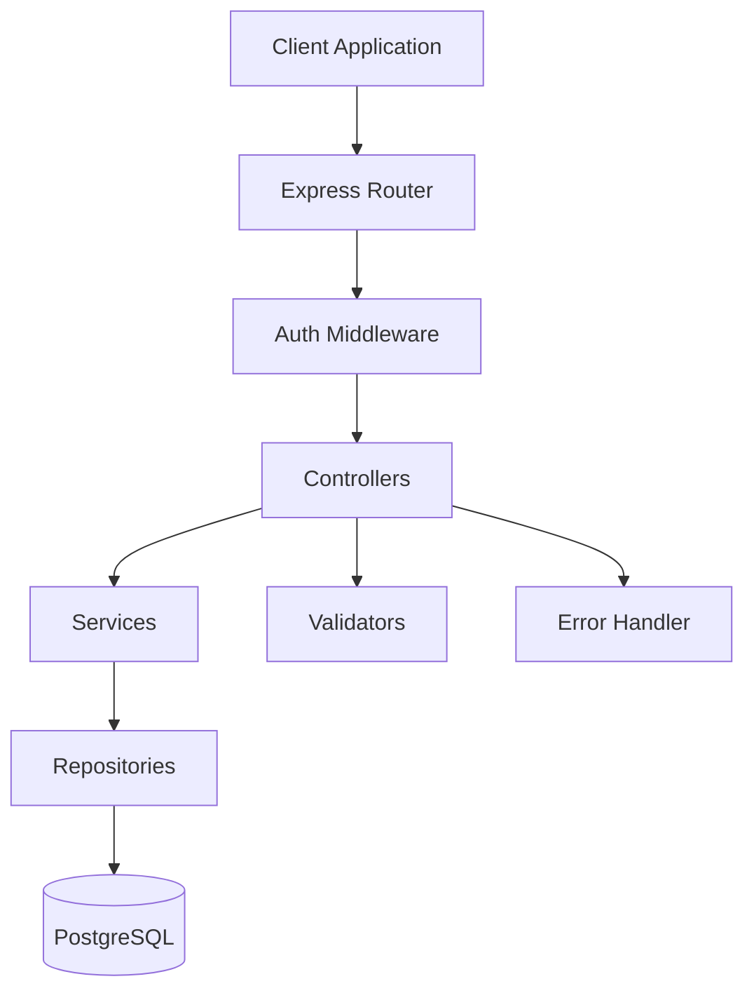

# RESTful API with Authentication - Design

> Technical design and architecture for the task management API

---

**Version**: 1.42.0  
**Last Updated**: 2026-02-11  
**Spec Type**: Example - API Feature

---

## Overview

This design document specifies the technical implementation of a RESTful task management API with JWT authentication. The architecture follows Express.js best practices with a layered approach: routes → controllers → services → repositories.

**Architecture Pattern:** Layered Architecture (MVC-inspired)  
**Technology Stack:** Node.js + Express + PostgreSQL + JWT

---

## Architecture Diagram



---

## System Architecture

### Layer Responsibilities

**1. Routes Layer** (`routes/`)
- Define API endpoints
- Map HTTP methods to controller functions
- Apply middleware (authentication, validation)

**2. Controllers Layer** (`controllers/`)
- Handle HTTP requests and responses
- Validate input using express-validator
- Call service layer for business logic
- Format responses

**3. Services Layer** (`services/`)
- Implement business logic
- Coordinate between multiple repositories
- Handle transactions
- Throw domain-specific errors

**4. Repositories Layer** (`repositories/`)
- Database access layer
- Execute SQL queries
- Map database rows to domain objects
- Handle database errors

**5. Middleware Layer** (`middleware/`)
- Authentication (JWT verification)
- Error handling
- Request logging
- Rate limiting

---

## Component Design

### 1. Authentication System

#### AuthController
**File:** `src/controllers/auth.controller.js`

**Responsibilities:**
- Handle registration and login requests
- Validate input data
- Return JWT tokens

**Methods:**
```javascript
class AuthController {
  /**
   * Register new user
   * POST /api/v1/auth/register
   */
  async register(req, res, next) {
    // 1. Validate input (email, password)
    // 2. Call authService.register()
    // 3. Return success response
  }

  /**
   * Login user
   * POST /api/v1/auth/login
   */
  async login(req, res, next) {
    // 1. Validate input (email, password)
    // 2. Call authService.login()
    // 3. Return JWT token
  }
}
```

---

#### AuthService
**File:** `src/services/auth.service.js`

**Responsibilities:**
- User registration logic
- User authentication logic
- Password hashing and verification
- JWT token generation

**Methods:**
```javascript
class AuthService {
  /**
   * Register new user
   * @param {string} email
   * @param {string} password
   * @returns {Promise<User>}
   * @throws {ConflictError} if email exists
   */
  async register(email, password) {
    // 1. Check if email exists
    // 2. Hash password with bcrypt
    // 3. Create user via userRepository
    // 4. Return user (without password)
  }

  /**
   * Authenticate user and generate token
   * @param {string} email
   * @param {string} password
   * @returns {Promise<{token: string, user: User}>}
   * @throws {UnauthorizedError} if credentials invalid
   */
  async login(email, password) {
    // 1. Find user by email
    // 2. Verify password with bcrypt
    // 3. Generate JWT token
    // 4. Return token and user
  }

  /**
   * Generate JWT token
   * @param {User} user
   * @returns {string} JWT token
   */
  generateToken(user) {
    // Use jsonwebtoken to create token
    // Payload: { userId, email }
    // Expiration: 24 hours
  }
}
```

---

#### AuthMiddleware
**File:** `src/middleware/auth.middleware.js`

**Responsibilities:**
- Verify JWT tokens
- Extract user from token
- Attach user to request object

**Implementation:**
```javascript
const jwt = require('jsonwebtoken');

/**
 * Verify JWT token and attach user to request
 */
async function authenticate(req, res, next) {
  try {
    // 1. Extract token from Authorization header
    const token = req.headers.authorization?.replace('Bearer ', '');
    
    if (!token) {
      throw new UnauthorizedError('No token provided');
    }

    // 2. Verify token
    const decoded = jwt.verify(token, process.env.JWT_SECRET);

    // 3. Attach user to request
    req.user = {
      id: decoded.userId,
      email: decoded.email
    };

    next();
  } catch (error) {
    next(new UnauthorizedError('Invalid token'));
  }
}
```

---

### 2. Task Management System

#### TaskController
**File:** `src/controllers/task.controller.js`

**Responsibilities:**
- Handle task CRUD requests
- Validate input data
- Enforce authorization

**Methods:**
```javascript
class TaskController {
  /**
   * Create new task
   * POST /api/v1/tasks
   */
  async create(req, res, next) {
    // 1. Validate input (title, description, status)
    // 2. Call taskService.create() with req.user.id
    // 3. Return created task
  }

  /**
   * List all user's tasks
   * GET /api/v1/tasks
   */
  async list(req, res, next) {
    // 1. Call taskService.findByUserId(req.user.id)
    // 2. Return tasks array
  }

  /**
   * Get single task
   * GET /api/v1/tasks/:id
   */
  async getById(req, res, next) {
    // 1. Call taskService.findById(req.params.id)
    // 2. Check if task belongs to req.user.id
    // 3. Return task or 403 Forbidden
  }

  /**
   * Update task
   * PUT /api/v1/tasks/:id
   */
  async update(req, res, next) {
    // 1. Validate input
    // 2. Check task ownership
    // 3. Call taskService.update()
    // 4. Return updated task
  }

  /**
   * Delete task
   * DELETE /api/v1/tasks/:id
   */
  async delete(req, res, next) {
    // 1. Check task ownership
    // 2. Call taskService.delete()
    // 3. Return 204 No Content
  }
}
```

---

#### TaskService
**File:** `src/services/task.service.js`

**Responsibilities:**
- Task business logic
- Coordinate with taskRepository
- Validate business rules

**Methods:**
```javascript
class TaskService {
  /**
   * Create new task
   * @param {string} userId
   * @param {Object} taskData
   * @returns {Promise<Task>}
   */
  async create(userId, taskData) {
    // 1. Validate business rules
    // 2. Create task via taskRepository
    // 3. Return created task
  }

  /**
   * Find all tasks for user
   * @param {string} userId
   * @returns {Promise<Task[]>}
   */
  async findByUserId(userId) {
    // 1. Query taskRepository
    // 2. Sort by createdAt DESC
    // 3. Return tasks
  }

  /**
   * Find task by ID
   * @param {string} taskId
   * @returns {Promise<Task>}
   * @throws {NotFoundError} if task doesn't exist
   */
  async findById(taskId) {
    // 1. Query taskRepository
    // 2. Throw NotFoundError if not found
    // 3. Return task
  }

  /**
   * Update task
   * @param {string} taskId
   * @param {Object} updates
   * @returns {Promise<Task>}
   */
  async update(taskId, updates) {
    // 1. Find task
    // 2. Apply updates
    // 3. Save via taskRepository
    // 4. Return updated task
  }

  /**
   * Delete task
   * @param {string} taskId
   * @returns {Promise<void>}
   */
  async delete(taskId) {
    // 1. Delete via taskRepository
  }
}
```

---

### 3. Data Access Layer

#### UserRepository
**File:** `src/repositories/user.repository.js`

**Responsibilities:**
- User database operations
- SQL query execution

**Methods:**
```javascript
class UserRepository {
  /**
   * Create new user
   * @param {Object} userData
   * @returns {Promise<User>}
   */
  async create(userData) {
    const query = `
      INSERT INTO users (id, email, password, created_at, updated_at)
      VALUES ($1, $2, $3, NOW(), NOW())
      RETURNING id, email, created_at, updated_at
    `;
    // Execute query and return user
  }

  /**
   * Find user by email
   * @param {string} email
   * @returns {Promise<User|null>}
   */
  async findByEmail(email) {
    const query = `
      SELECT id, email, password, created_at, updated_at
      FROM users
      WHERE email = $1
    `;
    // Execute query and return user or null
  }

  /**
   * Find user by ID
   * @param {string} userId
   * @returns {Promise<User|null>}
   */
  async findById(userId) {
    const query = `
      SELECT id, email, created_at, updated_at
      FROM users
      WHERE id = $1
    `;
    // Execute query and return user or null
  }
}
```

---

#### TaskRepository
**File:** `src/repositories/task.repository.js`

**Responsibilities:**
- Task database operations
- SQL query execution

**Methods:**
```javascript
class TaskRepository {
  /**
   * Create new task
   * @param {Object} taskData
   * @returns {Promise<Task>}
   */
  async create(taskData) {
    const query = `
      INSERT INTO tasks (id, user_id, title, description, status, created_at, updated_at)
      VALUES ($1, $2, $3, $4, $5, NOW(), NOW())
      RETURNING *
    `;
    // Execute query and return task
  }

  /**
   * Find all tasks for user
   * @param {string} userId
   * @returns {Promise<Task[]>}
   */
  async findByUserId(userId) {
    const query = `
      SELECT * FROM tasks
      WHERE user_id = $1
      ORDER BY created_at DESC
    `;
    // Execute query and return tasks
  }

  /**
   * Find task by ID
   * @param {string} taskId
   * @returns {Promise<Task|null>}
   */
  async findById(taskId) {
    const query = `
      SELECT * FROM tasks
      WHERE id = $1
    `;
    // Execute query and return task or null
  }

  /**
   * Update task
   * @param {string} taskId
   * @param {Object} updates
   * @returns {Promise<Task>}
   */
  async update(taskId, updates) {
    const query = `
      UPDATE tasks
      SET title = $1, description = $2, status = $3, updated_at = NOW()
      WHERE id = $4
      RETURNING *
    `;
    // Execute query and return updated task
  }

  /**
   * Delete task
   * @param {string} taskId
   * @returns {Promise<void>}
   */
  async delete(taskId) {
    const query = `DELETE FROM tasks WHERE id = $1`;
    // Execute query
  }
}
```

---

## API Routes

### Authentication Routes
**File:** `src/routes/auth.routes.js`

```javascript
const express = require('express');
const router = express.Router();
const authController = require('../controllers/auth.controller');
const { validateRegistration, validateLogin } = require('../validators/auth.validator');

// POST /api/v1/auth/register
router.post('/register', validateRegistration, authController.register);

// POST /api/v1/auth/login
router.post('/login', validateLogin, authController.login);

module.exports = router;
```

---

### Task Routes
**File:** `src/routes/task.routes.js`

```javascript
const express = require('express');
const router = express.Router();
const taskController = require('../controllers/task.controller');
const { authenticate } = require('../middleware/auth.middleware');
const { validateTask, validateTaskUpdate } = require('../validators/task.validator');

// All task routes require authentication
router.use(authenticate);

// POST /api/v1/tasks
router.post('/', validateTask, taskController.create);

// GET /api/v1/tasks
router.get('/', taskController.list);

// GET /api/v1/tasks/:id
router.get('/:id', taskController.getById);

// PUT /api/v1/tasks/:id
router.put('/:id', validateTaskUpdate, taskController.update);

// DELETE /api/v1/tasks/:id
router.delete('/:id', taskController.delete);

module.exports = router;
```

---

## Database Schema

### Users Table
```sql
CREATE TABLE users (
  id UUID PRIMARY KEY DEFAULT gen_random_uuid(),
  email VARCHAR(255) UNIQUE NOT NULL,
  password VARCHAR(255) NOT NULL,
  created_at TIMESTAMP NOT NULL DEFAULT NOW(),
  updated_at TIMESTAMP NOT NULL DEFAULT NOW()
);

CREATE INDEX idx_users_email ON users(email);
```

### Tasks Table
```sql
CREATE TABLE tasks (
  id UUID PRIMARY KEY DEFAULT gen_random_uuid(),
  user_id UUID NOT NULL REFERENCES users(id) ON DELETE CASCADE,
  title VARCHAR(200) NOT NULL,
  description TEXT,
  status VARCHAR(20) NOT NULL DEFAULT 'pending',
  created_at TIMESTAMP NOT NULL DEFAULT NOW(),
  updated_at TIMESTAMP NOT NULL DEFAULT NOW(),
  
  CONSTRAINT chk_status CHECK (status IN ('pending', 'in_progress', 'completed'))
);

CREATE INDEX idx_tasks_user_id ON tasks(user_id);
CREATE INDEX idx_tasks_created_at ON tasks(created_at DESC);
```

---

## Error Handling

### Custom Error Classes
**File:** `src/errors/index.js`

```javascript
class AppError extends Error {
  constructor(message, statusCode, errorCode) {
    super(message);
    this.statusCode = statusCode;
    this.errorCode = errorCode;
  }
}

class ValidationError extends AppError {
  constructor(message, details = {}) {
    super(message, 400, 'INVALID_INPUT');
    this.details = details;
  }
}

class UnauthorizedError extends AppError {
  constructor(message = 'Unauthorized') {
    super(message, 401, 'UNAUTHORIZED');
  }
}

class ForbiddenError extends AppError {
  constructor(message = 'Forbidden') {
    super(message, 403, 'FORBIDDEN');
  }
}

class NotFoundError extends AppError {
  constructor(message = 'Resource not found') {
    super(message, 404, 'NOT_FOUND');
  }
}

class ConflictError extends AppError {
  constructor(message = 'Resource already exists') {
    super(message, 409, 'CONFLICT');
  }
}
```

---

### Error Handler Middleware
**File:** `src/middleware/error.middleware.js`

```javascript
function errorHandler(err, req, res, next) {
  // Log error
  console.error(err);

  // Handle known errors
  if (err instanceof AppError) {
    return res.status(err.statusCode).json({
      error: {
        code: err.errorCode,
        message: err.message,
        details: err.details || {}
      }
    });
  }

  // Handle unknown errors
  res.status(500).json({
    error: {
      code: 'INTERNAL_ERROR',
      message: 'An unexpected error occurred'
    }
  });
}
```

---

## Input Validation

### Auth Validators
**File:** `src/validators/auth.validator.js`

```javascript
const { body, validationResult } = require('express-validator');

const validateRegistration = [
  body('email')
    .isEmail().withMessage('Invalid email format')
    .isLength({ max: 255 }).withMessage('Email too long'),
  body('password')
    .isLength({ min: 8, max: 128 }).withMessage('Password must be 8-128 characters'),
  
  (req, res, next) => {
    const errors = validationResult(req);
    if (!errors.isEmpty()) {
      throw new ValidationError('Validation failed', errors.mapped());
    }
    next();
  }
];

const validateLogin = [
  body('email').isEmail(),
  body('password').notEmpty(),
  
  (req, res, next) => {
    const errors = validationResult(req);
    if (!errors.isEmpty()) {
      throw new ValidationError('Validation failed', errors.mapped());
    }
    next();
  }
];
```

---

### Task Validators
**File:** `src/validators/task.validator.js`

```javascript
const { body, validationResult } = require('express-validator');

const validateTask = [
  body('title')
    .notEmpty().withMessage('Title is required')
    .isLength({ max: 200 }).withMessage('Title too long'),
  body('description')
    .optional()
    .isLength({ max: 2000 }).withMessage('Description too long'),
  body('status')
    .optional()
    .isIn(['pending', 'in_progress', 'completed']).withMessage('Invalid status'),
  
  (req, res, next) => {
    const errors = validationResult(req);
    if (!errors.isEmpty()) {
      throw new ValidationError('Validation failed', errors.mapped());
    }
    next();
  }
];
```

---

## Configuration

### Environment Variables
**File:** `.env`

```bash
# Server
PORT=3000
NODE_ENV=development

# Database
DB_HOST=localhost
DB_PORT=5432
DB_NAME=taskmanager
DB_USER=postgres
DB_PASSWORD=password

# JWT
JWT_SECRET=your-secret-key-change-in-production
JWT_EXPIRATION=24h

# Rate Limiting
RATE_LIMIT_WINDOW_MS=60000
RATE_LIMIT_MAX_REQUESTS=100
```

---

## Requirements Traceability

| Requirement | Design Component | Implementation |
|-------------|------------------|----------------|
| US-1: User Registration | AuthController.register() | auth.controller.js |
| US-2: User Login | AuthController.login() | auth.controller.js |
| US-3: Create Task | TaskController.create() | task.controller.js |
| US-4: List Tasks | TaskController.list() | task.controller.js |
| US-5: Update Task | TaskController.update() | task.controller.js |
| US-6: Delete Task | TaskController.delete() | task.controller.js |
| FR-1: Authentication | AuthService + AuthMiddleware | auth.service.js, auth.middleware.js |
| FR-2: Task CRUD | TaskService + TaskRepository | task.service.js, task.repository.js |
| FR-3: Authorization | AuthMiddleware + ownership checks | auth.middleware.js |
| FR-4: Input Validation | express-validator | auth.validator.js, task.validator.js |
| FR-5: Error Handling | Error classes + middleware | errors/index.js, error.middleware.js |
| FR-6: API Versioning | Route prefixes | routes/index.js |
| NFR-2: Security | bcrypt + JWT + validation | Throughout |
| NFR-4: Maintainability | Layered architecture | Project structure |

---

## Technology Stack

### Core Dependencies
```json
{
  "express": "^4.18.0",
  "pg": "^8.11.0",
  "jsonwebtoken": "^9.0.0",
  "bcrypt": "^5.1.0",
  "express-validator": "^7.0.0",
  "dotenv": "^16.0.0",
  "uuid": "^9.0.0"
}
```

### Dev Dependencies
```json
{
  "jest": "^29.0.0",
  "supertest": "^6.3.0",
  "nodemon": "^3.0.0"
}
```

---

## Project Structure

```
src/
├── controllers/
│   ├── auth.controller.js
│   └── task.controller.js
├── services/
│   ├── auth.service.js
│   └── task.service.js
├── repositories/
│   ├── user.repository.js
│   └── task.repository.js
├── routes/
│   ├── index.js
│   ├── auth.routes.js
│   └── task.routes.js
├── middleware/
│   ├── auth.middleware.js
│   ├── error.middleware.js
│   └── rate-limit.middleware.js
├── validators/
│   ├── auth.validator.js
│   └── task.validator.js
├── errors/
│   └── index.js
├── config/
│   ├── database.js
│   └── jwt.js
├── utils/
│   └── logger.js
└── app.js

tests/
├── unit/
│   ├── services/
│   └── repositories/
└── integration/
    ├── auth.test.js
    └── tasks.test.js
```

---

## Related Documentation

- [Requirements Document](requirements.md) - Feature requirements
- [Tasks Document](tasks.md) - Implementation plan
- [Spec Workflow Guide](../../spec-workflow.md) - Understanding Specs

---

**Version**: 1.42.0  
**Last Updated**: 2026-02-11  
**Status**: Example Spec
