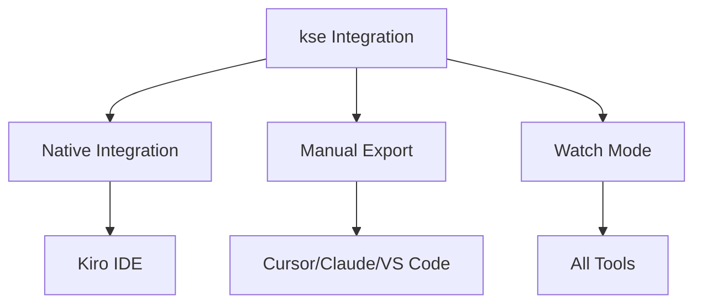
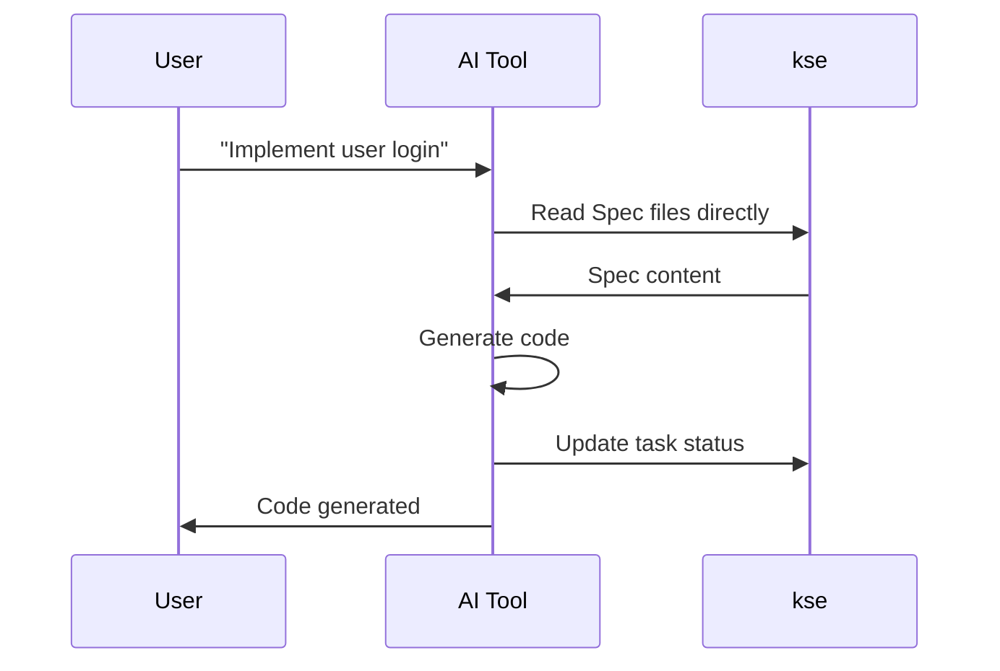
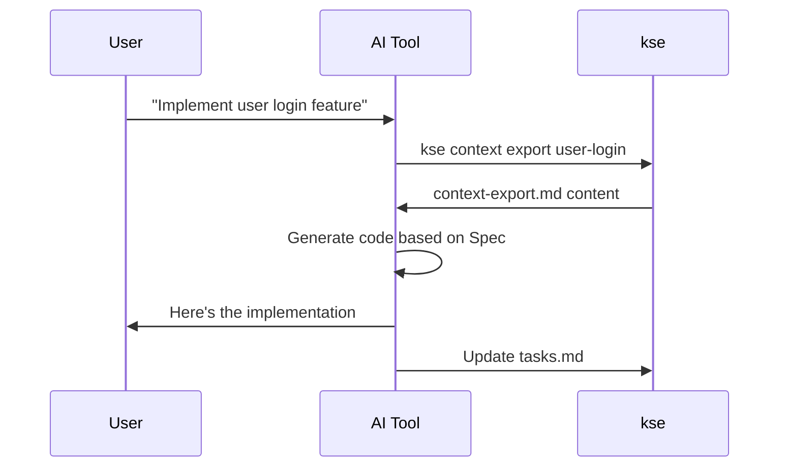
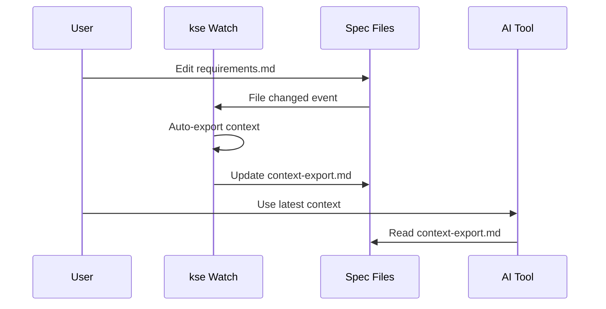
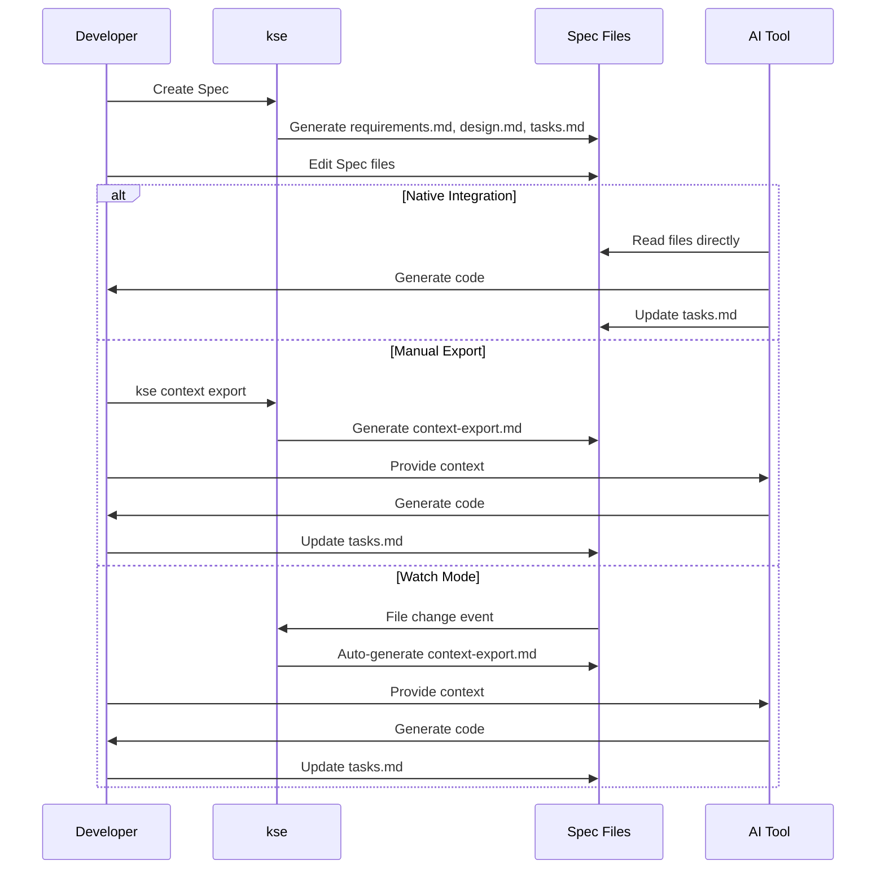

# Integration Modes Guide

> Three ways to integrate kse with your AI coding tools

---

**Version**: 1.0.0  
**Last Updated**: 2026-01-23  
**Audience**: Intermediate  
**Estimated Time**: 8 minutes

---

## Overview

kse supports three integration modes to work with different AI coding tools. Each mode offers different levels of automation and suits different workflows.



---

## Mode 1: Native Integration ⭐

**Best for:** Kiro IDE users  
**Automation Level:** Fully Automatic  
**Setup Complexity:** None (built-in)

### How It Works

With native integration, the AI tool directly accesses kse without any manual steps. The AI can read Specs, export context, and update tasks automatically.



### Supported Tools

- **Kiro IDE** - Full native support

### Workflow Example

```
You: "Implement the user login feature"

Kiro AI: 
  [Automatically reads .kiro/specs/01-00-user-login/]
  [Understands requirements and design]
  [Generates code]
  [Updates tasks.md automatically]
  
  ✓ Implemented AuthController
  ✓ Implemented AuthService
  ✓ Updated task 1.1 to complete
```

### Advantages

- ✅ **Zero manual steps** - AI handles everything
- ✅ **Always up-to-date** - AI reads latest Spec files
- ✅ **Automatic task tracking** - AI updates task status
- ✅ **Seamless workflow** - No context switching

### Limitations

- ❌ **Tool-specific** - Only works with Kiro IDE currently
- ❌ **Requires compatible AI** - AI must support file system access

---

## Mode 2: Manual Export

**Best for:** Claude Code, ChatGPT, Cursor, VS Code + Copilot  
**Automation Level:** AI-Driven (for tools with command execution) or Semi-Manual (for web tools)  
**Setup Complexity:** Low

### How It Works

The AI tool can directly call kse commands during your conversation. You stay in your familiar AI tool interface - the AI handles kse interaction automatically.



**Note:** For AI tools without command execution (like ChatGPT web), you can manually export and paste as a fallback.

### Supported Tools

- **Claude Code** - Large context window, excellent understanding
- **ChatGPT** - Good for conversational development
- **Cursor** - IDE integration with AI pair programming
- **VS Code + Copilot** - Inline suggestions with context
- **Any AI tool** - Works with any tool that accepts text input

### Workflow Example

**With AI tools that can execute commands (Cursor, Windsurf, Claude Desktop):**

```
You: "I have a Spec for user login at 01-00-user-login. 
     Please implement task 1.1: Create AuthController"

AI Tool: 
  [Executes: kse context export 01-00-user-login]
  [Reads the exported context]
  [Generates AuthController code]
  [Updates tasks.md automatically]
  
  ✓ Created AuthController with login/logout methods
  ✓ Updated task 1.1 to complete
```

**With web-based AI tools (ChatGPT, Claude web):**

```bash
# You run this once
kse context export 01-00-user-login
cat .kiro/specs/01-00-user-login/context-export.md | pbcopy

# Then paste into AI tool
You: "Here's my Spec context: [paste]
     Please implement task 1.1: Create AuthController"

AI: [Generates code based on your Spec]

# You update tasks manually
# Edit .kiro/specs/01-00-user-login/tasks.md
```

### Advantages

- ✅ **Works with any AI tool** - Universal compatibility
- ✅ **AI can call kse directly** - For tools with command execution
- ✅ **Fallback to manual** - Copy-paste for web-based tools
- ✅ **Simple setup** - No configuration needed
- ✅ **Reliable** - No dependencies on special integrations

### Limitations

- ❌ **Varies by tool** - Command execution depends on AI tool capabilities
- ❌ **Manual fallback** - Web-based tools require copy-paste
- ❌ **Context refresh** - May need to re-export after Spec changes (unless using Watch Mode)

### Optimization Tips

**Create shell aliases for faster export:**

```bash
# Add to ~/.bashrc or ~/.zshrc
alias kse-clip='kse context export $1 && cat .kiro/specs/$1/context-export.md | pbcopy && echo "✅ Context copied to clipboard"'

# Usage
kse-clip 01-00-user-login
# Now just paste into your AI tool
```

**Generate task-specific prompts:**
```bash
# Instead of exporting entire Spec
kse prompt generate 01-00-user-login 1.1

# Generates focused prompt for just task 1.1
```

---

## Mode 3: Watch Mode 🔄

**Best for:** Frequent Spec changes, team collaboration  
**Automation Level:** Automatic (after setup)  
**Setup Complexity:** Medium

### How It Works

kse monitors your Spec files for changes and automatically re-exports context. Your AI tool can always access the latest context without manual export.



### Supported Tools

- **All tools** - Works with any AI tool
- **Best with:** Windsurf, Cline (can execute commands)
- **Good with:** Cursor, Claude (manual context refresh)

### Setup

**1. Initialize watch mode:**
```bash
kse watch init
```

**2. Install auto-export preset:**
```bash
kse watch install context-export
```

**3. Start watching:**
```bash
kse watch start
```

**4. Verify it's running:**
```bash
kse watch status
```

Expected output:
```
Watch Mode: Active
Watching: .kiro/specs/**/*.md
Actions: context-export
Last execution: 2 minutes ago
```

### Workflow Example

**With watch mode running:**

1. **Edit your Spec** (e.g., add a new requirement)
   ```bash
   # Edit .kiro/specs/01-00-user-login/requirements.md
   ```

2. **kse automatically detects the change**
   ```
   [Watch Mode] Detected change: requirements.md
   [Watch Mode] Exporting context for 01-00-user-login...
   [Watch Mode] ✓ Context exported
   ```

3. **Use updated context immediately**
   ```bash
   # Context is already up-to-date
   cat .kiro/specs/01-00-user-login/context-export.md | pbcopy
   ```

### Advantages

- ✅ **Always up-to-date** - Context auto-updates on Spec changes
- ✅ **No manual export** - Set it and forget it
- ✅ **Great for iteration** - Refine Specs without re-exporting
- ✅ **Team-friendly** - Everyone gets latest context

### Limitations

- ❌ **Requires setup** - Initial configuration needed
- ❌ **Background process** - Must keep watch mode running
- ❌ **Resource usage** - Monitors file system continuously

### Advanced Configuration

**Custom watch patterns:**
```json
{
  "patterns": [
    ".kiro/specs/**/requirements.md",
    ".kiro/specs/**/design.md",
    ".kiro/specs/**/tasks.md"
  ],
  "actions": [
    {
      "name": "auto-export",
      "command": "kse context export ${spec-name}"
    }
  ]
}
```

**Multiple actions:**
```bash
# Install multiple presets
kse watch install context-export
kse watch install prompt-regen
kse watch install auto-sync
```

---

## Choosing the Right Mode

### Decision Matrix

| Factor | Native | Manual Export | Watch Mode |
|--------|--------|---------------|------------|
| **Setup Time** | None | None | 5 minutes |
| **Automation** | Full | None | Partial |
| **Tool Support** | Kiro only | All tools | All tools |
| **Context Freshness** | Always fresh | Manual refresh | Auto-refresh |
| **Task Tracking** | Automatic | Manual | Manual |
| **Best For** | Kiro users | Quick start | Active development |

### Recommendations by Tool

**Kiro IDE:**
- ✅ Use **Native Integration** (built-in)
- No setup needed, fully automatic

**Windsurf / Cline:**
- ✅ Use **Manual Export** initially
- ⭐ Upgrade to **Watch Mode** for active projects
- These tools can execute kse commands directly

**Claude Code / ChatGPT:**
- ✅ Use **Manual Export**
- Create shell aliases for faster workflow
- Use task-specific prompts for large Specs

**Cursor:**
- ✅ Use **Manual Export** with prompt generation
- ⭐ Consider **Watch Mode** for frequently changing Specs
- Cursor can read updated context files automatically

**VS Code + Copilot:**
- ✅ Use **Manual Export**
- Reference Spec files in code comments
- Copilot reads project files automatically

**Generic AI Tools:**
- ✅ Use **Manual Export**
- Universal compatibility
- Simple copy-paste workflow

---

## Hybrid Approaches

### Manual Export + Watch Mode

Use watch mode to keep context fresh, but still manually provide context to AI:

```bash
# Terminal 1: Keep watch mode running
kse watch start

# Terminal 2: Work normally
# Edit Specs, context auto-updates
# Copy latest context when needed
cat .kiro/specs/01-00-user-login/context-export.md | pbcopy
```

**Benefits:**
- Context always fresh
- Full control over when to provide context to AI
- Best of both worlds

### Native + Manual Export

Use native integration primarily, but export for sharing:

```bash
# Work with Kiro IDE (native integration)
# When sharing with team member using different tool:
kse context export 01-00-user-login
# Send context-export.md to teammate
```

**Benefits:**
- Seamless personal workflow
- Easy collaboration with non-Kiro users

---

## Context Flow Visualization

### Complete Context Flow



---

## Best Practices

### For All Modes

1. **Keep Specs updated** - Outdated Specs lead to incorrect code
2. **Use version control** - Commit Spec changes
3. **Review AI output** - AI follows Spec, but verify correctness
4. **Update tasks promptly** - Track progress accurately

### For Manual Export

1. **Create aliases** - Speed up export workflow
2. **Use task-specific prompts** - For large Specs
3. **Re-export after changes** - Keep context fresh
4. **Include steering rules** - For consistent AI behavior

### For Watch Mode

1. **Start watch at project start** - Make it part of your routine
2. **Check watch status** - Ensure it's running
3. **Monitor logs** - Catch any export errors
4. **Stop when not needed** - Save system resources

---

## Troubleshooting

### Native Integration Issues

**Problem:** AI doesn't see Spec files  
**Solution:** Ensure `.kiro/specs/` directory exists and has correct permissions

### Manual Export Issues

**Problem:** Context file too large for AI tool  
**Solution:** Use task-specific prompts:
```bash
kse prompt generate spec-name task-id
```

**Problem:** AI doesn't follow Spec  
**Solution:** Be explicit in prompt: "Strictly follow the design document"

### Watch Mode Issues

**Problem:** Watch mode not detecting changes  
**Solution:** 
```bash
kse watch stop
kse watch start
```

**Problem:** Context not updating  
**Solution:** Check watch logs:
```bash
kse watch logs
```

---

## Related Documentation

- **[Quick Start Guide](quick-start.md)** - Get started with kse
- **[Tool-Specific Guides](tools/)** - Detailed guides for each AI tool
- **[Spec Workflow](spec-workflow.md)** - Understanding Specs
- **[Command Reference](command-reference.md)** - All kse commands

---

## Summary

**Three Integration Modes:**

1. **Native Integration** - Fully automatic (Kiro IDE)
2. **Manual Export** - Universal compatibility (all tools)
3. **Watch Mode** - Auto-refresh context (all tools)

**Choose based on:**
- Your AI tool's capabilities
- Your workflow preferences
- Project activity level

**Start simple, upgrade as needed:**
```
Manual Export → Watch Mode → Native Integration
```

---

**Version**: 1.0.0  
**Last Updated**: 2026-01-23
