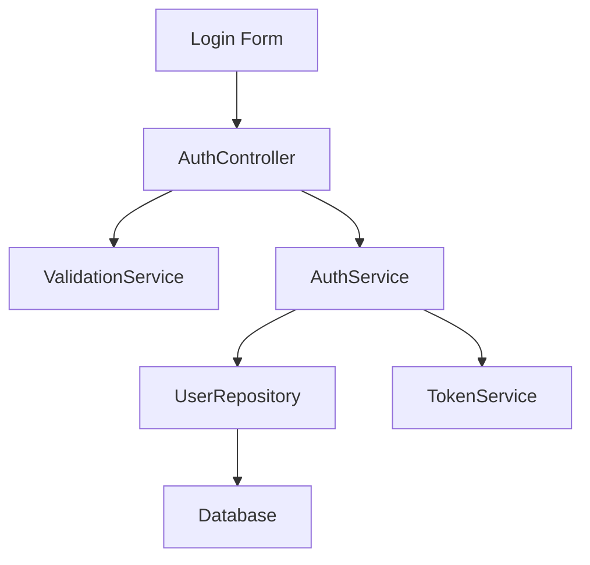

# Quick Start Guide

> Get started with kse in 5 minutes - from installation to your first AI-assisted feature implementation

---

**Version**: 1.0.0  
**Last Updated**: 2026-01-23  
**Estimated Time**: 5 minutes  
**Audience**: Beginners

---

## What You'll Learn

By the end of this guide, you will:
- ✅ Install kse and set up your first project
- ✅ Create a complete Spec (Requirements → Design → Tasks)
- ✅ Export context for your AI tool
- ✅ Use AI to implement features based on your Spec
- ✅ Track task progress

---

## Prerequisites

Before starting, ensure you have:
- **Node.js** 14 or higher ([Download](https://nodejs.org/))
- **npm** 6 or higher (comes with Node.js)
- Basic command-line knowledge
- An AI coding tool (Claude, Cursor, Windsurf, Copilot, etc.)

Check your versions:
```bash
node --version  # Should show v14.0.0 or higher
npm --version   # Should show 6.0.0 or higher
```

---

## Step 1: Install kse (30 seconds)

Install kse globally using npm:

```bash
npm install -g kiro-spec-engine
```

**Expected output:**
```
added 50 packages in 5s
```

**Verify installation:**
```bash
kse --version
```

**Expected output:**
```
1.3.0
```

**Troubleshooting:**
- **"kse: command not found"** → Restart your terminal or check your PATH
- **Permission errors on macOS/Linux** → Use `sudo npm install -g kiro-spec-engine`
- **Windows permission errors** → Run terminal as Administrator

---

## Step 2: Adopt kse in Your Project (1 minute)

Navigate to your project directory (or create a new one):

```bash
# For existing project
cd your-project

# Or create a new project
mkdir my-awesome-app
cd my-awesome-app
git init  # kse works best with git projects
```

**Adopt kse:**
```bash
kse adopt
```

**Expected output:**
```
✓ Detected project type: Node.js
✓ Created .kiro/ directory
✓ Created specs/ directory
✓ Created steering/ directory
✓ Generated CORE_PRINCIPLES.md
✓ Generated ENVIRONMENT.md
✓ Generated CURRENT_CONTEXT.md

✅ Project successfully adopted kse!

Next steps:
  1. Create your first Spec: kse create-spec 01-00-my-feature
  2. Read the guide: .kiro/README.md
```

**What was created:**
```
your-project/
├── .kiro/
│   ├── specs/              # Your Specs will live here
│   ├── steering/           # AI behavior rules
│   │   ├── CORE_PRINCIPLES.md
│   │   ├── ENVIRONMENT.md
│   │   └── CURRENT_CONTEXT.md
│   └── README.md           # Kiro system documentation
```

**Verification:**
```bash
kse status
```

**Expected output:**
```
Project: my-awesome-app
Specs: 0
Status: Ready
```

---

## Step 3: Create Your First Spec (2 minutes)

Let's create a Spec for a user login feature:

```bash
kse create-spec 01-00-user-login
```

**Expected output:**
```
✓ Created spec: 01-00-user-login
✓ Created requirements.md
✓ Created design.md
✓ Created tasks.md

📝 Next steps:
  1. Edit requirements.md to define what you're building
  2. Edit design.md to define how you'll build it
  3. Edit tasks.md to break down implementation steps
```

### 3.1 Write Requirements

Open `.kiro/specs/01-00-user-login/requirements.md` and write:

```markdown
# User Login Feature

## Overview
Enable users to log in to the application using email and password.

## User Stories

### US-1: User Login
**As a** user  
**I want to** log in with my email and password  
**So that** I can access my account

### US-2: Login Validation
**As a** user  
**I want to** see clear error messages when login fails  
**So that** I know what went wrong

## Functional Requirements

### FR-1: Login Form
The system shall provide a login form with:
- Email input field
- Password input field
- Submit button

### FR-2: Credential Validation
**WHEN** user submits valid credentials  
**THEN** system authenticates user and redirects to dashboard

**WHEN** user submits invalid credentials  
**THEN** system displays error message "Invalid email or password"

### FR-3: Input Validation
**WHEN** user submits empty email  
**THEN** system displays error "Email is required"

**WHEN** user submits invalid email format  
**THEN** system displays error "Please enter a valid email"

**WHEN** user submits password shorter than 6 characters  
**THEN** system displays error "Password must be at least 6 characters"

## Non-Functional Requirements

### NFR-1: Security
- Passwords must be hashed before storage
- Use bcrypt with salt rounds >= 10
- Implement rate limiting (max 5 attempts per minute)

### NFR-2: Performance
- Login response time < 500ms
- Support 100 concurrent login requests

### NFR-3: Usability
- Clear error messages
- Accessible form (WCAG 2.1 Level AA)

## Acceptance Criteria

- [ ] User can log in with valid email and password
- [ ] User sees error message with invalid credentials
- [ ] Email validation works correctly
- [ ] Password validation works correctly
- [ ] Passwords are hashed in database
- [ ] Rate limiting prevents brute force attacks
- [ ] Login response time is under 500ms
```

### 3.2 Write Design

Open `.kiro/specs/01-00-user-login/design.md` and write:

```markdown
# User Login - Design Document

## Overview
This design implements a secure user login system with email/password authentication, input validation, and rate limiting.

## Architecture

### System Components



## API Design

### POST /api/auth/login

**Request:**
```json
{
  "email": "user@example.com",
  "password": "secret123"
}
```

**Success Response (200):**
```json
{
  "success": true,
  "token": "eyJhbGciOiJIUzI1NiIsInR5cCI6IkpXVCJ9...",
  "user": {
    "id": "123",
    "email": "user@example.com",
    "name": "John Doe"
  }
}
```

**Error Response (401):**
```json
{
  "success": false,
  "error": "Invalid email or password"
}
```

**Error Response (429):**
```json
{
  "success": false,
  "error": "Too many login attempts. Please try again later."
}
```

## Component Design

### AuthController
**Responsibility:** Handle HTTP requests for authentication

**Methods:**
- `login(req, res)` - Process login request
- `validateRequest(req)` - Validate request format

### ValidationService
**Responsibility:** Validate user input

**Methods:**
- `validateEmail(email)` - Check email format
- `validatePassword(password)` - Check password requirements
- Returns: `{ valid: boolean, errors: string[] }`

### AuthService
**Responsibility:** Business logic for authentication

**Methods:**
- `authenticate(email, password)` - Verify credentials
- `generateToken(user)` - Create JWT token
- `hashPassword(password)` - Hash password with bcrypt

### UserRepository
**Responsibility:** Database operations for users

**Methods:**
- `findByEmail(email)` - Get user by email
- `updateLastLogin(userId)` - Update last login timestamp

### RateLimiter
**Responsibility:** Prevent brute force attacks

**Configuration:**
- Max attempts: 5 per minute per IP
- Block duration: 15 minutes after limit exceeded

## Data Models

### User
```javascript
{
  id: string,
  email: string,
  passwordHash: string,
  name: string,
  createdAt: Date,
  lastLoginAt: Date
}
```

## Security Considerations

1. **Password Hashing:** Use bcrypt with 10 salt rounds
2. **JWT Tokens:** Sign with secret key, expire in 24 hours
3. **Rate Limiting:** Implement per-IP rate limiting
4. **Input Sanitization:** Sanitize all user inputs
5. **HTTPS Only:** Enforce HTTPS in production

## Error Handling

| Error | HTTP Code | Message |
|-------|-----------|---------|
| Invalid credentials | 401 | "Invalid email or password" |
| Missing email | 400 | "Email is required" |
| Invalid email format | 400 | "Please enter a valid email" |
| Missing password | 400 | "Password is required" |
| Password too short | 400 | "Password must be at least 6 characters" |
| Rate limit exceeded | 429 | "Too many login attempts. Please try again later." |
| Server error | 500 | "An error occurred. Please try again." |

## Technology Stack

- **Backend:** Node.js + Express
- **Database:** PostgreSQL
- **Authentication:** JWT (jsonwebtoken)
- **Password Hashing:** bcrypt
- **Rate Limiting:** express-rate-limit
- **Validation:** validator.js

## Requirements Traceability

| Requirement | Design Component |
|-------------|------------------|
| FR-1: Login Form | AuthController.login() |
| FR-2: Credential Validation | AuthService.authenticate() |
| FR-3: Input Validation | ValidationService |
| NFR-1: Security | bcrypt, JWT, RateLimiter |
| NFR-2: Performance | Indexed database queries |
| NFR-3: Usability | Clear error messages in API responses |
```

### 3.3 Write Tasks

Open `.kiro/specs/01-00-user-login/tasks.md` and write:

```markdown
# User Login - Implementation Tasks

## Phase 1: Setup and Models

- [ ] 1.1 Set up project dependencies
  - Install express, bcrypt, jsonwebtoken, validator, express-rate-limit
  - Configure TypeScript (if using)

- [ ] 1.2 Create User model and database schema
  - Define User interface/class
  - Create database migration for users table
  - Add indexes on email field

## Phase 2: Core Services

- [ ] 2.1 Implement ValidationService
  - Create validateEmail() method
  - Create validatePassword() method
  - Write unit tests

- [ ] 2.2 Implement AuthService
  - Create hashPassword() method
  - Create authenticate() method
  - Create generateToken() method
  - Write unit tests

- [ ] 2.3 Implement UserRepository
  - Create findByEmail() method
  - Create updateLastLogin() method
  - Write unit tests

## Phase 3: API Implementation

- [ ] 3.1 Implement AuthController
  - Create login() endpoint handler
  - Add request validation
  - Add error handling
  - Write integration tests

- [ ] 3.2 Implement rate limiting
  - Configure express-rate-limit
  - Apply to login endpoint
  - Test rate limiting behavior

## Phase 4: Testing and Documentation

- [ ] 4.1 Write comprehensive tests
  - Unit tests for all services
  - Integration tests for API endpoint
  - Test error scenarios
  - Test rate limiting

- [ ] 4.2 Create API documentation
  - Document request/response formats
  - Add example requests
  - Document error codes

- [ ] 4.3 Manual testing
  - Test with valid credentials
  - Test with invalid credentials
  - Test input validation
  - Test rate limiting
  - Test performance (response time < 500ms)

## Phase 5: Deployment

- [ ] 5.1 Environment configuration
  - Set up environment variables
  - Configure JWT secret
  - Configure database connection

- [ ] 5.2 Deploy to staging
  - Deploy code
  - Run smoke tests
  - Verify functionality

## Notes
- All passwords must be hashed before storage
- Use environment variables for secrets
- Follow project coding standards
- Write tests before marking tasks complete
```

---

## Step 4: Export Context for Your AI Tool (1 minute)

Now that your Spec is complete, export it for your AI tool:

```bash
kse context export 01-00-user-login
```

**Expected output:**
```
✓ Exported context to .kiro/specs/01-00-user-login/context-export.md
✓ Context size: 3.2 KB
✓ Ready to use with AI tools
```

**What was created:**
A file at `.kiro/specs/01-00-user-login/context-export.md` containing:
- All requirements
- Complete design
- Task list
- Project structure
- Formatted for AI consumption

---

## Step 5: Use Your AI Tool (1 minute)

Now use your AI tool to implement the feature. Choose your tool:

### Option A: Claude Code / ChatGPT

1. **Open the context file:**
   ```bash
   # On macOS
   cat .kiro/specs/01-00-user-login/context-export.md | pbcopy
   
   # On Windows
   type .kiro\specs\01-00-user-login\context-export.md | clip
   
   # On Linux
   cat .kiro/specs/01-00-user-login/context-export.md | xclip -selection clipboard
   ```

2. **Start a new conversation** with Claude or ChatGPT

3. **Paste the context** and say:
   ```
   I've provided the complete Spec for a user login feature.
   Please implement task 1.1: "Set up project dependencies"
   ```

4. **Claude/ChatGPT will:**
   - Understand your requirements and design
   - Generate the appropriate code
   - Follow your architecture decisions

### Option B: Cursor

1. **Generate a task-specific prompt:**
   ```bash
   kse prompt generate 01-00-user-login 1.1
   ```

2. **Open Cursor Composer** (Cmd+K or Ctrl+K)

3. **Paste the generated prompt**

4. **Cursor will:**
   - Read your Spec files
   - Generate code matching your design
   - Create or modify files directly

### Option C: Windsurf / Cline

1. **Simply tell the AI:**
   ```
   Use kse to check the spec for 01-00-user-login and implement task 1.1
   ```

2. **The AI will:**
   - Automatically run `kse context export 01-00-user-login`
   - Read the exported context
   - Implement the task
   - Update task status

### Option D: VS Code + Copilot

1. **Create a new file** (e.g., `src/auth/AuthController.js`)

2. **Add a comment referencing your Spec:**
   ```javascript
   // Task 1.1: Set up project dependencies
   // See: .kiro/specs/01-00-user-login/design.md
   // 
   // Install: express, bcrypt, jsonwebtoken, validator, express-rate-limit
   ```

3. **Copilot will:**
   - Suggest code based on your Spec
   - Follow your design patterns
   - Generate appropriate implementations

---

## Step 6: Track Your Progress (30 seconds)

As you complete tasks, update the task status:

**Edit** `.kiro/specs/01-00-user-login/tasks.md`:

```markdown
- [x] 1.1 Set up project dependencies  ← Changed from [ ] to [x]
- [ ] 1.2 Create User model and database schema
```

**Check your progress:**
```bash
kse status
```

**Expected output:**
```
Project: my-awesome-app
Specs: 1

Spec: 01-00-user-login
  Total tasks: 15
  Completed: 1
  In progress: 0
  Not started: 14
  Progress: 6.7%
```

---

## Next Steps

Congratulations! You've completed the quick start. Here's what to do next:

### Learn More About Integration

Choose your AI tool for detailed guidance:
- **[Cursor Guide](tools/cursor-guide.md)** - Deep dive into Cursor integration
- **[Claude Guide](tools/claude-guide.md)** - Best practices for Claude Code
- **[Windsurf Guide](tools/windsurf-guide.md)** - Automated workflows with Windsurf
- **[Generic Guide](tools/generic-guide.md)** - Works with any AI tool

### Explore Advanced Features

- **[Integration Modes](integration-modes.md)** - Native, Manual, and Watch Mode
- **[Spec Workflow](spec-workflow.md)** - Deep dive into Spec creation
- **[Command Reference](command-reference.md)** - All kse commands

### See Real Examples

- **[API Feature Example](examples/add-rest-api/)** - Complete RESTful API Spec
- **[UI Feature Example](examples/add-user-dashboard/)** - React dashboard Spec
- **[CLI Feature Example](examples/add-export-command/)** - CLI command Spec

---

## Troubleshooting

### Issue: "kse: command not found"

**Solution:**
1. Restart your terminal
2. Check if npm global bin is in PATH:
   ```bash
   npm config get prefix
   ```
3. Add to PATH if needed (macOS/Linux):
   ```bash
   export PATH="$(npm config get prefix)/bin:$PATH"
   ```

### Issue: Context file is too large for AI tool

**Solution:** Generate task-specific prompts:
```bash
kse prompt generate 01-00-user-login 1.1
```

This creates a smaller, focused context for just that task.

### Issue: AI doesn't follow my design

**Solution:**
1. Make your design.md more detailed
2. Add code examples in design.md
3. Be explicit in your prompt: "Strictly follow the design document"
4. Include steering rules:
   ```bash
   kse context export 01-00-user-login --steering
   ```

### Issue: Can't find my Spec files

**Solution:**
All Specs are in `.kiro/specs/`:
```bash
ls .kiro/specs/
```

### More Help

- 📖 **[Troubleshooting Guide](troubleshooting.md)** - Common issues and solutions
- 🤔 **[FAQ](faq.md)** - Frequently asked questions
- 💬 **[GitHub Discussions](https://github.com/yourusername/kiro-spec-engine/discussions)** - Community help

---

## Summary

You've learned how to:
- ✅ Install and set up kse
- ✅ Create structured Specs with requirements, design, and tasks
- ✅ Export context for AI tools
- ✅ Use AI to implement features based on Specs
- ✅ Track implementation progress

**The kse workflow:**
```
Create Spec → Export Context → AI Implements → Update Tasks → Repeat
```

**Ready to build your next feature?** 🚀

```bash
kse create-spec 02-00-your-next-feature
```

---

**Version**: 1.0.0  
**Last Updated**: 2026-01-23
