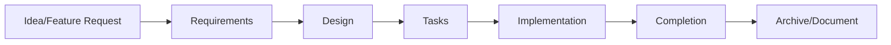
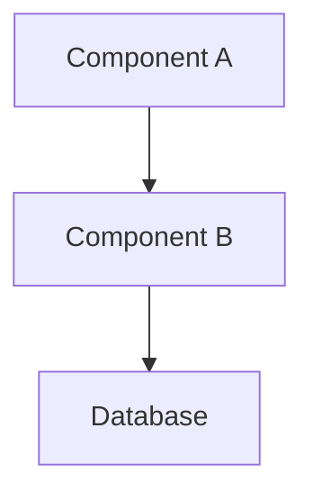
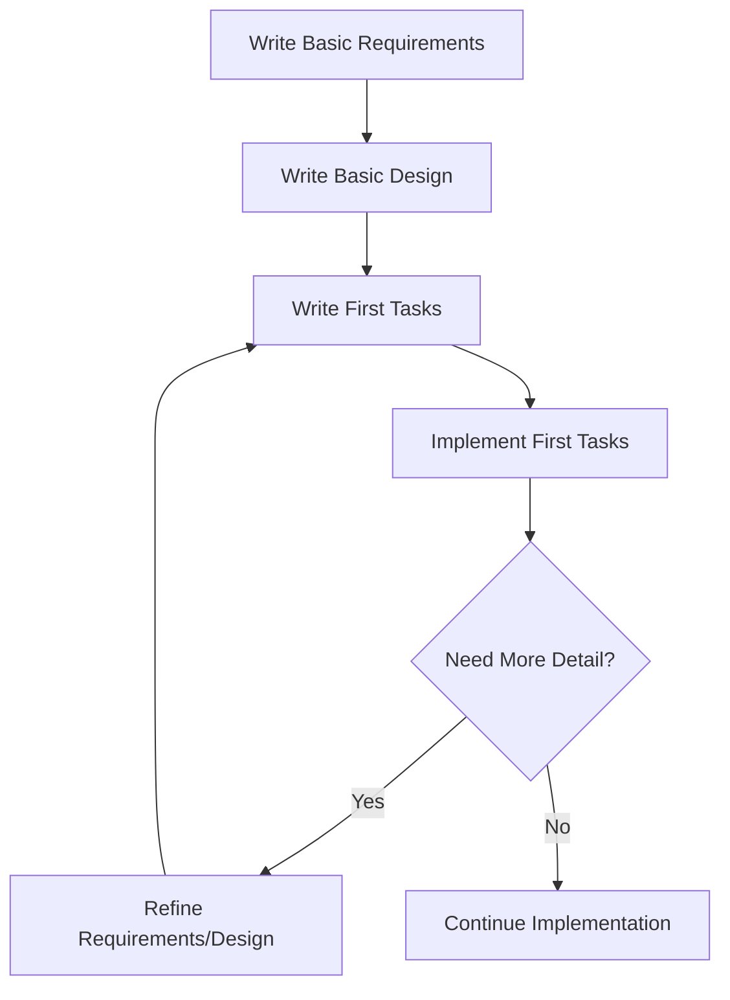
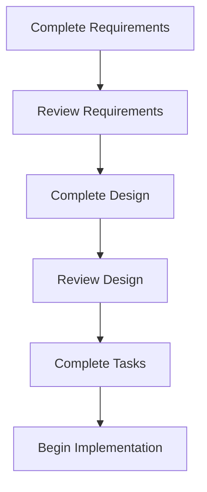
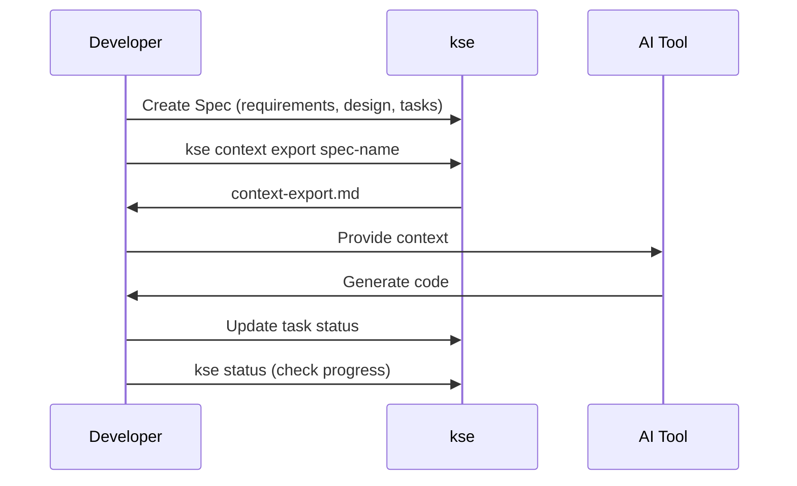
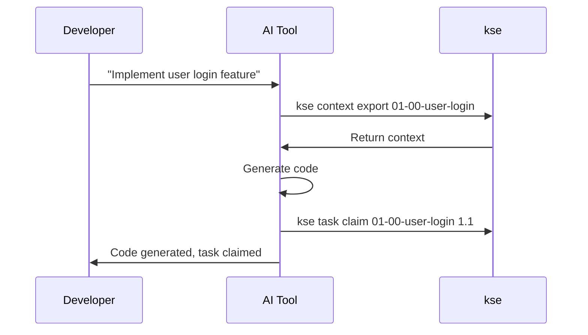

# Spec Workflow Guide

> Understanding the Spec-driven development workflow in kse

---

**Version**: 1.42.0  
**Last Updated**: 2026-02-11  
**Audience**: Intermediate  
**Estimated Time**: 10 minutes

---

## Overview

A **Spec** (specification) is the fundamental unit of work in kse. It's a structured description of a feature or component that guides both human developers and AI assistants through the implementation process.

Every Spec follows a three-stage workflow: **Requirements → Design → Tasks**

---

## Spec Naming and Numbering

Before creating a Spec, you need to choose a name following the format: `{major}-{minor}-{description}`

### Quick Numbering Guide

**Format**: `XX-YY-feature-name`
- `XX` = Major number (01, 02, 03, ...)
- `YY` = Minor number (00, 01, 02, ...)
- `feature-name` = kebab-case description

**Common Strategies**:

1. **Simple Projects** (recommended for most cases):
   ```
   01-00-user-authentication
   02-00-payment-system
   03-00-notification-service
   ```
   Use major numbers only (minor always `00`) for independent features.

2. **Complex Projects** (grouped by domain):
   ```
   01-00-auth-foundation
   01-01-auth-add-oauth
   01-02-auth-add-2fa
   02-00-payment-mvp
   02-01-payment-subscriptions
   ```
   Group related features under the same major number.

3. **Hybrid Approach** (flexible):
   Start simple, add structure when needed. Use `XX-00` for independent features, introduce `XX-01+` when iterations are needed.

**Decision Tree**:
- First Spec? → Use `01-00-{name}`
- Related to existing Spec? → Same major, increment minor
- Independent feature? → Next major number with `-00`

📖 **For detailed guidance, see**: [Spec Numbering Strategy Guide](spec-numbering-guide.md)

---

## The Spec Creation Workflow



### Stage Descriptions

1. **Idea/Feature Request** - The initial concept or need
2. **Requirements** - What you're building and why (user stories, acceptance criteria)
3. **Design** - How you'll build it (architecture, APIs, components)
4. **Tasks** - Step-by-step implementation plan
5. **Implementation** - Actual coding (often AI-assisted)
6. **Completion** - All tasks done, feature working
7. **Archive/Document** - Spec serves as documentation

---

## Stage 1: Requirements

**Purpose:** Define WHAT you're building and WHY

**File:** `requirements.md`

**Key Components:**
- **Overview** - Brief description of the feature
- **User Stories** - "As a... I want... So that..."
- **Functional Requirements** - Specific capabilities the system must have
- **Acceptance Criteria** - "WHEN... THEN..." statements
- **Non-Functional Requirements** - Performance, security, usability

**Example Structure:**

```markdown
# Feature Name

## Overview
Brief description of what this feature does

## User Stories
- As a [user type], I want to [action], so that [benefit]

## Functional Requirements
### FR-1: Requirement Name
Description of what the system must do

## Acceptance Criteria
- WHEN [condition] THEN [expected result]

## Non-Functional Requirements
- Performance: Response time < 500ms
- Security: Data encrypted at rest
```

**Best Practices:**
- ✅ Write from user perspective
- ✅ Be specific and measurable
- ✅ Include edge cases
- ✅ Consider security and performance
- ❌ Don't include implementation details (that's for Design)

---

## Stage 2: Design

**Purpose:** Define HOW you'll build it

**File:** `design.md`

**Key Components:**
- **Architecture Overview** - High-level system structure
- **Component Design** - Individual components and their responsibilities
- **API Design** - Endpoints, request/response formats
- **Data Models** - Database schemas, data structures
- **Technology Stack** - Languages, frameworks, libraries
- **Requirements Traceability** - Map requirements to design components

**Example Structure:**

```markdown
# Feature Name - Design

## Architecture



## API Design
### POST /api/endpoint
Request: { ... }
Response: { ... }

## Component Design
### ComponentName
**Responsibility:** What it does
**Methods:**
- method1() - Description
- method2() - Description

## Data Models
```javascript
{
  field1: type,
  field2: type
}
```

## Technology Stack
- Backend: Node.js + Express
- Database: PostgreSQL

## Requirements Traceability
| Requirement | Design Component |
|-------------|------------------|
| FR-1 | ComponentA.method1() |
```

**Best Practices:**
- ✅ Use diagrams to visualize architecture
- ✅ Define clear component responsibilities
- ✅ Specify all APIs and data formats
- ✅ Link back to requirements
- ❌ Don't skip the traceability section

---

## Stage 3: Tasks

**Purpose:** Break down implementation into actionable steps

**File:** `tasks.md`

**Key Components:**
- **Task List** - Checkbox list of implementation steps
- **Task Hierarchy** - Organized by phase or component
- **Task IDs** - Numbered for easy reference (1.1, 1.2, 2.1, etc.)
- **Dependencies** - Implicit through ordering

**Example Structure:**

```markdown
# Feature Name - Tasks

## Phase 1: Setup
- [ ] 1.1 Set up project structure
- [ ] 1.2 Install dependencies
- [ ] 1.3 Configure environment

## Phase 2: Core Implementation
- [ ] 2.1 Implement ComponentA
  - [ ] 2.1.1 Create class structure
  - [ ] 2.1.2 Implement method1()
  - [ ] 2.1.3 Write unit tests
- [ ] 2.2 Implement ComponentB

## Phase 3: Integration
- [ ] 3.1 Connect components
- [ ] 3.2 Integration testing
- [ ] 3.3 End-to-end testing

## Phase 4: Documentation
- [ ] 4.1 API documentation
- [ ] 4.2 User guide
```

**Best Practices:**
- ✅ Break large tasks into subtasks
- ✅ Order tasks logically (dependencies first)
- ✅ Include testing tasks
- ✅ Be specific enough for AI to understand
- ❌ Don't make tasks too granular (not every line of code)

---

## The Complete Workflow in Action

### Example: User Login Feature

**1. Create the Spec:**
```bash
kse create-spec 01-00-user-login
```

**2. Write Requirements** (`.kiro/specs/01-00-user-login/requirements.md`):
```markdown
# User Login

## User Stories
- As a user, I want to log in with email and password

## Acceptance Criteria
- WHEN user enters valid credentials THEN they are logged in
- WHEN user enters invalid credentials THEN they see an error
```

**3. Write Design** (`.kiro/specs/01-00-user-login/design.md`):
```markdown
# User Login - Design

## API Design
POST /api/auth/login
Request: { email, password }
Response: { token } or { error }

## Components
- AuthController - handles login requests
- AuthService - validates credentials
- UserRepository - database access
```

**4. Write Tasks** (`.kiro/specs/01-00-user-login/tasks.md`):
```markdown
- [ ] 1.1 Create AuthController
- [ ] 1.2 Create AuthService
- [ ] 1.3 Create UserRepository
- [ ] 1.4 Implement login endpoint
- [ ] 1.5 Write tests
```

**5. Export Context:**
```bash
kse context export 01-00-user-login
```

**6. Implement with AI:**
- Provide context to your AI tool
- AI implements tasks based on your Spec
- Update task checkboxes as you complete them

**7. Track Progress:**
```bash
kse status
```

**8. Maintain Document Governance:**
```bash
# Check for document violations
kse docs diagnose

# Clean up temporary files
kse docs cleanup --spec 01-00-user-login

# Organize artifacts (reports, scripts, etc.)
kse docs archive --spec 01-00-user-login

# Validate final structure
kse docs validate --spec 01-00-user-login
```

---

## Workflow Variations

### Iterative Refinement

You don't have to complete all three stages before starting implementation:



**When to use:**
- Exploring new features
- Prototyping
- Learning new technologies

### Waterfall Approach

Complete each stage fully before moving to the next:



**When to use:**
- Well-understood features
- Critical systems
- Team collaboration (clear handoffs)

---

## Integration with AI Tools

### Context Export Workflow



### Automated Workflow (Windsurf/Cline)



---

## Best Practices

### Requirements Stage
1. **Start with user stories** - Understand the user's perspective
2. **Use EARS format** for acceptance criteria (WHEN... THEN...)
3. **Include non-functional requirements** - Don't forget performance, security
4. **Think about edge cases** - What could go wrong?

### Design Stage
1. **Visualize with diagrams** - A picture is worth a thousand words
2. **Define clear interfaces** - APIs, method signatures, data formats
3. **Maintain traceability** - Link every design decision to a requirement
4. **Choose appropriate technologies** - Document your tech stack

### Tasks Stage
1. **Break down logically** - Group related tasks into phases
2. **Order by dependencies** - What needs to be done first?
3. **Include testing** - Every feature needs tests
4. **Be AI-friendly** - Tasks should be clear enough for AI to implement

### Document Governance
1. **Keep Specs clean** - Use `kse docs archive` to organize artifacts
2. **Remove temporary files** - Use `kse docs cleanup` regularly
3. **Validate structure** - Use `kse docs validate` before committing
4. **Install Git hooks** - Use `kse docs hooks install` to prevent violations

### Throughout
1. **Keep it updated** - Specs are living documents
2. **Use version control** - Commit Spec changes
3. **Review regularly** - Ensure Spec matches implementation
4. **Archive completed Specs** - They become documentation

---

## Common Pitfalls

### ❌ Too Vague
**Bad:**
```markdown
- [ ] Make login work
```

**Good:**
```markdown
- [ ] 1.1 Implement AuthController.login() method
  - Accept email and password
  - Validate inputs
  - Return JWT token on success
  - Return error message on failure
```

### ❌ Too Detailed
**Bad:**
```markdown
- [ ] 1.1 Create variable named 'email'
- [ ] 1.2 Create variable named 'password'
- [ ] 1.3 Write if statement to check email
```

**Good:**
```markdown
- [ ] 1.1 Implement input validation
  - Validate email format
  - Validate password length
  - Return validation errors
```

### ❌ Missing Traceability
**Bad:** Design with no connection to requirements

**Good:** Design with clear traceability table:
```markdown
| Requirement | Design Component |
|-------------|------------------|
| FR-1: User can log in | AuthController.login() |
| FR-2: Validate inputs | ValidationService |
```

---

## Related Documentation

- **[Quick Start Guide](quick-start.md)** - Get started with your first Spec
- **[Document Governance](document-governance.md)** - Keep your Specs clean and organized
- **[Integration Modes](integration-modes.md)** - How to use Specs with AI tools
- **[Command Reference](command-reference.md)** - All kse commands
- **[Examples](examples/)** - Complete example Specs

---

## Summary

The Spec workflow is:
1. **Requirements** - Define WHAT and WHY
2. **Design** - Define HOW
3. **Tasks** - Define STEPS
4. **Implementation** - Build it (with AI assistance)
5. **Completion** - Verify and document

**Key Benefits:**
- ✅ Clear structure for features
- ✅ Better AI assistance (AI understands your intent)
- ✅ Built-in documentation
- ✅ Progress tracking
- ✅ Team collaboration

**Start your next Spec:** 🚀
```bash
kse create-spec 02-00-your-feature
```

---

**Version**: 1.42.0  
**Last Updated**: 2026-02-11
