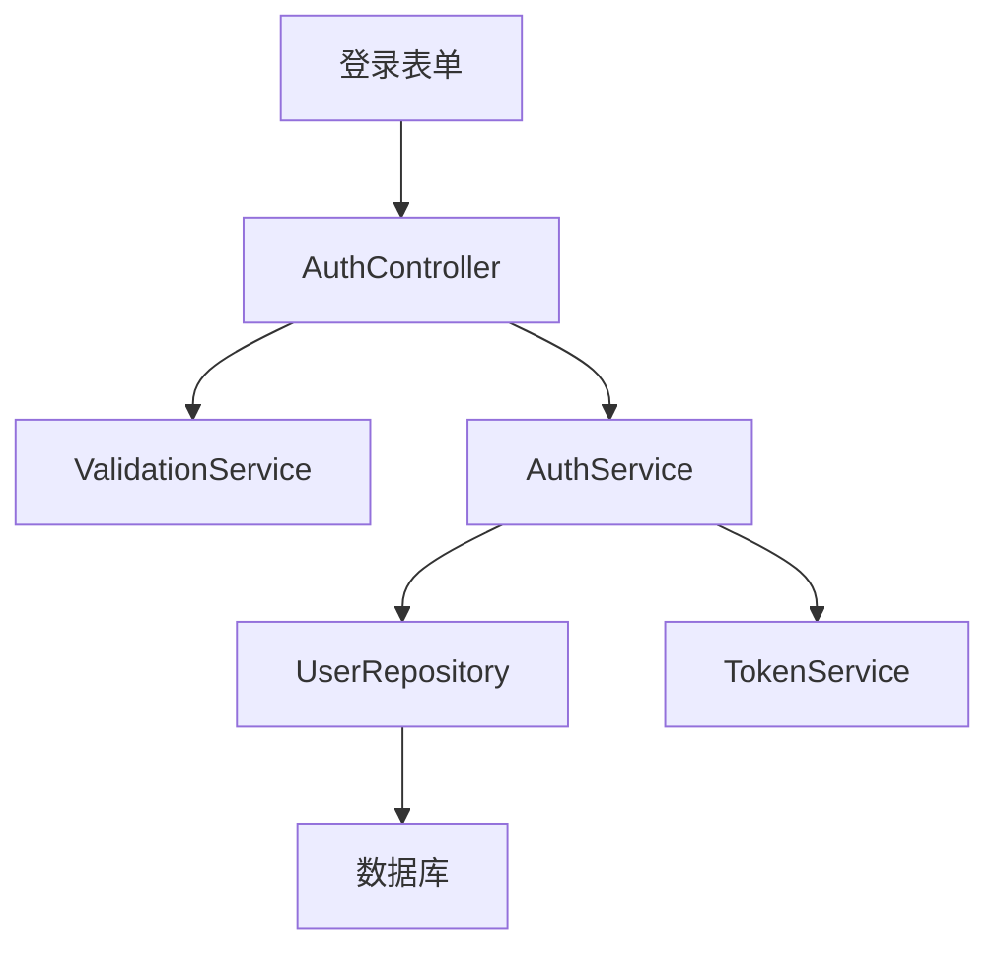

# 快速入门指南

> 5 分钟上手 kse - 从安装到第一个 AI 辅助功能实现

---

**版本**: 1.46.0  
**最后更新**: 2026-02-13  
**预计时间**: 5 分钟  
**目标读者**: 初学者

---

## 你将学到什么

完成本指南后，你将能够：
- ✅ 安装 kse 并设置你的第一个项目
- ✅ 创建完整的 Spec（需求 → 设计 → 任务）
- ✅ 为你的 AI 工具导出上下文
- ✅ 使用 AI 基于 Spec 实现功能
- ✅ 跟踪任务进度

---

## 前置条件

开始之前，请确保你有：
- **Node.js** 14 或更高版本（[下载](https://nodejs.org/)）
- **npm** 6 或更高版本（随 Node.js 一起安装）
- 基本的命令行知识
- 一个 AI 编码工具（Claude、Cursor、Windsurf、Copilot 等）

检查你的版本：
```bash
node --version  # 应显示 v14.0.0 或更高
npm --version   # 应显示 6.0.0 或更高
```

---

## 步骤 1：安装 kse（30 秒）

使用 npm 全局安装 kse：

```bash
npm install -g kiro-spec-engine
```

**预期输出：**
```
added 50 packages in 5s
```

**验证安装：**
```bash
kse --version
```

**预期输出：**
```
1.3.0
```

**故障排除：**
- **"kse: command not found"** → 重启终端或检查 PATH
- **macOS/Linux 权限错误** → 使用 `sudo npm install -g kiro-spec-engine`
- **Windows 权限错误** → 以管理员身份运行终端

---

## 步骤 2：在项目中采用 kse（1 分钟）

进入你的项目目录（或创建新项目）：

```bash
# 对于现有项目
cd your-project

# 或创建新项目
mkdir my-awesome-app
cd my-awesome-app
git init  # kse 最适合与 git 项目配合使用
```

**采用 kse：**
```bash
kse adopt
```

**预期输出：**
```
✓ 检测到项目类型：Node.js
✓ 创建 .kiro/ 目录
✓ 创建 specs/ 目录
✓ 创建 steering/ 目录
✓ 生成 CORE_PRINCIPLES.md
✓ 生成 ENVIRONMENT.md
✓ 生成 CURRENT_CONTEXT.md

✅ 项目成功采用 kse！

下一步：
  1. 创建你的第一个 Spec：kse spec bootstrap --name 01-00-my-feature --non-interactive
  2. 阅读指南：.kiro/README.md
```

**创建的内容：**
```
your-project/
├── .kiro/
│   ├── specs/              # 你的 Spec 将存放在这里
│   ├── steering/           # AI 行为规则
│   │   ├── CORE_PRINCIPLES.md
│   │   ├── ENVIRONMENT.md
│   │   └── CURRENT_CONTEXT.md
│   └── README.md           # Kiro 系统文档
```

**验证：**
```bash
kse status
```

**预期输出：**
```
Project: my-awesome-app
Specs: 0
Status: Ready
```

---

## 步骤 3：生成你的第一个 Spec 初稿（2 分钟）

让我们为用户登录功能生成一个 Spec 初稿：

```bash
kse spec bootstrap --name 01-00-user-login --non-interactive
```

**预期输出：**
```
✓ 生成 Spec 初稿：01-00-user-login
✓ 生成 requirements.md
✓ 生成 design.md
✓ 生成 tasks.md

📝 下一步：
  1. 编辑 requirements.md 定义你要构建什么
  2. 编辑 design.md 定义你将如何构建
  3. 编辑 tasks.md 分解实现步骤
```

多 Spec 场景下可直接使用：

```bash
kse spec bootstrap --specs "01-00-user-login,01-01-user-session" --max-parallel 3
```

上述命令会默认切换到 orchestrate 模式并并行推进。

### 3.1 编写需求

打开 `.kiro/specs/01-00-user-login/requirements.md` 并编写：

```markdown
# 用户登录功能

## 概述
使用户能够使用邮箱和密码登录应用程序。

## 用户故事

### US-1：用户登录
**作为** 用户  
**我想要** 使用邮箱和密码登录  
**以便** 访问我的账户

### US-2：登录验证
**作为** 用户  
**我想要** 在登录失败时看到清晰的错误消息  
**以便** 知道出了什么问题

## 功能需求

### FR-1：登录表单
系统应提供包含以下内容的登录表单：
- 邮箱输入字段
- 密码输入字段
- 提交按钮

### FR-2：凭据验证
**当** 用户提交有效凭据时  
**则** 系统验证用户并重定向到仪表板

**当** 用户提交无效凭据时  
**则** 系统显示错误消息"邮箱或密码无效"

### FR-3：输入验证
**当** 用户提交空邮箱时  
**则** 系统显示错误"邮箱为必填项"

**当** 用户提交无效邮箱格式时  
**则** 系统显示错误"请输入有效的邮箱"

**当** 用户提交少于 6 个字符的密码时  
**则** 系统显示错误"密码必须至少 6 个字符"

## 非功能需求

### NFR-1：安全性
- 密码必须在存储前进行哈希处理
- 使用 bcrypt，盐轮数 >= 10
- 实现速率限制（每分钟最多 5 次尝试）

### NFR-2：性能
- 登录响应时间 < 500ms
- 支持 100 个并发登录请求

### NFR-3：可用性
- 清晰的错误消息
- 可访问的表单（WCAG 2.1 Level AA）

## 验收标准

- [ ] 用户可以使用有效的邮箱和密码登录
- [ ] 用户在凭据无效时看到错误消息
- [ ] 邮箱验证正常工作
- [ ] 密码验证正常工作
- [ ] 密码在数据库中已哈希
- [ ] 速率限制防止暴力攻击
- [ ] 登录响应时间低于 500ms
```

### 3.2 编写设计

打开 `.kiro/specs/01-00-user-login/design.md` 并编写：

```markdown
# 用户登录 - 设计文档

## 概述
此设计实现了一个安全的用户登录系统，具有邮箱/密码认证、输入验证和速率限制。

## 架构

### 系统组件



## API 设计

### POST /api/auth/login

**请求：**
```json
{
  "email": "user@example.com",
  "password": "secret123"
}
```

**成功响应 (200)：**
```json
{
  "success": true,
  "token": "eyJhbGciOiJIUzI1NiIsInR5cCI6IkpXVCJ9...",
  "user": {
    "id": "123",
    "email": "user@example.com",
    "name": "张三"
  }
}
```

**错误响应 (401)：**
```json
{
  "success": false,
  "error": "邮箱或密码无效"
}
```

**错误响应 (429)：**
```json
{
  "success": false,
  "error": "登录尝试次数过多。请稍后再试。"
}
```

## 组件设计

### AuthController
**职责：** 处理认证的 HTTP 请求

**方法：**
- `login(req, res)` - 处理登录请求
- `validateRequest(req)` - 验证请求格式

### ValidationService
**职责：** 验证用户输入

**方法：**
- `validateEmail(email)` - 检查邮箱格式
- `validatePassword(password)` - 检查密码要求
- 返回：`{ valid: boolean, errors: string[] }`

### AuthService
**职责：** 认证的业务逻辑

**方法：**
- `authenticate(email, password)` - 验证凭据
- `generateToken(user)` - 创建 JWT 令牌
- `hashPassword(password)` - 使用 bcrypt 哈希密码

### UserRepository
**职责：** 用户的数据库操作

**方法：**
- `findByEmail(email)` - 通过邮箱获取用户
- `updateLastLogin(userId)` - 更新最后登录时间戳

### RateLimiter
**职责：** 防止暴力攻击

**配置：**
- 最大尝试次数：每个 IP 每分钟 5 次
- 阻止时长：超过限制后 15 分钟

## 数据模型

### User
```javascript
{
  id: string,
  email: string,
  passwordHash: string,
  name: string,
  createdAt: Date,
  lastLoginAt: Date
}
```

## 安全考虑

1. **密码哈希：** 使用 bcrypt，10 个盐轮数
2. **JWT 令牌：** 使用密钥签名，24 小时后过期
3. **速率限制：** 实现每个 IP 的速率限制
4. **输入清理：** 清理所有用户输入
5. **仅 HTTPS：** 在生产环境中强制使用 HTTPS

## 错误处理

| 错误 | HTTP 代码 | 消息 |
|------|-----------|------|
| 无效凭据 | 401 | "邮箱或密码无效" |
| 缺少邮箱 | 400 | "邮箱为必填项" |
| 无效邮箱格式 | 400 | "请输入有效的邮箱" |
| 缺少密码 | 400 | "密码为必填项" |
| 密码太短 | 400 | "密码必须至少 6 个字符" |
| 超过速率限制 | 429 | "登录尝试次数过多。请稍后再试。" |
| 服务器错误 | 500 | "发生错误。请重试。" |

## 技术栈

- **后端：** Node.js + Express
- **数据库：** PostgreSQL
- **认证：** JWT (jsonwebtoken)
- **密码哈希：** bcrypt
- **速率限制：** express-rate-limit
- **验证：** validator.js

## 需求追溯

| 需求 | 设计组件 |
|------|----------|
| FR-1：登录表单 | AuthController.login() |
| FR-2：凭据验证 | AuthService.authenticate() |
| FR-3：输入验证 | ValidationService |
| NFR-1：安全性 | bcrypt、JWT、RateLimiter |
| NFR-2：性能 | 索引数据库查询 |
| NFR-3：可用性 | API 响应中的清晰错误消息 |
```

### 3.3 编写任务

打开 `.kiro/specs/01-00-user-login/tasks.md` 并编写：

```markdown
# 用户登录 - 实现任务

## 阶段 1：设置和模型

- [ ] 1.1 设置项目依赖
  - 安装 express、bcrypt、jsonwebtoken、validator、express-rate-limit
  - 配置 TypeScript（如果使用）

- [ ] 1.2 创建 User 模型和数据库架构
  - 定义 User 接口/类
  - 为 users 表创建数据库迁移
  - 在 email 字段上添加索引

## 阶段 2：核心服务

- [ ] 2.1 实现 ValidationService
  - 创建 validateEmail() 方法
  - 创建 validatePassword() 方法
  - 编写单元测试

- [ ] 2.2 实现 AuthService
  - 创建 hashPassword() 方法
  - 创建 authenticate() 方法
  - 创建 generateToken() 方法
  - 编写单元测试

- [ ] 2.3 实现 UserRepository
  - 创建 findByEmail() 方法
  - 创建 updateLastLogin() 方法
  - 编写单元测试

## 阶段 3：API 实现

- [ ] 3.1 实现 AuthController
  - 创建 login() 端点处理器
  - 添加请求验证
  - 添加错误处理
  - 编写集成测试

- [ ] 3.2 实现速率限制
  - 配置 express-rate-limit
  - 应用到登录端点
  - 测试速率限制行为

## 阶段 4：测试和文档

- [ ] 4.1 编写全面的测试
  - 所有服务的单元测试
  - API 端点的集成测试
  - 测试错误场景
  - 测试速率限制

- [ ] 4.2 创建 API 文档
  - 记录请求/响应格式
  - 添加示例请求
  - 记录错误代码

- [ ] 4.3 手动测试
  - 使用有效凭据测试
  - 使用无效凭据测试
  - 测试输入验证
  - 测试速率限制
  - 测试性能（响应时间 < 500ms）

## 阶段 5：部署

- [ ] 5.1 环境配置
  - 设置环境变量
  - 配置 JWT 密钥
  - 配置数据库连接

- [ ] 5.2 部署到预发布环境
  - 部署代码
  - 运行冒烟测试
  - 验证功能

## 注意事项
- 所有密码必须在存储前进行哈希处理
- 使用环境变量存储密钥
- 遵循项目编码标准
- 在标记任务完成前编写测试
```

---

## 步骤 4：为你的 AI 工具导出上下文（1 分钟）

现在你的 Spec 已完成，为你的 AI 工具导出它：

（可选）先执行标准化流程和闸口检查：

```bash
kse spec pipeline run --spec 01-00-user-login
kse spec gate run --spec 01-00-user-login --json
```

```bash
kse context export 01-00-user-login
```

**预期输出：**
```
✓ 上下文已导出到 .kiro/specs/01-00-user-login/context-export.md
✓ 上下文大小：3.2 KB
✓ 准备好与 AI 工具一起使用
```

**创建的内容：**
位于 `.kiro/specs/01-00-user-login/context-export.md` 的文件，包含：
- 所有需求
- 完整设计
- 任务列表
- 项目结构
- 为 AI 消费格式化

---

## 步骤 5：使用你的 AI 工具（1 分钟）

现在使用你的 AI 工具来实现功能。选择你的工具：

### 选项 A：Claude Code / ChatGPT

1. **打开上下文文件：**
   ```bash
   # macOS
   cat .kiro/specs/01-00-user-login/context-export.md | pbcopy
   
   # Windows
   type .kiro\specs\01-00-user-login\context-export.md | clip
   
   # Linux
   cat .kiro/specs/01-00-user-login/context-export.md | xclip -selection clipboard
   ```

2. **开始新对话** 与 Claude 或 ChatGPT

3. **粘贴上下文** 并说：
   ```
   我已提供用户登录功能的完整 Spec。
   请实现任务 1.1："设置项目依赖"
   ```

4. **Claude/ChatGPT 将：**
   - 理解你的需求和设计
   - 生成适当的代码
   - 遵循你的架构决策

### 选项 B：Cursor

1. **生成任务特定提示：**
   ```bash
   kse prompt generate 01-00-user-login 1.1
   ```

2. **打开 Cursor Composer**（Cmd+K 或 Ctrl+K）

3. **粘贴生成的提示**

4. **Cursor 将：**
   - 读取你的 Spec 文件
   - 生成匹配你设计的代码
   - 直接创建或修改文件

### 选项 C：Windsurf / Cline

1. **简单地告诉 AI：**
   ```
   使用 kse 检查 01-00-user-login 的 spec 并实现任务 1.1
   ```

2. **AI 将：**
   - 自动运行 `kse context export 01-00-user-login`
   - 读取导出的上下文
   - 实现任务
   - 更新任务状态

### 选项 D：VS Code + Copilot

1. **创建新文件**（例如 `src/auth/AuthController.js`）

2. **添加引用你的 Spec 的注释：**
   ```javascript
   // 任务 1.1：设置项目依赖
   // 参见：.kiro/specs/01-00-user-login/design.md
   // 
   // 安装：express、bcrypt、jsonwebtoken、validator、express-rate-limit
   ```

3. **Copilot 将：**
   - 基于你的 Spec 建议代码
   - 遵循你的设计模式
   - 生成适当的实现

---

## 步骤 6：跟踪你的进度（30 秒）

完成任务后，更新任务状态：

**编辑** `.kiro/specs/01-00-user-login/tasks.md`：

```markdown
- [x] 1.1 设置项目依赖  ← 从 [ ] 改为 [x]
- [ ] 1.2 创建 User 模型和数据库架构
```

**检查你的进度：**
```bash
kse status
```

**预期输出：**
```
Project: my-awesome-app
Specs: 1

Spec: 01-00-user-login
  Total tasks: 15
  Completed: 1
  In progress: 0
  Not started: 14
  Progress: 6.7%
```

---

## 下一步

恭喜！你已完成快速入门。以下是接下来要做的：

### 了解更多关于集成的信息

选择你的 AI 工具获取详细指导：
- **[Cursor 指南](../tools/cursor-guide.md)** - 深入了解 Cursor 集成
- **[Claude 指南](../tools/claude-guide.md)** - Claude Code 最佳实践
- **[Windsurf 指南](../tools/windsurf-guide.md)** - 使用 Windsurf 的自动化工作流
- **[通用指南](../tools/generic-guide.md)** - 适用于任何 AI 工具

### 探索高级功能

- **[集成模式](../integration-modes.md)** - 原生、手动和 Watch 模式
- **[Spec 工作流](../spec-workflow.md)** - 深入了解 Spec 创建
- **[命令参考](../command-reference.md)** - 所有 kse 命令

### 查看真实示例

- **[API 功能示例](../examples/add-rest-api/)** - 完整的 RESTful API Spec
- **[UI 功能示例](../examples/add-user-dashboard/)** - React 仪表板 Spec
- **[CLI 功能示例](../examples/add-export-command/)** - CLI 命令 Spec

---

## 故障排除

### 问题："kse: command not found"

**解决方案：**
1. 重启终端
2. 检查 npm 全局 bin 是否在 PATH 中：
   ```bash
   npm config get prefix
   ```
3. 如需要，添加到 PATH（macOS/Linux）：
   ```bash
   export PATH="$(npm config get prefix)/bin:$PATH"
   ```

### 问题：上下文文件对 AI 工具来说太大

**解决方案：** 生成任务特定提示：
```bash
kse prompt generate 01-00-user-login 1.1
```

这会为该任务创建一个更小、更集中的上下文。

### 问题：AI 不遵循我的设计

**解决方案：**
1. 使你的 design.md 更详细
2. 在 design.md 中添加代码示例
3. 在提示中明确说明："严格遵循设计文档"
4. 包含 steering 规则：
   ```bash
   kse context export 01-00-user-login --steering
   ```

### 问题：找不到我的 Spec 文件

**解决方案：**
所有 Spec 都在 `.kiro/specs/` 中：
```bash
ls .kiro/specs/
```

### 更多帮助

- 📖 **[故障排除指南](../troubleshooting.md)** - 常见问题和解决方案
- 🤔 **[常见问题](../faq.md)** - 常见问题解答
- 💬 **[GitHub Discussions](https://github.com/yourusername/kiro-spec-engine/discussions)** - 社区帮助

---

## 总结

你已学会如何：
- ✅ 安装和设置 kse
- ✅ 创建包含需求、设计和任务的结构化 Spec
- ✅ 为 AI 工具导出上下文
- ✅ 使用 AI 基于 Spec 实现功能
- ✅ 跟踪实现进度

**kse 工作流：**
```
bootstrap Spec → pipeline/gate → 导出上下文 → AI 实现 → 更新任务 → 重复
```

**准备好构建你的下一个功能了吗？** 🚀

```bash
kse spec bootstrap --name 02-00-your-next-feature --non-interactive
```

---

**版本**: 1.46.0  
**最后更新**: 2026-02-13

